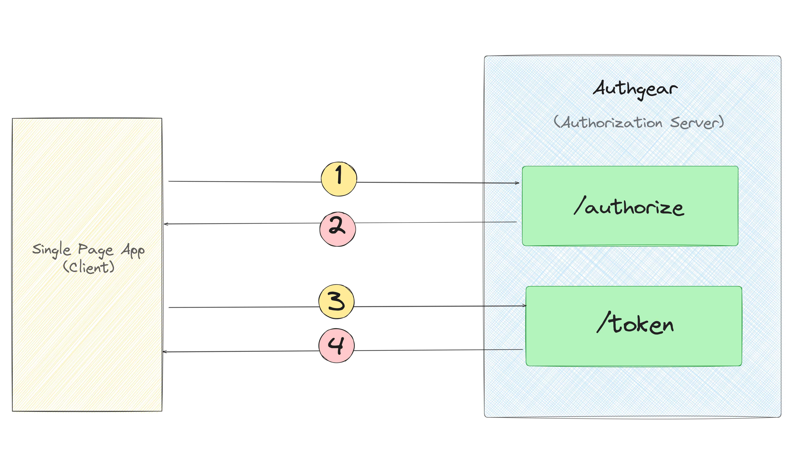
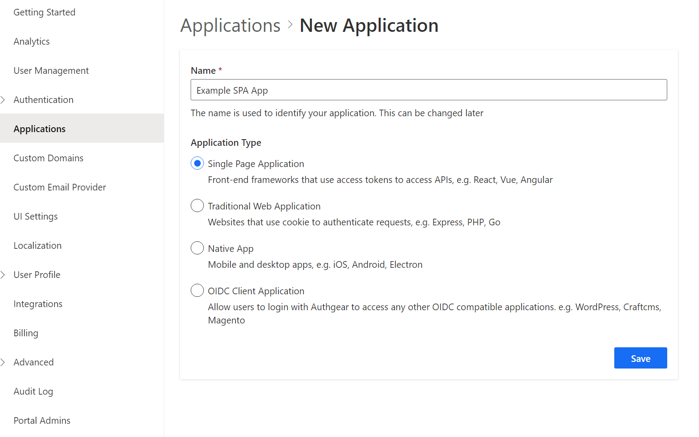
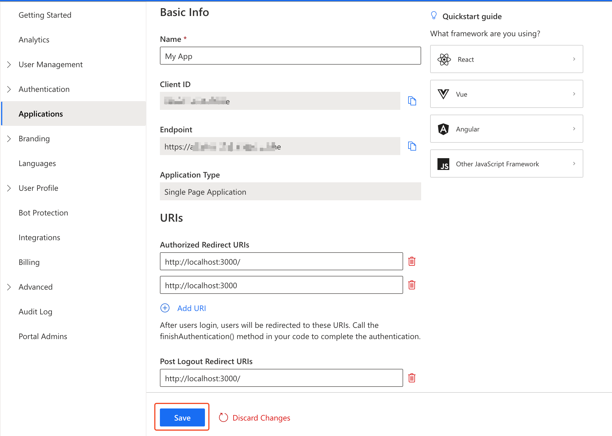
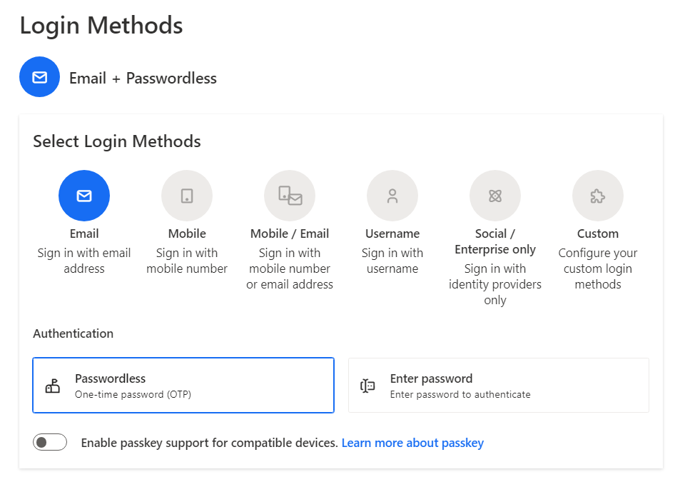
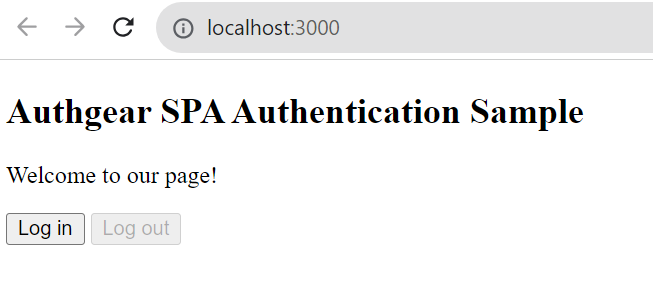
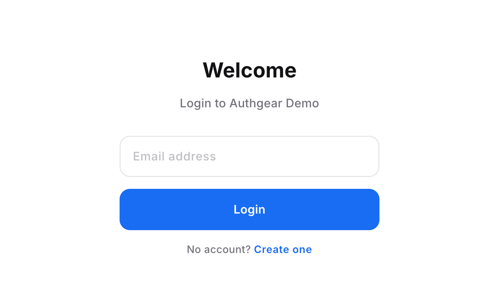

All web apps today need users to sign in and share their info to make their own profiles. This helps the app give them a personalized experience securely. There are **two ways** that the developers can authenticate the users – either they can create their own authentication system or they can use an <a href="/solutions/customer-identity-and-access-management" target="_blank">identity and access management service</a> that provides secure user registration and login capabilities with built-in login pages.

This post demonstrates how to easily add authentication to **any Javascript Single Page Application (SPA)** using <a href="/" target="_blank">Authgear</a>.

## Why Authgear?

If you use Authgear in your apps, it's like sending the sign-in process to one main login page, similar to how Google does it for Gmail, YouTube, and others. You can easily integrate **authentication features** into your app (<a href="https://docs.authgear.com/get-started/single-page-app/angular" target="_blank">Angular</a>, <a href="https://docs.authgear.com/get-started/single-page-app/vue" target="_blank">Vue</a>, <a href="https://docs.authgear.com/get-started/single-page-app/react" target="_blank">React</a>, or any JavaScript websites). It usually involves just **a few lines of code** to enable **multiple authentication methods**, such as <a href="/features/social-login" target="_blank">social logins</a>, <a href="/features/passwordless-authentication" target="_blank">passwordless</a>, <a href="/features/biometric-authentication" target="_blank">biometrics logins</a>, <a href="/features/whatsapp-otp" target="_blank">one-time-password (OTP)</a> with SMS/WhatsApp, and multi-factor authentication (MFA).

## How it works

When your user logs in, Authgear creates a special **ID Token** that gets sent back to your app:

1. When the user hits your "login" button or links in your client app, your app sends them to the Authgear sign-in page. You can also <a href="https://docs.authgear.com/how-to-guide/customize/branding" target="_blank">customize</a> this page.
1. The user logs into Authgear using one of the log in options you've set up (like username/password, social media log-in, passwordless, or email magic link).
1. After the user is authenticated, your app asks for the user's ID Token.
1. Authgear then gives the user's ID Token back to your app.

<!--FIGURE--><!--/FIGURE-->

## Implementation Overview

The implementation of authentication for SPA apps consists of two parts. In the first part, you create an Authgear app, choose a logging method and customize the sign-in UI page(optional). The second part covers the use of <a href="https://github.com/authgear/authgear-sdk-js" target="_blank">Authgear’s Web SDK</a> to trigger authentication flow such as log-in, and log-out.

## Part 1: Configure the Authgear

### Create an Authgear Account

The first thing you’ll need to do is create an <a href="https://accounts.portal.authgear.com/signup" target="_blank">Authgear account</a> to get started with <a href="https://portal.authgear.com/" target="_blank">Authgear’s Portal</a> for free.

### Create an application in the Portal

You’ll need to create an application so you know which users can log into which apps. The Authgear application is where you will configure how you want authentication to work for the project you are developing.

- Once logged into <a href="https://portal.authgear.com/" target="_blank">Authgear Portal</a>, navigate to the "Applications" tab and click "Add Application."
- Choose an appropriate application type (Single Page Application) and provide a name for your application.

<!--FIGURE--><!--/FIGURE-->

- Click “Save” and skip to the next tutorial page or you can also follow the <a href="https://docs.authgear.com/get-started/single-page-app/website#setup-application-in-authgear" target="_blank">getting started guide</a> to set up the new application.

## Configure the application

After creating the application, you'll be directed to the "Settings" tab, where you can configure the application's settings.

**Configure Authorized Redirect URIs**

An **Authorized Redirect URI** is a URL in your application where Authgear redirects the user after they have authenticated. You should set it to <a href="http://localhost:3000" target="_blank">http://localhost:3000/</a> where our SPA is running. We will create it in part 2.

**Note**: that the trailing "`/`" in the above URLs must be included.

**Configure Post Logout Redirect URIs**

A **Post Logout Redirect URI** is a URL in your application that Authgear can return to after the user has been logged out of the Authgear authorization server. For the logout URL, you need to set the same address <a href="http://localhost:3000" target="_blank">http://localhost:3000</a>.

Click "Save" and keep the **Endpoint** and **Client ID** in mind. You will need it when initializing the connection through <a href="https://github.com/authgear/authgear-sdk-js" target="_blank">Authgear SDK for Web</a> in your SPA code.

<!--FIGURE--><!--/FIGURE-->

Every application in Authgear is assigned an alphanumeric, unique client ID that your application code will use to call Authgear APIs through the SDK.

### Configure the sign-in methods

Authgear supports a wide range of authentication methods. From the “Authentication” tab, you can choose a **login method** for your users. Options are including, by email, mobile, or social, just using a username or the custom method you specify. For simplicity, you can choose the **Email** and **Passwordless** options:

<!--FIGURE--><!--/FIGURE-->

## Part 2: **Add Authentication to your web page**

Follow the steps to create a simple **SPA app** and learn how to use <a href="https://docs.authgear.com/get-started/single-page-app/website" target="_blank">Authgear Web SDK</a> to integrate Authgear into your application. You can also view a <a href="https://github.com/authgear/authgear-example-spa-js" target="_blank">full-source code</a> on the GitHub repo.

### Prerequisites

Before we start, ensure you have Node.js installed in your system. If not, download and install it from the <a href="https://nodejs.org/en/download/" target="_blank">official website</a>.

### Create a basic web server

In this part, you'll make a simple **website server** to host the SPA app using <a href="https://expressjs.com/" target="_blank">ExpressJS</a>. We'll also use it to serve our HTML page and any assets it needs, like JavaScript, CSS and so on. Start with making a new folder on your computer to keep the app’s source code (In the example, we call it authgear-spa-js-login). Then, initialize a new NPM project by running the following command:

```

npm init -y
			
```

Next we install two required packages:

```

npm install express
			
```

Also install [nodemon](<https://npmjs.org/package/nodemon>) so that our server can be restarted automatically on any code changes in dev mode:

```

npm install -D nodemon
			
```

Next, open the package.json file and edit scripts entry to have start and dev commands like the below:

```

{
  // ...
  "scripts": {
    "start": "node server.js",
    "dev": "nodemon server.js"
  },
  // ...
}
			
```

Now you can run the app in two modes: prod and dev.

For example, npm run dev will run the application using nodemon, monitoring for changes as we modify files.

### Creating server.js

Create a new file server.js in the root of the project and populate it with the following code:

```

const express = require("express");
const { join } = require("path");
const app = express();

// Serve static assets from the /public folder
app.use(express.static(join(__dirname, "public")));

// Endpoint to serve the configuration file
app.get("/authgear_config.json", (req, res) => {
  res.sendFile(join(__dirname, "authgear_config.json"));
});

// Serve the index page for all other requests
app.get("/*", (_, res) => {
  res.sendFile(join(__dirname, "index.html"));
});

// Listen on port 3000
app.listen(3000, () => console.log("Application running on port 3000"));
			
```

### Create a basic HTML page

Create a index.html file in the root of the project and add the following content to the created file:

```

<!DOCTYPE html>
<html>
  <head>
    <meta charset="UTF-8" />
    <title>Authgear SPA SDK Sample</title>
    <link rel="stylesheet" type="text/css" href="/css/main.css" />
  </head>

  <body>
    <h2>SPA Authentication Sample</h2>
    <p>Welcome to our page!</p>
    <button id="btn-login" disabled="true" onclick="login()">Log in</button>
    <button id="btn-logout" disabled="true" onclick="logout()">Log out</button>
    <button id="btn-settings" disabled="true" onclick="openUserSettings()">User Settings</button>
    <script src="js/app.js"></script>
    <script src="https://unpkg.com/@authgear/web@2.2.0/dist/authgear-web.iife.js"></script>
  </body>
</html>
			
```

To keep the demo simple, we do not use a package manager such as <a href="https://webpack.js.org/" target="_blank">Webpack</a>, we will retrieve the Authgear Web SDK from Authgear's CDN using IIFE(Immediately-invoked Function Expression) bundle. We can reference a script in our HTML directly:

```

<script src="https://unpkg.com/@authgear/web@2.2.0/dist/authgear-web.iife.js"></script>
			
```

You can install the Authgear Web SDK as a dependency of your application, it is useful if you are building React or React Native apps. See how to <a href="https://docs.authgear.com/get-started/single-page-app/website#install-the-authgear-web-sdk" target="_blank">install the package</a>.

### Create a main.css file

Create a new folder called public folder in the project root folder and create another folder called css inside the public folder. Add a new file in there called main.css. This will be used to determine how the log-in and log-out button elements will be hidden on the main page depending on whether a user is authenticated or not.

Open the newly-created public/css/main.css file and add the following CSS:

```

.hidden {
    display: none;
}
  
label {
    margin-bottom: 10px;
    display: block;
}
			
```

After creating an HTML file and applying CSS styles, see now how our page looks like by running npm run dev and accessing it at <a href="http://localhost:3000" target="_blank">http://localhost:3000</a>.

<!--FIGURE--><!--/FIGURE-->

### Create an app.js file

To add some action to the page, we create a new directory in the public folder called js, and add a new file in there called `app.js`.

Copy and paste the following JS code to app.js:

```

    	let authgearClient = null;

      const configureClient = async () => {
          authgearClient = window.authgear.default;

          await authgearClient.configure({
              endpoint: "YOUR_AUTHGEAR_PROJECT_DOMAIN",
              clientID: "YOUR_AUTHGEAR_APP_CLIENT_ID",
              sessionType: "refresh_token",
          }).then(
              () => {
                  console.log("Authgear client successfully configured!");
              },
              (err) => {
                  console.log("Failed to configure Authgear");
              }
          );
      };

      const login = async () => {
          await authgearClient
              .startAuthentication({
                  redirectURI: "http://localhost:3000/",
                  prompt: "login",
              })
              .then(
                  () => {
                      console.log("Logged in!");
                  },
                  (err) => {
                      console.log("Log in failed", err);
                  }
              );
      };

      const logout = async () => {
          await authgearClient
          .logout({
            redirectURI: window.location.origin,
          })
          .then(
            () => {
              console.log("Logged out successfully");
            },
            (err) => {
              console.log("Failed to logout");
            }
          );

          updateUI();
      };

      const openUserSettings = () => {
          authgearClient.open("/settings");
      }

      window.onload = async () => {
          await configureClient();
          updateUI();

          const query = window.location.search;
          if (query.includes("code=")) {
              await authgearClient.finishAuthentication();
              updateUI();

              window.history.replaceState({}, document.title, "/");
          }
      }

      const updateUI = async () => {
          const isAuthenticated = authgearClient.sessionState === "AUTHENTICATED";

          document.getElementById("btn-logout").disabled = !isAuthenticated;
          document.getElementById("btn-login").disabled = isAuthenticated;
          document.getElementById("btn-settings").disabled = !isAuthenticated;
      };
		
```

Replace `AUTHGEAR_ENDPOINT` and `CLIENT_ID` with the endpoint and client ID for your Authgear client application.

The code above configures a new Authgear client, and defines login and logout logic.

## Understanding the whole picture

Let’s breakdown down app.js code in the previous section and understand how authentication is achieved with Authgear:

**Login flow**

login: The login function is called by the **Login** button previously defined in the HTML page. It performs the login action by calling *authgearClient.startAuthentication* Authgear’s function.  It redirects the user to the Auhthgear login page. After the user logs in successfully, they will be redirected back to the same page we set in redirectURI. Run the project and click the **Login** button. You should be taken to the **Authgear Login Page** configured for your application. Go ahead and create a new user or log in using an email (we specified the Passwordless Email login method in the first part). When you try to log in with your email, you should receive a <a href="https://docs.authgear.com/strategies/email-login-link" target="_blank">magic link</a> to your email box to confirm login operation.

<!--FIGURE--><!--/FIGURE-->

After authenticating successfully, you will be redirected to the page you were before.

**Logout flow**

logout: This function logs the user out and redirects them back to the original page (at <a href="http://localhost:3000" target="_blank">http://localhost:3000</a>). It uses Authgear’s logout function and logs a message to the console indicating the result of the operation.

**Update the UI**

window.onload: This is a function that runs when the page loads. It configures the Authgear client and updates the UI. If the page's URL contains a "code=" which means the user is authenticated (code query will be received from Authgear server), it updates the UI again and removes the "code=" from the URL.

**Evaluate the authentication state**

updateUI: This function updates the status of the login and logout buttons based on whether the user is authenticated or not. In Authgear, you can check if the user has logged in or not with sessionState attribute. If the user is authenticated, we disable the login button and enable the logout button, and vice versa if the user is not authenticated.

###### User Settings page

Authgear provides a pre-built User Settings page for your users to view and modify their profile details and security settings.

The openUserSettings() function in our example app call open('/settings') method of the Authgear SDK to open the User Settings page when a user clicks on the User Settings button.

## Summary

Throughout the post, you learned how you can quickly add passwordless email-based authentication to any JavaScript web page in just 10 minutes using Authgear. There's much more you can do with Authgear, for example, you can obtain the <a href="https://docs.authgear.com/get-started/single-page-app/website#fetching-user-info" target="_blank">current user info</a> through SDK, or if you needed to securely communicate from your web page to a backend API, you can include an <a href="https://docs.authgear.com/get-started/single-page-app/website#calling-an-api" target="_blank">access token</a> to the HTTP requests to your application server.
