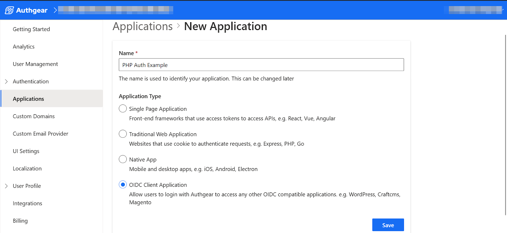
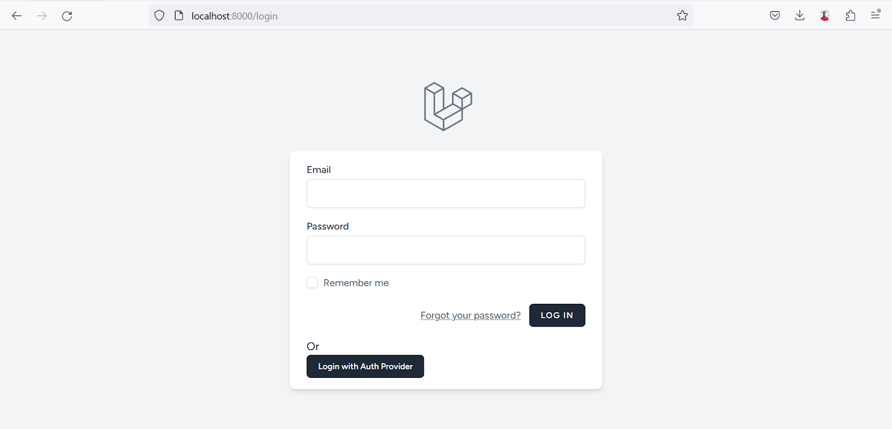
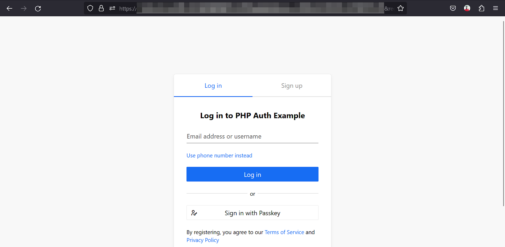

Social login is a feature that allows users to log in to a site using their existing account on social media sites like Facebook, Twitter, and Google.

The addition of social media login to a website can increase signups. This is because social login simplifies the signup process. For example, social login eliminates the need for users to create and remember another set of usernames and passwords.

The way social login works is simple. Instead of the user entering their username and password on your site, they click on a button to sign in with their social media account (e.g. Google, Facebook, or Twitter account). Then, they are directed to an authorization page on the social media site to grant your website authorization on behalf of the user. If the user is not signed in on the social media site, they’ll be required to sign in first.

In this article, you’ll learn how to add social login to your Laravel website.

## What is a Social Login Provider?

In social login, the provider is simply the social media site where the user already has an account. Examples of popular social login providers include Facebook, Twitter (now X), Google, LinkedIn, Apple, Microsoft, and Github.

Most popular social media login providers rely on the [OAuth](/post/what-is-oauth-2-0-and-how-it-works) standard. Hence, you can use just about any service that supports the OAuth standard as a social login provider. In this post, we’ll see an example of how to use any provider besides the common ones supported by Laravel.

### Laravel Socialite

Socialite is the official package for implementing social login in Laravel. It is a super helpful tool. However, as of the time of making this post, it only supports the following social login providers:

- Facebook
- Twitter
- Google
- LinkedIn
- GitHub
- GitLab
- Bitbucket

If you need to implement social login using any provider outside any of the above, you’ll need to use an extra tool like [Socialite Providers](https://socialiteproviders.com/) which has it’s own limits on published providers. Our goal in this post is to provide a guide that will make it easier to work with any social login provider that supports OAuth.

## How to Add Social Login to Laravel Using Other Providers

In this section, we’ll walk through a step-by-step guide for adding social login to a Laravel website using a provider not supported by Socialite.

We’ll use Authgear as the OAuth provider for our example app. Authgear is an Authentication-as-a-Service solution that offers features like Multi-factor authentication, social login, and biometric authentication.

Although Authgear is not a regular social login provider, it shares the same OAuth standard and authorization flow as most providers. This includes the use of OAuth credentials, redirecting users to an authorization page, and sending an authorization code back to a client application.

### Pre-requisites

To follow along, you need to have the following:

- An existing Laravel project. Or create a new project.
- An Authgear account. Create one for free [here](/).

### Step 1: Get OAuth Credentials from the Provider’s Site

In order to connect your Laravel application to any social login provider, you need to get OAuth credentials from the provider's site.

Follow this guide to get OAuth credentials from Authgear.

First login to the Authgear Portal and create a new project or select an existing one. Then, navigate to the **Applications** section of the project. Create a new application with **OIDC Client Application** as the type as shown below:

<!--FIGURE--><!--/FIGURE-->

Next, click on the **Save** button to go to the configuration page of the new application. The configuration page contains all the OAuth credentials such as Client ID, Client Secret, and endpoints for your Authgear application. Note down these values as you’ll use them in later steps.

<!--FIGURE--><!--/FIGURE-->

One final thing to configure in Authgear is the redirect URI. This should be a link to a page on your application that will complete the authentication flow after a user grants authorization to your app on the provider’s site.

While you are still on the configuration page for your Authgear application, scroll down to the URL section and click on Add URI. For this example, we are testing on localhost using the default port for Laravel so, enter **localhost:8000/oauth/callback** in the text field and click **Save**. In production make sure to add the correct link with your website’s domain name.

### Step 2: Enable User Authentication in Your Laravel Project

In most cases, websites use social login in addition to regular email and password authentication. So, let’s set up the regular email and password authentication for our Laravel application. We’ll be using the Laravel/Breeze package to do this.

Breeze is the official authentication starter kit for Laravel. It helps set up the routes, views, controllers, and database for user authentication automatically.

Run the following commands in the root folder of your Laravel project to download the Breeze package:

```

composer require laravel/breeze --dev

```

Once Breeze is downloaded, run the following command to enable Breeze and set up all the resources for the user authentication system:

```

php artisan breeze:install

```

On the setup prompt, select **blade** as the stack and leave other options as default.

After setup is complete, you should see some new folders and files added to your Laravel project. These include an **Auth** sub-folder in the **controllers** folder, and another **auth** sub-folder in the **views** folder.

### Step 3: Add Social Login Button to Page

In this step, we’ll add a **Login with Authgear** button just below the regular **Login** button like this:

<!--FIGURE--><!--/FIGURE-->

To create the above view, open **views/auth/login.blade.php** and add the following code just below the **Log In** button:

```

<div class="mt-4">
   <p>Or</p>
   <a href="/oauth/login" class="inline-flex items-center px-4 py-2 bg-gray-800 border border-transparent rounded-md font-semibold text-xs text-white">Login with Auth Provider</a>
</div>

```

Once you’re done, visit **localhost:8000/login** to preview the login page. At this point clicking on the **Login with Auth Provider** button will not work as intended. We’ll fix that in the next step.

### Step 4: Redirect the User to the Provider’s Authorization Page

When the user clicks on **Login with Auth Provider**, we’ll redirect them to the provider’s authorization page.

To do that, we need to set up a new OAuth controller in Laravel and implement the necessary methods.

Create a new controller by running the following command:

```

php artisan make:controller OAuthController

```

Before we start adding code to the new controller, let’s install the **OAuth2-client** package. We’ll use this package to communicate with endpoints on the social login provider’s site from our Laravel project.

Run the following command to install OAuth2-client:

```

composer require league/oauth2-client

```

Now let's go back to implementing our new controller. Add the following code to **OAuthController.php**:

```

use \League\OAuth2\Client\Provider\GenericProvider;
use Illuminate\Support\Facades\Auth;
use Illuminate\Support\Facades\Hash;
use App\Models\User;

class OAuthController extends Controller {

	public $provider;

	public function __construct ()
	{
    	$appUrl = env("AUTHGEAR_PROJECT_URL", "");
    	$this->provider = new GenericProvider([
        	'clientId'            	=> env("AUTHGEAR_APP_CLIENT_ID", ""),
        	'clientSecret'        	=> env("AUTHGEAR_APP_CLIENT_SECRET", ""),
        	'redirectUri'         	=> env("AUTHGEAR_APP_REDIRECT_URI", ""),
        	'urlAuthorize'        	=> $appUrl.'/oauth2/authorize',
        	'urlAccessToken'      	=> $appUrl.'/oauth2/token',
        	'urlResourceOwnerDetails' => $appUrl.'/oauth2/userInfo',
        	'scopes' => 'openid'
    	]);
	}

	public function startAuthorization() {
    	$authorizationUrl = $this->provider->getAuthorizationUrl();
    	return redirect($authorizationUrl);
	}

    public function handleRedirect() {

    }
}

```

The above code uses some environment variables that we’ve not yet configured, so let's do that now. Open the **.env** file for your Laravel project and add the following fields:

```

AUTHGEAR_PROJECT_URL = ""
AUTHGEAR_APP_CLIENT_ID = ""
AUTHGEAR_APP_CLIENT_SECRET = ""
AUTHGEAR_APP_REDIRECT_URI = "http://localhost:8000/oauth/callback"

```

Set the value for each field with the correct value from your Authgear application’s configuration page (see step 1).

Your project URL is the hostname of your Authgear application’s endpoints. For example, if your endpoint is **https://laravel-app.authgear.cloud/oauth2/authorize**, your project URL will be **https://laravel-app.authgear.cloud**.

Before we continue to the next step, let's create the routes that will call the **startAuthorization()** and **handleRedirect()** methods. To do that, add the following code to **routes/web.php**:

```

Route::get('/oauth/login', [OAuthController::class, 'startAuthorization']);
Route::get('/oauth/callback', [OAuthController::class, 'handleRedirect']);

```

We’ll implement the **handleRedirect()** method in the next step.

At this point, if you run your app and click on the Login with Auth Provider button, you should be redirected to the provider’s authorization page.

<!--FIGURE--><!--/FIGURE-->

Before your users can sign in with your Authgear project, they need to create an account on the authorization page. Their data is only accessible to your project and not to other developers or projects on Authgear.

### Step 5: Implement OAuth Callback Page

After a user grants authorization to your application on the provider’s site, they are redirected to your callback page. This is the same page your redirect URI points to in step 1. We’ll implement the logic for this page in the **handleRedirect()**method in our OAuthController file.

Replace the empty **handleRedirect()** method with the following code:

```

public function handleRedirect() {

	// if code is set, get access token
	$accessToken = null;
	if (isset($_GET['code'])) {
    	$code = $_GET['code'];

    	try {
        	$accessToken = $this->provider->getAccessToken('authorization_code', [
            	'code' => $code
        	]);

    	} catch (\League\OAuth2\Client\Provider\Exception\IdentityProviderException $e) {

        	// Failed to get the access token or user details.
        	exit($e->getMessage());

    	}

    	//Use access token to get user info
    	if (isset($accessToken)) {
        	$resourceOwner = $this->provider->getResourceOwner($accessToken);
        	$userInfo = $resourceOwner->toArray();
       	 
        	echo $userInfo['email'];
       	 
    	}
	}
}

```

The code we just added exchanges the authorization code from the provider for an access token. It then uses the access token to request the current user’s information from Authgear.

### Step 6: Log User In

Now let's use the user information we retrieved from the provider to start a new authenticated user session in our Laravel app.

First, we need to add a new **oauth_uid** field to our **users** database table. The migration file for this table was created automatically by Breeze. To add the new field, first add **oauth_uid** as a new fillable field in **Models/User.php**. Then, open **database/migrations/create_users_table…** and add the following code on a new line inside the **Schema::create()** method:

```

$table->string('oauth_uid')->nullable();

```

Next, run the **php artisan migrate** command to create the actual database table.

Finally, look for the following line in the **handleRedirect()** method:

```

echo $userInfo['email'];

```

Replace the above line with the following code:

```

//check if user already registered
$oldUser = User::query()->whereEmail($userInfo['email'])->first();
if (!empty($oldUser)) { // for production apps add more checks to prevent possible account hijack.
	$oldUser->oauth_uid = $userInfo['sub'];
	$oldUser->save();
	Auth::guard('web')->login($oldUser);
} else {
	$user = User::create([
    	'name' => $userInfo['email'],
    	'email' => $userInfo['email'],
    	'oauth_uid' => $userInfo['sub'],
    	'password' => Hash::make($userInfo['sub'] ."-". $userInfo['email'])
    	]);

    	Auth::guard('web')->login($user);
}

// Redirect user to a protected route
return redirect('/dashboard');

```

Now let's walk through what the code we just added does:

1. First, the code uses the user’s email from the provider to check whether that user is already registered and then logs them in.
1. In a case where the user is not already registered, a new account is created for them using the data from the social login provider.
1. Finally, the authenticated user is redirected to their dashboard.

With all the above steps, your **Login with Auth Provider** button should redirect the user to Authgear to Login/Register or grant Authorization, then redirect them back to your website for your site to complete the authentication process.

You can follow the same steps in this tutorial to add social login to your Laravel app for other providers like Monday, Apple, and more.

## What's Next?

You can continue learning more about Authgear and how to use it to add multiple social login providers without implementing separate codes for each provider. For example, after adding Authgear as your provider, you can add other providers like Facebook, Twitter, and Google in the Authgear Portal without updating your Laravel code. Check out the [official documentation for Authgear](https://docs.authgear.com/get-started) to learn more.

Also see our hands-on video guide on [how to add social login to a Laravel application using any provider](https://www.youtube.com/watch?v=dWsxWeyHw-A).
