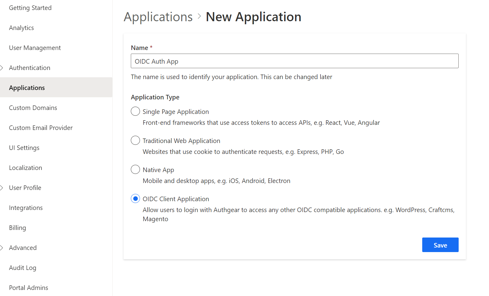
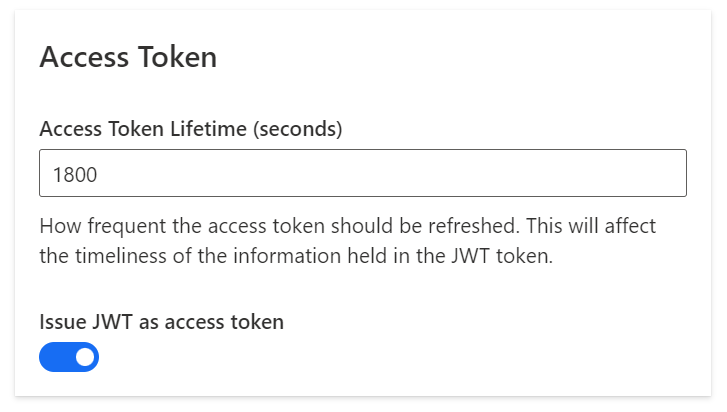
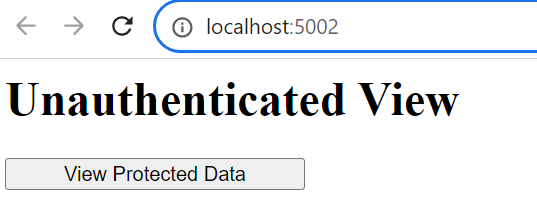
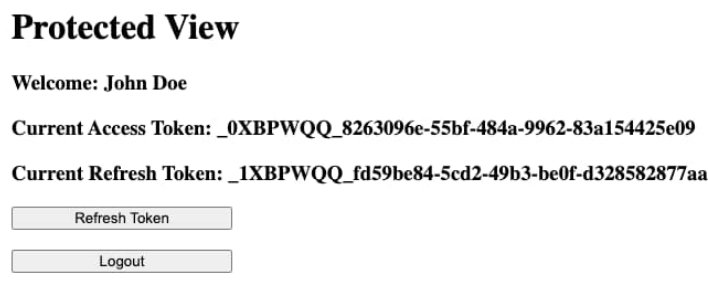
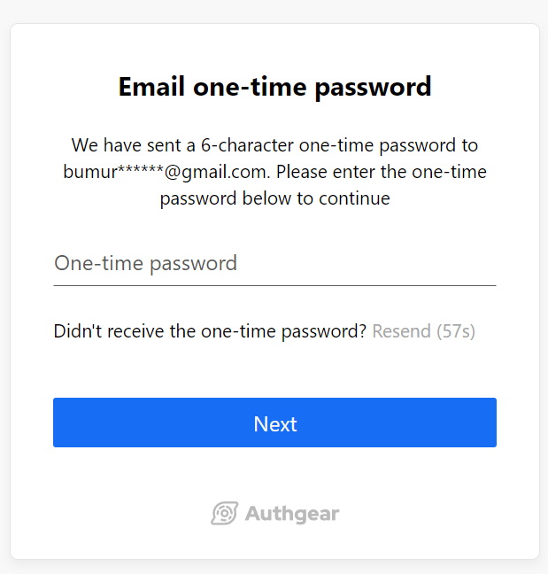

<a href="/" target="_blank">Authgear</a> acts as an IAM provider that is a **gatekeeper to the resources** you provide to customers as web and mobile applications, APIs, etc. The gatekeeper initiates authorization as outlined in <a href="https://oauth.net/2/" target="_blank">OAuth 2.0</a>. The addition of the <a href="https://openid.net/developers/how-connect-works/" target="_blank">OpenID Connect</a> layer adds authentication to secure your users’ digital identities and your product.

This blog post provides a basic demo web application, created using [ASP.NET](http://ASP.NET), and demonstrates how to add authentication features with <a href="/" target="_blank">Authgear</a> by implementing an [OpenID Connect](https://docs.authgear.com/concepts/identity-fundamentals#open-id-connect) flow, then retrieving OAuth tokens, in order to call APIs. View <a href="https://github.com/authgear/authgear-example-dotnet/blob/main/README.md" target="_blank">implementation</a> on GitHub.

## Learning objectives

You will learn the following throughout the article:

- How to add user login, sign-up, and logout to <a href="http://ASP.NET" target="_blank">ASP.NET</a> Core Applications.
- How to use the <a href="http://ASP.NET" target="_blank">ASP.NET</a> Core Authorization Middleware to protect <a href="http://ASP.NET" target="_blank">ASP.NET</a> Core application routes.

## Add authentication to [ASP.NET](http://ASP.NET) Core App

## **Prerequisites**

Before you get started, you will need the following:

- A **free Authgear account**. <a href="https://oursky.typeform.com/to/S5lvI8rN" target="_blank">Sign up</a> if you don't have one already.
- <a href="https://dotnet.microsoft.com/en-us/download" target="_blank">.NET 7</a> downloaded and installed on your machine. You can also use <a href="https://visualstudio.microsoft.com/" target="_blank">Visual Studio</a> and <a href="https://code.visualstudio.com/" target="_blank">VS code</a> to automatically detect the .NET version.

## Part 1: Configure Authgear

To use Authgear services, you’ll need to have an application set up in the Authgear <a href="https://portal.authgearapps.com/" target="_blank">Dashboard</a>. The Authgear application is where you will configure how you want to authenticate and manage your users.

### Step 1: Configure an application

Use the interactive selector to create a new **Authgear OIDC Client application** or select an existing application that represents the project you want to integrate with.

<!--FIGURE--><!--/FIGURE-->

Every application in Authgear is assigned an alphanumeric, unique client ID that your application code will use to call Authgear APIs through the OpenID Connect Client in the .NET app. Note down the Authgear ISSUER (for example, [https://example-auth.authgear-apps.com](https://example-auth.authgear-apps.com)), CLIENT ID, CLIENT SECRET, and OpenID Token Endpoint (<a href="https://example-auth.authgear-apps.com/oauth2/token" target="_blank">https://example-auth.authgear-apps.com/oauth2/token</a>) from the output. You will use these values in the next step for the client app config.

<!--FIGURE--><!--/FIGURE-->

### Step 2: Configure **Redirect URI**

A **Redirect URI** of your application is the URL that Authgear will redirect to after the user has authenticated in order for the **OpenID Connect middleware** to complete the authentication process. In our case, it will be a home page for our <a href="http://ASP.NET" target="_blank">ASP.NET</a> and it will run at <a href="http://localhost:5002" target="_blank">http://localhost:5002</a>.

Set the following redirect URI: <a href="http://localhost:5002/signin-oidc" target="_blank">http://localhost:5002/signin-oidc</a> If not set, users will not be returned to your application after they log in.

### Step 3: Enable Access Token

Also, enable **Issue JWT as an access token** option under the **Access Token** section of the app configuration:

<!--FIGURE--><!--/FIGURE-->

### Step 4: Choose a Login method

After you created the **Authgear app**, you choose how users need to **authenticate on the login page**. From the **Authentication** tab, navigate to **Login Methods**, you can choose a **login method** from various options including, by email, mobile, or social, just using a username or the custom method you specify. For this demo, we choose the **Email+Passwordless** approach where our users are asked to register an account and log in by using their emails. They will receive a One-time password (OTP) to their emails and verify the code to use the app.

<!--FIGURE--><!--/FIGURE-->

## Part 2: Configure <a href="http://ASP.NET" target="_blank">ASP.NET</a> Core application to use Authgear

This guide will use to provide a way for your users to log in to your <a href="http://asp.net/" target="_blank">ASP.NET</a> Core application. The <a href="https://github.com/authgear/authgear-example-dotnet" target="_blank">project source code</a> can be found on GitHub. If you are familiar with the steps, you can skip this part and clone the code repository and run the code sample by following the <a href="https://github.com/authgear/authgear-example-dotnet/blob/main/README.md" target="_blank">README.md</a> file there.

### Step 1: Install dependencies

To integrate Authgear with [ASP.NET](http://asp.net/) Core you will use both the Cookie and OpenID Connect (OIDC) authentication handlers. If you are not using a sample project and are integrating Authgear into your own existing project, then please make sure that you add Microsoft.AspNetCore.Authentication.OpenIdConnect packages to your application. Run the following command in your terminal or use your editor to include the NuGet package there:

```

Install-Package Microsoft.AspNetCore.Authentication.OpenIdConnect
			
```

### Step 2: **Install and configure OpenID Connect Middleware**

To enable authentication in your [ASP.NET](http://ASP.NET) Core application, use the OpenID Connect (OIDC) middleware. Open Startup class and in the ConfigureServices method, add the authentication services, and call the AddAuthentication method. To enable cookie authentication, call the AddCookie method. Next, configure the OIDC authentication handler by adding method AddOpenIdConnect  method implementation. Configure other parameters, such as *Issuer, ClientId, ClientSecret , and Scope*. Here, is how looks like Startup.cs after you apply these changes:

```

public class Startup
 {

     public IWebHostEnvironment Environment { get; }
     public IConfiguration Configuration { get; }

     public Startup(IWebHostEnvironment environment, IConfiguration config)
     {
         Environment = environment;
         Configuration = config;
     }

     // This method gets called by the runtime. Use this method to configure the HTTP request pipeline.
     public void Configure(IApplicationBuilder app, IWebHostEnvironment env)
     {
         app.UseRouting();
         app.UseAuthentication();
         app.UseAuthorization();
         app.UseEndpoints(endpoints =>
         {
             endpoints.MapRazorPages();
         });
     }

     public void ConfigureServices(IServiceCollection services)
     {
         // Prevent WS-Federation claim names being written to tokens
         JwtSecurityTokenHandler.DefaultInboundClaimTypeMap.Clear();

         services.AddAuthentication(options =>
         {
             options.DefaultScheme = CookieAuthenticationDefaults.AuthenticationScheme;
             options.DefaultChallengeScheme = OpenIdConnectDefaults.AuthenticationScheme;
         })
         .AddCookie(CookieAuthenticationDefaults.AuthenticationScheme, options =>
         {
             // Use the strongest setting in production, which also enables HTTP on developer workstations
             options.Cookie.SameSite = SameSiteMode.Strict;
         })
         .AddOpenIdConnect(options =>
         {

             // Use the same settings for temporary cookies
             options.NonceCookie.SameSite = SameSiteMode.Strict;
             options.CorrelationCookie.SameSite = SameSiteMode.Strict;

             // Set the main OpenID Connect settings
             options.Authority = Configuration.GetValue<string>("OpenIdConnect:Issuer");
             options.ClientId = Configuration.GetValue<string>("OpenIdConnect:ClientId");
             options.ClientSecret = Configuration.GetValue<string>("OpenIdConnect:ClientSecret");
             options.ResponseType = OpenIdConnectResponseType.Code;
             options.ResponseMode = OpenIdConnectResponseMode.Query;
             string scopeString = Configuration.GetValue<string>("OpenIDConnect:Scope");
             options.Scope.Clear();
             scopeString.Split(" ", StringSplitOptions.TrimEntries).ToList().ForEach(scope =>
             {
                 options.Scope.Add(scope);
             });

             // If required, override the issuer and audience used to validate ID tokens
             options.TokenValidationParameters = new TokenValidationParameters
             {
                 ValidIssuer = options.Authority,
                 ValidAudience = options.ClientId
             };

             // This example gets user information for display from the user info endpoint
             options.GetClaimsFromUserInfoEndpoint = true;

             // Handle the post logout redirect URI
             options.Events.OnRedirectToIdentityProviderForSignOut = (context) =>
             {
                 context.ProtocolMessage.PostLogoutRedirectUri = Configuration.GetValue<string>("OpenIdConnect:PostLogoutRedirectUri");
                 return Task.CompletedTask;
             };

             // Save tokens issued to encrypted cookies
             options.SaveTokens = true;

             // Set this in developer setups if the OpenID Provider uses plain HTTP
             options.RequireHttpsMetadata = false;
         });

         services.AddAuthorization();
         services.AddRazorPages();

         // Add this app's types to dependency injection
         services.AddSingleton<tokenclient>();
     }
 }
			</tokenclient></string></string></string></string></string>
```

### Step 3: Add Protected resource

Assume that there is a protected resource like Razor page Protected.cshtml that is used to represent views:

```

page "/protected"
model ProtectedModel

addTagHelper*, Microsoft.AspNetCore.Mvc.TagHelpers

<h1>Protected View</h1>

<h3>
    <p>Welcome: &Model.Username</a>
    <p>Current Access Token: &Model.AccessToken</a>
    <p>Current Refresh Token: &Model.RefreshToken</a>
    
    <form method="post">
        <p><button value="RefreshToken" asp-page-handler="RefreshToken">Refresh Token</button></p>
        <p><button value="Logout" asp-page-handler="Logout">Logout</button></p>
    </form>
</h3>
			
```

And ProtectedModel.cs class to which Authorize attribute is applied requires authorization.

```

[Authorize]
public class ProtectedModel : PageModel
{
    public string Username { get; set; }
    public string AccessToken { get; set; }
    public string RefreshToken { get; set; }

    private readonly TokenClient tokenClient;

    public ProtectedModel(TokenClient tokenClient)
    {
        this.tokenClient = tokenClient;
    }

    public async Task OnGet()
    {
        ClaimsPrincipal user = this.User;
        var givenName = user.FindFirstValue("given_name");
        var familyName = user.FindFirstValue("family_name");
        this.Username = $"{givenName} {familyName}";

        this.AccessToken = await this.tokenClient.GetAccessToken(this.HttpContext);
        this.RefreshToken = await this.tokenClient.GetRefreshToken(this.HttpContext);
    }

    public async Task<iactionresult> OnPostRefreshToken()
    {
        await this.tokenClient.RefreshAccessToken(this.HttpContext);
        this.AccessToken = await this.tokenClient.GetAccessToken(this.HttpContext);
        this.RefreshToken = await this.tokenClient.GetRefreshToken(this.HttpContext);
        return Page();
    }

    public async Task OnPostLogout()
    {
        await HttpContext.SignOutAsync(CookieAuthenticationDefaults.AuthenticationScheme);
        await HttpContext.SignOutAsync(OpenIdConnectDefaults.AuthenticationScheme);
    }
}
			</iactionresult>
```

To see protected data, users need to go through the authentication process via Authgear.

<!--FIGURE--><!--/FIGURE-->

If a user has not authenticated yet, Unauthenticated.chtml page is rendered, an OpenID Connect redirect flow is triggered and the user needs to authenticate through the Authgear login page. See **Run the Application** section

After successful authentication, you should see the protected page with the following details:

<!--FIGURE--><!--/FIGURE-->

### Step 4: Set up and run the application

Start by cloning the project into your local machine:

```

git clone
			
```

Make the project directory your current working directory:

```

cd authgear-example-dotnet
			
```

Update the following configuration variables in the appsettings.json file with your Authgear app settings values from **Part1** such as Issuer, ClientId, ClientSecret, and Authgear endpoint:

```

{
    "OpenIDConnect": {
        "ClientId": "{your-client-id}",
        "ClientSecret": "{your-client-secret}",
        "Issuer": "{your-authgear-app-endpoint}",
        "Scope": "openid",
        "PostLogoutRedirectUri": "http://localhost:5002",
        "TokenEndpoint": "{your-authgear-app-endpoint}/oauth2/token"
    },
    "Urls": "http://localhost:5002",
    "Logging": {
        "LogLevel": {
            "Default": "Information",
            "Microsoft": "Warning",
            "Microsoft.Hosting.Lifetime": "Information"
        }
    }
}
			
```

Execute the following command to run the <a href="http://asp.net/" target="_blank">ASP.NET</a> Core web application:

dotnet builddotnet run

You can now visit <a href="http://localhost:5002" target="_blank">http://localhost:5002</a> to access the application. When you click on the **"View Protected Data"** button, <a href="http://ASP.NET" target="_blank">ASP.NET</a> Core takes you to the **Authgear’s Login page**.

<!--FIGURE--><!--/FIGURE-->

Your users can log in to your application through a page hosted by Authgear, which provides them with a secure, standards-based login experience that you can customize with your own branding and various authentication methods, such as <a href="/features/social-login" target="_blank">social logins</a>, <a href="/features/passwordless-authentication" target="_blank">passwordless</a>, [biometrics logins](/features/biometric-authentication), <a href="/features/whatsapp-otp" target="_blank">one-time-password (OTP)</a> with SMS/WhatsApp, and multi-factor authentication (MFA).

<!--FIGURE--><!--/FIGURE-->

After you have authenticated, a protected view is rendered. The application receives an Access token that it uses to present user data on the screen, and tokens that could be used in upstream requests to some backend API, to access data on behalf of the user.

<!--FIGURE--><!--/FIGURE-->

### Next steps

This tutorial showed how to quickly implement an end-to-end OpenID Connect flow in .NET with Authgear. Only simple code is needed, after which protected views are secured with built-in UI login pages.
