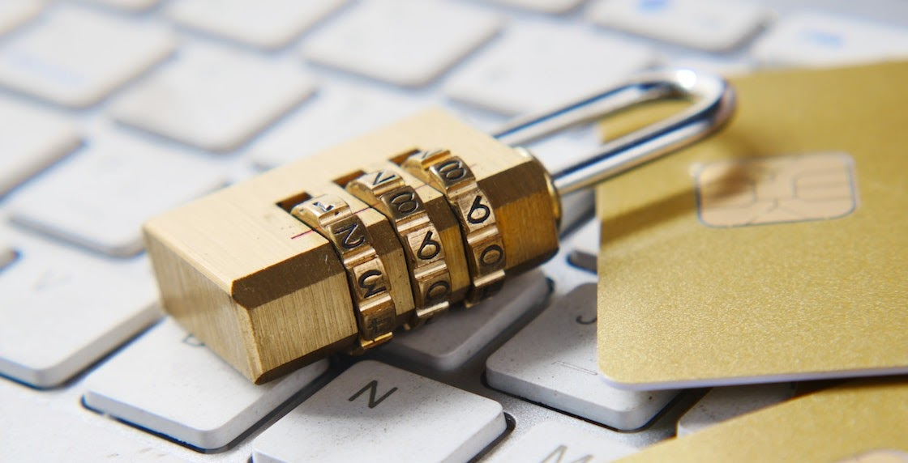
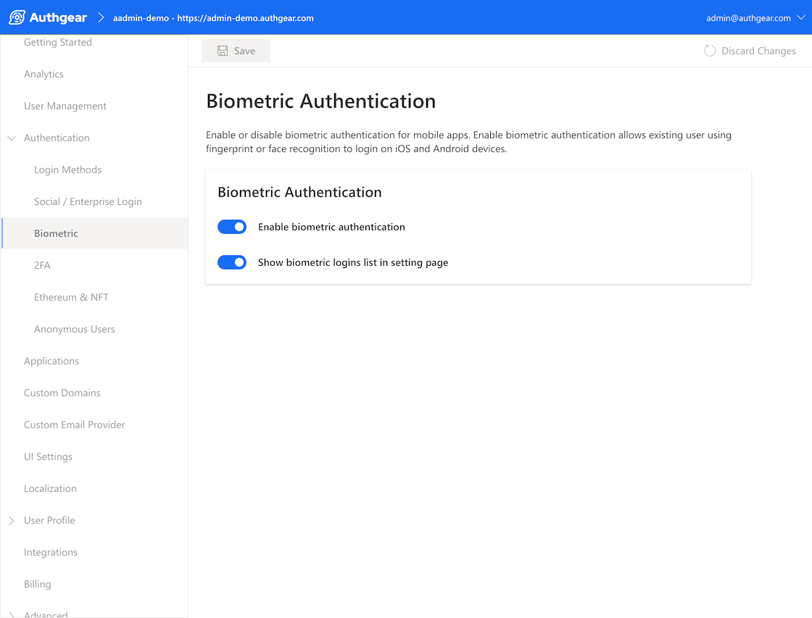

    
    Biometric authentication has become one of the most common login method now that mobile devices equipped with biometric sensors are ubiquitous. Compared to the traditional username-password authentication, it’s a much more secure and convenient authentication method via which users access various applications. When users attempt to log into applications, the system will compare their biometric signatures with the ones stored in the database to make sure that they are the ones with access to the applications or systems.

However, if the good old username-password authentication has been the dominant method of authentication, why should you implement biometric authentication? It’s actually more than just faster login and better data security.

In this blog post, we will talk about:

<nav id="table-of-content">
    <ul>
        <li><a href="#def">What Is Biometric Authentication?</a></li>
        <li><a href="#why">Why Should My Applications or Websites Offer Biometric Login?</a></li>
        <li><a href="#benefits">Benefits of Implementing Biometric Login with Authgear</a></li>
        <li><a href="#types">What Are the Types of Biometric Authentication?</a></li>
        <li><a href="#authgear">How Do I Offer Biometric Authentication in My Applications or Websites?</a></li>
    </ul>
</nav>

<h2 id="def">What Is Biometric Authentication?</h2>

In a nutshell, biometric authentication is the process of verifying a user’s identity by comparing the presented physical attributes, or inherence factors, with the one stored in the database. These inherence factors are integral to the user, such as facial patterns, fingerprints, etc., and therefore can be very hard to replicate. The uniqueness of these physiological characteristics allow researchers to come up with several biometric technologies that have become part of our everyday life.

The difference between biometric and password-based authentication isn’t just the authentication factor. Usually, passwords are securely saved on the server via <a href="/post/password-hashing-salting" target="_blank">hashing and salting</a>. Biometric data, on the other hand, are not passed around between servers and devices. When you log into apps via biometric login, what you unlock isn’t the access to the application but the use of digital certificate or private key that’s actually used to verify the user.

Biometric authentication is mostly used as a secondary authentication method after a user has entered the username and password, or as the main authentication method for returned users. For example, for most banking app, you only need to log in with username and password for the first time. Afterwards, you can log into these apps via Face ID or Touch ID, which is much faster and more secure compared to password-based authentication.

<h2 id="why">Why Should My Applications or Websites Offer Biometric Login?</h2>

<!--FIGURE--><!--/FIGURE-->

### User Experience and Preference

Compared to the good old username-password authentication, biometric authentication is certainly faster for the users. Instead of entering their usernames and passwords, which sometimes can be easily forgotten, users simply have to press on the fingerprint scanner or look into the cameras on their mobile phones to unlock them.

To learn more about consumers’ authentication preferences, <a href="https://www.visa.ie/visa-everywhere/innovation/biometrics-next-frontier-payments.html" target="_blank">VISA conducted a survey among 1,000 Americans</a> and found that:

- 86% of them are interested in using biometric authentication.
- 70% of them think that biometric authentication is easier but only 46% of them think that it’s more secure than passwords.

Even though less than half of the respondents think that biometric authentication is the more secure method, the majority still thinks that it’s the easier way to get authenticated. Gradually, as consumers have more faith in biometric authentication, developers will inevitably need to offer biometric authentication to improve the user experience on their applications or websites.

### Stronger Data Security

Although it is still far from being impenetrable, biometric authentication is still more secure than the username-password authentication in several ways.

1. Users will never forget about their passwords since they are the passwords.
1. Users’ unique biometric data is harder for hackers to replicate.
1. According to <a href="https://www.gartner.com/smarterwithgartner/the-iam-leaders-guide-to-biometric-authentication" target="_blank">Gartner</a>, what makes biometric authentication more secure is not only the uniqueness of users’ characteristics but also the “difficulty to impersonate the living person presenting the trait to a sensor.”

Although it only took 48 hours for hackers to hack Touch ID when it was introduced with iPhone 5S in 2013, biometric authentication has become much more secure now compared to passwords or PINs, which are most likely saved in sticky notes or some documents that are quite vulnerable to hackers.

There are still some areas of improvement, such as accuracy, costs, and software vulnerability, for biometric authentication, but it is evident that biometric authentication has become more popular than the traditional methods.

	<h2 class="title cta-split-content-left">Provide Better and More Secure Login Experience with Authgear</h2>
  
Easily equip your apps with biometric and other authentication features

  <a href="/talk-with-us" target="_blank" class="w-inline-block">
  	
Get Demo

<h2 id="benefits">Benefits of Implementing Biometric Login with Authgear</h2>

The advantage of having biometric login in your apps isn’t limited to convenience. Here are some more business benefits brought by implementing biometric login with a <a href="/post/what-is-customer-identity-and-access-management-ciam" target="_blank">Customer Identity and Access Management</a> solution like Authgear.

### Decrease Cost and Time to Market

Although this might not be the first thing that comes to mind, implementing biometric authentication can reduce costs in a few ways. As clients can now user biometric authentication to log in instead of username and password, the number of account recovery or password reset requests will decrease, saving much operation costs. In addition, many banking apps now also use <a href="/post/sms-otp-vulnerabilities-and-alternatives" target="_blank">SMS OTP</a> as the secondary authentication factor; however, OTP message services aren’t free. Having biometric authentication as another available option allows app owners to reduce the number of messages they have to deliver for verification.

Moreover, as Authgear has already taken care of the development of biometric authentication, implementing biometric login with Authgear can drastically reduce time to market.

### Minimize Efforts to Pass Security Audit and Review

Many sectors, especially in the health and financial industries, have strict cybersecurity regulations to better protect consumers’ personal information. As a result, businesses must make sure that their apps are equipped with features like two-factor authentication and biometric login. Authgear has done the heavy lifting for you. All you have to do is integrate your websites or apps with Authgear and then you can easily deploy security features to pass the audit and review.

### Reduce Development Errors

A lot can go wrong when developing and maintaining biometric authentication, along with other authentication features. Authgear has helped businesses of all sizes secure their applications and we constantly keep up to date with the latest best practices so that our clients can focus on the development of core functionality and not worry about authentication and user management.

<h2 id="types">What Are the Types of Biometric Authentication?</h2>

<!--FIGURE--><!--/FIGURE-->

### **Fingerprint Recognition**

Everyone’s fingerprints are unique. Not even identical twins share the same fingerprints, making them the perfect biometric identifier for authentication. Fingerprint recognition uses a person’s fingerprint to verify the identity and is certainly one the most widespread biometric authentication technologies due to the ubiquity of mobile devices.

### **Face Recognition**

Face recognition was spotted in a lot of films and is now widely deployed in several industries, such as law enforcement, financial services, and more. It mainly analyzes the geometry of the face or facial anatomy to identify users. Based on your data, the system will create an encrypted digital model that will be used as a reference when the user tries to get authenticated.

### **Eye Recognition**

Ever seen one of those films where the protagonists have to access a secret facility by looking into a tiny piece of equipment that scans their eyeballs? That’s a perfect example of eye recognition.

There are actually two types of eye recognition, namely iris and retina recognition. An iris scanner uses infrared light to analyze the colored rings found in the iris while a retina scan checks for the unique pattern of blood vessels in the eye.

Although it has been popularized in all sorts of media, it is quite expensive to implement and therefore is not as popular as face or fingerprint recognition.

### **Voice Recognition**

Voice recognition analyzes the different parts, such as tone, pitch, and frequency, of a user’s voice to check their identity. Nowadays, assistants on mobile devices are programmed to only respond to users whose voices have been matched in the settings.

There are still other physiological and behavioral characteristics, such as vein patterns and gait, that can be used to authenticate users; however, they are not as common as the aforementioned methods.

<h2 id="how-to-include-biometric-auth">How Do I Offer Biometric Authentication in My Applications or Websites?</h2>

Developing an authentication system to provide all kinds of authentication methods in your applications or websites can be a lot of work. Outsourcing your auth system can actually speed up your development process, reduce risks of data breach, and allow your developers to focus on their core tasks.

Authgear provides all features needed for your applications such as passwordless & biometrics, SSO & social login, password policy management, two-factor authentication, etc. In order to enable biometric authentication for your app, you simply have to enable it in your portal and also follow the steps in our [documentation](https://docs.authgear.com/strategies/biometric) to enable biometric login in mobile SDK.

<!--FIGURE--><!--/FIGURE-->

<a href="/talk-with-us" target="_blank">Contact us</a> and learn more about how you can benefit from Authgear to deliver smooth user experience and improve data security.
