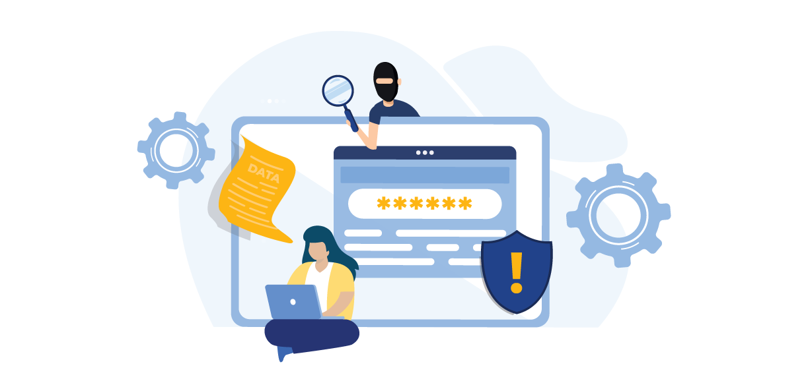
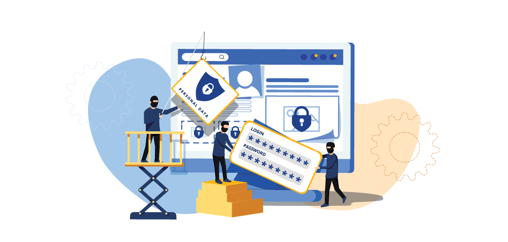

    Authentication is the process of verifying that someone is who they say they are. It is a key part of security for any website or application.

However, authentication can be broken if it is not implemented correctly. According to the OWASP Foundation, broken authentication is among the <a href="https://owasp.org/www-project-top-ten/" target="_blank">top ten web application security risks</a>, ranking at number two in 2017 and seven in 2021. The causes of broken authentication are poorly implemented authentication and session management. Attackers can exploit these vulnerabilities to access sensitive information, such as financial or personal information.

In other words, broken authentication allows attackers to bypass authentication mechanisms and gain the same privileges as the attacked users. But what is broken authentication?

This blog post will explore this topic deeply and discuss the causes of broken authentication and how to prevent it.

<nav id="table-of-content"> Table of Content
    <ul>
        <li><a href="#definition">What Is Broken Authentication?</a></li>
        <li style="margin-bottom:0"><a href="#session-management">Poorly Implemented Session Management</a>
            <ul>
                <li><a href="#hijack">Session Hijacking</a></li>
                <li><a href="#rewrite">Session ID URL Rewriting</a></li>
                <li><a href="#fixation">Session Fixation</a></li>
            </ul>
        </li>
        <li style="margin-bottom:0"><a href="#loose-policy">Loose Password Policies and Stolen/Compromised Credentials</a>
            <ul>
                <li><a href="#stuffing">Credential Stuffing</a></li>
                <li><a href="#spraying">Password Spraying</a></li>
                <li><a href="#phishing">Phishing Attacks</a></li>
            </ul>
        </li>
        <li style="margin-bottom:0"><a href="#prevent-broken">How to Prevent Broken Authentication?</a>
            <ul>
                <li style="margin-bottom:0"><a href="#session-tips">Tips for Better Session Management</a>
                    <ul style="margin-bottom:0">
                        <li style="margin-top:15px"><a href="#avoid-session-url">Avoid Showing Session IDs in URLs</a></li>
                        <li><a href="#session-length">Set the Appropriate Session Length</a></li>
                        <li><a href="#rotate-id">Rotate and Invalidate Session IDs</a></li>
                    </ul>
                </li>
                <li style="margin-top:0;margin-bottom:0"><a href="#strong-policies">Stronger Password Policies & Authentication</a>
                    <ul style="margin-bottom:0">
                        <li style="margin-top:15px"><a href="#passkey">Enable Passkeys as the Primary Authenticator</a></li>
                        <li><a href="#mfa">Implement Multi-factor Authentication</a></li>
                        <li><a href="#hash-salt">Use a Strong Password Hashing Algorithm</a></li>
                        <li><a href="#password-policies">Create Strong Password Policies</a></li>
                    </ul>
                </li>
            </ul>
        </li>
        <li><a href="#authgear">Let Authgear Protect Your Applications from Broken Authentication</a></li>
    </ul>
</nav>

<h2 id="definition">What Is Broken Authentication?</h2>

Broken authentication refers to any vulnerabilities involving the attackers impersonating the original users on applications. In other words, authentication is broken when attacks can assume user identities by compromising passwords, session tokens, user account information and other details. The main causes of broken authentication are poorly implemented session management and loose password policies or other weak security measures resulting in stolen or compromised credentials. Let’s dig into the causes and their associated attacks.

<h2 id="session-management">Poorly Implemented Session Management</h2>

<!--FIGURE--><!--/FIGURE-->

Before we get into how poorly implemented session manage leads to broken authentication, there are a few terms that we need to explain.

When your users are browsing most web applications today, they are required to access online accounts. In most cases, they log in using a username and password. Once they access an online account, the application assigns them an irreplicable **session ID** that acts as an identity key.

This process establishes a **session** — a series of user-related requests that are tracked together. Sessions are used to store information about the state of your interaction with the application. The session IDs usually exist as cookies or Authorization Header.

For example, a session is created when users log into a website. This session tracks all the requests users make while logged in. Once the user logs out or the session times out, the session is destroyed.

Session management relates to how your website and application users designate a given session’s parameters. It is about aspects such as how long a session lasts before they log out or how you issue session IDs. It also relates to the security of the given sessions when connect to the IP addresses of different users.

You should note that your users establish a session with an application or website every time they log in as a user. This session is authenticated, meaning users need credentials to log into the session.

For this reason, OWASP acknowledges that “the session ID of an authenticated session is temporarily equivalent to the strongest authentication method used by the application.” The authentication method could be username and password, one-time passwords (OTP), or biometrics.

There are different types of broken authentication attacks related to session management. These include:

<h3 id="hijack">Session Hijacking</h3>

This type of session management attack happens when an attacker takes over a user's session by stealing their session ID. An attacker can do this in several ways, such as by intercepting the session ID transmitted between the user and the server.

The attacker can also take advantage when a user does not log out after using an application and abandons their device. Cybercriminals will then be able to access the device and use the same session that is still active.

<h3 id="rewrite">Session ID URL Rewriting</h3>

Session ID URL rewriting happens when a user’s session ID is displayed in a website’s URL. Anyone accessing the URL through an unsecured Wi-Fi can continue with the session.

The attack commonly happens when session IDs are inserted into the URL instead of being stored in a cookie. Users might unintentionally share their session ID when they send links to other people. People with the links can then impersonate the original users. This type of attack is common in applications that use URL parameters to store session IDs.

<h3 id="fixation">Session Fixation</h3>

This attack occurs when the web application does not generate a new session ID after the user logs in. In this case, the application gives users the same IDs before and after authentication. It can also happen when the application generates static or easily guessable session IDs.

<h3 id="loose-policy">Loose Password Policies and Stolen/Compromised Credentials</h3>

<!--FIGURE--><!--/FIGURE-->

Cybercriminals can also compromise your authentication process if your apps don’t impose strong password policies. Your users might be inclined to choosing easily-guessed passwords that cybercriminals can use to access their accounts.

Some of the attacks related to stolen or compromised credentials include:

<h3 id="stuffing">Credential Stuffing</h3>

Credential stuffing involves automatically injecting stolen pairs of usernames and passwords into the login forms of a website. Attackers obtain lists of compromised user credentials and use bots to automatically attempt logging into different systems. This is based on the assumption that many users reuse usernames and passwords that are easily to guessed or have been compromised.

If there is a data breach, submitting the stolen credentials to other sites will make it easy for attackers to compromise other accounts. The attackers can sell the stolen credentials or give them away to their fellow cybercriminals. This means more hackers trying your users' credentials on various accounts, which increases the risk of successful attacks.

<h3 id="spraying">Password Spraying</h3>

In this type of attack, cybercriminals try to guess the passwords of many accounts using common passwords. Examples of these passwords include 123456, curse words, sports names, and the term "password." As a matter of fact, <a href="https://edition.cnn.com/2020/11/19/tech/common-passwords-2020-trnd/index.html" target="_blank">2.5 million people still use “123456” as their passwords</a>. Attackers will normally target a large list of users instead of trying to crack one account during any one period.

The problem with these types of attacks is that they can easily go undetected. This is because most organizations do not track failed login attempts.

<h3 id="phishing">Phishing Attacks</h3>

Phishing attacks happen when cybercriminals send malicious emails that trick users into revealing their credentials. They can also use this method to install malware on the victim's device or redirect them to a fake website.

Phishing attacks can expose users' credentials, which can then be used to access their accounts on other websites. The attacks can be broad attempts that target all users with one fraudulent email or a spear phishing attack targeting a particular individual. The latter is common because it is easy for attackers to manipulate a user's emotions based on the available personal information.

<h2 id="prevent-broken">How to Prevent Broken Authentication?</h2>

<!--FIGURE--><!--/FIGURE-->

Although attacks involving broken authentication are common, there are some measures you can take to prevent them. The following safeguards will help you secure your authentication process:

<h3 id="session-tips">Tips for Better Session Management</h3>

These best practices will help you secure your session management process:

<h4 id="avoid-session-url">Avoid Showing Session IDs in URLs</h4>

As we mentioned earlier, session IDs should not appear in URLs since anyone who have access to the URL can continue with the session.

Instead, session IDs should be stored in cookies or HTTP authorization header.

<h4 id="session-length">Set the Appropriate Session Length</h4>

Web applications will automatically end a session at a given point. This happens if the user logs out or if they go for a long period without any activity. You should tailor your web application’s session length to the app in use or the user type.

For instance, a money transfer app should log users out periodically, preferably within minutes, to minimize the vulnerability of session hijacking. But if it’s a streaming video service, the session can go on for weeks so that users don’t have to log in every time.

<h4 id="rotate-id">Rotate and Invalidate Session IDs</h4>

You should also rotate or invalidate session IDs periodically. This will ensure that an attacker cannot use a stolen session ID for an extended period of time. A common practice is to have a refresh token and access token for each session, while the access token is relatively short-lived, and the client can use the refresh token to get a new access token to maintain the session.

<h3 id="strong-policies">Stronger Password Policies & Authentication</h3>

You can also protect your users from various attacks related to password compromises through several measures. These include:

<h4 id="passkey">Enable Passkeys as the Primary Authenticator</h4>

<a href="/features/passkeys" target="_blank">Passkeys</a> is a new category of digital credentials that allow users to log into website applications without using complex passwords that are vulnerable to cyber-attacks. Users will only give a username when signing up, after which they will be authenticated using biometrics or PIN, exactly how they unlock their phones. Passkeys then not only reduces friction during the login and sign-up processes but also enhance data security since attackers have no way to trick the users into giving them the credentials.

<h4 id="mfa">Implement Multi-factor Authentication</h4>

<a href="/post/what-is-multi-factor-authentication-mfa" target="_blank">Multi-factor authentication</a> (MFA) is an authentication method that requires more than one factor to verify the user’s identity. The most common factors are something the user knows (usually a password), something the user has (like a security token), and something the user is (like their fingerprint).

For instance, when users log in to your website application, they may be required to enter their password and input a code sent to their mobile device. MFA adds an extra layer of security to the login process. Even if a cybercriminal manages to steal the user’s password, they will not be able to access the account without the second factor.

<h4 id="hash-salt">Use a Strong Password Hashing Algorithm</h4>

Another measure to prevent password-related attacks is to <a href="/post/password-hashing-salting" target="_blank">hash and salt the passwords</a>. Hashing is the process of converting the password into a random string of characters, known as a hash value while salting is adding random data, known as a salt, to the password before it’s hashed.

This makes it harder for attackers to crack the password because they need to know the salt value to reverse the process. <a href="https://cheatsheetseries.owasp.org/cheatsheets/Password_Storage_Cheat_Sheet.html#password-hashing-algorithms" target="_blank">OWASP has recommended a few hashing algorithms</a> best for storing passwords such as Argon2id, scrypt, bcrypt, and PBKDF2.

An important measure is to use a cryptographically strong password hashing algorithm that converts the password into a non-reversible string of characters. A strong algorithm <a href="/post/password-hashing-salting" target="_blank">hash and salts</a> the passwords so that even if hackers get access to the authentication servers, they won't be able to get the password in clear text.

<h4 id="password-policies">Create Strong Password Policies</h4>

You can also create strong password policies to make it harder for attackers to guess or brute force their way into user accounts. Some of the measures you can take include:

- Enforcing a minimum password strength
- Prohibiting common passwords
- Implementing a password expiration policy
- Restricting the number of failed login attempts such that the account locks out after several attempts

The goal is to eliminate weak passwords that attackers can easily guess.

<h2 id="authgear">Let Authgear Protect Your Applications from Broken Authentication</h2>

Dealing with all these security measures can be quite time-consuming and there’s always a chance for developers to neglect a few steps that can lead to broken authentication. Your team should focus on developing core features instead of worrying about broken authentication.

By integrating your applications with Authgear, you can easily protect your users from the aforementioned cyberattacks. On the portal, you can design strong password policies to minimize the risk of stolen credentials on the portal without writing a single line of code. Furthermore, Authgear also hashes and salts the passwords in your applications to ensure that users’ passwords aren’t stored in plain text.

Authgear equips your applications with all security features and authentication mechanisms to ensure stronger security and an enhanced user experience. <a href="https://accounts.portal.authgear.com/signup" target="_blank">Sign up to Authgear</a> for free, or <a href="/talk-with-us" target="_blank">contact us</a> to learn more about how you can use Authfear to grow your user base.
