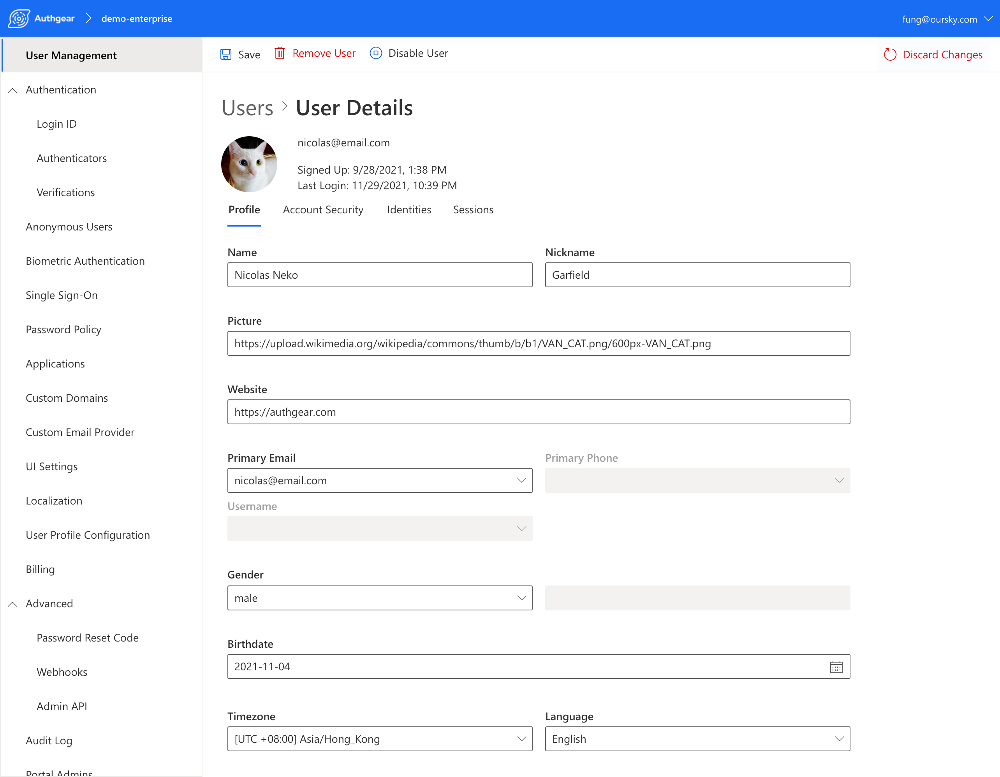
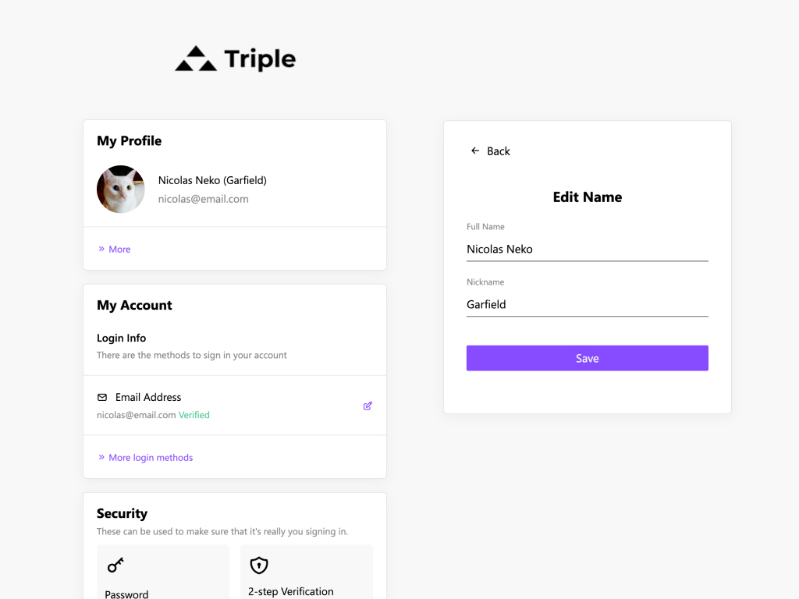

User management is not only sign-up and login. It also includes the storing of user profile securely and a friendly way for the admin and your users to edit them. We are excited to bring these features into all your projects!

## **User Profile**

Each user will have a profile in the Authgear project. The profiles contain information about the users such as name, gender, contact information. You can customize the fields for your project to keep only those you need. Access control can even be set separately for the app, the admins and the end-users.

These attributes are supported out-of-the-box by Authgear: Name, Given Name, Family Name, Middle Name, Nickname, Profile (Webpage), Picture, Website, Gender, Birthdate, Timezone, Language, Address, Email, Phone, Preferred Username.

### Admin Portal

In the user detail page on the Portal, you will find a new tab called "Profile". The app admin can quickly view and change the information about a user.

<!--FIGURE--><!--/FIGURE-->

### Ship fast with the pre-built frontend

In the [User Settings](https://docs.authgear.com/integrate/auth-ui) page, there is a new section where the users can manage their profile. Yes, the front-end is pre-built for you. You don't need to write any code for your final app to ship this feature.

<!--FIGURE--><!--/FIGURE-->

### Accessing the profile

The user profile can be access through the Admin API on your server, or [the SDK and the `userinfo` endpoint](https://docs.authgear.com/integrate/user-profile#userinfo-endpoint) on the client.

### **Pulling basic info from Social Media**

Many developers utilize Authgear to connect their apps with social media logins. Upon signup with social media, these platforms also return the information about the users. Authgear will copy these information into the user profiles. So the profile will be automatically populated when the users first use your app!

Learn more about integrating this feature into your apps by reading [the docs](https://docs.authgear.com/integrate/user-profile).
