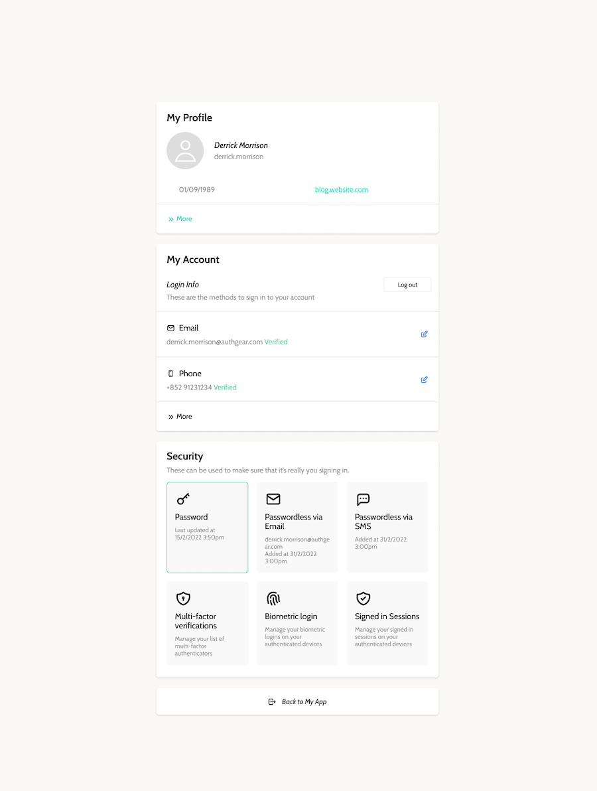

In a recent <a href="https://www.pwc.com/us/en/services/consulting/library/consumer-intelligence-series/future-of-customer-experience.html" target="_blank">PWC survey</a>, 32% of customers included said they would stop engaging with a business after just one bad experience. There’s no doubt about it. Customer experience has to be a priority for any business seeking success, and when it comes to the digital space, it’s all about making sure that each online interaction is a positive one.

In this article, we’ll be looking at how businesses can improve the digital customer experience with customer identity and access management solutions. Improving how people log onto and access your business’s offerings has significant benefits for both the digital customer experience and your bottom line.

<nav id="table-of-content">
    <ul>
        <li><a href="#how">How Can You Improve the Digital Customer Experience with CIAM?</a>
            <ul>
                <li><a href="#registraion">A Simplified Registration Process</a></li>
                <li><a href="#login">Making the Login Process Smoother</a></li>
                <li><a href="#sso">Single Sign-On (SSO) for Convenient Access Across Multiple Platforms</a></li>
                <li><a href="#security">Enhanced Security and Trust</a></li>
                <li><a href="#service">Self-Service Capabilities</a></li>
            </ul>
        </li>
        <li><a href="#benefits">The Benefits of Using CIAM to Improve Digital Customer Experience</a>
            <ul>
                <li><a href="#convert">Convert More Visitors into Customers</a></li>
                <li><a href="#sales">Increase Sales and Retain More Customers</a></li>
                <li><a href="#cost">Reduce Customer Support Costs</a></li>
                <li><a href="#loyalty">Build Customer Loyalty</a></li>
            </ul>
        </li>
        <li><a href="#authgear">Elevate Digital Customer Experience with Authgear</a></li>   
    </ul>
</nav>

<h2 id="how">How Can You Improve the Digital Customer Experience with CIAM?</h2>

Improving customer experience is a never-ending fight that requires businesses to find the optimum balance between customer experience and security to eliminate frictions and gain customer trust at the same time. From smoother signups and logins to improved customer trust, here’s how integrating great CIAM with your apps and other platforms can improve the digital customer experience:

<h3 id="registraion">A Simplified Registration Process</h3>

<!--FIGURE--><!--/FIGURE-->

One of the very first interactions a customer will have with a business’s website is registering their details to open a new account. This can often be a finicky process with lengthy forms and annoying questions that end up putting people off entirely. It’s why landing and sign-up page drop-off rates can sometimes be as high as <a href="https://andrewchen.com/investor-metrics-deck" target="_blank">80%</a>.

To help keep customers engaged, Authgear provides a pre-built registration template that follows the best practices for a high signup conversion rate so that the registration process helps clinch new customers rather than scare them off.

We also offer <a href="/post/social-login-guide" target="_blank">social login options</a> like Login with Facebook, Google, Apple, and more, at Authgear. These allow users to sign up for your apps or websites with existing credentials from popular platforms. The benefit of this in terms of improving digital customer experience is that users get to skip most, if not all, of the most annoying steps of registering.

In addition, we’ve also supported <a href="/features/passkeys" target="_blank">passkey</a>, an alternative method of user authentication that has the potential to replace usernames and passwords once and for all. Users no longer have to create and remember complex passwords with passkey. They simply have to do what they usually do to unlock their phones like via a biometric sensor or PIN, simplifying the registration processing and improving digital customer experience.

<h3 id="login">Making the Login Process Smoother</h3>

Once registration is complete, logging into your site or app becomes the next hurdle for a customer to cross. Thankfully, having to remember complicated passwords doesn’t need to be an issue anymore with passkey and other <a href="/post/passwordless-authentication-complete-guide" target="_blank">passwordless authentication</a> methods as we explain earlier. Other passwordless options that we offer at Authgear include <a href="/features/whatsapp-otp" target="_blank">WhatsApp OTP</a>, <a href="/features/biometric-authentication" target="_blank">biometric authentication</a>, and SMS OTP.

<!--FIGURE--><!--/FIGURE-->

Making it easier for your customers to log in is one of the simplest solutions for anyone looking at how to improve digital customer experience. Think of your registration and login process like you would the doorway to a store – if it’s heavy and difficult to use, or doesn’t automatically slide open when expected, customers are likely to give up and go somewhere easier to access.

By providing a <a href="/post/frictionless-authentication" target="_blank">frictionless authentication</a> experience with CIAM, you can take control of some of the first and most fundamental impressions a customer will have of your business. That’s how you ensure that they stay engaged, rather than signing off.

<h3 id="sso">Single Sign-On (SSO) for Convenient Access Across Multiple Platforms</h3>

Single Sign-On (SSO) allows users to log into multiple sites with just a single set of credentials. Businesses that run more than one platform can use SSO to create a greater sense of uniformity across their offerings.

It helps connect customers to apps operating under the same banner while also making for a far more convenient login process overall. Instead of using separate logins for each site or app, a user only needs one. It’s more convenient that way and reflects better on the business hosting the platforms.

<h3 id="security">Enhanced Security and Trust</h3>

Trust is a crucial component of any long-term relationship but building it with customers is often challenging. One of the most significant ways that CIAM can help with this aspect of the digital customer experience is by not only making sign-ups and logins more convenient but by backing that up with a real sense of security for users.

A frictionless authentication process is one thing, but if it’s all too easy, then it may give the impression of lax security. Our CIAM solution is dedicated to helping businesses protect both their data and that of their users from unauthorized access so that customers feel safe in their digital interactions.

It’s a tricky balance, creating systems that make things easier for users without compromising security, but one we’ve managed to find and better yet, seen many times over how it helps build a sense of trust with customers.

<h3 id="service">Self-Service Capabilities</h3>

Another way in which CIAM like Authgear helps improve digital customer experience is by providing users with self-service options. Where in the past an issue with a password or a request to change login details may have required customer support, Authgear provides an account setting page that allows users to manage much of this on their own.

<!--FIGURE--><!--/FIGURE-->

Customers can update their personal information, reset their passwords, change their authentication methods, and adjust any linked accounts they have according to their preferences, at any time without having to wait for days and hours for the customer support team to respond.

<h2 id="benefits">The Benefits of Using CIAM to Improve Digital Customer Experience</h2>

Choosing to tackle the issue of how to improve digital customer experience using a CIAM solution brings with it a host of added benefits. From increased conversion rates and sales to lowered support costs, CIAM doesn’t just benefit the customer, it benefits the business. Here’s how:

<h3 id="convert">Convert More Visitors into Customers</h3>

By reducing friction in the registration process with CIAM, businesses are able to not only reduce the bounce rate for new visitors but also ensure that more people follow through with the signup process. This simple step can have major financial benefits.

It means that businesses can expand their newsletter lists and be more targeted in their advertising to further coax casual visitors into being dedicated customers. It helps ensure that attempt at reeling in new customers works as intended, bringing with it the potential for increased sales down the line.

<h3 id="sales">Increase Sales and Retain More Customers</h3>

Sign-up is one thing but how do you make it easy for people to return after that first interaction? <a href="https://andrewchen.com/investor-metrics-deck" target="_blank">50-75%</a> of users who register with a website will remain inactive after that point. When you manage to attract them back, likely through advertising or newsletter, passwords and bad CIAM practices shouldn’t be the thing that keeps them inactive.

That’s why integrating your platforms with a CIAM solution can be quite beneficial. It doesn't just help improve digital customer experience, they also make it far easier for customers to return to your platforms even after a long hiatus. If they didn’t choose a passwordless solution and need to change their login, no problem. That’s where our self-service settings kick in again to help retain customer attention and eventually, lead to more sales.

Many sites nowadays don’t ask for users to re-login until they’re about to complete their purchase. The problem is that if that login process is irritating in any way, it can give people enough pause that they choose to abandon the purchase altogether. Don’t give them that chance. A smooth authentication streamlines the whole buying process which means fewer abandoned carts and in turn, more sales.

<h3 id="cost">Reduce Customer Support Costs</h3>

Customer support costs can be a huge drain on businesses, especially as they expand. The issue is that if there isn’t adequate support present, customer experience can drop significantly and cost a business in sales. CIAM solutions like Authgear are set up to ensure that the digital customer experience stays positive, while also lowering customer support costs.

The first way we’ve designed our solutions to do this is with passwordless authentication options. One of the most common customer support issues tends to be users who have forgotten their passwords and get locked out of their accounts. By going passwordless, businesses can avoid this issue entirely which means fewer customer support requests and more satisfied customers.

The self-service capabilities in our CIAM solutions also offer major benefits in this regard. If a user needs to change their password, update personal information, or change their authentication method, they don’t need to email support staff. They can simply adjust things themselves to suit their exact needs.

These may seem like small interventions, but they can drastically cut back the amount of customer support requests that come in and as a result, reduce how much staff a business needs to hire to meet user demand.

<h3 id="loyalty">Build Customer Loyalty</h3>

Encouraging customer loyalty is all about ensuring that every time they show up to your site, they’re offered a seamless, secure experience. Going back to that first statistic we mentioned on how one bad experience is enough to drive 32% of customers away, one security breach can cost a business in both data and customer loyalty.

Proper CIAM that adheres to regulations and upholds data privacy makes people feel safe in using your platforms and helps build loyalty over time. Customers need to feel reassured that their login is as secure as it is convenient. Passwordless options that boost protection against cyber security threats aren’t just great CIAM to improve customer experience, but customer loyalty as well.

A site that you know is safe and easy to use is far more attractive than one where there’s a question mark over privacy. Security and reliability are hugely important for customer loyalty and an area where CIAM, especially the way Authgear does it, can bring a host of benefits.

<h2 id="authgear">Elevate Digital Customer Experience with Authgear</h2>

Customers should be able to use your platforms with ease and be reassured at every step that their data is safe. Our passwordless options, self-service settings, and pre-built registration templates do just that. Authgear’s CIAM approach is designed to be easy to integrate into apps and websites while offering the added bonus of boosting both customer experience and data privacy.

Knowing how to improve digital customer experience is one thing, but at Authgear, we’re ready to elevate it.

Click <a href="/solutions/customer-identity-and-access-management" target="_blank">here</a> to learn more about our CIAM solutions or <a href="/talk-with-us" target="_blank">contact us</a> to tell us more about your business and how Authgear can help you find the right balance between smooth digital customer experience and strong data security.
