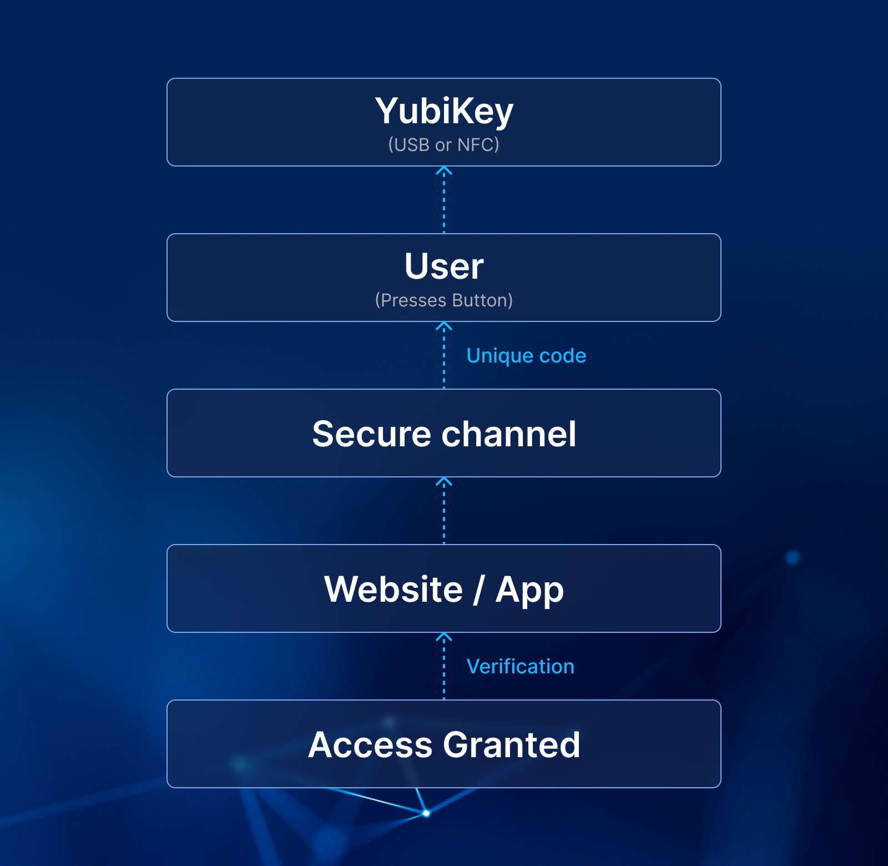

## What is a YubiKey? How Does it Work? (See diagram below)

Imagine a tiny, USB-like device that acts as a physical guardian to your online accounts. That's essentially what a YubiKey is. It's a hardware authentication device that replaces traditional passwords with a more secure and convenient method – cryptographic keys.

1. Plug and Play: You insert the YubiKey into your computer's USB port or your mobile device's NFC reader.
1. Login Challenge: When logging in to a website or application, you'll be prompted for your second-factor authentication (2FA).
1. Button Press: Tap the golden button on the YubiKey. This triggers the magic within!
1. Unique Code Generation: Inside the YubiKey, a secure chip generates a unique, one-time passcode. This code is based on complex mathematical algorithms and your YubiKey's individual identity.
1. Secure Transmission: The generated code is then transmitted to the website or app, not through your keyboard (a key security feature!), eliminating the risk of keyloggers capturing it.
1. Verification and Access: The website/app verifies the code's validity and, if correct, grants you access.

<!--FIGURE--><!--/FIGURE-->

## The Meteoric Rise of Passkeys: Why YubiKey and Similar Solutions are Booming

<!--FIGURE--><!--/FIGURE-->

The surge in popularity of passkeys like YubiKey isn't just a fad; it's a response to a perfect storm of factors converging in the digital landscape. Let's dissect the key drivers behind this exciting shift:

1. The Password Predicament:

- Security Woes: Data breaches continue to plague us, highlighting the inadequacy of passwords in a world of sophisticated cyberattacks. Phishing and credential stuffing remain significant threats, and complex password management is a burden for most users.
- User Fatigue: Remembering numerous, unique passwords for countless accounts is frustrating and impractical. Users often resort to weak, reused passwords, further compromising security.

1. The Rise of Awareness and Demand:

- Increased Cyber Literacy: The public is becoming increasingly aware of cyber threats and the importance of robust online security. Consumers are actively seeking solutions that offer better protection for their digital identities.
- Regulatory Push: Data privacy regulations like GDPR and CCPA are driving organizations to adopt stronger authentication measures, further fueling the demand for secure alternatives.

1. Technological Advancements:

- WebAuthn Standard: This industry-backed standard defines a protocol for websites and applications to securely communicate with authenticators like YubiKey, paving the way for widespread adoption.
- Biometric Integration: Advancements in fingerprint and facial recognition technologies are enabling seamless and secure login experiences while incorporating passkeys.
- Mobile Device Compatibility: Growing support for passkeys on smartphones and tablets through NFC and Bluetooth connectivity increases accessibility and convenience.

1. Industry Adoption and Momentum:

- Tech Giants Lead the Way: Major players like Google, Microsoft, Apple, and Twitter are implementing passkey support, demonstrating their legitimacy and effectiveness. This sets a precedent for broader adoption across various industries.
- Open-Source Development: Initiatives like the FIDO Alliance and Thetis are fostering open-source development of passkey solutions, ensuring wider accessibility and innovation.

1. Benefits Beyond Security:

- Convenience: Passkeys offer a faster and more convenient login experience compared to traditional passwords, eliminating the need for typing and remembering complex strings.
- Reduced Costs: Organizations can benefit from reduced helpdesk tickets related to password resets and improved employee productivity with streamlined login processes.
- Universal Applicability: Passkeys hold the potential to become a universal authentication standard, eliminating the need for multiple login credentials across different platforms.

The rise of passkeys signifies a paradigm shift in online security. While YubiKey is a prominent player, other solutions exist, catering to diverse needs and preferences. The key takeaway is that moving beyond passwords towards secure hardware authentication is no longer a distant future, but a rapidly approaching reality.

## Beyond YubiKey: Exploring the Diverse Landscape of Passkey Solutions

<!--FIGURE--><!--/FIGURE-->

In our previous explorations, we delved into the world of YubiKeys and the rising trend of passkeys. Now, let's broaden our horizons and explore some compelling alternatives to YubiKey, each with unique strengths and considerations:

1. Feitian:

- Variety is Key: Feitian offers a wider range of key types and form factors compared to YubiKey. From standard USB sticks to NFC rings and Bluetooth dongles, they cater to diverse user preferences and device compatibility needs.
- Cost-Effectiveness: Generally more affordable than YubiKeys, Feitian keys can be a budget-friendly option for individuals or organizations seeking a basic level of hardware authentication.
- Potential Drawbacks: Security certifications and community support might not be as extensive as YubiKey, and some models may lack advanced features like multi-protocol support.

1. Thetis:

- Biometric Fusion: Thetis stands out by integrating fingerprint sensors into their keys, offering an additional layer of security and convenience through biometric authentication.
- Sleek Design: Thetis keys boast a more modern and user-friendly design compared to some traditional YubiKey models, appealing to design-conscious users.
- Limited Availability: Currently, Thetis keys have a smaller market presence and might be less readily available compared to YubiKeys.

1. Nitrokey:

- Open-Source Power: Nitrokey champions open-source hardware and software, allowing for greater transparency and customization for tech-savvy users.
- Advanced Features: Some Nitrokey models offer advanced features like secure PIN unlocking and support for a wider range of protocols, catering to power users and specific security needs.
- Steeper Learning Curve: The open-source nature and advanced features might require more technical knowledge for setup and use compared to user-friendly options.

1. Google Titan Security Key:

- Google Integration: Tightly integrated with Google products and services, the Titan key offers a seamless experience for users heavily invested in the Google ecosystem.
- Affordability: The Titan key is a relatively affordable option, making it accessible to a wider audience.
- Limited Functionality: Primarily focused on Google services, the Titan key might not offer the same versatility as other options for broader passwordless authentication needs.

## Securing the Enterprise: Why YubiKey and Authgear are the Perfect Duo

<!--FIGURE--><!--/FIGURE-->

While YubiKey offers robust individual hardware authentication, enterprises require a comprehensive solution to manage and leverage its full potential across their organization. That's where Authgear steps in, acting as the brains behind the brawn of your YubiKey deployment.

Why Enterprises Need an Auth Solution with YubiKeys:

1. Centralized Management: Imagine juggling hundreds or even thousands of YubiKeys. Authgear provides a central console to easily enroll, assign, and manage user access, streamlining deployment and eliminating administrative headaches.
1. Seamless User Experience: No more confusing login workflows! Authgear integrates seamlessly with existing applications and directories, allowing users to log in effortlessly with their YubiKeys across different platforms.
1. Granular Access Control: Define and enforce specific access permissions for different users and groups, ensuring granular control over sensitive data and resources.
1. Compliance and Reporting: Stay ahead of regulations with detailed activity logs and reports on user access and authentication attempts. Authgear helps you demonstrate compliance with data privacy regulations like GDPR and CCPA.
1. Multi-Factor Authentication (MFA) & Passwordless: Go beyond YubiKey and leverage Authgear's support for other MFA methods, offering a layered security approach and even enabling passwordless login for select applications.
1. Scalability and Security: Securely scale your authentication needs as your organization grows. Authgear boasts robust security infrastructure and adheres to industry best practices to protect your sensitive data.

The YubiKey & Authgear Advantage:

Think of YubiKey as the physical key to your enterprise, and Authgear as the sophisticated lock system that controls access. Together, they offer:

- Unmatched Security: Eliminate password-based vulnerabilities and protect against phishing, credential stuffing, and other cyberattacks.
- Enhanced User Experience: Streamline login processes and improve user satisfaction with convenient, secure authentication.
- Reduced Costs: Save time and resources on password resets, helpdesk tickets, and security breaches.
- Improved Compliance: Demonstrate adherence to data privacy regulations and mitigate compliance risks.

Beyond YubiKey:

Remember, Authgear isn't limited to YubiKeys. It integrates with various industry-leading passkey solutions, offering flexibility to choose the option that best suits your specific needs and budget.

Ready to Secure Your Enterprise?

Don't settle for password-based vulnerabilities. Equip your organization with the combined power of YubiKey and Authgear, and unlock a future of secure, user-friendly, and scalable authentication. Contact Authgear today to discuss your specific needs and experience the future of enterprise security.
