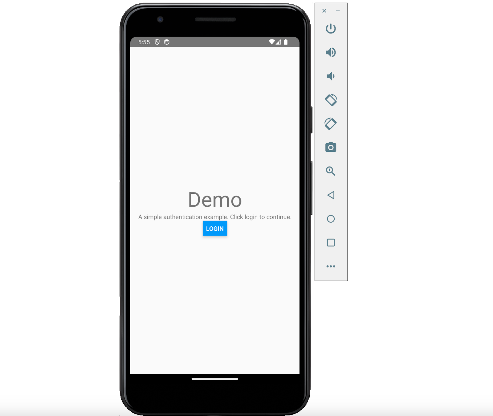
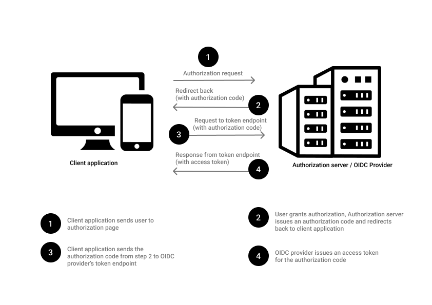
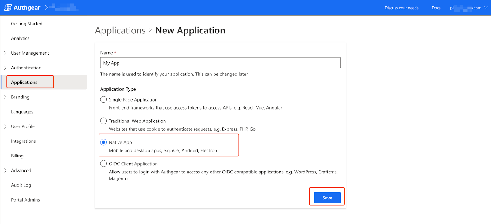
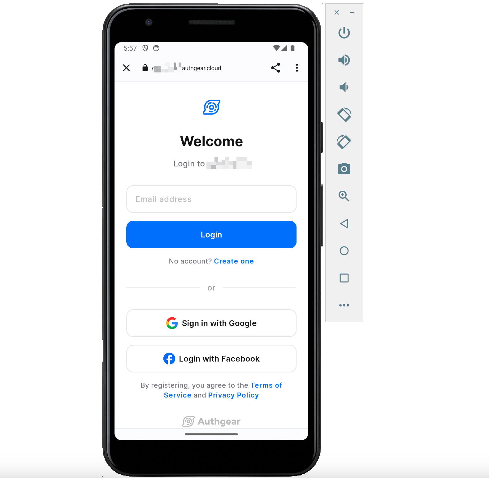
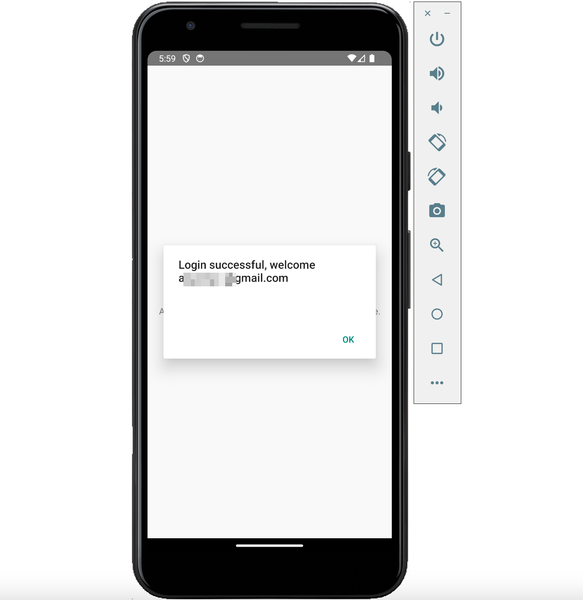

A simple definition of user authentication in a React Native application is a feature that allows users of the application to register with a username and password and subsequently log in with the same details to access additional features. User Authentication is an important part of any modern application that offers personalized or custom experience to each user.  For example, if you’re building an e-commerce application, adding authentication makes it easier to save a user's shopping cart and purchase history.

In this post, you’ll learn how to add authentication to a React Native application in under 10 minutes.

For this post, we’ll use an Authentication-as-a-Service solution Authgear, to save you stress, time, and cost associated with building your backend service for saving users’ login details and handling authentication logic. Authgear makes adding user authentication to React Native applications fast and secure.

## Pre-requisites

To follow this guide seamlessly, you should have the following:

- Node.js (version 18.20.4 or later) installed on your computer.
- Android or iOS Development Set up on your computer. See the [Set Up Your Environment](https://reactnative.dev/docs/set-up-your-environment) section of the official React Native documentation for more details.
- A code editor (e.g. Visual Studio Code)

## Steps: How to Add User Authentication to React Native

In the following section, we’ll provide a step-by-step guide for building a simple React Native application that has a login button that users can click to start authentication. Once the user logs in successfully, they are redirected back to the application with a custom welcome message.

The following screenshot shows the welcome screen with the login button mentioned above:

<!--FIGURE--><!--/FIGURE-->

Under the hood, Authgear uses [OpenID Connect](https://docs.authgear.com/how-to-guide/authenticate/oidc-provider) (OIDC) authentication protocol. As a result, during authentication, a user is redirected to an authorization page and then redirected back to the client application (your React Native application) once authorization is complete.

Below is a flowchart that explains how OIDC works.

<!--FIGURE--><!--/FIGURE-->

### 1. Create a React Native Project or use an existing project

First, you need to create the React Native project to which you will be adding user authentication. If you already have an existing React Native project, you can skip this step.

To create a new React Native project, run the following command from the directory where you want to store your project:

```
npx react-native init reactnativeauth 
```

If prompted to install react-native, type “y” and hit Enter to continue.

Wait for the project creation process to finish.

### 2. Add Authgear RN SDK to Your React Native Project

Now that you have a React Native Project, you’re ready to add the Authgear SDK to it. We mentioned earlier that Authgear is an Authentication-as-a-Service solution that makes it easy and fast to add secure authentication to React Native applications.

Before you continue, if you created a new project in the previous step, update the content of the **App.tsx** to the following remove the default React Native starter app screen:

```

import React, {useCallback} from 'react';
import {Alert, Button, Text, View} from 'react-native';

function App(): React.JSX.Element {
  return &#60;LoginScreen /&#62;;
}

function LoginScreen() {
  const initiateAuthentication = useCallback(() => {
    // Normally you should only configure once when the app launches.
    // TODO
  }, []);

  return (
    &#60;View
      style={{
        flex: 1,
        justifyContent: 'center',
        alignItems: 'center',
      }}>
      &#60;Text style={{fontSize: 48}}>Demo&#60;/Text&#62;
      &#60;Text>A simple authentication example. Click login to continue.&#60;/Text&#62;
      &#60;Button title="Login" onPress={initiateAuthentication} /&#62;
    &#60;/View&#62;
  );
}

export default App;

```

Install the Authgear SDK by running the following command from the root directory of your React Native project:

```
npm install @authgear/react-native
```

### 3. Configure Authgear

Next, configure the Authgear SDK with the credentials from your Authgear application. To get the credentials, you’ll need to [sign up](https://accounts.portal.authgear.com/signup) for an Authgear account and create an application.

You can create an application on the Authgear Portal by navigating to **Application** > **Add Application**. Then select **Native App** and click **Save**.

<!--FIGURE--><!--/FIGURE-->

Once you’re done creating your Authgear application, you’ll be redirected to the application’s configuration page where you can find your credentials and set an **Authorized Redirect URI**. The Authorized Redirect URI is a valid page on your application that Authgear can redirect the user to after authorization. The Authgear SDK will create this page in your React Native project.

For this example, add *com.reactnativeauth://host/path* as an Authorized Redirect URI. In your own personal or work project, this value may be the **{namespace}://host/path** for your application (you can find **namespace** in **android/app/build.gradle**).

Now, update **App.tsx** to include your Authgear application’s Client ID, and [endpoint](https://docs.authgear.com/reference/glossary#your-authgear-endpoint).

First, find the following line in App.tsx:

```
// TODO 
```

Replace the above line with the following code:

```

authgear
  .configure({
    clientID: '&#60;YOUR_CLIENT_ID&#62;',
    endpoint: '&#60;YOUR_AUTHGEAR_ENDPOINT&#62;',
  })
  .then(() => {
    authgear
      .authenticate({
        redirectURI: 'com.reactnativeauth://host/path',
      })
      .then(({userInfo}) => {
        Alert.alert('Login successful, welcome ' + userInfo.email);
      });
  });

```

Replace **YOUR_CLIENT_ID** and **YOUR_AUTHGEAR_ENDPOINT** with the correct values for your Authgear application.

### 4. Implement Authorized Redirect URI

To enable your application to handle the redirect back when the user finishes authentication, you need to make changes to your project’s platform-specific (iOS and Android) configurations.

**Android**

For Android, open the android/app/src/main/AndroidManifest.xml file and add the following code inside the <application> tag like this:

```

&#60;application&#62;
  &#60;activity android:name="com.authgear.reactnative.OAuthRedirectActivity"
      android:exported="true"
      android:launchMode="singleTask"&#62;
      &#60;intent-filter&#62;
          &#60;action android:name="android.intent.action.VIEW" /&#62;
          &#60;category android:name="android.intent.category.DEFAULT" /&#62;
          &#60;category android:name="android.intent.category.BROWSABLE" /&#62;
          &#60;!-- Configure data to be the exact redirect URI your app uses. --&#62;
          &#60;!-- NOTE: The redirectURI supplied in AuthenticateOptions *has* to match as well --&#62;
          &#60;data android:scheme="com.reactnativeauth"
              android:host="host"
              android:pathPrefix="/path"/&#62;
      &#60;/intent-filter&#62;
  &#60;/activity&#62;
&#60;/application&#62;

```

Also, include the following queries section in your **AndroidManifest.xml (**required for Android API Level 30 or higher that is, Android 11 or above):

```

&#60;?xml version="1.0" encoding="utf-8"?&#62;
&#60;manifest xmlns:android="http://schemas.android.com/apk/res/android"&#62;
  <!-- Other elements such <application> -->
  &#60;queries&#62;
    &#60;intent&#62;
      &#60;action android:name="android.support.customtabs.action.CustomTabsService" /&#62;
    &#60;/intent&#62;
  &#60;/queries&#62;
&#60;/manifest&#62;

```

**iOS**

For iOS, add the matching redirect URI in **ios/reactnativeauth/Info.plist** like this:

```

&#60;?xml version="1.0" encoding="UTF-8"?&#62;
&#60;!DOCTYPE plist PUBLIC "-//Apple//DTD PLIST 1.0//EN" "http://www.apple.com/DTDs/PropertyList-1.0.dtd"&#62;
&#60;plist version="1.0"&#62;
&#60;dict&#62;
      <!-- Other entries -->
      &#60;key&#62;CFBundleURLTypes&#60;/key&#62;
      &#60;array&#62;
              &#60;dict&#62;
                      &#60;key&#62;CFBundleTypeRole&#60;/key&#62;
                      &#60;string&#62;Editor&#60;/string&#62;
                      &#60;key&#62;CFBundleURLSchemes&#60;/key&#62;
                      &#60;array&#62;
                              &#60;string&#62;com.reactnativeauth&#60;/string&#62;
                      &#60;/array&#62;
              &#60;/dict&#62;
      &#60;/array&#62;
&#60;/dict&#62;
&#60;/plist&#62;

```

Next, insert the SDK integration code by adding the following code to **ios/reactnativeauth/AppDelegate.mm**:

```

// Other imports...
#import &#60;authgear-react-native/AGAuthgearReactNative.h&#62;

// Other methods...

// For handling deeplink
- (BOOL)application:(UIApplication *)app
            openURL:(NSURL *)url
            options:
                (NSDictionary&#60;UIApplicationOpenURLOptionsKey, id&#62; *)options {
    return [AGAuthgearReactNative application:app openURL:url options:options];
}

// For handling deeplink
// deprecated, for supporting older devices (iOS &#60; 9.0)
- (BOOL)application:(UIApplication *)application
              openURL:(NSURL *)url
    sourceApplication:(NSString *)sourceApplication
          annotation:(id)annotation {
    return [AGAuthgearReactNative application:application
                                      openURL:url
                            sourceApplication:sourceApplication
                                  annotation:annotation];
}

// for handling universal link
- (BOOL)application:(UIApplication *)application
    continueUserActivity:(NSUserActivity *)userActivity
      restorationHandler:
          (void (^)(NSArray&#60;id&#60;UIUserActivityRestoring&#62;&#62; *_Nullable))
              restorationHandler {
    return [AGAuthgearReactNative application:application
                        continueUserActivity:userActivity
                          restorationHandler:restorationHandler];
}

```

### 5. Test Your Application

If you followed the above steps correctly, you should be able to test user authentication on your app now.

To test your application, run the **npm start** command then press the **“a”** key for Android or the **“i”** key for iOS on your keyboard.

You should be greeted with the welcome screen and a Login button.

Click on the login button to start an authentication session. You’ll be redirected to Authgear’s secure authentication user interface (AuthUI) where your users can either register a new account or log in to an account they’ve created.

<!--FIGURE--><!--/FIGURE-->

On successful login, users will be redirected back to your application with the welcome message we added to the sample code in this tutorial. If you study the code, you’ll also notice a **userInfo** object that’s returned by the Authgear SDK, you can use this object to get details about the current user. In our example, we used **userInfo.email** to display the current user’s email address.

<!--FIGURE--><!--/FIGURE-->

## Conclusion

With the above steps, we’ve been able to add authentication to a React Native application quickly without building our own backend.

Authgear offers pre-built login and registration screens called AuthUI. Also, you can customize the AuthUI in the Authgear Portal to match the rest of your application’s branding.

There’s so much more you can do with Authgear Portal to customize your application and manage your users.

Finally, Authgear has APIs, and login methods (such as [biometric](https://docs.authgear.com/how-to-guide/authenticate/biometric), OTP, TOTP, and more) that allow developers to build more custom experiences. To learn more about Authgear, check out our [official documentation](https://docs.authgear.com/) or join our [discord server](https://discord.gg/Kdn5vcYwAS) to ask questions and get answers from our community of developers passionate about authentication.
