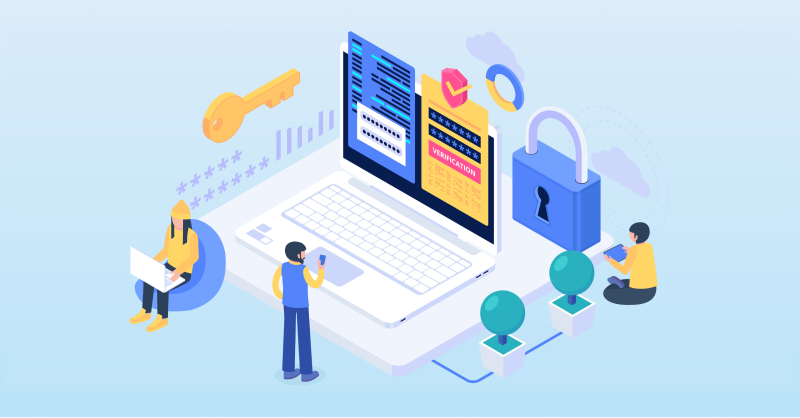

In today's increasingly interconnected and digital world, the management of identities and access to various systems and resources is of paramount importance for individuals and organizations alike. With the rapid growth of cloud computing, mobile applications, and remote work, the traditional methods of identity management have become cumbersome and less effective. This is where Identity as a Service (IDaaS) emerges as a game-changer.

In this article, we’ll talk about what identity as a service is, how it’s different from identity and access management (IAM) and explain why it’s such a must-have for businesses operating today.

<nav id="table-of-content">
    <ul>
        <li><a href="#def">What Is Identity as a Service (IDaaS)?</a></li>
        <li><a href="#why">Why Having Identity as a Service (IDaaS) is a Must?</a></li>
        <li><a href="#features">The Most Important Features of Great IDaaS</a></li>
        <li><a href="#future">The Future of IDaaS</a></li>
    </ul>
</nav>

<h2 id="def">What Is Identity as a Service (IDaaS)?</h2>

More and more businesses and enterprises are replacing their legacy, on-premise solutions with cloud-based solutions and identity and access management (IAM) also can’t escape this trend.

Identity as a Service (IDaaS) is the cloud version of IAM and allows organizations to manage internal or external identity and access on the cloud. It encompasses all the central functions of a standard, outsourced IAM solution but with far improved cost-effectiveness and efficiency enabled by cloud technology.

<h2 id="why">Why Having Identity as a Service (IDaaS) is a Must?</h2>

<!--FIGURE--><!--/FIGURE-->

As businesses grow and develop, identity and access management tends to get more costly and complex with each year. This is further exacerbated by technology changes and increasing cyber security pressures. Balancing user experience and security can be quite challenging and the best way to ease these burdens and limit the expense of identity management is to outsource to an IAM solution that can handle all these issues for you, from development to long-term maintenance.

Anyone who’s done IAM with an internal team will know just how significant the financial and human resources required are, whether on-premises or cloud-based. In the case of something that isn’t even the core business of a company, this is an even less attractive expense; however, having IDaaS is a must now as delivering a smooth <a href="/post/digital-customer-experience-ciam" target="_blank">digital experience</a> is also vital for businesses nowadays. For these reasons and more, identity as a service is a must-have solution for any business looking to better manage internal and external identities, deliver smoother user experience, reduce cost, and increase user acquisition and retention rates.

That’s not all identity as a service has to offer though. Let’s look further into the business benefits:

### Reduce Costs

As we’ve mentioned, IAM requires significant investment when developed and maintained internally. By simply subscribing to an IDaaS service instead, businesses can save on all the physical equipment and specialized IT staff that on-prem IAM would have needed.

This reduces costs at the time of inception and makes it far more affordable to scale your IAM needs as your business grows. Maintenance is built into the solution so you’re also less likely to incur unexpected expenses in the way that internal IAM management often can.

### Improve the User Experience

Identity as a service comes with a variety of features that help businesses improve user experience. This includes <a href="/post/customer-sso" target="_blank">SSO</a> (single-sign-on) which allows users to access multiple platforms under the same host with just one set of credentials, as well as <a href="/features/passwordless-authentication" target="_blank">passwordless</a> options, <a href="/post/biometric-authentication" target="_blank">biometrics</a> (e.g. Face ID), and OTP. Password fatigue and password-reset issues can be an issue of the past, thanks to these features.

Another way in which IDaaS helps to improve the user experience is by expanding self-service options for users. Things like resetting passwords and updating relevant login information can be done by the user rather than involving an IT or help desk query. That way internal or external IAM issues are resolved quicker and with less hassle for both the user and the platform host.

### Increase Revenue and Customer Loyalty

What we’ve just referenced in terms of passwordless options and SSO helps create a <a href="/post/frictionless-authentication" target="_blank">frictionless authentication</a> process that can bring about major boosts in customer retention and revenue. The login experience is a fundamental step that often sets up the relationship between a business and its customers which is why improvements to it can be so impactful.

Customers tend to respond best to online experiences that are simple and easy to use. To that end, we also offer <a href="/solutions/customer-identity-and-access-management" target="_blank">pre-built signup and login pages</a> at Authgear that are designed to convert site visitors into users. The process of inputting information and creating a profile on a business’s website is yet another step where IDaaS can improve the user experience and help build customer loyalty.

### Enhance Data Security

Identity as a service can enhance data security in two central ways: making the implementation of safer login options easier and having a dedicated team on hand to maintain and develop new features so that a business stays safe from cyber-attacks.

In terms of safer logins, our IDaaS approach includes passwordless methods, <a href="/features/passkeys" target="_blank">passkeys</a>, OTPs, and MFA options that are proven to boost cybersecurity. Instead of trying to build the necessary infrastructure to support just one of these authentication types, we have multiple on hand that are well-trusted in protecting user and business data from hackers.

We’ve already covered the financial advantages of having a dedicated IAM team, but the data security benefits are just as important, if not more so. Maintenance issues have a data cost as much as they have a financial impact and one wrong step can threaten a business’s privacy.

Our team at Authgear is far more equipped to keep a business’s IAM technology updated against security threats than an internal team would likely be able to. It’s not just day-to-day maintenance that we handle, but the big picture of authentication approaches and how best to ensure data privacy in an ever-changing landscape of cyber security issues.

### Stay on Top of Privacy Regulations and Compliance

As PWC showed in their <a href="https://www.pwc.com/us/en/services/consulting/cybersecurity-risk-regulatory/library/seven-privacy-megatrends/rise-privacy-enforcement.html" target="_blank">2020 Privacy Megatrend report</a>, the amount of people whose data will fall under privacy regulations is growing rapidly every year. As more countries enforce these regulations, safeguarding customer data is no longer an option, it’s a must. Our IDaaS solution makes it far easier for businesses to keep up with these data privacy shifts and avoid costly legal issues.

<h2 id="features">The Most Important Features of Great IDaaS</h2>

<!--FIGURE--><!--/FIGURE-->

With the aforementioned advantages of IDaaS in mind, here are some of the most important features the service includes:

- **Single Sign On** for a better user experience and more unified experience across a business’s platforms or applications.
- **Passwordless options** so that users no longer keep track of complex passwords eg. OTPs, biometrics, and social logins.
- **Admin portals** so that your customer support can create, update, and delete user accounts with just a few clicks. Another important feature is the option for a self-service setting page that users can access to manage their credentials and authentication methods.
- **Security access controls** that allow businesses to assign users specific roles that control what applications they have access to. This allows businesses to better manage <a href="/solutions/wiam-extended-workforce-secure-manage-access-for-frontline-contractors-more" target="_blank">external identities</a>. For example, suppliers or brokers who need access to internal applications.

<h2 id="future">The Future of IDaaS</h2>

Authentication methods are constantly evolving, as are the cybersecurity threats they’re meant to mitigate against. Added to this pressure is how impactful a simple login process can be in shaping the quality of the online user experience.

The future of IDaaS, as we see it at Authgear, is to help businesses stay ahead of these changes and expectations. That’s why we’ve made sure that our IDaaS solution leverages the best technology has to offer, from being cloud-based to having multiple authentication options, for a safer, easier, and more cost-effective identity management approach.

That said, we know some are hesitant about sourcing these services externally. <a href="/talk-with-us" target="_blank">Contact us</a> to talk about what your pain points are regarding the outsourcing of external identity and access management. We’re more than happy to explain how Authgear can solve those issues and help support your business goals in the process.
