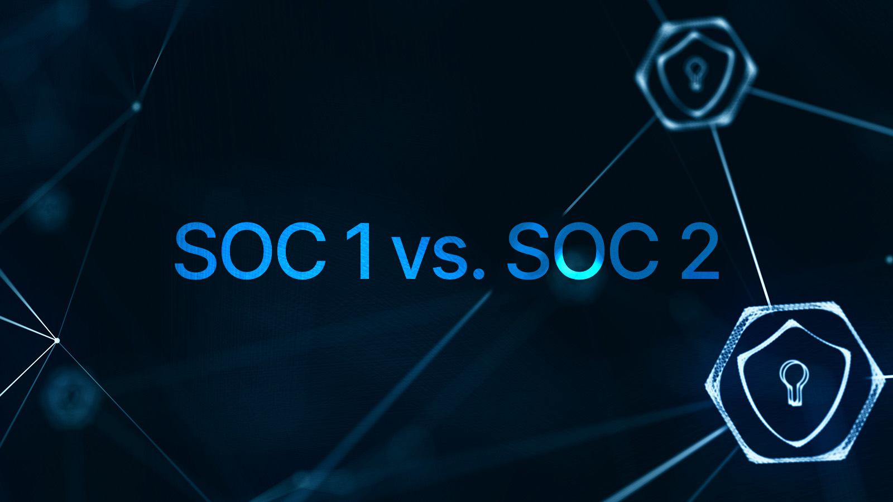

In today's data-driven world, where information is the lifeblood of business, trust is paramount. Enterprises entrust service providers with sensitive data, from customer records to financial transactions. But how can companies ensure their data is handled with the utmost security and privacy? Enter SOC 2 compliance, a powerful framework that sets the gold standard for data security practices.

## Understanding SOC 2:

Unlike a strict set of rules, SOC 2 (Service Organization Controls Type 2) is a flexible framework that outlines five core "trust service principles": security, availability, processing integrity, confidentiality, and privacy. This means organizations tailor their controls to meet these principles, demonstrating effective data management through an independent audit.

### Why It Matters:

Achieving SOC 2 compliance isn't just a box to tick; it's a strategic advantage. Here's why it's crucial for your enterprise:

- Build Trust and Credibility: Demonstrating robust data security practices fosters trust with customers, partners, and investors. It shows you take data privacy seriously, giving your brand a competitive edge.
- Enhanced Security Posture: Implementing SOC 2 controls strengthens your entire security posture, proactively mitigating risks and preventing data breaches. It's like a full-body armor for your digital infrastructure.
- Reduce Business Disruption: Data breaches can be crippling, both financially and reputationally. SOC 2 compliance minimizes the risk of such disruptions, ensuring business continuity and protecting your bottom line.

### SOC 2 Compliance Checklist: A Step-by-Step Guide to Success

<!--FIGURE--><!--/FIGURE-->

Achieving SOC 2 compliance, while rewarding, isn't a simple feat. To navigate this journey effectively, a detailed checklist can be your map. Here's a comprehensive breakdown of the key steps, with additional insights to empower your progress:

### Phase 1: Planning and Preparation

1. Define Objectives: What are your goals for achieving SOC 2 compliance? Increased customer trust, market differentiation, or internal security improvement? Understanding your "why" guides your path.
1. Scope and Type Selection: Determine the scope of your SOC 2 report. Will it cover your entire organization or specific services? Choose between Type 1 (point-in-time description of controls) or Type 2 (testing controls over a period).
1. Risk Assessment: Conduct a thorough risk assessment to identify and prioritize potential threats to your data security. Analyze vulnerabilities, potential impact, and existing controls.
1. Gap Analysis: Compare your current security posture against the SOC 2 Trust Service Criteria (TSC) of Security, Availability, Processing Integrity, Confidentiality, and Privacy. Identify gaps in your controls and prioritize areas for improvement.

### Phase 2: Control Design and Implementation

1. Security Policy Development: Define clear and comprehensive security policies covering user access, data encryption, incident response, and acceptable use.
1. Access Control Systems: Implement robust access control mechanisms like multi-factor authentication, privilege management, and user activity monitoring.
1. Data Security Measures: Encrypt sensitive data at rest and in transit, regularly backup and restore data, and conduct vulnerability assessments and penetration testing.
1. Monitoring and Logging: Implement continuous monitoring of system activity, security events, and access attempts. Maintain detailed logs for audit purposes.
1. Incident Response Plan: Define a clear and documented incident response plan outlining actions to contain, investigate, and recover from security incidents.

### Phase 3: Documentation and Testing

1. Control Documentation: Thoroughly document your implemented controls, their objectives, procedures, and evidence of effectiveness.
1. Internal Testing: Conduct regular internal testing of your controls to verify their effectiveness and identify areas for improvement.
1. Auditor Selection: Choose an independent auditor qualified to perform SOC 2 audits. Collaborate closely with them to ensure smooth audit execution.

### Phase 4: Audit and Reporting

1. Audit Communication: Provide necessary documentation and access to the auditor for their assessment. Maintain open communication throughout the process.
1. Audit Findings and Remediation: Address any audit findings promptly, implementing control enhancements as needed.
1. Report Issuance: Receive the final SOC 2 report from the auditor, showcasing your successful compliance achievement.

## Beyond the Checklist:

Remember, this checklist serves as a framework, not a rigid formula. Tailor it to your specific organization and risk profile. Continuously monitor and update your controls, keeping pace with evolving threats and regulations. Most importantly, embrace SOC 2 as a journey of continuous improvement, enhancing your data security posture and building trust with your stakeholders.

## SOC 1 vs. SOC 2: Focus on the Source

<!--FIGURE--><!--/FIGURE-->

Imagine SOC 1 and SOC 2 as siblings, sharing a family resemblance but specializing in distinct areas.

SOC 1:

- Focus: Internal controls over financial reporting.
- Think: Audits for financial service organizations, ensuring accurate and reliable financial data processing.
- Image: Picture a magnifying glass scrutinizing accounting practices.

SOC 2:

- Focus: Controls relevant to data security, availability, processing integrity, confidentiality, and privacy.
- Think: Audits for cloud service providers, SaaS companies, and any organization handling sensitive customer data.
- Image: Imagine a shield protecting a vault of sensitive information.

<table style="width:100%;border-collapse: collapse;">
  <thead>
    <tr>
      <th style="width:20%;text-align:left;background:#f5f5f5;padding:6px;">Feature</th>
      <th style="width:40%;text-align:left;background:#f5f5f5;padding:6px;">SOC 1</th>
      <th style="width:40%;text-align:left;background:#f5f5f5;padding:6px;">SOC 2</th>
    </tr>
  </thead>
  <tbody>
    <tr>
      <td style="padding:6px;border-bottom: 1px solid #ddd;">Primary Concern</td>
      <td style="padding:6px;padding:6px;border-bottom: 1px solid #ddd;">Financial reporting accuracy</td>
      <td style="padding:6px;padding:6px;border-bottom: 1px solid #ddd;">Data security and privacy</td>
    </tr>
    <tr>
      <td style="padding:6px;padding:6px;border-bottom: 1px solid #ddd;">Applicable to</td>
      <td style="padding:6px;padding:6px;border-bottom: 1px solid #ddd;">Primarily financial service organizations</td>
      <td style="padding:6px;padding:6px;border-bottom: 1px solid #ddd;">Any organization handling sensitive data</td>
    </tr>
    <tr>
      <td style="padding:6px;padding:6px;border-bottom: 1px solid #ddd;">Types</td>
      <td style="padding:6px;padding:6px;border-bottom: 1px solid #ddd;">Type 1 (description of controls) and Type 2 (testing of controls)</td>
      <td style="padding:6px;padding:6px;border-bottom: 1px solid #ddd;">Type 1 and Type 2</td>
    </tr>
    <tr>
      <td style="padding:6px;padding:6px;">Report Stucture</td>
      <td style="padding:6px;padding:6px;">Focuses on internal controls relevant to financial reporting</td>
      <td style="padding:6px;padding:6px;">Covers the five Trust Service Principles (Security, Availability, Processing Integrity, Confidentiality, and Privacy)</td>
    </tr>
  </tbody>
</table>

## ISO 27001: The Guiding Light

<!--FIGURE--><!--/FIGURE-->

Unlike SOC 1 and SOC 2, which are audit reports, ISO 27001 is a prescriptive set of guidelines for implementing an Information Security Management System (ISMS).

- Think: A comprehensive blueprint for building and maintaining robust data security practices.
- Image: Imagine a detailed map leading to a fortress of data security.

## Relationship with SOC 2:

- Implementing ISO 27001 can significantly facilitate achieving SOC 2 compliance, as many of its controls align with the SOC 2 Trust Service Principles.
- However, ISO 27001 certification doesn't guarantee SOC 2 compliance, as SOC 2 requires additional controls and an independent audit.

Choosing the Right Path:

The ideal framework for your organization depends on your specific goals and needs:

- SOC 1: If financial reporting accuracy is your primary concern.
- SOC 2: If data security and privacy for your customers or partners are paramount.
- ISO 27001: If you want a structured approach to building and maintaining robust data security practices, potentially laying the groundwork for future SOC 2 compliance.

Ultimately, remember that data security is not a destination, but a continuous journey. Choosing the right framework is a crucial step, but stay committed to ongoing monitoring, improvement, and adaptation to evolving threats and regulations.

## Authentication: The Gatekeeper of Data:

Now, let's unlock the role of authentication and identity management in SOC 2 compliance. These are essentially the gatekeepers of your data, ensuring only authorized individuals access sensitive information. Strong authentication measures, like multi-factor authentication and biometrics, play a critical role in meeting the security and confidentiality principles of SOC 2.

Here's how robust authentication strengthens your compliance posture:

- Prevents Unauthorized Access: Strong authentication mechanisms significantly reduce the risk of unauthorized access, safeguarding your data from malicious actors.
- User Access Control: Granular access control policies based on user roles and permissions ensure only authorized users access specific data, upholding the principle of least privilege.
- Auditable Activity Trails: Detailed logs of user login attempts and data access provide transparency and accountability, crucial for demonstrating control effectiveness during SOC 2 audits.

## The Final Key:

SOC 2 compliance is not just a checkbox; it's a commitment to securing your enterprise's most valuable asset – its data. By embracing SOC 2 and leveraging the power of strong authentication, you build a fortress of trust that protects your business, your customers, and your future. Remember, in today's digital landscape, securing your data is not just a good practice; it's a business imperative. Invest in SOC 2 compliance, and unlock the key to data security and lasting success.
