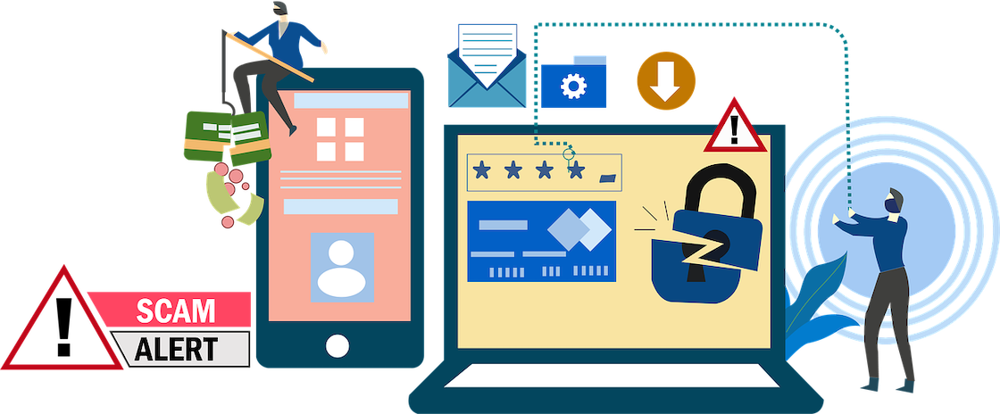

Businesses nowadays can no longer consider cybersecurity an afterthought since hackers and scammers are finding new ways to steal information. New precautions like two-factor authentication are needed to protect customer data.

Two-factor authentication (2FA) requires a user to present two pieces of evidence or information before granting access to apps or online platforms. One widely used secondary authentication method is SMS authentication. Until this day, SMS authentication remains one of the most widely used methods of authentication since the number of mobile users continues to increase.

Sadly, SMS two-factor authentication is not the best option. The SMS systems are insecure and were developed while cybersecurity was in its infancy. In this article, we discuss:

<nav id="table-of-content">
<ul>
<li><a href="#definition">What Is SMS Authentication?</a></li>
<li><a href="#sms-disadvantages">Why Using SMS Authentication for 2FA Isn't Ideal?</a></li>
<li><a href="#sms-alternatives">Other More Secure Authentication Methods</a>
<ul style="margin-bottom:0">
<li style="margin-top:15px"><a href="#whatsapp-otp">WhatsApp OTP</a></li>
<li><a href="#email-otp">Email OTP</a></li>
<li><a href="#biometric">Biometric Authentication</a></li>
</ul>
</li>
<li><a href="#authgear">More Cost-Effective and Secure Authentication with Authgear</a></li>
</ul>
 </nav>

<h2 id="definition">What Is SMS Authentication?</h2>

SMS authentication is a simple type of 2FA or Multi-Factor Authentication (MFA). Users who sign in receive a text message with an authentication code. All they have to do is fill in the code on the platform to gain access. It is commonly used across major social sites like Twitter, Instagram, and Google.

SMS authentication adds a layer of security relying on possession-based authentication (the idea that you are the only person who owns the number). Therefore, someone who wants unauthorized access must steal your password and phone.

While SMS authentication seems easy to use and common, is it the safest?

<h2 id="sms-disadvantages">Why Using SMS Authentication for 2FA Isn't Ideal?</h2>

While SMS authentication is simple and convenient, it has its downsides. Therefore, organizations must determine if it is safe enough to protect their organization and customer data.

Here are some reasons why SMS authentication is not ideal.

<!--FIGURE--><!--/FIGURE-->

### SMS Messages are not Encrypted

SMS messages are not end-to-end encrypted. Therefore, governments and cellular providers can actually see your messages. The messages are stored in the systems for days while the metadata stays longer.

Secondly, SMS messages can be intercepted by hackers. Mobile phone networks connect through a signaling protocol launched before cyber crimes were a huge deal. The signaling system has been breached before and information such as bank verification codes stolen in the past, making it the less secure method of communication or authentication.

### SMS Spoof

In the old days, phishing was prevalent with computers and laptops. However, the capability of phones to access the internet opens them to exploitation. SMS spoof allows criminals to disguise themselves as trusted organizations and send you a link that redirects you to sites where they request crucial information, such as passwords and authentication codes.

Criminals use SMS messages trick users as they have to click on the link to ascertain its authenticity. By the time you click on it, you may have been hacked.

### SIM Cards Can be Swapped

It is actually easier to swap a SIM card than you think. It happens when an attacker masquerades as the owner of the number. They then use the owner's information to trick the cell service provider into believing that they are the owner.

The provider will then link the phone number to the attacker's sim card. They can then access all your SMS, including authentication passwords.

### SMS Authentication can be Quite Costly

If you are a profit-driven enterprise, you'll always want to keep the cost of operation low. So, while keeping information secure, you'll want to use the cheapest, most secure option.

SMS authentication depends on providers' services and will charge as per the provider rates. The prices vary among providers and can change depending on the location and time. The costs can quickly pile up if your user base grows exponentially and have to send thousands of authentication code on a daily basis.

<h2 id="sms-alternatives">Other More Secure Authentication Methods</h2>

Considering the demerits of SMS authentication and keeping security in mind, businesses must look for better ways to replace SMS authentication. You'll need a system that offers improved security due to increased cybercrimes.

Here are more secure ways to authenticate users.

<h3 id="whatsapp-otp">WhatsApp OTP</h3>

Another more straightforward way to authenticate users is through WhatsApp. WhatsApp OTP is quite simliar to SMS authentication. However, Authgear’s WhatsApp OTP mechanism is different from others.

When users attempt to log into your app through WhatsApp OTP, the system will display the OTP on the screen instead of sending them an OTP on WhatsApp as shown below.

<!--FIGURE--><!--/FIGURE-->

The user can then send the OTP to Authgear for authentication. This allows businesses to significantly reduce operation cost as user-initiated conversations on WhatsApp are much cheaper than business-initiated ones and it also comes with other benefits.

Aside from cost reduction, WhatsApp offers users end-to-end encryptions. In other words, criminals won't be able to intercept messages you send and receive. WhatsApp itself also does not have access to the messages.

<a href="/features/whatsapp-otp" target="_blank">WhatsApp OTP</a> also provides a frictionless signup process and an increased app conversion rate. Users can easily create new accounts with existing information without facing issues with deliverability.

<h3 id="email-otp">Email OTP</h3>

Email OTP works the same way as SMS authentication, only through different channels.

When a user first signs up on your platform, you'll ask them to provide an email that they will verify. Henceforth, they will receive an OTP through that email whenever they log into the site. The user will then use the code to gain access.

Emails don't rely on cellular services meaning they are a bit safer. However, their dependency on internet connection makes them vulnerable to hacking.

<h3 id="biometric">Biometric Authentication</h3>

Biometric authentication has become ubiquitous as most consumers now have a cellular device that comes with either facial or fingerprint recognition.

Users can easily gain access to different apps or software by simply looking into their phones or pressing their thumbs on the fingerprint scan. It eliminates the need to remember long and complex passwords, providing a smoother experience for the users.

The method is fast as you don't have to wait for an OTP delivery. It is also more secure than SMS authentication since it is much harder for hackers to replicate users’ biometric data.

<h2 id="authgear">More Cost-Effective and Secure Authentication with Authgear</h2>

Authgear is a Customer Identity and Access Management solution that has all the security and user management features that your applications need. By integrating your software or apps with Authgear, you can easily implement a variety of authentication methods, such as SMS OTP, WhatsApp OTP, Social logins, biometric authentication, etc., to not only provide a smooth user experience but more importantly enhance data security, increase user conversation rate, and reduce costs.

<a href="/talk-with-us" target="_blank">Request a demo</a> or <a href="https://accounts.portal.authgear.com/signup" target="_blank">sign up for a free</a> trial to see how you can benefit from Authgear.
