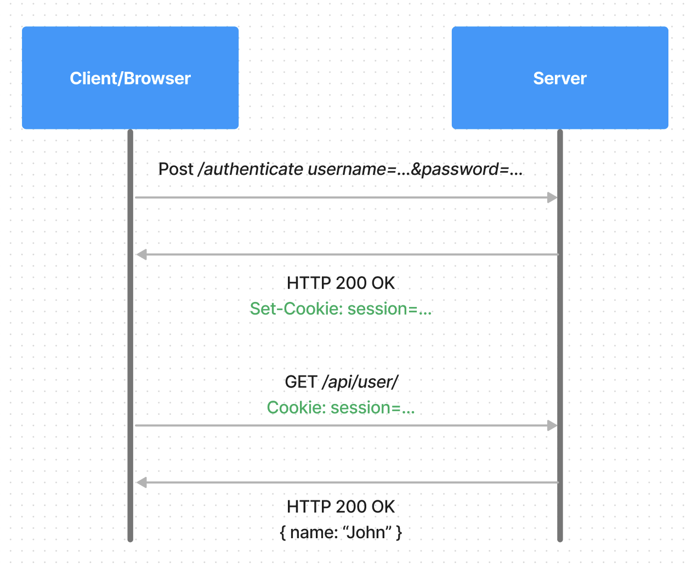
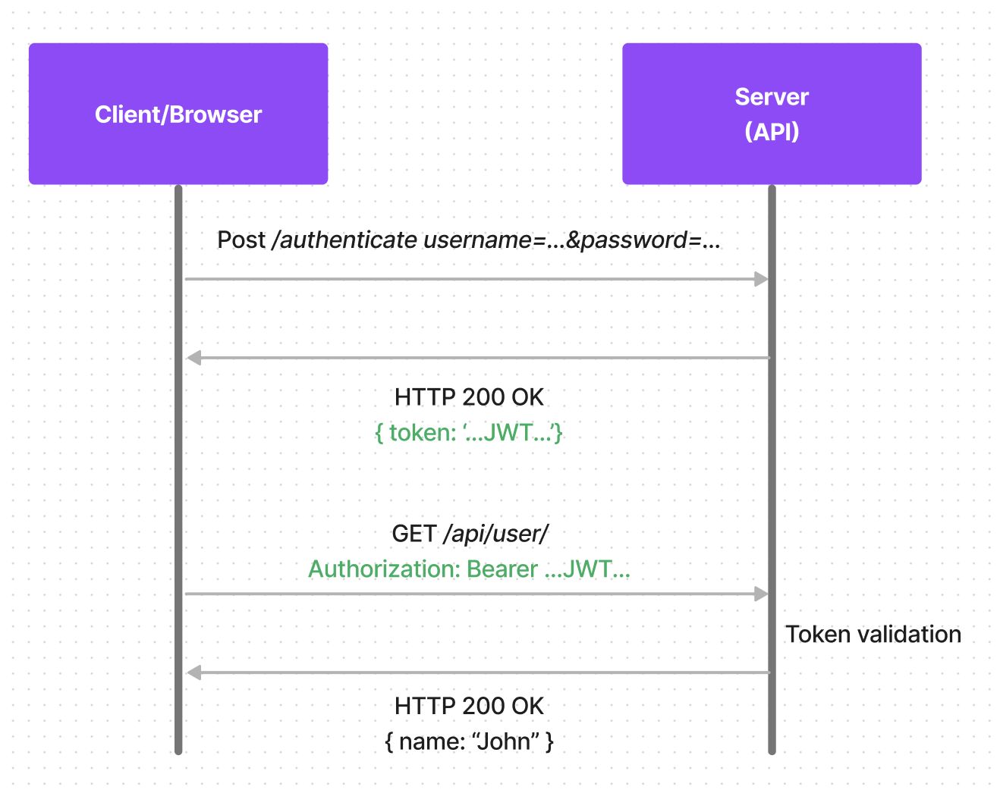
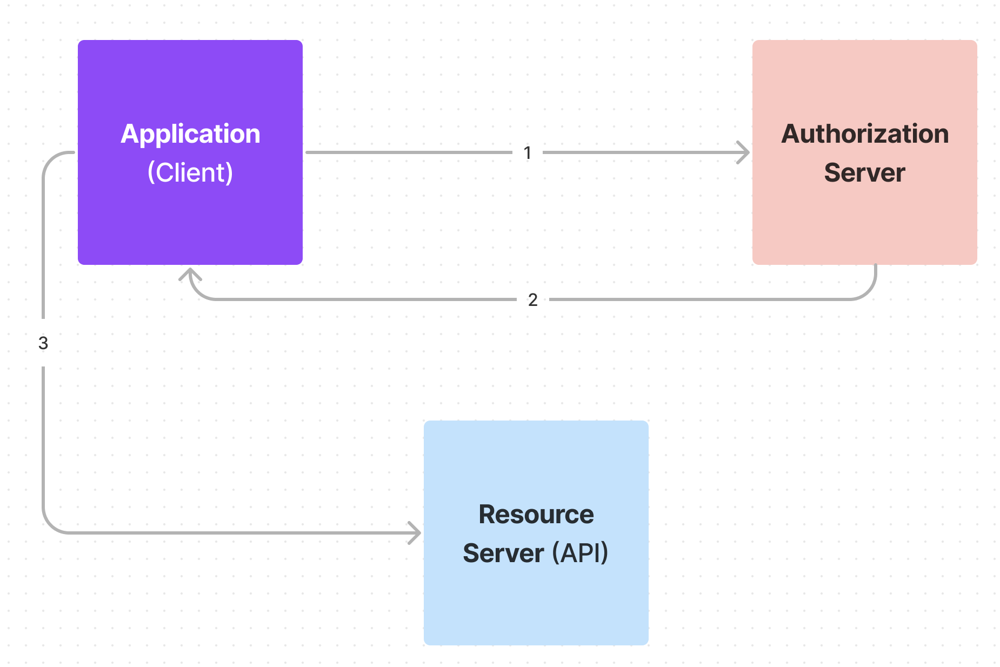
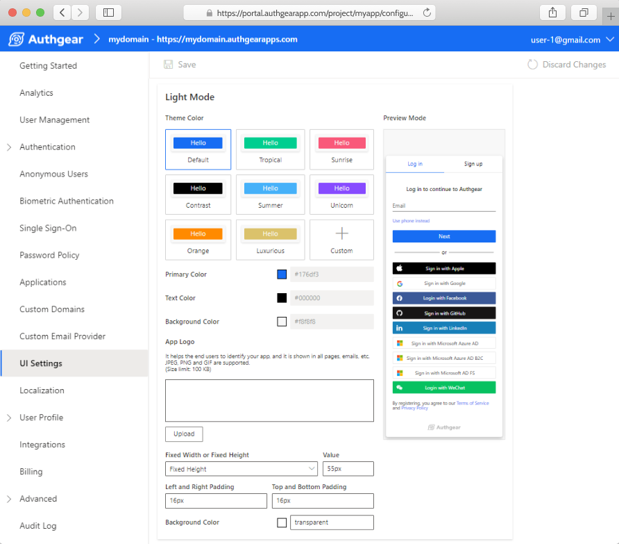
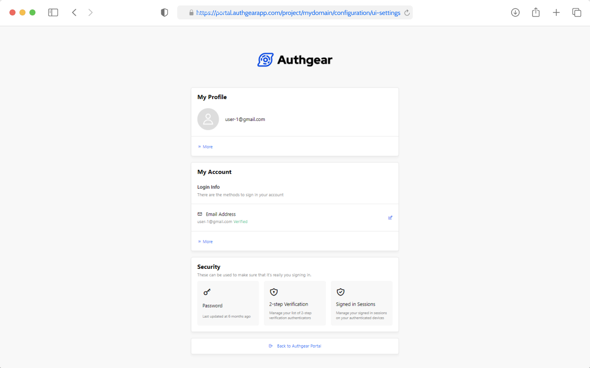
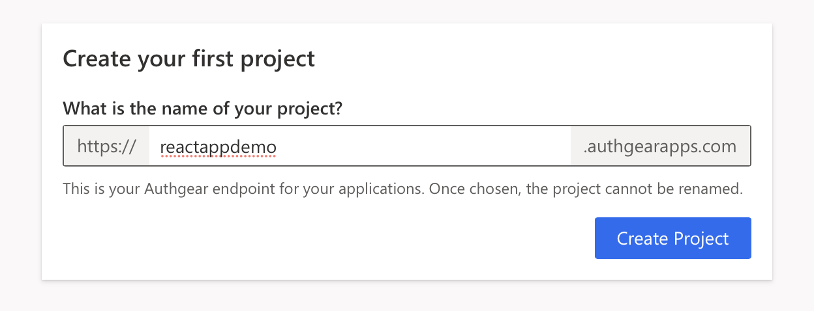
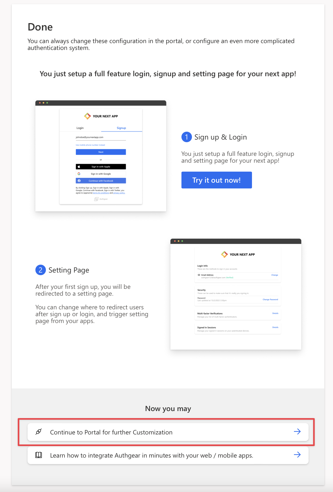
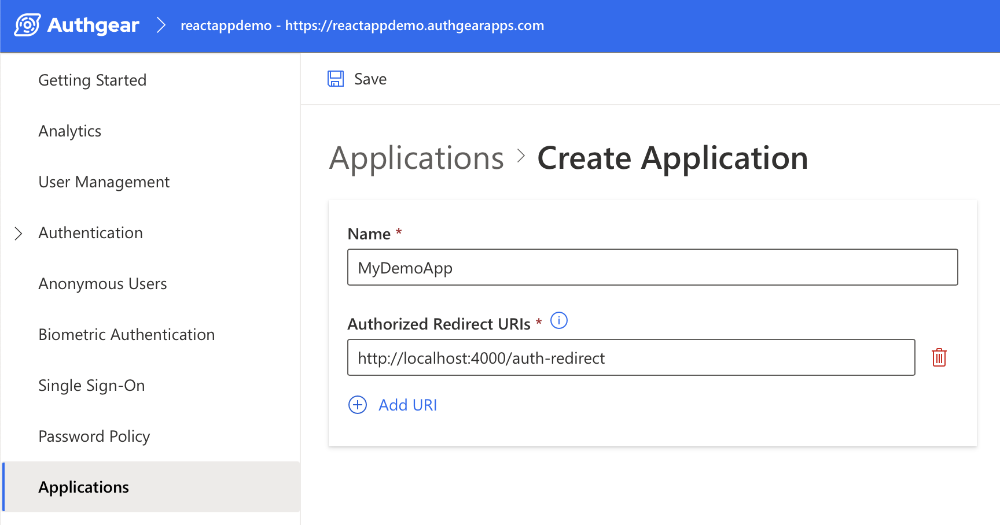
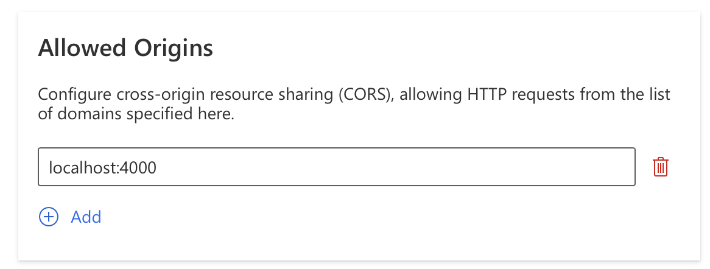

<script type="application/ld+json">
    {
        "@context":"http://schema.org",
        "@type":"NewsArticle",
        "mainEntityOfPage":{
                            "@type":"WebPage",
                            "@id":"/post/web-application-authentication-guide#webpage",
														"url":"/post/web-application-authentication-guide"
                        },
        "headline":"Web App Authentication: How It Works and How to Implement It",
        "image":{
            "@type":"ImageObject",
            "url":"https://uploads-ssl.webflow.com/60658b47b03f0c77e8c14884/630d7b2da3b2846da3fe1afa_web-app-guide.png",
            "width":1200,
            "height":600
        },
        "datePublished":"2022-07-21",
        "dateModified":"2022-07-21",
        "description":"In this guide, you'll learn more about how authentication in web app works and how to implement it with Authgear.",
        "author":{
            "@id":"https://www.oursky.com/#organization"
        },
        "publisher":{
            "@type":"Organization",
            "name":"Oursky",
            "@id":"https://www.oursky.com/#organization",
            "logo":{
                "@type":"ImageObject",
                "@id":"https://www.oursky.com/#logo",
                "url":"https://oursky.com/assets/img/og-image.png",
                "caption":"Oursky"
              }
        }
    }
    </script>
As a web developer, you know how common it is to have authentication in your application as a requirement. And why not? It should be important, we surely want to know who is making requests, manage multi-transactions, and protect users' private information.

In this guide, you’ll learn all you need to know about web app authentication, how it works in your web apps, and how to integrate Authgear Web SDK with your web apps to implement authentication quickly and securely.

<nav id="table-of-content">
    <ul>
        <li><a href="#definition">What is an Authenticated Application?</a></li>
        <li><a href="#methods">Authentication Methods in Web Apps</a>
            <ul style="margin-top:15px; margin-bottom:15px">
                <li><a href="#cookie">Cookie-Based Authentication</a></li>
                <li><a href="#token">Token-Based Authentication</a></li>
                <li><a href="#third-party">Third-Party Access (OAuth, API-token)</a></li>
                <li><a href="#openid">OpenID Connect (OIDC)</a></li>
                <li><a href="#saml">Security Assertion Markup Language (SAML)</a></li>
            </ul>
        </li>
        <li><a href="#access-token">How Does Access Token Work on a Web App</a></li>
        <li><a href="#authgear">How to Implement Authentication In Your Web App with Authgear?</a></li>
    </ul>
 </nav>

Before we start discussing all the technical details of how authentication works in web apps, let's first understand what authentication actually is with an example.

<h2 id="definition">What is an Authenticated Application?</h2>

**An authenticated application is a software application that verifies a user's identity before granting access to its features and data.** This essential security measure ensures that only authorized individuals can interact with the application.

Authentication involves confirming that a user is who they claim to be. This is typically achieved by requiring users to provide credentials such as usernames, passwords, or biometric data. Once verified, the application issues a digital token or session cookie, allowing the user to access protected resources.

Essentially, an authenticated application acts as a gatekeeper, safeguarding sensitive information and preventing unauthorized access.

<h2 id="methods">Authentication Methods in Web Applications</h2>

We have many ways in which an app can be authenticated. Let's look at each of them one by one:

<h3 id="cookie">Cookie-Based Authentication</h3>

Cookies are generally used to handle user authentication in web applications. Here's a diagram that shows how this works:

Working of cookie-based authentication in web apps:

<!--FIGURE--><!--/FIGURE-->

<p>As you can see here, the client browser sends the <span class="inline-code">POST</span> <a href="https://developer.mozilla.org/en-US/docs/Web/HTTP/Methods/POST" target="_blank">request</a> for login credentials to the server. The server then verifies the credentials sent to it with the <span class="inline-code">HTTP 200 OK</span> status code. It creates a session ID stored in the server and returns it to the client via <span class="inline-code">Set-Cookie: session=…</span>. On the subsequent requests, the session ID from the cookie is verified in the server, and the corresponding request is processed. When you log out of the app, your session ID will be cleared from both the client and server.</p>

<h3 id="token">Token-Based Authentication</h3>

This method is on the rise as we see more and more Single Page Applications (SPAs) being made.

One of the most common ways to implement token-based authentication is to use <a href="https://jwt.io/" target="_blank">JSON Web Tokens (JWTs)</a>. JWTs are an open standard that defines a self-contained way to transmit information between parties as JSON objects securely.

Working of token-based authentication:

<!--FIGURE--><!--/FIGURE-->

When the credentials are received from the client's browser, the server validates these credentials and also generates a signed JWT containing all of the user information. The token is stateless, so it never gets stored on the server. Over the following requests, the token is passed to the server and then gets decoded in order to verify it on the server.

<h3 id="third-party">Third-Party Access (OAuth, API-token)</h3>

The third-party access authentication can work in two ways:

- **Via API-token**: it's usually the same as we discussed above on JWT, where the token is sent to the authorization header and handled at some API gateway to authenticate the user.
- **Via Open Authentication (OAuth)**: as you might have guessed by its name, <a href="https://oauth.net/" target="_blank">OAuth</a> is an open protocol that allows secure authentication methods from the web, mobile, and desktop applications. This protocol authenticates against the server as a user.

<h3 id="openid">OpenID Connect (OIDC)</h3>

Building upon the OAuth 2.0 protocol, OpenID Connect (OIDC) simplifies user authentication by providing an authorization layer on top of it. This layer enables applications to verify user identities and obtain essential user information beyond just basic authentication. OIDC offers several advantages, including:

- **Single Sign-On (SSO):** Users can log in to your application using their existing credentials from a trusted identity provider (IdP) like Google or Facebook, eliminating the need for separate login credentials for your application. This streamlines the login process and improves user experience.
- **Reduced Security Risk:** By leveraging established IdPs for authentication, OIDC reduces the burden of managing user credentials on your application server. This minimizes the risk of data breaches and unauthorized access.****
- **Rich User Information:** OIDC allows applications to request and receive a broader scope of user information from the IdP beyond just usernames. This information can include profile details, email addresses, and preferences, potentially enriching the user experience within your application.

<h3 id="saml">Security Assertion Markup Language (SAML)</h3>

Security Assertion Markup Language (SAML) is an XML-based standard for exchanging authentication and authorization data between online systems. It functions as a single sign-on (SSO) and federated identity management solution, specifically designed for enterprise environments. In an SSO scenario, a user logs in once to a central identity provider (IdP) and can then access multiple secure applications without needing to re-enter their credentials for each application. SAML relies on XML assertions to securely communicate authentication and authorization data between the IdP, the service provider (SP) requesting access (i.e., your web application), and potentially other trusted parties. This enables users to seamlessly move between different applications within a corporate network or cloud environment without encountering separate login prompts.

Learn more about OIDC and SAML:

[OIDC vs. SAML: Decoding the SSO Showdown (And Why It Matters for Your Business)](/post/oidc-vs-saml-decoding-the-sso-showdown-and-why-it-matters-for-your-business)

<h2 id="access-token">How Does Access Token Work on a Web App?</h2>

We hear the term "access tokens" whenever we talk about authentication. But what are these in the first place? Let's figure this out.

### What Are Access Tokens?

<blockquote class="def-quote"><span style="font-weight:700">Access token</span> is a code used for authenticating a web application to access specific resources.</blockquote>

These access tokens are provided as <a href="https://jwt.io/" target="_blank">JSON Web Tokens (JWTs)</a>, which are then passed over the secure <a href="https://developer.mozilla.org/en-US/docs/Glossary/https" target="_blank">HTTPS protocol</a> while in transit.

They are used in token-based authentication types. When you are successfully authenticated, the web application receives an access token. Now whenever an API is called on the app, this token will be passed as a credential.

The basic structure of a web token consists of the following parts separated by dots(.):

1.**Header**: this again consists of two parts; the token type (like JWT) and the token signing algorithm being used (like SHA256). Here's an example:

```

{
	<span class="property">"alg"</span>: <span class="string">SHA256"</span>,
	<span class="property">"typ"</span>: <span class="string">"JWT"</span>
}
	
```

2. **Payload**: this contains the claims. Claims are statements about an entity (like a user) with some additional data. These claims can be registered, public or private. Here's an example payload:

```

{
	<span class="property">"sub"</span>: <span class="string">"1234567890"</span>,
	<span class="property">"name"</span>: <span class="string">"John Doe"</span>
	<span class="property">"admin"</span>: <span class="property">true</span>
}

```

3. **Signature**: here, the encoded header and payload, along with a secret, the header's algorithm comes together and signs it to create a signature. For example, here's a signature code using the HMAC SHA256 algorithm:

```

<span class="constant">HMACSHA256</span>(
<span class="function">base64UrlEncode</span>(header) <span class="operator">+</span> <span class="string">"."</span> <span class="operator">+</span>
<span class="function">base64UrlEncode</span>(payload),
secret)

```

Putting it together, the output web token is three Base64-URL strings separated by dots:

```

eyJhbGci0iJIUzI1NiIsInR5cCI6IkpXVCJ9.
eyJzdWIi0iIxMjMONTY30DkwIiwibmFtZSI6IkpvaG4
gRG91IiwiaXNTb2NpYWwiOnRydWV9.
4pcPyMD0901PSyXnrXCjTwXyr4BsezdI1AVTmud2fU4

```

### **Working of Web Tokens**

<p>
    Here's how these tokens work in websites and web apps:
    </p><ol>
        <li>A web token is returned when a user logs in successfully using their credentials (like email/password).</li>
        <li>Now, whenever the user wants to access a route or a resource on a web app that's protected, the user agent sends this token in the authorization header such as: <span class="inline-code">Authorization: Bearer token</span></li>
    </ol>
    <p>As you can see, it uses the Bearer schema, which is a cryptic string usually generated by the server in response to a login request.</p>
    <ol start="3">
        <li>Next, the server's routes will check whether the provided access toke is valid in the Authorization header.</li>
        <li>If it's valid, the user is allowed to access the requested protected routes.</li>
    </ol>
<p></p>

Here's a diagram that shows how the access token is obtained from the authorization server in order to access protected routes:

<!--FIGURE--><!--/FIGURE-->

1. The client requests for authorization to the authentication server.
1. After granting the authorization, the auth server returns an access token to the application.
1. The application uses the token to access a protected route via some API.

Now that you know all about what access tokes are, where they're used, and how they work in a web app, let's try to take a look at using one of the authentication providers, i.e., Authgear.

<h2 id="authgear">How to Implement Authentication In Your Web App with Authgear?</h2>

We saw many ways to authenticate the user using different methods and how they work. Now let's take a practical approach toward authentication. We will be using Authgear here, so we will tell you all you need to know if you're unfamiliar with it. As for the web, we will be using the React.js library. Let's begin!

### What is Authgear?

<blockquote class="def-quote"><span style="font-weight:700">Authgear</span> is an Customer Identity and Access Management (CIAM) solution for web and mobile apps built on top of the OpenID Connect (OIDC) standard, making it very easy to integrate with your new and existing applications.</blockquote>

It supports integrations with popular third-party service providers like Google, Apple, and Azure Active Directory (AD). Along with this, it also supports authentication via WhatsApp, email address and phone number via the One-Time Password (OTP) method.

Here are some of the features Authgear provides you by default:

**1. Signup page**: you don't need to create a custom signup page now, as you can use Authgear's prebuilt signup and login pages with best practices for signup conversions. You can even customize the look to align it with your brand visual identity.

<!--FIGURE--><!--/FIGURE-->

**2. Multiple security features**: you can easily implement social logins, Two-Factor Authentication (2FA), biometrics, and more features available to use to provide a smooth and secure user experience.

**3. Password policies**: you can have your customizable password policies to fulfill your corporate security requirements.

**4. Sessions alert and revoke**: you can easily ensure your user's security by listing their sessions and terminating any unknown sessions easily.

**5.** **User profile & setting**: This feature allows your users to have more control over their account information and activity. They can edit information, such as name, primary address, username, etc., of their profiles, manage their 2FAs, and terminate suspiscious sessions.

<!--FIGURE--><!--/FIGURE-->

**6. Admin portals**: your admin portal shows you everything you need to know about configuring the different authentication methods, adding security measures, or creating/revoking users with a few clicks.

### **What is React.js?**

For integrating Authgear's web SDK, we will create our web application using the React.js library for JavaScript.

<blockquote class="def-quote"><a href="https://reactjs.org/" target="_blank">React.js</a> (or React) is a declarative and component-based JavaScript library for building user interfaces for Single Page Applications (SPAs).</blockquote>

### **Setup Authgear for React**

We will be using Authgear's web SDK in our React app. For this, first, we need to do a bit of setup.

#### **Step 1: Signup for the Authgear Portal account**

Visit <a href="https://portal.authgear.com/" target="_blank">https://portal.authgear.com/</a> and create a new account (or login into an existing one).

After you've created your Authgear account, you will be prompted to create a new project.

#### **Step 2: Create and configure your project**

You should see the following right now:

Create project dialog box

<!--FIGURE--><!--/FIGURE-->

You can name it anything you like, but you won't be able to change it later. This is your Authgear endpoint so choose wisely. Here, we call it ‘reactappdemo’.

Now we configure the project in the next three steps. Here, we choose the following settings:

- Email and password
- Users can enable 2FA optionally
- TOTP Devices/Apps

After you choose your required settings, you will be greeted with the following:

Project creation finished interface

<!--FIGURE--><!--/FIGURE-->

Now, you can click on “Continue to Portal for further Customisation”.

#### **Step 3: Create an application**

After creating the project, we will create an application. Make sure you're on your project, and then:

1. Go to the ‘Applications’ option in the sidebar.
1. Click 'Add Application' and input the name you want to give:

Create application interface in the Portal

<!--FIGURE--><!--/FIGURE-->

<p>As you can see here, we also give it an “Authorized Redirect URI.” Users will be redirected to this path after they get authenticated. Typically, when we are in the development phase, we can give it <span class="inline-code">http://localhost:4000/auth-redirect</span> as URI for local development.</p>
<ol start="3">
<li>Click the 'Save' button in the top toolbar, and you will be greeted with a popup containing the 'Client ID' copy it to your clipboard or save it somewhere.</li>
</ol>

#### **Step 4: Configure the application**

While on your app's ‘Edit Application’ section, check the ‘Issue JWT as access token’ checkbox under the ‘Token Settings’ section. This enables to use JWT as an access token and allows easier access token decoding. But if you will forward incoming requests to Authgear Resolver Endpoint for authentication, leave this unchecked.

#### **Step 5: Add your website to allowed origins**

We need our website origin to communicate with Authgear. For this:

<ol>
<li>Go to the ‘Applications' > ‘Allowed Origins' section.</li>
<li>Add your website origin URL here. If your app is already deployed, then it should be like <span class="inline-code">yourdomain.com</span>; else, use <span class="inline-code">localhost:4000</span> for local development.</li>
<li>Click ‘Save’.</li>
</ol>

You should have this by now:

<!--FIGURE--><!--/FIGURE-->

With this, we are all ready to start some coding!

### **Scaffold a React app**

Open up your Terminal and run the following command to create a React app:

```

npx create-react-app authgear-demo

```

We use the Create React App (CRA) tooling to scaffold an app quickly. Read more about this tool <a href="https://create-react-app.dev/" target="_blank">here</a>.

### **Install Authgear's Web SDK**

Authgear's web SDK is available as an NPM package. You can install it either via NPM or Yarn:

```

npm install --save --save-exact @authgear/web
<span class="comment">// OR</span>
yarn add @authgear/web --exact

```

### **Initialize the Authgear SDK**

Now open up the newly created authgear-demo app in your favorite code editor.

### **Initialize the Authgear SDK**

Head over to the *App.js* root file. Here, we need to do a bit of cleanup. We need to add the SDK initialization code correctly before use; for that, we add the following code:

```

authgear
	.<span class="function">configure</span>({
		<span class="property">endpoint</span>: <span class="string">'https://yourapp.authgear-apps.com'</span>,
			<span class="property">clientID</span>: <span class="string">'YOUR_CLIENT_ID'</span>,
			<span class="property">sessionType</span>: <span class="string">'refresh_token'</span>,
	 })
.<span class="function">then</span>(
	() => {
		console.<span class="function">log</span>(<span class="string">'Succesfully configured!'</span>);
	},
	(err) => {
		console.<span class="function">log</span>(<span class="string">'Failed to configure'</span>, err);
	}
);

```

<p>Don't forget to import <span class="inline-code">authgear</span>in the first place:</p>
<p><span>import authgear from '@authgear/web';</span></p>
<p>In the above code, we call the <span class="inline-code">configure</span> method every time our page loads up. The configure method takes in an <a class="inline-code" href="https://authgear.github.io/authgear-sdk-js/docs/web/interfaces/ConfigureOptions/#endpoint" target="_blank">endpoint</a>, a default domain you can see in your Authgear admin portal. It is something like: <span class="inline-code">https://yourapp.authgear-apps.com</span>. We also give it the <a class="inline-code" href="https://authgear.github.io/authgear-sdk-js/docs/web/interfaces/ConfigureOptions/#endpoint" target="_blank">clientID</a> of our application and the <a href="https://authgear.github.io/authgear-sdk-js/docs/web/interfaces/ConfigureOptions/#sessiontype" class="inline-code">sessionType</a>, which can be <span class="inline-code">"refresh_token"</span> or if you use cookie-based authentication, it can be <span class="inline-code">"cookie"</span>.</p>

Next, we handle our configuration further using the .then() method, where we can add code for successful or failed configurations.

### **Log in to your application**

After successfully configuring the web SDK, we can go ahead with making the user log in to our app.

#### **Step 1**: Replace the default JSX code with the following:

```

    <span class="keyword">function</span> <span class="function">App</span>() {
        <span class="keyword">return</span> (
            <<span class="tag">div</span> <span class="attribute">className</span>='<span class="value">App</span>'>
                <<span class="tag">button</span> <span class="attribute">style</span>={{ <span class="property">marginTop</span>: '<span class="value">10rem</span>' }} <span class="attribute">onClick</span>={handleOnClick}>
                    Signup / Login
                <<span class="tag">/button</span>>
            <<span class="tag">/div</span>>
            );
    }
    <span class="keyword">export</span> <span class="keyword">default</span> App;
    
```

Here, we make our **start authorization** call so that we can redirect our user to the login/signup page.

```

authgear.<span class="function">finishAuthorization</span>().<span class="function">then</span>(
	(userInfo) => {
		<span class="comment">// authorized successfully</span>
		console.<span class="function">log</span>(<span class="string">'Authorized successfully'</span>);
	},
	(err) => {
		<span class="comment">// failed to finish authorization</span>
    console.<span class="function">log</span>(<span class="string">'Failed to finish authorization'</span>, err);
  }
);
  
```

<a href="/talk-with-us" target="_blank">Contact us</a> to learn more about how Authgear can help you improve user experience, increase conversion rate, and ensure security for your apps.

You may also refer to our <a href="https://docs.authgear.com/" target="_blank">Authgear Docs</a> for more instructions. Or join our [Discord server ](https://discord.gg/Kdn5vcYwAS)to learn more about web application authentication
