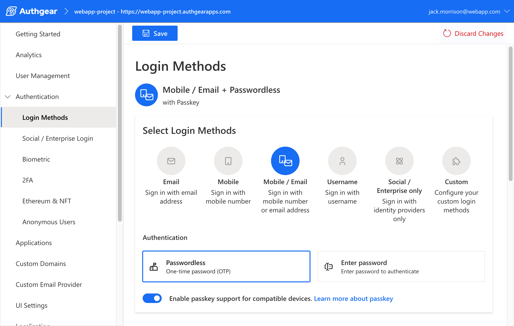

    
    
    

In 2021, President Biden had MFA rolled out across the federal government as part of a plan to increase cybersecurity. This came after the US national cyber security chief argued that Multi-Factor Authentication could prevent 80-90% of cyber-attacks. As we stare down increasing threats, the effectiveness of MFA at enhancing online safety is quickly making it a cyber-security must.

To understand more about MFA, how it works, and the benefits it provides, keep reading:

<nav id="table-of-content">Table of Content
    <ul>
        <li><a href="#mfa">What Is Multi-Factor Authentication (MFA)?</a></li>
        <li><a href="#why-mfa">Why Do You Need MFA if You Have a Password?</a>
            <ul>
                <li><a href="#guess">Easy to Guess Passwords</a></li>
                <li><a href="#stolen">Stolen Passwords</a></li>
            </ul>
        </li>
        <li><a href="#how">How Does MFA Work?</a>
            <ul>
                <li><a href="#knowledge">Knowledge Factor</a></li>
                <li><a href="#possession">Possession Factor</a></li>
                <li><a href="#inheritance">Inheritance Factor</a></li>
            </ul>
        </li>
        <li><a href="#benefits">The Benefits of Using Multi-Factor Authentication</a></li>
        <li><a href="#2fa">What is Two-factor Authentication (2FA)?</a></li>
        <li><a href="#conclusion">Harness the Power of MFA with Just a Few Clicks.</a></li>        
    </ul>
</nav>

<h2 id="mfa">What Is Multi-Factor Authentication (MFA)?</h2>

<!--FIGURE--><!--/FIGURE-->

MFA stands for Multi-Factor Authentication and is characterized by the fact that it requires users to provide more than one authentication factor to gain access to an application, online account, etc.

It is a core component of any <a href="/post/what-is-customer-identity-and-access-management-ciam" target="_blank">customer identity and access management</a> (CIAM) because of the way it combines a username and password with one or more additional verification factors. MFA decreases the likelihood of a successful cyber-attack simply by layering authentication methods. The fact that it’s so simple, makes it no less effective. If anything, that’s one of its best advantages in that It’s easy to adopt and use while still providing excellent protection against attacks.

*At Authgear, we’ve made sure to create*<a href="/solutions/customer-identity-and-access-management" target="_blank">*MFA solutions*</a>*that don’t require extra development or management from your end – businesses can get all the benefits of boosted security and happier users without any of the fuss.*

<h2 id="why-mfa">Why Do You Need MFA if You Have a Password?</h2>

<!--FIGURE--><!--/FIGURE-->

If the only point of authentication standing between you and your account is a username and password, your information isn’t nearly as secure as you might think. Without multi-factor authentication, passwords can be vulnerable to hackers thanks to these challenges:

<h3 id="guess">Easy to Guess Passwords</h3>

According to the UK’s National Cyber Security Centre <a href="https://www.ncsc.gov.uk/news/most-hacked-passwords-revealed-as-uk-cyber-survey-exposes-gaps-in-online-security" target="_blank">report</a> in 2019, the password “123456” was used on over 23 million breached accounts worldwide. Picking easy-to-guess passwords remains a global issue. Other common password choices include birthdays, common dictionary words, or popular band and sport team names. A persistent hacker who knows what they’re doing can use bots and guesswork until they land on your correct password, at which point your accounts could be broken into and your information stolen.

<h3 id="stolen">Stolen Passwords</h3>

Even when users do pick a password that’s slightly more complicated, they often make the mistake of using the same one across multiple accounts. Again, this leaves people vulnerable to attacks. Passwords are, on their own, inefficient protection against cyber-attacks. You can create highly complex passwords that are unique to each of your accounts, and still face trouble because if it’s stolen and there’s no MFA, there won’t be anything else to stop hackers from getting in.

Phishing emails and <a href="/post/credential-stuffing" target="_blank">credential stuffing</a> attacks mean that your personal privacy is always at risk. Scarier still is that once password and username combinations are found out, hackers will sell stolen passwords to each other. This means that people often have their personal details in circulation online and only find out when it’s already too late.

<h2 id="how">How Does MFA Work?</h2>

<!--FIGURE--><!--/FIGURE-->

How MFA works is by requiring users to identify themselves by more than a username and password combination. It’s an added layer of protection against stolen passwords because it means that even if someone gets your details, there’s still another layer of authentication to cross.

Organizations that add multi-factor authentication to their systems not only better protect themselves, but anyone who uses their services. For multi-factor authentication, there are three kinds of authentication factors that are generally used:

<h3 id="knowledge">Knowledge Factor</h3>

Knowledge factors are the most commonly used ones. Authentication done using knowledge factors demands that users present information that they should know. In single-layer authentication, knowledge factors, including passwords, passphrases, answers to personal security questions, and pin codes, are usually the credentials used for authentication.

Knowledge factors are considered to be the ones most vulnerable to attacks since many users tend to make their credentials easy to remember or reuse them for multiple accounts.

<h3 id="possession">Possession Factor</h3>

Some authentication systems will use a security fob (also referred to as a hardware token), magnetic badges, or another physical item that you have to possess in order to have your details authenticated and access granted. A good example is when a bank asks you to enter a pin code into a machine after swiping your card, but it’s most common in physical security systems.

#### TOTP Generated by Authenticator App

One of the most common examples of MFA, OTPs count as a possession factor because you have to possess the physical object of the smartphone to get the OTP from the app. Contrary to SMS sent via texts, authenticator apps eliminate any risks associated with SMS-based attacks.

#### OTPs Sent to Users via Text or Email

The same occurs when you receive an OTP via text or Email. Your laptop or tablet can be another device through which to receive a possessive authentication factor.

#### Physical Security Items eg. Smart Cards, Access Badges, Fobs, USB Devices, or Security Keys

An example of multi-factor authentication that takes a more physical shape, items such as access badges and fobs are generally used to authenticate entry into physical security systems.

<h3 id="inheritance">Inheritance Factor</h3>

The inheritance factor relies on something on your body or the things you’ve “inherited”, which is to say your biometric data. Think of Apple’s touch or face ID – these are some of the most secure forms of authentication because each individual has completely unique biometric data. It’s very difficult to replicate or steal someone’s fingerprint and better yet, scanning is quick and easy to use.

#### Fingerprints

Probably the most well-known and widely used form of <a href="/post/biometric-authentication" target="_blank">biometric authentication</a> is fingerprint scanning. Thanks to the unique patterning of each person’s fingerprints, a system can store your unique pattern and then compare it to the physiological evidence you present when you want to authenticate your access.

#### Facial Recognition

One of the most used examples of MFA today, facial recognition is a quick, highly secure authentication method available to many of us on our smartphones.

#### Using Retina, Voice, or Iris Scanning

This is a more niche example of multi-factor authentication, but voice, retina, and iris scanning are being adopted at increasing rates. They’re often used alongside fingerprints or facial recognition to boost security even further.

<h2 id="benefits">The Benefits of Using Multi-Factor Authentication</h2>

<!--FIGURE--><!--/FIGURE-->

If you’re still wondering, “How does MFA work?” the best way to understand it may be to see the benefits that it can offer:

### Secure Accounts from Credential Theft and Fraud

The most significant benefit of using MFA is in the depth of security it adds by ensuring that a user’s online security is not based solely on a password that could be stolen or shared. If that password ends up in the wrong hands, MFA will mean it still won’t be enough to gain access to an account.

For instance, by enabling the <a href="/features/whatsapp-otp" target="_blank">WhatsApp OTP</a> feature of Authgear, your apps will require that whoever has the password also have the user’s smartphone to get into their account, which is highly unlikely.

### Deliver a Strong End-Use Access Experience

Not only does MFA provides added authentication barriers to keep hackers out, but it also allows users to log into apps through simpler ways. When multi-factor authentication is enabled, users will not longer have to log in by entering their usernames and passwords. Instead, they can simply check the notification on their devices, press their fingers on the fingerprint scan, or even just look into their devices. MFA keeps users safer while also creating a more personalized, better experience for them overall.

### Meet Compliance Requirements and Regulations

There are many industries now that require multi-factor authentication for different user groups, employees, and consumers with some regulations taking it further by requiring a specific standard of authenticator assurance. These regulations can seem daunting for businesses, but they can be met with ease by choosing from Authgear’s range of assurance factors and methods. Whatever is required to comply with your industry’s requirements, we have a solution that can help you.

<h2 id="2fa">What is Two-factor Authentication (2FA)?</h2>

Two-factor authentication or short 2FA, is a type of multi-factor authentication that requires exactly 2 authentication factors. Usually, one of the factors is something you know like a password or PIN while the second factor is something you have, like your phone or a hardware token.

In 2FA, a one-time password (OTP) can be sent to the user's phone number via SMS or via email after they enter their password. Alternatively, users can also verify that it’s them logging in to a service on an authenticator app.

<h2 id="conclusion">Harness the Power of MFA with Just a Few Clicks.</h2>

Authgear offers a number of powerful multifactor authentication tools for developers who want to add authentication to their applications. Designed to integrate easily into existing systems, you can utilize MFA and enhance cyber security for both users and service providers with just a few clicks.

<!--FIGURE--><!--/FIGURE-->

Moreover, developers can also easily configure two-factor authentication, as shown below, to ensure data security for users without all the coding hassles.

<!--FIGURE--><!--/FIGURE-->

<a href="https://accounts.portal.authgear.com/signup" target="_blank">Sign up</a> now to easily enable MFA with Authgear or <a href="/talk-with-us" target="_blank">contact us</a> to chat more about the solution that works best for you and your security requirements.
