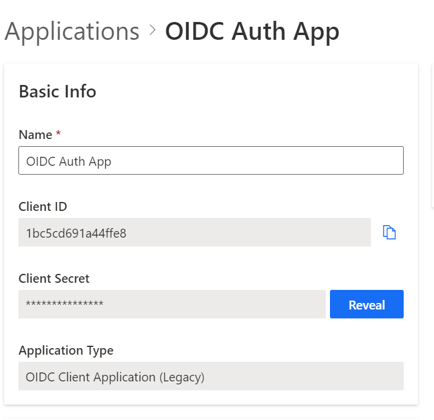
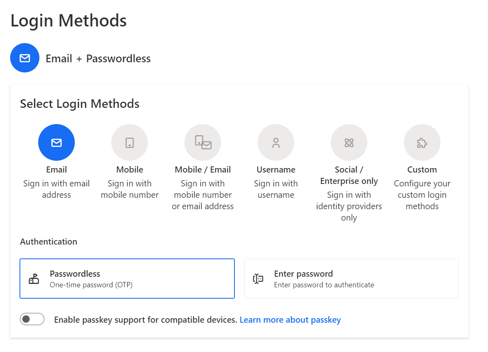
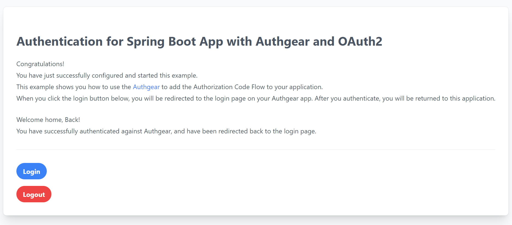

<a href="/" target="_blank">Authgear</a> is a free-to-use identity platform to manage access to your applications. It uses a special **OpenID Connect (OIDC)** protocol and **OAuth 2.0 Authorization Framework** to confirm who users are and allow/disallows them access to protected resources. With Authgear, you can easily add different ways for users to log in and access your apps and APIs, without needing to worry about the technical details of how it all works. Authgear takes care of the complicated parts of verifying users and granting them permission, so you can focus on building your applications and business value features.

In this post, you will learn **how to add authentication to your Java Spring Boot application** using <a href="https://tools.ietf.org/html/rfc6749" target="_blank">OAuth2</a> with Authgear as the Identity Provider (IdP).

## Learning objectives

You will learn the following throughout the article:

- How Authorization code flow works.
- How to create an app on Authgear.
- How to enable Email based login.
- Add sign-up and login features to Spring Boot App.

## How Authorization Code Flow works with Authgear

Before diving into implementation, let’s understand first the <a href="https://tools.ietf.org/html/rfc6749#section-4.1" target="_blank">Authorization Code Flow</a> works in our example. This flow can only be used for confidential applications (such as Regular Web Applications) because involves **exchanging an authorization code for a token**. Here are steps in this flow:

<!--FIGURE--><!--/FIGURE-->

1. User selects **Login** within the **Spring application**.
1. **Spring Security** redirects the user to **Authgear Authorization Server** (/oauth2/authorize endpoint).
1. **Authgear** redirects the user to the login page and authorization prompt.
1. The user authenticates using one of the configured <a href="https://docs.authgear.com/strategies/user-identity-and-authenticator" target="_blank">login options</a> (for example, by Email).
1. **Authgear** redirects the user back to the application with a single-use authorization code.
1. **Spring OAuth2** client sends the authorization code, application's client ID, and application's credentials, such as a client secret, to **Authgear** (/oauth2/token endpoint).
1. **Authgear** verifies the authorization code, the application's client ID, and the application's credentials.
1. **Authgear** responds with an ID token and access token (and optionally, a refresh token).
1. The application can use the access token to call an API to access information about the user.
1. API responds with requested data.

## Add login to your Spring Webapp

This example uses <a href="https://docs.spring.io/spring/docs/current/spring-framework-reference/web.html" target="_blank">Spring MVC</a> with <a href="https://www.thymeleaf.org/" target="_blank">Thymeleaf</a> and <a href="https://docs.spring.io/spring-security/reference/whats-new.html" target="_blank">SpringSecurity 6</a> to build a regular web application and it uses Authgear to **add authentication with the login page** provided by Authgear. The full source code of the examples can be found <a href="https://github.com/Boburmirzo/authgear-spring-oauth2-example" target="_blank">on GitHub</a>.

## **Prerequisites**

Before you get started, you will need the following:

- Java 17 or higher. You can use <a href="https://sdkman.io/" target="_blank">SDKMAN!</a> to install Java if you don't have it already.
- A **free Authgear account**. <a href="https://accounts.portal.authgear.com/signup" target="_blank">Sign up</a> if you don't have one already.

## Part 1: Configure Authgear

To use Authgear services, you’ll need to have an application set up in the Authgear <a href="https://portal.authgear.com/" target="_blank">Dashboard</a>. The Authgear application is where you will configure how you want authentication to work for the project you are developing.

### Step 1: Configure an application

Use the interactive selector to create a new **Authgear OIDC Client application** or select an existing application that represents the project you want to integrate with.

<!--FIGURE--><!--/FIGURE-->

Every application in Authgear is assigned an alphanumeric, unique client ID that your application code will use to call Authgear APIs through the Spring Boot <a href="https://docs.spring.io/spring-security/reference/reactive/oauth2/client/index.html" target="_blank">OAuth 2 Client</a>. Note down the Authgear issuer (for example, https://example-auth.authgear-apps.com/), CLIENT ID, CLIENT SECRET, and OpenID endpoints from the output. You will use these values in the next step for the client app config.

<!--FIGURE--><!--/FIGURE-->

### Step 2: Configure **Redirect URI**

A **Redirect URI** is a URL in your application that you would like Authgear to redirect users to after they have authenticated. In our case, it will be a home page for our Spring Boot App. If not set, users will not be returned to your application after they log in.

### Step 3: Choose a Login method

After you created the Authgear app, you choose how users need to **authenticate on the login page**. From the “Authentication” tab, navigate to “Login Methods”, you can choose a **login method** from various options including, by email, mobile, or social, just using a username or the custom method you specify. For this demo, we choose the **Email+Passwordless** approach where our users are asked to register an account and log in by using their emails. They will receive a One-time password (OTP) to their emails and verify the code to use the app.

<!--FIGURE--><!--/FIGURE-->

## Part 2: Configure Spring Boot application

### Step 1: Add Spring dependencies

To create a new Spring Boot application you use the <a href="https://start.spring.io/" target="_blank">Spring Initializr</a>. Then you add dependencies to pom.xml file such as <a href="https://mvnrepository.com/artifact/org.springframework.boot/spring-boot-starter-oauth2-client" target="_blank">spring-boot-starter-oauth2-client</a> starter provides all the Spring Security dependencies needed to add authentication to your web application and Thymeleaf is used just to build a single page UI.

```

  <dependencies>
      <dependency>
          <groupId>org.springframework.boot</groupId>
          <artifactId>spring-boot-starter-web</artifactId>
      </dependency>
      <dependency>
          <groupId>org.springframework.boot</groupId>
          <artifactId>spring-boot-starter-oauth2-client</artifactId>
      </dependency>
      <dependency>
          <groupId>org.springframework.boot</groupId>
          <artifactId>spring-boot-starter-thymeleaf</artifactId>
      </dependency>
      <dependency>
          <groupId>org.thymeleaf.extras</groupId>
          <artifactId>thymeleaf-extras-springsecurity6</artifactId>
          <version>3.1.1.RELEASE</version>
      </dependency>
  </dependencies>
  
```

### Step 2: Configure OIDC authentication with Authgear

Spring Security makes it easy to configure your application for authentication with OIDC providers such as Authgear. We need to add the client credentials to the **application.properties** file with your Auhgear provider configuration. You can use the sample below and replace properties with the values from your Authgear app:

```

spring.security.oauth2.client.registration.authgear.client-id={your-client-id}
spring.security.oauth2.client.registration.authgear.client-secret={your-client-secret}
spring.security.oauth2.client.registration.authgear.authorization-grant-type=authorization_code
spring.security.oauth2.client.registration.authgear.scope=openid
spring.security.oauth2.client.registration.authgear.redirect-uri=http://localhost:8080/
spring.security.oauth2.client.provider.authgear.token-uri=https://{DOMAIN}/oauth2/token
spring.security.oauth2.client.provider.authgear.authorization-uri=https://{DOMAIN}/oauth2/authorize

# To logout from the app
authgear.oauth2.end-session-endpoint=https://{DOMAIN}/oauth2/end_session
  
```

### Step 3: Add login to your application

To enable user login with Authgear, create a class that will provide an instance of **SecurityFilterChain**, add the @EnableMethodSecurity annotation, and override the necessary method:

```

@Configuration
@EnableMethodSecurity(securedEnabled = true)
public class SecurityConfig {

    @Value("${authgear.oauth2.end-session-endpoint}")
    private String endSessionEndpoint;

    @Bean
    public SecurityFilterChain configure(HttpSecurity http) throws Exception {
        http.authorizeHttpRequests((requests) -> requests
                // allow anonymous access to the root page
                .requestMatchers("/").permitAll()
                // authenticate all other requests
                .anyRequest().authenticated())
            // enable OAuth2/OIDC
            .oauth2Login(withDefaults())
            // configure logout handler
            .logout(logout -> logout.logoutRequestMatcher(new AntPathRequestMatcher("/logout"))
                .logoutSuccessUrl("/")
                .addLogoutHandler(oidcLogoutHandler()));
        return http.build();
    }

    LogoutHandler oidcLogoutHandler() {
        return (request, response, authentication) -> {
            try {
                response.sendRedirect(endSessionEndpoint);
            } catch (IOException e) {
                throw new RuntimeException(e);
            }
        };
    }
}
  
```

### Step 4: Add front page

We create a simple home.html page using Thymeleaf templates. When a user opens the page running on http://localhost:8080/, we show the page with buttons for login or logout:

<!--FIGURE--><!--/FIGURE-->

### Step 5: Add controller

Next, we create a controller class to handle the incoming request. This controller renders the home.html page. When the user authenticates, the application retrieves the user's profile information attributes to render the page.

```

@Controller
public class HomeController {
    @GetMapping("/")
    String home() {
        return "home";
    }
}
  
```

### Step 6: Run the Application

To run the application, you can execute the mvn spring-boot:run goal. Or run from your editor the main ExampleApplication.java file. The sample application will be available at http://localhost:8080/.

<!--FIGURE--><!--/FIGURE-->

Click on the **Login** button to be redirected to the Authgear login page.

<!--FIGURE--><!--/FIGURE-->

You can also customize the login page UI view from the Authgear Portal. After you sign-up, you will receive an OTP code in your email to verify your identity.

<!--FIGURE--><!--/FIGURE-->

And log into your new account, you will be redirected back to the home page:

<!--FIGURE--><!--/FIGURE-->

You have successfully configured a Spring Boot application to use Authgear for authentication. Now users can sign-up for a new account, log in, and log out.

## Next steps

There is so much more you can do with Authgear. Explore other means of login methods such as using <a href="https://docs.authgear.com/strategies/email-login-link" target="_blank">Magic links</a> in an email, <a href="https://docs.authgear.com/strategies/how-to-setup-sso-integrations" target="_blank">social logins</a>, or <a href="https://docs.authgear.com/strategies/whatsapp-otp-login" target="_blank">WhatsApp OTP</a>. For the current application, you can also <a href="https://docs.authgear.com/strategies/user-identity-and-authenticator" target="_blank">add more users</a> from the Authgear portal.
