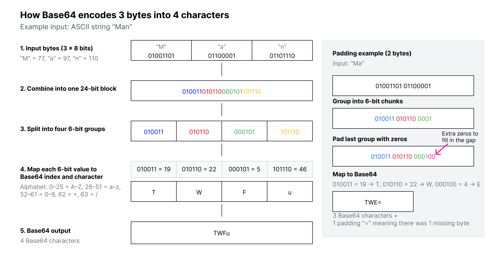
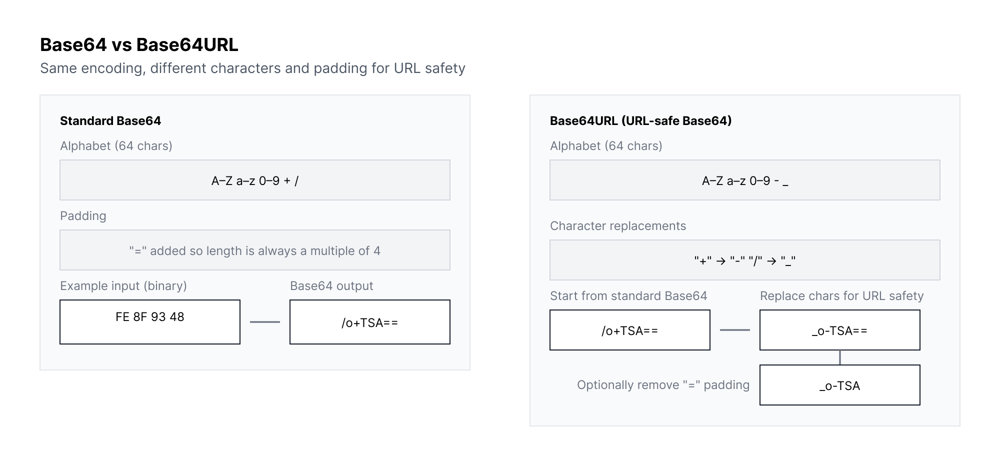

Data flows through the modern web in countless formats, yet not all systems can handle raw binary safely.

Base64 solves this problem by converting binary data into a text-safe format, ensuring reliable transmission across emails, APIs, web forms, and browser scripts. It appears everywhere, from JWT tokens and JSON payloads to QR codes and email attachments, yet many developers rely on it without fully understanding how it works.

This often leads to errors like incorrect padding, URL-safe variant mismatches, or decoding failures. Its strength lies in simplicity and consistency, making it an essential tool for handling binary data in text-based environments.

This blog explains Base64 in clear, practical terms, detailing how it works, when it should be used, common pitfalls to avoid, and ways to **decode encode Base64** efficiently for real-world development tasks.

## **What Is Base64?**

Base64 is a binary-to-text encoding method that converts any type of binary data, files, images, or raw bytes, into a sequence of safe, ASCII-friendly characters. Systems built around text, such as email, logs, or APIs, often cannot handle binary directly. Base64 ensures this data can be carried through such systems without corruption.

Although Base64 transforms data into a readable string, it does not encrypt or secure it in any meaningful way. Anyone can run a **base64 decode** operation and recover the original data.

### **Why Does Base64 Exist?**

Many early internet protocols were not designed to handle binary data.

To prevent corruption, engineers needed a way to represent binary content as clean text that could survive transit through restrictive systems. Base64 became the standardized format to guarantee safe transport across environments like email gateways, proxies, and text-based APIs.

Even in modern systems, REST APIs, OAuth flows, or serverless logs, binary transport issues still occur. Base64 remains the simplest solution for “wrapping” binary data so it passes through text-based systems.

## **How Base64 Works?**

Base64 works by grouping binary data and mapping it to a limited set of safe characters. It takes 3 bytes (24 bits), splits them into four 6-bit groups, and converts each 6-bit chunk into one of 64 allowed characters. When the final block is incomplete, = padding is used to maintain structure.

This process is fully reversible. Any Base64 string can undergo a **decode Base64 decode** process to return to its original binary form. This reversibility is why Base64 is widely used in serialization, debugging, and API architectures.

<!--FIGURE--><!--/FIGURE-->

## **Is Base64 Secure?**

Base64 is not encryption and should never be treated as such. It does not hide the data, does not provide confidentiality, and does not prevent tampering. Because anyone can easily decode Base64 using built-in tools or online utilities, sensitive data must always be protected through encryption or proper authentication measures.

If you are building authentication or identity features, a platform like Authgear handles actual security layers, such as TOTP, passkeys, recovery codes, and token signing, while Base64 simply plays a supporting role for encoding data safely.

## **When To Use Base64?**

Base64 is helpful when binary data needs to pass through systems or protocols that only accept text. It ensures that the underlying bytes remain intact, even if the transport medium is restrictive. Below are real-world use cases where Base64 shines.

### **1. Embedding Images in HTML or CSS**

Web developers occasionally embed small images directly into HTML or CSS using Base64.  
 Instead of referencing an external image file, the Base64-encoded version is added inline, reducing HTTP requests and simplifying asset delivery for small elements like icons or logos.

Example:

``

Small assets load quickly and eliminate extra file requests, though large images should still be referenced separately.

### **2. Sending Binary Data Through JSON APIs**

JSON is inherently text-based and does not allow raw binary. To send files through JSON APIs, such as attachments, images, or certificate blobs, developers encode the binary using Base64.

The receiving system then performs the **base64 decode** process to reconstruct the original file. This is widely used across mobile apps, IoT devices, and SaaS backends.

### **3. Handling JWTs, OAuth Tokens, and Web Identity Systems**

Authentication systems rely heavily on Base64URL, a variant of Base64 with URL-safe characters. JWT headers and payloads use Base64URL, allowing them to be safely embedded in URLs, cookies, and HTTP headers without causing parsing issues.

It’s important to remember that JWTs are signed, not encrypted. Even though Base64 makes them transport-safe, their contents can still be decoded easily. Developers working with identity flows in Authgear regularly inspect Base64URL-encoded token segments when debugging authentication.

### **4. Email Attachments and MIME Encoding**

Email was built long before binary files were common. To safely transmit attachments, Base64 became part of the MIME standard. Most email clients automatically encode outgoing attachments and decode incoming ones behind the scenes. This ensures file integrity across a wide variety of legacy and modern mail servers.

### **5. Storing Small Binary Blobs in Databases**

Databases do not always support binary fields or may complicate binary storage. Encoding small binary fragments, like thumbnails, cryptographic keys, or configuration bundles, as Base64 makes them easier to log, query, or serialize. However, for large files or media, object storage remains the better choice.

## **How To Encode and Decode Base64?**

Most programming languages offer built-in support for Base64. The examples below demonstrate how to **decode encode Base64** in JavaScript, Python, Go, Java, and Bash. These examples include secondary keyword variations like **base64 encodebase64** for consistency.

### **JavaScript**

**Browser APIs:**

`const encoded = btoa("Hello World");`

`const decoded = atob(encoded);`

btoa stands for binary-to-ascii, and btoa stands for ascii-to-binary respectively.

**Node.js version:**

const encoded = Buffer.from("Hello World").toString("base64");

const decoded = Buffer.from(encoded, "base64").toString("utf8");

### **Python**

Python’s Base64 module makes encoding simple:

## **Go**

Go’s standard library offers clean Base64 utilities:

### **Java**

Java includes utilities for standard and URL-safe Base64:

## **Bash**

The shell remains one of the easiest places to experiment with Base64:

**Encode:**

`echo -n "Hello World" | base64`

**Decode:**

`echo -n "SGVsbG8gV29ybGQ=" | base64 --decode`

## **Base64 vs Base64URL**

Base64URL is a modified version of Base64 designed for URLs, cookies, and authentication flows. It replaces characters that may be interpreted incorrectly in URLs and often omits padding. This makes Base64URL the preferred format for OAuth, OIDC, and JWTs.

If you're working with tokens in Authgear or similar identity platforms, you will encounter Base64URL frequently.

<!--FIGURE--><!--/FIGURE-->

## **Base64 Encoding Workflow**

Understanding how Base64 works internally can help you debug issues more effectively.  
 The process always follows these steps:

1. Convert data into bytes
1. Group bytes into 24-bit blocks
1. Split each block into four 6-bit pieces
1. Map each 6-bit segment to the Base64 character set
1. Add `=` padding if the input length isn’t divisible by three

This structured transformation guarantees consistency across languages and platforms.

## **Common Developer Mistakes**

Base64 is simple, but errors still occur frequently. Below are the most common issues engineers encounter when working with Base64 in applications and APIs.

### **1. Using Base64 as Encryption**

Base64 is readable and reversible. Never store credentials, API keys, or personal data in Base64 under the assumption it is hidden.

### **2. Mixing Up Base64 and Base64URL**

These formats look similar but behave differently. A Base64URL string cannot always be decoded with a Base64 decoder unless the characters are converted and padding is fixed.

### **3. Double Encoding**

This happens when data that is already Base64-encoded is encoded again.  
 Double-encoded values often cause API failures, signature mismatches, or broken file transfers.

### **4. Encoding Large Files**

Base64 inflates file size by roughly 33%. For large objects, use binary storage or streaming instead of Base64.

## **When Not To Use Base64?**

While Base64 is convenient, it is not always the best solution. Avoid Base64 when:

- Transferring large files
- Handling high-performance data pipelines
- Storing binary blobs long-term
- Sensitive data requires actual security
- Binary-friendly transport formats are available

Knowing when to avoid Base64 is as important as knowing when to use it.

## **Using Authgear During Base64 Debugging**

Developers often need quick ways to inspect or debug encoded data. Authgear’s [free Base64 Decode & Encode tool](/tools/base64-decode-encode) helps teams test payloads, inspect authentication tokens, and validate Base64URL behavior without needing to write scripts or run local utility commands.

This is especially useful in authentication use cases, where engineers frequently inspect Base64URL-encoded JWT headers and payloads or troubleshoot API request bodies.

## **Base64 in Authentication and API Systems**

Base64 appears heavily in modern authentication protocols. While it is not used for security, it ensures the underlying bytes are safely represented when passed through redirects, cookies, or HTTP headers.

Common examples include:

### **Basic Auth Headers**

`Authorization: Basic dXNlcjpwYXNz`

### **JWT Sections**

Headers and payloads are Base64URL-encoded JSON objects.

### **SAML Certificates**

X.509 certificates in SAML metadata are Base64-encoded.

If you're building auth flows, Base64 is a supporting encoding layer, while platforms like Authgear handle the actual security, token signing, and MFA requirements.

## **Performance Considerations**

Base64 is efficient for small and medium-sized payloads. However, because it increases data size, encoding or decoding very large files may use more memory, slow down processing, or increase network bandwidth consumption.

For performance-critical applications, consider streaming Base64 operations or using binary formats where possible.

## **Troubleshooting Base64 Errors**

When Base64 fails to decode, the cause is usually simple.  
 Common reasons include:

- Missing or incorrect padding
- Newline characters introduced by editors
- Using Base64 instead of Base64URL
- Corrupted or truncated data
- Double-encoded content

Most decoding issues can be fixed by correcting padding or verifying the encoding variant.

## **Wrapping Up**

Base64 is an essential tool that makes it possible to safely represent binary data as text.  
 Whether embedding images, transmitting files through JSON APIs, or inspecting authentication tokens, Base64 ensures your data survives transit through systems that only understand text.

By understanding how to properly **decode encode Base64**, use it safely, and avoid common mistakes, developers can build more reliable and secure integrations.

<a href="https://portal.authgear.com/" target="_blank">Start your free Authgear trial today</a> and easily debug Base64 data and inspect tokens with<a href="/tools/base64-decode-encode" target="_blank"> its free Decode & Encode tool.</a>

## **FAQs**

### **1. Is Base64 a form of encryption?**

No. Base64 is purely an encoding method. Anyone can perform a **base64 decode** action to reveal the original data.

### **2. Why does Base64 make data larger?**

Base64 increases data size by about 33% because 3 bytes of binary become 4 encoded characters.

### **3. What is the difference between Base64 and Base64URL?**

Base64URL replaces `+` and `/` with `-` and `_`, making it safe for URLs, cookies, and token-based authentication flows.

### **4. How do I decode Base64 easily?**

Most languages provide decoding functions, and online tools, such as Authgear’s Base64 Decode & Encode tool, offer a fast way to test and inspect encoded data.
