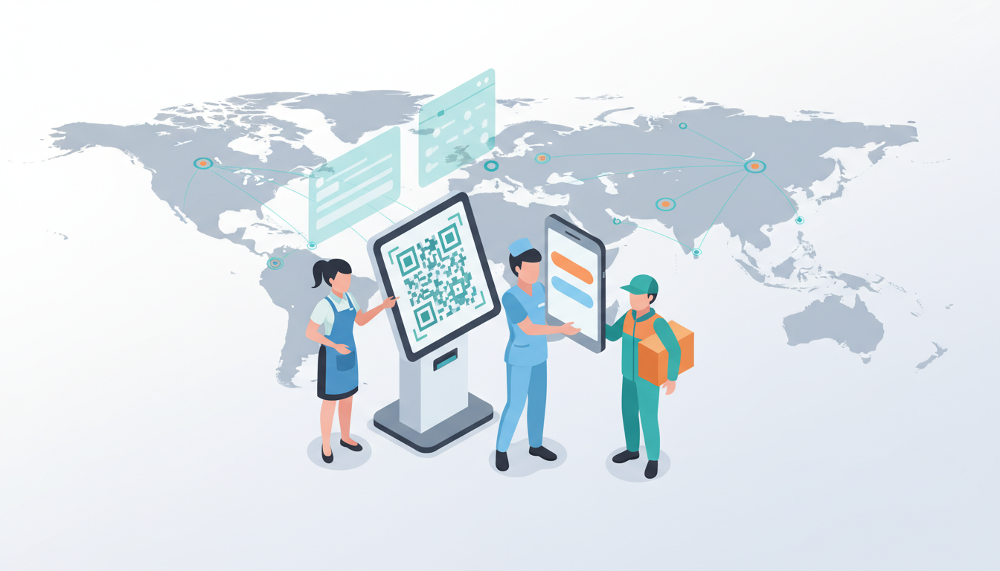
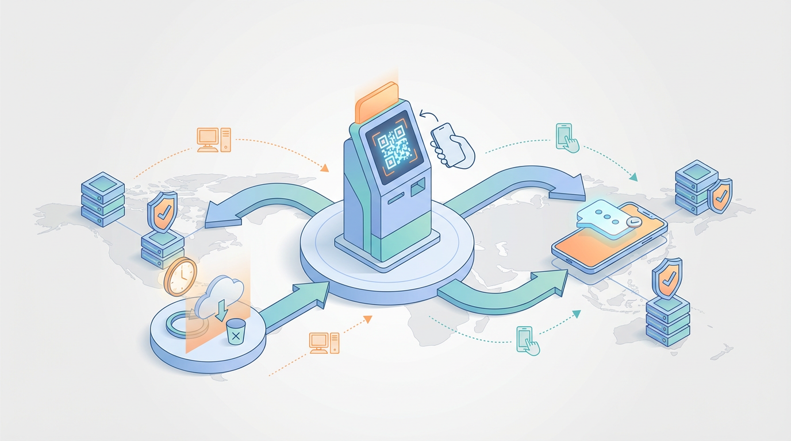

Enterprise identity teams are increasingly evaluating whether Ping Identity is the right fit - especially when authentication requirements extend beyond traditional office-based employees to include mobile-first workforces who rarely access desktop computers. Organizations operating across multiple countries face additional constraints: data residency laws, language and localization needs, varying connectivity conditions, and complex procurement requirements. This guide helps procurement, security, and product teams evaluate Ping alternatives with a practical lens: evaluation criteria, vendor comparisons, and vendor shortlists.

Authgear is positioned throughout this guide as a mobile-first identity platform built for phone-first authentication. Authgear's approach targets passwordless authentication, SMS enrollment, and multi-region hosting options - a practical model for enterprises managing authentication for staff who primarily use mobile devices

**In this guide:**

- [Why Companies Look Beyond Ping](#why-companies-look-beyond-ping-identity)
- [Evaluation Criteria](#evaluation-criteria-for-enterprises-and-mobile-first-staff)
- [Top 9 Ping Alternatives](#top-ping-identity-alternatives-to-evaluate-quick-reference)
- [Vendor Deep Dives](#vendor-profiles-detailed)

<!--FIGURE--><!--/FIGURE-->

## Why companies look beyond Ping Identity

Ping Identity is a mature platform that excels at workforce SSO, complex federation and enterprise lifecycle management. Yet buyers often find it misaligned for other scenarios.

- **Complexity for simple needs.** Many Ping deployments are built around workforce IAM and federated SSO. Extending that model to large populations of mobile-first workers (shop staff, clinic nurses, drivers) creates unnecessary overhead.
- **Workforce-centric assumptions.** Ping is typically designed for personal corporate devices, email-based enrollment, and desktop/laptop workflows - not phone-first authentication or SMS-based enrollment.
- **Cost and licensing model.** Pricing structures aimed at corporate seats or SSO can make large mobile workforce deployments expensive.   <ul><li>**Multi-region operational gaps.** Data residency, and localized identity providers (government eIDs)

### When to evaluate an alternative

- Expanding to customer-facing or large mobile-first populations
- Need for local data hosting, regional SLAs, or specific compliance (e.g., local government ID integration)
- High TCO under per-seat or per-license pricing models
- Requirement for mobile-first workflows, SMS enrollment, or intermittent connectivity support

## Evaluation criteria for enterprises and mobile-first staff

<!--FIGURE--><!--/FIGURE-->

Standard CIAM/IAM checklists (security, UX, scalability) are necessary but insufficient for globally distributed, mobile-first workforces. Expand evaluation to include mobile and multi-region nuances.

### Key criteria and what to ask

#### Use-case fit: mobile-first & device-light users

- Does the vendor support **mobile-first authentication** with native iOS and Android SDKs?
- Are there SMS-first and one-tap enrollment flows that do not require email?
- Can you integrate **ID badges** or local smartcards?
- How does the vendor handle account recovery for non-email users?

#### Security that fits operations: adaptive & passkey alternatives

- Does the platform support **passkeys** on mobile devices, and alternative secure flows where they are not supported?
- Are there **adaptive authentication** controls (geo/behavior signals) that avoid high-friction steps for low-risk staff actions?
- Are fallback flows robust (e.g., one-time codes, operator-assisted verification)?

#### Architecture, performance, and multi-region availability

- Are there **multi-region hosting** options or local cloud footprints?
- What is the vendor's **SLA**, and are there region-specific SLAs or support hours?
- How is **latency** measured and mitigated (edge caching, replicated sessions)?

#### Data residency, privacy, and local compliance

- Can customer data be kept within the required jurisdiction?
- Does the vendor provide **auditable consent capture**, retention controls, and data export for audits?
- What certifications (ISO, SOC 2) and local legal support do they provide?

#### Developer experience and operational admin

- Are there SDKs for mobile and web, low-code UI components, and easy webhook integrations?
- Is the admin console design user-friendly?
- How good is the **documentation** and sample apps for mobile-first flows?

#### Pricing, TCO, and procurement

- Pricing model: per-seat vs MAU vs per-device vs per-auth?
- Does vendor pricing scale to very large mobile workforce populations affordably?
- Are there hidden costs for regional hosting, localization, or integrations?

### Scoring rubric (quick)

- **5** = Excellent fit for mobile-first/multi-region needs
- **3** = Good for standard CIAM but requires workarounds
- **1** = Poor fit

Use this rubric during vendor demos to rate vendors across the checklist.

<!--FIGURE--><!--/FIGURE-->

## Top Ping Identity alternatives to evaluate (quick reference)

Below are short one-line summaries. Vendors are ordered alphabetically.

- **Authgear** - Mobile-first authentication with SMS enrollment, multi-region hosting options; designed for phone-first staff at scale
- **Auth0** - Developer-first CIAM, extensible, strong ecosystem; evaluate regional hosting and mobile-first workflow readiness.
- **CyberArk** - Best for privileged access management; not ideal for broad mobile workforce IAM.
- **Infisign** - Enterprise IAM with some regional focus; verify claims for offline scenarios.
- **JumpCloud** - Directory and device management strengths; check mobile authentication UX.
- **LoginRadius** - CIAM with global reach and local IDP integrations; examine per-MAU pricing for large mobile workforce counts.
- **Microsoft Entra ID** - Excellent for Microsoft shops and workforce SSO; caution about cloud lock-in and mobile-first fit.
- **Okta** - Leader in workforce SSO and lifecycle; complexity and cost may be prohibitive for mobile workforce deployments.
- **Stytch** - Modern passwordless-first CIAM; strong developer experience, evaluate regional hosting and offline flows.

## Vendor profiles (detailed)

For each vendor: overview, strengths, weaknesses, best-for scenarios, regional notes, migration flags, and POC checklist.

### Authgear - Overview & mobile-first approach

Authgear is an open-source identity platform focused on mobile-first and phone-first use cases. It emphasizes easy enrollment (SMS, passcodes), passwordless authentication, and multi-region hosting options for enterprises operating across jurisdictions.

**Strengths**

- SMS and WhatsApp OTP enrollment flows
- **Passwordless authentication** with passkeys and biometrics
- Mobile-optimized SDKs for iOS and Android
- Mobile-optimized SDKs with responsive authentication flows
- User-friendly admin console
- Open-source core with enterprise features; self-hosted option (Authgear ONCE) allows deployment in any region
- ISO 27001 and SOC 2 Type II certified

**Weaknesses**

- Younger ecosystem vs large incumbents; fewer prebuilt enterprise connectors in some regions
- For some complex workforce lifecycle features (deep HR integrations), additional connectors may be required

**Best for**

- Enterprises with large mobile-first populations: retail, healthcare clinics, logistics
- Organizations requiring multi-region data residency and compliance
- Deployments prioritizing mobile-first authentication workflows

**Regional strengths/limitations**

- Cloud hosting on Google Cloud Platform (US); multi-region data residency available for Enterprise plans; self-hosted option allows deployment in any region

**Migration notes**

- Supports SAML/OIDC for interoperability; standard OAuth/OIDC protocols simplify migration from other identity providers

**POC checklist**

- Test SMS and WhatsApp enrollment with real mobile devices
- Validate passwordless authentication flows
- Measure onboarding time and auth success rates for actual staff
- Verify regional hosting configuration and data residency settings

### Auth0

**Strengths:** Depth of extensibility, custom rules, large partner ecosystem, many connectors, strong developer community.****

**Weaknesses:** Pricing can scale steeply with MAU; regional hosting and offline flows may require engineering work.

**Best for:** Developer-first CIAM for digital-first end-users with complex integration needs.

**Migration flags:** Custom rules and extensibility may complicate migration from Ping.

**Mobile-first/Multi-region fit:**

- Auth0 excels at digital-first customer authentication but may require additional engineering for SMS-first enrollment workflows
- Regional hosting available but configuration for offline/intermittent connectivity scenarios needs evaluation
- Consider total cost for large mobile workforce populations given MAU-based pricing

**POC checklist**

- Test mobile authentication flows on iOS and Android
- Validate SMS delivery and non-email enrollment flows
- Calculate projected costs at mobile workforce scale (10k+ MAU)

### Okta

**Strengths:** Best-in-class workforce SSO, lifecycle management, broad integration catalog, mature governance features.

**Weaknesses:** Complexity for CIAM/mobile-first scenarios, higher cost, heavier architecture.

**Best for:** Workforce SSO at large enterprises with complex HR integrations.

**Migration flags:** Lifecycle integrations (HR systems) require careful mapping.

**Mobile-first/Multi-region fit:**

- Okta is optimized for workforce identity with strong SSO and governance, but may be heavyweight for mobile-first deployments
- Mobile authentication workflows typically require workarounds or custom development
- Pricing model (per-seat/enterprise licensing) can be costly for large mobile workforce populations
- Strong regional availability and compliance certifications

**POC checklist**

- Evaluate simplified enrollment flows for non-email users
- Test mobile authentication UX on staff devices
- Compare TCO for mobile workforce vs mixed workforce deployments

### Microsoft Entra ID

**Strengths:** Tight integration with Microsoft stack (Office 365, Azure), identity governance features, conditional access.

**Weaknesses:** Cloud lock-in, complexity for non-Microsoft environments, limited purpose-built mobile-first tooling.

**Best for:** Microsoft-centric enterprises with heavy Azure/M365 usage.

**Migration flags:** Authentication flows tied to Azure AD may require re-architecting for non-Microsoft systems.

**Mobile-first/Multi-region fit:**

- Strong choice if your enterprise is already Microsoft-centric
- Mobile support available but designed primarily for corporate devices
- SMS-first and QR enrollment require additional configuration or custom flows
- Global infrastructure with regional data centers, but check specific regional hosting requirements

**POC checklist**

- Test with your actual device mix (especially non-Windows mobile devices)
- Validate QR/SMS enrollment workflows
- Assess vendor lock-in implications for multi-cloud strategies

### Stytch

**Strengths:** Modern passwordless-first approach, fast developer experience, clean APIs, good documentation.

**Weaknesses:** Regional hosting options and offline flows vary; evaluate enterprise support maturity.

**Best for:** Modern web/mobile customer-facing CIAM with passwordless priority.

**Migration flags:** Passwordless primitives differ from SAML/OIDC models - plan interoperability carefully.

**Mobile-first/Multi-region fit:**

- Strong for digital-first passwordless but evaluate readiness for phone-first mobile scenarios
- Mobile SDK support available with good developer experience
- SMS/OTP flows available but verify offline resilience and regional SMS delivery
- Growing platform but check regional hosting availability and SLAs

**POC checklist**

- Test passwordless flows on actual mobile devices
- Validate SMS delivery across your regions
- Assess mobile app integration complexity

### LoginRadius

**Strengths:** CIAM platform with global reach, local IDP integrations, social login options.

**Weaknesses:** Pricing and performance for large mobile workforce cohorts should be evaluated; feature depth varies.

**Best for:** Customer-facing CIAM with global reach and social login requirements.

**Migration flags:** MAU pricing can make large-scale mobile workforce projects costly.

**Mobile-first/Multi-region fit:**

- Good for customer CIAM but evaluate mobile-first specific features
- Global presence supports regional deployments but verify specific data residency options
- MAU-based pricing requires careful cost modeling for large mobile workforce populations
- Social login strength less relevant for workforce scenarios

**POC checklist**

- Test enrollment flows without email requirements
- Validate mobile authentication capabilities
- Model costs at projected mobile workforce scale

### CyberArk

**Strengths:** Industry leader in privileged access management, secrets management, strong security posture.

**Weaknesses:** Not designed for mass mobile workforce CIAM; different problem domain.

**Best for:** Privileged identities and sensitive access control (admin accounts, developers, contractors with elevated access).

**Migration flags:** Different problem space - not suited for mass-user flows.

**Mobile-first/Multi-region fit:**

- CyberArk solves a different problem (PAM) than mobile workforce authentication
- Not recommended for mobile-first or large-scale workforce authentication scenarios
- Excellent for securing privileged accounts but overkill and misaligned for mobile workforce staff

**POC checklist**

- Only evaluate if you have privileged access requirements separate from workforce authentication

### JumpCloud

**Strengths:** Directory services and device management, cross-platform support, unified admin console.

**Weaknesses:** Mobile authentication UX may require custom work; primarily device-management focused.

**Best for:** Mixed device fleets with emphasis on device management and directory services.

**Migration flags:** Consider device management overlap and mobile device policies.

**Mobile-first/Multi-region fit:**

- Strong for managing diverse device fleets but less specialized for mobile workforce authentication workflows
- Mobile device management capabilities available
- Better suited when device management is as important as identity management
- Regional hosting capabilities should be verified for specific jurisdictions

**POC checklist**

- Test mobile device management and authentication controls
- Evaluate admin UX for non-technical field operators
- Assess whether device management features justify the platform choice

### Infisign

**Strengths:** Enterprise features with regional emphasis, claims some offline/local capabilities.

**Weaknesses:** Verify claims on offline scenarios; newer platform requires due diligence.

**Best for:** Enterprises needing enterprise-grade IAM with regional considerations.

**Migration flags:** Validate local certifications and SLA claims thoroughly.

**Mobile-first/Multi-region fit:**

- Positioned for enterprises but requires validation of mobile-first specific features
- Verify passwordless authentication, QR/SMS enrollment, and offline capabilities with proof-of-concept
- Check regional hosting options and compliance certifications for your jurisdictions
- Newer platform means less public reference architecture and case studies

**POC checklist**

- Request references for similar mobile workforce deployments
- Test all claimed offline and mobile-first capabilities
- Verify regional hosting and data residency options

## Side-by-side comparison matrix

Note: Scores use the 1-5 rubric. Focus on mobile-first/multi-region fit.

    <table class="ag-table">
      <thead>
        <tr>
          <th>Vendor</th>
          <th>Mobile-first</th>
          <th>Regional data residency</th>
          <th>Developer experience</th>
          <th>Pricing model (mobile workforce)</th>
          <th>Enterprise features</th>
        </tr>
      </thead>
      <tbody>
        <tr>
          <td>Authgear</td>
          <td align="center">5</td>
          <td align="center">4</td>
          <td align="center">4</td>
          <td>Optimized</td>
          <td>SSO, MFA, audit logs</td>
        </tr>
        <tr>
          <td>Auth0</td>
          <td align="center">3</td>
          <td align="center">3</td>
          <td align="center">5</td>
          <td>MAU-focused</td>
          <td>Extensible CIAM</td>
        </tr>
        <tr>
          <td>Okta</td>
          <td align="center">3</td>
          <td align="center">4</td>
          <td align="center">4</td>
          <td>Per-seat / enterprise</td>
          <td>Workforce lifecycle</td>
        </tr>
        <tr>
          <td>Microsoft Entra ID</td>
          <td align="center">2</td>
          <td align="center">4</td>
          <td align="center">4</td>
          <td>Enterprise entitlements</td>
          <td>Identity governance</td>
        </tr>
        <tr>
          <td>Stytch</td>
          <td align="center">4</td>
          <td align="center">2</td>
          <td align="center">5</td>
          <td>MAU / auth</td>
          <td>Passwordless-focused</td>
        </tr>
        <tr>
          <td>LoginRadius</td>
          <td align="center">3</td>
          <td align="center">3</td>
          <td align="center">3</td>
          <td>MAU</td>
          <td>CIAM features</td>
        </tr>
        <tr>
          <td>CyberArk</td>
          <td align="center">1</td>
          <td align="center">4</td>
          <td align="center">2</td>
          <td>License-based</td>
          <td>PAM</td>
        </tr>
        <tr>
          <td>JumpCloud</td>
          <td align="center">3</td>
          <td align="center">3</td>
          <td align="center">3</td>
          <td>Per-device</td>
          <td>Directory + device mgmt</td>
        </tr>
        <tr>
          <td>Infisign</td>
          <td align="center">3</td>
          <td align="center">3</td>
          <td align="center">3</td>
          <td>Enterprise</td>
          <td>IAM features</td>
        </tr>
      </tbody>
    </table>

This matrix highlights the trade-offs between vendors for mobile-first usability, and multi-region hosting options.

## Migration playbook: moving from Ping Identity (or similar) to a new platform

A practical, phased plan reduces risk. Below is a high-level playbook and a sample timeline (8-12 weeks typical for a POC + phased rollout for mobile-first use cases).

### 1. Discovery & planning (Week 0-2)

- Inventory: identity providers, user directories, authentication methods, and integrations
- Stakeholders: security, ops, managers, legal, HR
- Define success metrics: onboarding time, auth success rate, helpdesk calls, latency
- Choose sample pilot sites and device classes (personal mobile, feature phone, tablet)

### 2. Design (Week 2-4)

- Map identity model (users, badges, devices)
- Define enrollment and recovery flows for non-email users (SMS, WhatsApp, admin-assisted)
- Compliance mapping: data residency, consent capture, retention

### 3. POC & integration (Week 4-6)

- Implement core flows with the new platform (example: phone number enrollment, mobile login, SMS fallback)
- Integrate SAML/OIDC for interoperability with existing SSO apps where needed
- Run security tests: pen test and basic threat modeling for new flows

### 4. Pilot & measure (Week 6-8)

- Deploy pilot to selected locations
- Collect KPIs: average onboarding time, authentication success, helpdesk tickets
- Observe field operator issues; iterate

### 5. Phased rollout (Week 8-12+)

- Expand using phased cohorts; shadow mode for a percentage of users
- Dual-run and token exchange: keep Ping for workforce SSO and gradually switch mobile workforce authentication
- Production cutover and decommission timeline

### 6. Post-launch & optimization

- Ongoing monitoring, audit logs, and SLA reviews
- Training refreshers and local-language documentation

### Cutover strategies for mobile authentication

**Staged approach:** pilot one region/location, then a "dark launch" stage where traffic is mirrored.

**Shadow mode:** validate new auth events against old system without affecting users.

**Token exchange:** issue tokens in the new platform, validate against legacy sessions for transition.

**Rollback:** keep a tested rollback plan and ensure you can re-enable Ping SSO rapidly if critical issues arise.

### Operational readiness & training for mobile-first staff

- Create simple one-page job aids with screenshots (local language)
- Train managers on one-click account recovery and SMS/WhatsApp enrollment assistance
- Provide a quick helpline and step-by-step scripts for staff and managers
- Monitor real-world helpdesk call types and refine flows to remove friction

### Authgear migration checklist (sample)

- Confirm SAML/OIDC compatibility with existing apps
- Test SMS/WhatsApp delivery in all regions (carrier lists, sender IDs)
- Verify regional data residency settings and obtain legal sign-off
- Run POC with at least 50 real mobile workforce users

## Region-specific considerations and regulatory checklist

Identity programs must be geo-aware. Below are practical checks by region.

### EU/EEA (GDPR)

- Confirm legal basis for processing and maintain consent records
- Ensure data residency or lawful transfer mechanisms (SCCs) for cross-border processing
- Provide data subject request processes (access, deletion)
- **Authgear note:** configurable data residency and built-in audit events support compliance

### APAC

- **Local hosting and latency:** use local cloud regions to reduce latency
- **Government ID integrations:** support for regional eID or identity exchange APIs varies; map integration requirements early
- **Language and UX:** localize enrollment prompts and SMS templates for local languages and character sets

### LATAM & Africa

- **Local SMS delivery:**vet gateway partners and sender IDs for reliable OTP delivery
- **Language and UX:**localize enrollment prompts and SMS templates

### General regulatory checklist

- **Data residency:** can you host data where regulation requires it?
- **Consent & audit:** capture consent and maintain logs for tribunal/audit
- **Certifications:** SOC 2, ISO 27001, or regionally relevant certifications
- **Local legal counsel review:** integrate early

## Decision framework and recommendations

Choose based on primary needs:

### Mobile-first & multi-region distributed (SMS, passwordless): **Authgear**

**Why:** purpose-built for phone-first workflows, multi-region hosting, and low-touch admin UX.

### Microsoft-centric enterprise with heavy reliance on Azure AD and workforce SSO: **Microsoft Entra ID**

**Why:** deep Microsoft integration and governance features.

### Workforce lifecycle, broad SSO, and identity governance: **Okta**

**Why:** mature workforce IAM and integrations, but may be heavyweight for mobile-first scenarios.

### Privileged access and secrets management: **CyberArk**

**Why:** top choice for PAM but not for mass mobile workforce authentication.

### Developer-first passwordless customer CIAM: **Stytch or Auth0**

**Why:** excellent developer experience for digital-first customer apps; validate regional hosting.

### When to choose Authgear

- Large mobile-first user base (thousands to tens of thousands)
- Need for passwordless/SMS-based enrollment without email
- Multi-region data residency required (via Enterprise plan or self-hosting)
- Want an affordable pricing model oriented to mobile workforce scale

## Frequently Asked Questions

### Is Authgear a good alternative to Ping Identity?

Yes, particularly for enterprises managing mobile-first workers on personal devices. While Ping Identity excels at workforce SSO and complex federation, Authgear is purpose-built for phone-first scenarios with SMS enrollment, passwordless authentication, and multi-region hosting options.

### How much does Ping Identity cost compared to alternatives?

Ping Identity typically uses per-seat or enterprise licensing which can be expensive for large mobile workforce deployments. Alternatives like Authgear offer MAU-based or per-device pricing models that scale more affordably for mobile workforce populations. Specific pricing varies by vendor and deployment size.

### What is the best Ping Identity alternative for multi-national enterprises?

The best alternative depends on your specific use case:

- **Mobile-first with passwordless authentication:** Authgear
- **Microsoft-centric environments:** Microsoft Entra ID
- **Workforce lifecycle and governance:** Okta
- **Developer-first customer CIAM:** Auth0 or Stytch

Evaluate vendors using the criteria in this guide based on your mobile-first, multi-region, and compliance requirements.

### How long does it take to migrate from Ping Identity to a new platform?

Typical migration timelines range from 8-12 weeks for POC and initial rollout, with phased expansion taking an additional 4-8 weeks. Timeline depends on complexity of existing integrations, number of users, and regional requirements. See the migration playbook section for detailed phases.

### What certifications should I look for in a Ping Identity alternative?

Key certifications include:

- **ISO 27001** (information security management)
- **SOC 2 Type II** (security, availability, confidentiality)
- **Regional certifications** (e.g., EU Cloud Code of Conduct, APAC-specific standards)

Verify that certifications cover the specific regions where you'll host data.

### Can passwordless authentication work for mobile workforces?

Yes, passwordless authentication is ideal for mobile workforces. Options include biometric authentication (Face ID, Touch ID), passkeys (FIDO2/WebAuthn), and SMS/WhatsApp OTP. These methods are more secure than passwords and provide better user experience on mobile devices.

## Conclusion and next steps

### Key takeaways

- Ping Identity is strong for workforce SSO but may be misaligned for mobile-first and multi-region deployments
- Evaluate vendors using a mobile-first and region-focused checklist: passwordless authentication, SMS flows, multi-region hosting, and mobile workforce-friendly pricing
- Authgear is designed for enterprises managing phone-first staff at scale - lowering onboarding friction and operating costs

### Actions

- Download the Authgear migration checklist (POC + cutover templates)
- Request an Authgear demo or book a co-run POC to validate SMS and passwordless flows in your region
- Use the RFP question bank in your procurement process and run a 6-8 week pilot measuring onboarding time and auth success rate

Authgear is built for enterprises who need identity solutions optimized for mobile-first teams. If your staff primarily use mobile devices and you need multi-region hosting with low-touch enrollment, consider scheduling a demo to see a tailored pilot plan.
