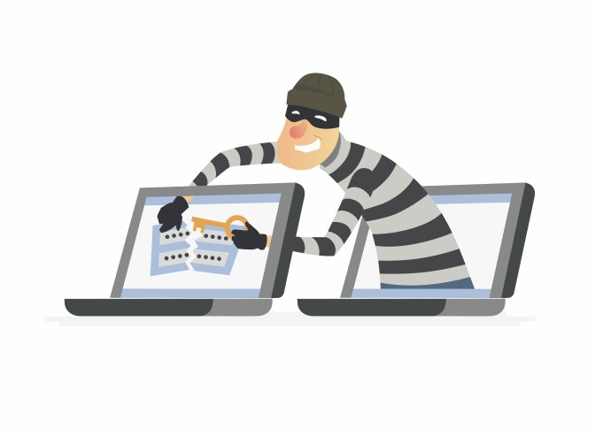
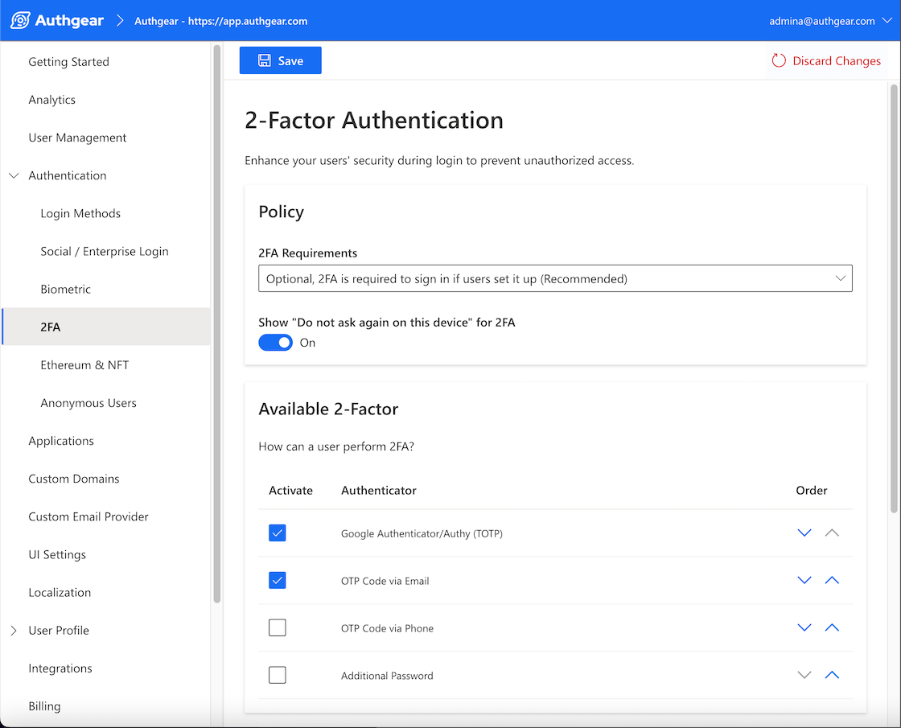

In 2020, a Security and Exchange Commissions <a href="https://www.sec.gov/files/Risk%20Alert%20-%20Credential%20Compromise.pdf" target="_blank">report</a> highlighted the growing risk of credential stuffing attacks. Part of what continues to make it such a serious cyber security challenge is the way it exploits simple errors people make every day. Most of us know by now not to use the same password and username across multiple platforms, but it remains a painfully common occurrence and one that makes automated attacks far too easy.

There are <a href="https://www.troyhunt.com/the-111-million-pemiblanc-credential-stuffing-list/" target="_blank">credential stuffing lists</a> with millions of email addresses and corresponding passwords floating around the internet and placing people and their data at risk without them even being aware. The prevalence of credential abuse and the threat it poses to our online safety makes it vital for us to understand it better.

That’s exactly why we’ve put together a comprehensive guide on what this cyber security threat involves and how best to protect against it.

<nav id="table-of-content">
    <ul> 
        <li><a href="#definition">What Is Credential Stuffing?</a></li>
        <li><a href="#how">How Credential Stuffing Attacks Work?</a></li>
        <li><a href="#difference">The Difference Between Credential Stuffing and Brute Force Attacks</a></li>
        <li><a href="#prevent">How to Prevent Credential Stuffing?</a>
            <ul style="margin-top:17.92px;margin-bottom:0">
                <li><a href="#user">From the User’s Side</a></li>
                <li><a href="#company">From the Company’s Side</a></li>
            </ul>
        </li>
        <li><a href="#authgear">Building Your Defense Against Credential Stuffing</a></li>
    </ul>
 </nav>

<h2 id="definition">What Is Credential Stuffing?</h2>

One of the reasons it’s been so difficult to prevent credential stuffing attacks is that many people still don’t know what it is. With that in mind, let’s begin with a simple credential stuffing definition: **it is a cyber-attack in which credentials (username and password pairs) obtained from a data breach where information was hacked or stolen from another service are used to attempt to log in to another unrelated service**. Sometimes called password stuffing, it uses stolen information to “fraudulently gain access to user accounts” (<a href="https://owasp.org/www-community/attacks/Credential_stuffing" target="_blank">OWASP</a>).

If that sounds slightly terrifying, it’s because it is. When a person has used the same password and email address across multiple sites, those credentials being exposed means that attackers can gain access to all those accounts too. The result is compromised data security across multiple platforms, just from an attacker gaining a single set of your credentials.

<h2 id="how">How Credential Stuffing Attacks Work?</h2>

<!--FIGURE--><!--/FIGURE-->

Knowing how to prevent a credential stuffing attack starts with understanding how the attacks take place. There is a typical process that attackers tend to follow in large-scale credential abuse:

1. First, they set up a bot that can log into multiple user accounts at once while faking different IP addresses. This allows the attackers to be quick and cover their footprints as they go.
1. The next step is to run an automated process to check if stolen credentials work on many websites. Again, it's all about speed.
1. Afterward, the attacker will monitor for successful logins. Where they are successful, they can then get personally identifiable information, credit cards, or other valuable data from the compromised accounts.
1. This account information is retained for future use and can be exploited in phishing attacks or other transactions enabled by the compromised service.

The efficiency of this process means that even though the success rate of credential stuffing attacks is roughly only one in a thousand, it’s still lucrative for attackers. They’re able to gain huge volumes of credentials which are then traded by hackers. These trades are generally in the form of lists, one of which named “<a href="https://www.troyhunt.com/the-111-million-pemiblanc-credential-stuffing-list/" target="_blank">Pemiblanc</a>” yielded 111 million email addresses in 2018. Scarier still is that similar lists exist across the internet now without most people ever being aware of it.

<h2 id="difference">The Difference Between Credential Stuffing and Brute Force Attacks</h2>

The Open Web Application Security Project (OWASP), an international non-profit dedicated to improving software security, notes in their <a href="https://owasp.org/www-community/attacks/Credential_stuffing" target="_blank">credential stuffing definition</a> that it can be seen as a subcategory of brute-force attacks. The differences between the two are, however, quite significant. For example:

- Brute Force attacks try to guess credentials **with no context** using ransom strings, commonly used password patterns, or dictionaries of common phrases. In comparison, credential stuffing uses already confirmed credentials.
- Where credential stuffing gains information via data breaches and is made more efficient because of people using repeat passwords, the success of a brute force attack relies on users choosing simple, guessable passwords. Brute force attacks are essentially a guessing game, whereas credential stuffing is far more targeted.
- Brute force attacks have a much lower success rate because they don’t have the level of data from previous breaches the way credential stuffing attacks do.

An easy defense against brute force attacks is creating strong passwords with multiple characters, letters, and numbers. This approach does not however necessarily protect against credential stuffing. If the same password is used across multiple accounts, it doesn’t matter how strong it is – a credential stuffing attack can still exploit it. That’s why implementing two-factor authentication (2FA) is so crucial as it requires users to present a secondary factor to gain access to the software/system. With this in place, simply using stolen credentials is unlikely to be enough for an attacker to get into your account.

Knowing how to prevent credential stuffing is all about seeing the ways in which these attacks can be made more difficult to perform. It tends to require a multi-layered approach that takes all parties into consideration – something we’re about to dive into …

<h2 id="prevent">How to Prevent Credential Stuffing?</h2>

<!--FIGURE--><!--/FIGURE-->

The scary reality for enterprises is that, as a <a href="https://www.troyhunt.com/the-111-million-pemiblanc-credential-stuffing-list/" target="_blank">2018 FTC case</a> in the USA showed, if a customer’s data is threatened because of credential stuffing, the legal responsibility is still at least partially on the company's shoulders. Even if that user made the error of using repeat passwords, it’s not enough of a defense to leave the company behind the application entirely absolved.

Preventing credential stuffing isn’t only a matter of protecting data privacy, but ensuring that companies don’t find themselves caught in the consequences of a user’s login being used without their knowledge. It affects all parties and stopping it requires changes from both sides too. That’s why it is so important that we all gain a better understanding of how to prevent credential stuffing attacks.

<h3 id="user">From the User’s Side</h3>

The results of the 2019 <a href="https://www.ncsc.gov.uk/news/most-hacked-passwords-revealed-as-uk-cyber-survey-exposes-gaps-in-online-security" target="_blank">UK Cyber Survey</a> showed that at the time, 23.2 million people in the UK were still using “123456” as their password. Protecting users from credential stuffing starts, in many ways, from the moment they choose their password. The problem is that too many users are still asking “What is credential stuffing?” and not seeing how important their choices are in avoiding credential abuse. Here are some key steps that users can take to better protect themselves:

#### **Use a Password Manager and Generate an Unique Password for Each Service**

Creating one unique password and then applying it to multiple accounts is not enough to stop password stuffing. Reusing information, even once, means exposing your servers to risk. That’s why it’s so important that users create passwords unique to each, specific account. Using a password manager can help users not only store and organize their passwords but also generate unique passwords for different services as to avoid using the same password for all.

#### **Turn on Two-Factor Authentication**

Most services now provide the option for two-factor authentication. Turning this simple feature on has huge benefits for users wanting to avoid being the victim of a credential stuffing attack. In addition to the username and password, the system requires that the user present another authentication factor, such as PIN, fingerprint, etc., to gain access to the system. Furthermore, it will ensure that they get a notification on their phone or another connected device every time they log in. As small as this step may seem, it is highly effective at keeping hackers away because it alerts people when their credentials are being used.

One of the scariest aspects of credential stuffing is that without two-factor authentication, you likely won’t know your account has been used by someone else until something has gone horribly wrong.

<h3 id="company">From the Company’s Side</h3>

<a href="/post/how-to-protect-your-users-from-automated-attacks" target="_blank">Protecting users from automated attacks</a> isn’t simply a matter of avoiding legal consequences, but of ensuring the overall safety of the online user experience. Enterprises need to be doing more to prevent the devastation that credential stuffing attacks can cause. Not only is the image of the company at stake in these matters, but people’s fundamental privacy. When it comes to maintaining cyber security, knowing how to prevent credential stuffing is fundamental for any company. Here are some tools to help companies do just that:

#### **Multi-Factor Authentication (MFA)**

<a href="/post/what-is-multi-factor-authentication-mfa" target="_blank">Multi-factor authentication</a> (MFA) is, as the name suggests, an authentication that requires more than one factor to verify the user’s identity. The most common factors are:

- Something the user knows (usually a password).
- Something the has (like a security token).
- Something the user is (for example, their fingerprint).

For instance, when users log into your website, they may be required to enter their password and then input a code sent to their mobile device. Ultimately, the purpose of MFA is to add an extra layer of security to the login process. The benefit of this is that even if attackers have a person’s password and username, they won’t be able to access the account without the second authentication factor.

Effective data security is generally about stacking up a barrier of protection that will make it harder for hackers to get through unseen. Implementing MFA as part of that barrier, especially when combined with other security measures, makes for a highly effective credential stuffing defense plan.

#### **Passkeys**

The new category of digital credentials is <a href="/features/passkeys" target="_blank">Passkeys</a>, a solution that allows users to go completely passwordless and as such, eliminate the risk of password stuffing. It means that users don’t need to worry about creating unique, complex passwords or changing them frequently. Instead, when users sign up for a website application, they’re given a username and then authenticated using biometrics or a PIN ­– exactly how they unlock their phones.

This works to reduce friction during the login and sign-up process and enhances data security since attackers cannot trick users into giving them their details. Credential stuffing relies on the use of passwords for success; without them, attackers have nothing to work with. Passkeys allow enterprises to circumvent the threat these attacks pose altogether.

#### **CAPTCHA**

CAPTCHA requires users to perform an action to prove they are human, a step that is intended to make it more difficult for credential-stuffing bots to operate. Unfortunately, hackers can use headless browsers to bypass CAPTCHA quite easily. Like MFA, CAPTCHA is a tool that can be combined with other security solutions and is also only useful in specific applications.

CAPTCHA can help prevent automated login attempts, but there are weaknesses to the tool that automated attackers can exploit. As such, implementing CAPTCHA alone is unlikely to be enough of a defense against attacks. Though CAPTCHA is one of the more frequently used tools to prevent credential stuffing, it’s not nearly as effective as other security measures available. At best, it’s great for making automated login attempts on your user accounts more time-consuming but it’s not enough to stop credential stuffing entirely.

#### **Device Fingerprinting**

Companies can use JavaScript to collect information about user devices and create a “fingerprint” for each incoming session. This fingerprint is a combination of parameters such as the user's operating system, language, browser, time zone, etc. After the fingerprint is created, it can then be matched with any other browser that attemps to log into the account; however, an user may have several devices and prompting warnings every time a new browser tries to log in might compromise user experience.

How strict the parameters are and what measures are enforced is up to the enterprise implementing them – they can even go as far as banning the IP used. The general recommendation however is to use a combination of at least 2-3 parameters and enforce less severe measures such as a temporary ban until the account is deemed safe again.

<h2 id="authgear">Building Your Defense Against Credential Stuffing</h2>

<a href="/" target="_blank">Authgear</a> offers multiple, highly effective features to help prevent credential stuffing attacks. Some of these include <a href="/features/biometric-authentication" target="_blank">Biometric Logins</a>, <a href="/features/whatsapp-otp" target="_blank">Whatsapp OTPs</a> as a form of MFA, and entirely passwordless logins with <a href="/features/passkeys" target="_blank">Passkey</a>.

In addition, Authgear also provides a variety of secondary factors, such as TOTP, OTP via email or additional passwords to protect your users from credential stuffing.

<!--FIGURE--><!--/FIGURE-->

A pre-built account setting page is also available for your users to enable MFA, manage their credentials, and revoke their signed in session if they observe any suspiscious actions.

<!--FIGURE--><!--/FIGURE-->

The threat that credential attacks pose to user safety and data privacy is not something to be taken lightly. <a href="/talk-with-us" target="_blank">Contact us</a> at Authgear for more details on how we can help build your defense against these threats.
