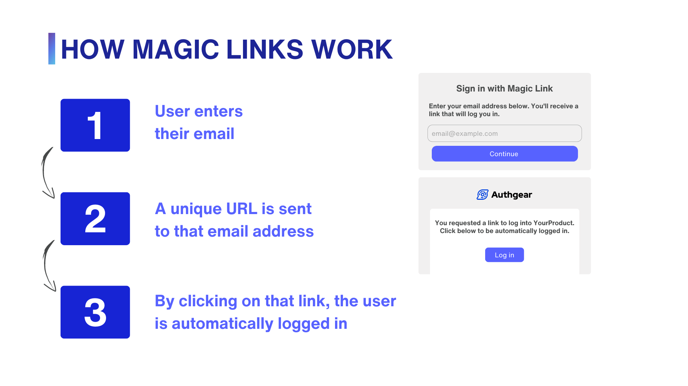
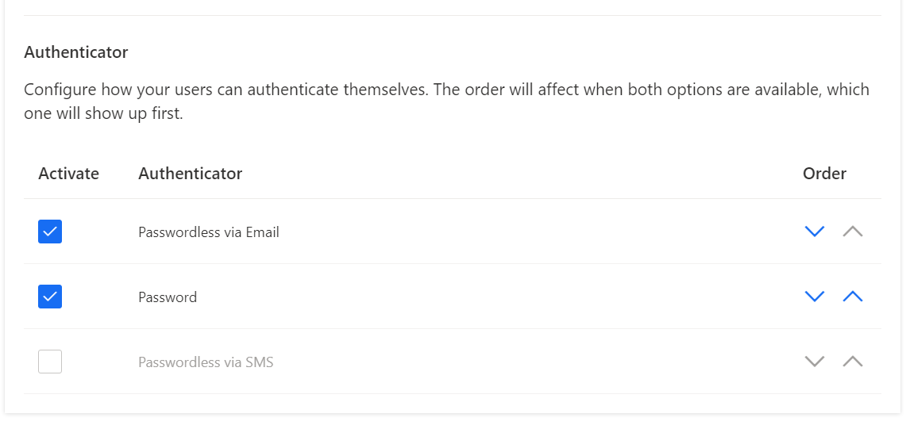
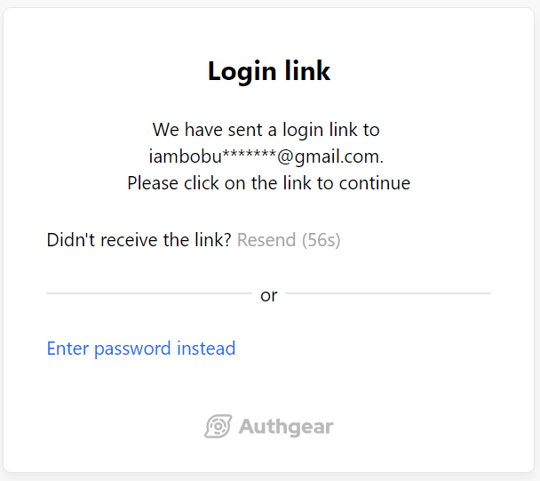

Nowadays, our daily activities, such as communication, financial transactions, shopping, and entertainment, require us to **enter account credentials**. Traditional login processes with passwords force us to recall specific usernames and passwords for each account, either **from memory** or using a **password manager** which generates and saves strong passwords for a safer login experience. Despite the availability of such tools, there is still resistance and hesitation among people when it comes to using them, driven by a variety of reasons:

1. Most of them are okay to keep passwords somewhere else or memorize them.
1. They do not know which one to use or how to get started.
1. They do not want to pay for password protection.
1. They do not trust password management software.

However, there is an alternative called **magic links** that eliminates the need for remembering passwords. With <a href="https://docs.authgear.com/strategies/email-login-link" target="_blank">magic links</a>, all you need to do is enter your email address, receive a link in your inbox, click on it, and presto! You gain instant access. This post explores **what magic links are** and **what you need to know** to implement an email-powered login flow for your users with <a href="/" target="_blank">Authgear</a>.

## What are magic links?

**Magic links** are a type of <a href="/features/passwordless-authentication" target="_blank">passwordless authentication</a> approach where users enter their email/username and get a link in the associated mailbox to click and log in.

Magic links reduces the risk of password-related vulnerabilities. Passwords can be weak, reused across multiple accounts, or easily guessed by hackers using brute-force attacks. Magic links, on the other hand, are time-sensitive and unique to each login attempt.

They also provide a layer of convenience for users. With traditional passwords, users often need to reset them periodically, leading to additional steps and potential account lockouts. However, with magic links, there is no need for password management or regular updates.

## How does Magic Links work?

The process of **using magic links** with Authgear is straightforward.

1. When a user wants to log in to a website or application, they enter their email address on the login page.
1. The application sends an email with a link to their registered email address.
1. The user clicks on the link in the email to access the application.

<!--FIGURE--><!--/FIGURE-->

## 5 Use cases of Magic Links

Magic links can be used in a variety of scenarios, from logging in to an application to accessing secure resources. Here are some real-world use cases where magic links have been successfully implemented:

**1. Password reset**

When someone forgets their password or thinks it might not be secure anymore, they often go through a process called password reset. Magic links can be used for password resets. The user receives an email or text message with a special link. When they click on that link, they are taken to a webpage where they can enter a new password. This way, they can easily reset their password without having to remember the old one.

**2. Time-sensitive transactions**

Sometimes the authentication process can take a while, which can be inconvenient for time-sensitive transactions like bank transfers or online payments. To address this, a magic link can be generated, allowing users to authenticate themselves quickly and easily, without any extra delays. This way, they can securely complete their transactions without any unnecessary friction.

**3. One-time access**

Imagine a situation where someone wants to access something just once, like a shared document or an invitation to an event. In this case, magic links can be handy. They work by creating a special link that can only be used one time. So, when the user clicks on the link and gets access to the document or event, the link becomes useless and can't be used again.

**4. Easy waitlist onboarding**

Waitlists are a helpful way to see if people are interested in your product before it's ready. But there's a common issue with waitlists: many people leave when you try to convert them into actual users. To tackle this problem, it's important to make the process of getting started as easy as possible. Instead of sending a link that asks them to create an account, why not send them a link that instantly lets them use the product? This way, they can jump right in without any extra steps or delays.

**In-store purchases**

As more people move away from using cash and cards for shopping, they are embracing new ways to make payments. Instead of using traditional payment methods, vendors can send a special link to a customer's email address. When the customer clicks on this link, they can complete the transaction without having to provide any additional personal or payment details in case a user registered on the vendor with payment details before, they can send an email just to confirm the payment using previous payment details.

## Use Authgear for optimizing your magic link emails

If you are looking to implement magic link authentication for your product, here are some facts on how Authgear can offer a great user experience and help with mitigating risks by magic link cons.

**1. Email verification**

By using Authgear, email verification services are provided out of the box. By default, Authgear also emails magic links to users when they sign up. You can also customize when Authgear **sends verification emails**. For example, if you need to **verify emails in bulk** or if you want to **delay verification** until the user performs an action requiring a verified email.

**2. Guaranteed Email delivery**

The success of magic links relies on the **email service** you use to send them. If emails get lost or take a long time to arrive, users won't be able to log in properly. Slow email delivery can frustrate users and distract them from the login process. Authgear **uses trusted email (SMTP) providers** to make sure that magic links reach destinations and prevent links from ending up in the spam folder. You can also use your <a href="https://docs.authgear.com/customize/custom-email-provider" target="_blank">custom email provider</a> to manage, monitor, and troubleshoot your email communications, and customize email templates.

**3. Provides one-time-use links**

Authgear ensures the safety and effectiveness of magic links by making them **usable only once**. By setting them as one-time-use links, you prevent them from being shared with unauthorized users.

**4. Enforces multi-factor authentication (MFA)**

One of the disadvantages of using magic links is that it heavily relies on the user’s primary email address. If that email address gets hacked, bad actors can easily steal single-factor magic links and access the associated services and tools without permission. From the Authgear portal, you can **enable MFA** in addition to the magic links to **reduce these risks**.

**5. Sets expiration time for links**

Another way to make magic links safer is by setting an expiration period. With Authgear, your set links will only work for a specific period of time that you decide (usually around 1 min) and then they will automatically stop working.

**6. Customize login methods**

Assume that you have a case where you send **magic links to a few users** and allow them to log in only from the magic link. While for all other users, the login would follow the normal flow through **Email & Password** credentials. In this case, it is possible to define multiple login methods with Authgear to accommodate the specific requirements of different user groups.

<!--FIGURE--><!--/FIGURE-->

<!--FIGURE--><!--/FIGURE-->

**7. Customize branding**

You can change how the end-users see the login pages and <a href="https://docs.authgear.com/customize/branding" target="_blank">customize the look</a> to match your branding..

**8. Customer Support Link**

Just as importantly, you can allow end-users <a href="https://docs.authgear.com/customize/customer-support-link" target="_blank">contact customer support</a> in case they need help in the login process and include this support link under magic links.

## How to integrate a magic link flow into your app

Building your own magic link process seems easy at first glance, however, it comes with its own set of challenges. Some common difficulties you might encounter are security, email delivery, error handling, maintenance, and integration with other email providers. It may be worth exploring established authentication tools such as Authgear. Here’s a <a href="https://docs.authgear.com/strategies/email-login-link" target="_blank">more detailed walkthrough</a> to start **integrating magic links** into your app.

Authgear offloads much of the complexity associated with authentication so that you can focus on creating **value-added features** for your application. It is possible to integrate Authgear into various types of applications - from **single-page web apps;** **mobile applications** to **backend services**.

## Summary

In conclusion, Authgear’s passwordless login experiences with magic links offer a user-friendly and secure solution to the challenges associated with passwords. A single clickable link that logs in the user is more desirable. The best part about Authgear is having a pre-built interface which requires minimum effort to set up magic links. Even better, there is a free plan to get you started!  
  
Related resources

- [Authentication-as-a-Service: What Is It and Why You Need It](/post/authentication-as-a-service)
- [Frictionless Authentication: What Is It & How To Implement It?](/post/frictionless-authentication)
