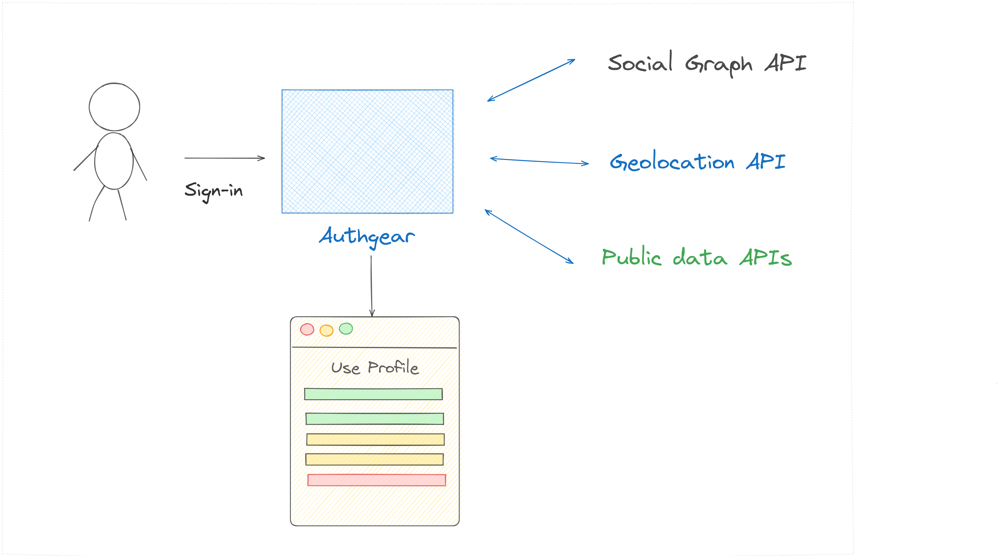
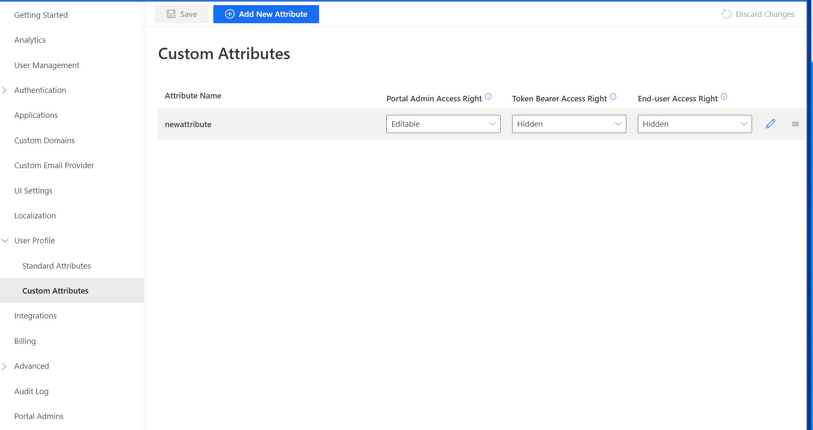
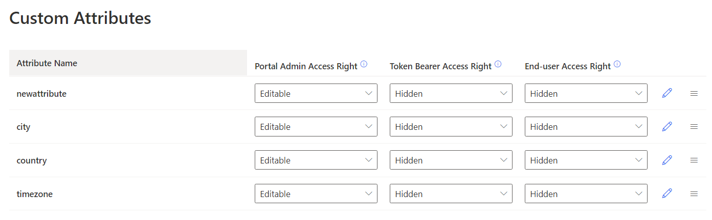
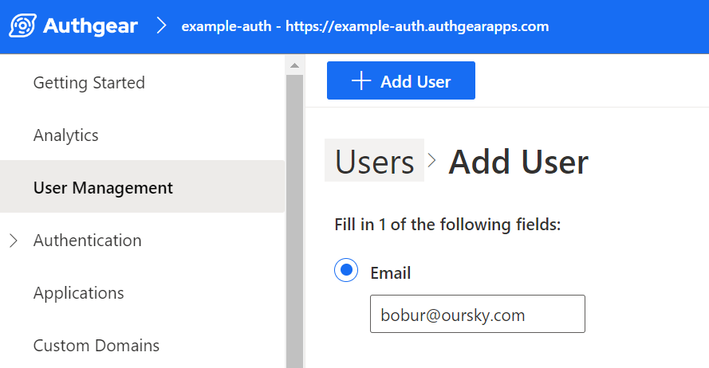
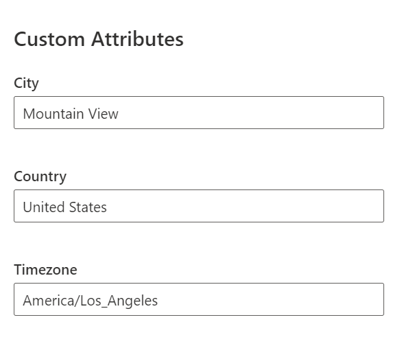

Sometimes, your business may need more details about your users than what they provide when they first sign up or log in. But how do you get these details? It wouldn't be good to keep asking your users for the same information every time they log in, as that would make their experience **less enjoyable**. Also, it's not practical or efficient for someone in your company to search for and add extra information to each user's profile manually. In such cases, the **Profile Enrichment** method can help in finding and adding information that is publicly available to a user's profile.

In this post, we'll explore how enriching user profiles work, their benefits, and how you can enable it using <a href="/" target="_blank">Authgear</a> to boost your product usage by understanding who your customers are.

## What is Profile Enrichment?

Profile enrichment, as the name suggests, means making your current customer data better by adding more details from **outside sources**. It's all about bringing in extra information about your customers from other places and mixing it with the basic data you already have. For example, when a user logs in or during the sign-up process, you can request public <a href="https://ip-api.com/" target="_blank">Geolocation API</a> to capture more information about the user’s country, city, or time zone by using their IP address.

## Boosting product value with Profile Enrichment

There are a lot of benefits of using profile enrichment practice, here are some of them you might think of:

1. **Personalization**: Personalization is more than just a trend – it's a necessity in the current business environment. For instance, if you know your customer's job titles or the industry they work in, you can create hyper-personalized communication and experiences that speak directly to their needs and interests.
1. **Increased Customer Engagement**: Profile enrichment provides deeper insights into user behaviors, preferences, and lifestyles. These insights can then be used to create strategies that will increase user engagement. This might include sending personalized emails, displaying relevant product recommendations, or designing user interface enhancements based on user behaviors and preferences.
1. **Better Segmentation**: With enriched user profiles, segmentation becomes more accurate and insightful. Companies can segment users based on their demographic information, behavior, interests, or preferences. This enhanced segmentation can lead to more effective marketing campaigns, improved user experience, and ultimately, higher conversion rates.
1. **Improved Customer Retention**: Understanding your customer is key to retaining them. Profile enrichment offers a deeper understanding of your users, allowing you to proactively address issues, predict future behavior, and offer products or services tailored to their needs, leading to increased customer satisfaction and loyalty.

<!--FIGURE--><!--/FIGURE-->

## How to enable profile enrichment with Authgear?

For profile enrichment with Authgear, you create a <a href="https://docs.authgear.com/integrate/events-hooks/denohooks" target="_blank">Hook</a> that could call an external API such as <a href="https://www.fullcontact.com/" target="_blank">FullContact</a> and <a href="https://clearbit.com/" target="_blank">Clearbit</a> to grab some data and then put any extra information into the User Profile that every user gets when they sign up through Authgear. You could also integrate that data with the profile custom attributes of existing users who are logging in but are missing that information.

Hooks are snippets of code in **JavaScript / TypeScript** that run at specific <a href="https://docs.authgear.com/integrate/events-hooks/event-list" target="_blank">Events</a> in the identity workflow, such as when the user logs in or signs up for an account or updates their profile a new event is triggered.

By default, Authgear has <a href="https://docs.authgear.com/integrate/user-profile#standard-attributes" target="_blank">standard attributes</a> which contain basic info, such as name, email, and timestamp of the user's latest login, in pre-defined attributes of <a href="https://openid.net/specs/openid-connect-core-1_0.html#StandardClaims" target="_blank">OIDC specification</a>. See the full list of attributes <a href="https://docs.authgear.com/integrate/user-profile#standard-attributes" target="_blank">here</a>. You can access user profiles in <a href="https://docs.authgear.com/how-to-guide/integration/access-user-profiles" target="_blank">different ways</a> and you <a href="https://docs.authgear.com/integrate/user-profile#add-new-attributes" target="_blank">add new attributes</a> to the custom attributes section both in the <a href="https://portal.authgear.com/" target="_blank">Authgear</a> and programmatically using Hooks.

<!--FIGURE--><!--/FIGURE-->

## Example of profile enrichment with Authgear

Suppose you wanted to gather more detailed information about your users than the basic details they gave when they first registered for their accounts. In this case, you could use a Hook. This Hook could activate right after a user creates an account (using <a href="https://docs.authgear.com/integrate/events-hooks/event-list#user.pre_create" target="_blank">user.pre_create</a> event), and it would link to location data APIs to collect more demographic data about them: city, country, and timezone. This Hook would then put this extra information into the **user's profile custom attributes**. Here are easy steps on how to achieve this:

Step 1. Make sure that you have an Authgear account. If you don't have one, you can <a href="https://accounts.portal.authgear.com/signup" target="_blank">create it for free</a> on the Authgear website. Start by logging into your <a href="https://portal.authgear.com/" target="_blank">Authgear dashboard</a>. This is your command center for managing authentication for your apps.

Step 2. Go to **User Profile** → **Custom Attributes** page.

Step 3. Add 3 new attributes there, namely *city*, *name*, and *timezone*:

<!--FIGURE--><!--/FIGURE-->

Step 4. Navigate to your Authgear Dashboard's **Advanced**->**Hooks** section.

Step 5.**Add** a new **Blocking Event**.

Step 6. Choose the Block Hook **Type** as the *TypeSctipt* and set the Event option to *User* *pre-create*. You will write a new             Typescript function from scratch.

Step 7. Click on **Edit Script** under the **Config** option.

Step 8. Write a function logic for how you integrate any external API to populate custom attributes into the editor. For example.

```

export default async function(e: EventUserPreCreate): Promise
			<hookresponse> {
  // API Key for IP Geolocation
  const apiKey = 'MY_API_KEY';
  // Any random IP address
	const ipAddress = '8.8.8.8' 

  // Fetch data from the IP Geolocation API
  const response = await fetch(`https://api.ipgeolocation.io/ipgeo?apiKey=${apiKey}&ip=${ipAddress}`);
  const data = await response.json();

return {
    is_allowed: true,
    mutations:{
      user: {
          custom_attributes: {
            "city": data.city, 
            "country": data.country_name,
            "timezone": data.time_zone.name
        }
      }
    },
  };
}
  
			</hookresponse>
```

Step 9. Now if you navigate to **User Management** and **Add** a new user.

<!--FIGURE--><!--/FIGURE-->

Step 10. After the user is created, you should able to see custom attributes values have been updated for the user:

<!--FIGURE--><!--/FIGURE-->

## Progressive Profiling

Asking for too much information all at once can overwhelm users. **Progressive profiling** is another smart way to learn more about your customers. Rather than bombarding your users with lots of questions when they **first sign up**, you simply ask them a couple of questions each time they log in or update their user profile. Using progressive profiling with Authgear makes things better for your users by making sign-up forms shorter, not asking the same questions over and over, gathering more useful information, and helping more users complete sign-up.

## Summary

Profile Enrichment, when used effectively, can offer significant benefits to businesses. It enables deeper connections with customers, leading to improved user experiences, more effective marketing, and increased customer loyalty.

### Related resources

- <a href="/post/authentication-as-a-service" target="_blank">Authentication-as-a-Service: What Is It and Why You Need It</a>
- <a href="/post/frictionless-authentication" target="_blank">Frictionless Authentication: What Is It & How To Implement It?</a>

### Recommended content

- <a href="/post/simplifying-authentication-integration-with-authgear-sdks" target="_blank">Simplifying Authentication Integration For Developers With Authgear SDKs</a>
- <a href="/post/social-login-guide" target="_blank">Social Login - Why You Should Implement It</a>
