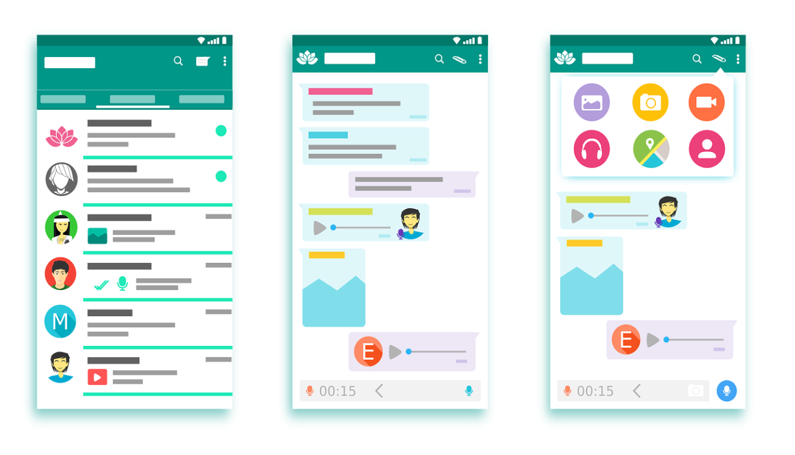

SMS was once the main channel through which businesses communicate with their customers. Businesses can send OTPs, promotional messages, transactional messages, and other information to their customers through SMS. However, the invention of messenger apps and their growing popularity have made businesses change how they interact with their customers. Marketers have noticed the rise of messenger apps and begun to leverage their popularity to get closer with their prospects or customers. Among all the messenger apps, WhatsApp is the most popular one with India, Brazil, and the United States as the Top 3 WhatsApp countries ranked by largest audiences.

Despite its popularity, not a lot of businesses have made the most of WhatsApp Business, which is an app designed to help businesses of all sizes to drive sales and provide better customer support. In this blog post, we will be discussing:

<nav id="table-of-content">
    <ul>
        <li><a href="#why-whatsapp">Why Should You Do Marketing on WhatsApp?</a></li>
        <li><a href="#benefits">How Can You Benefit From WhatsApp Marketing?</a></li>
        <li><a href="#whatsapp-features">What Features Does Whatsapp Have That Can Help You Achieve Your Marketing Goals?</a></li>
        <li><a href="#authgear-whatsapp">Begin your WhatsApp Marketing with OTP</a></li>
    </ul>
</nav>

<h2 id="why-whatsapp">Why Should You Do Marketing on WhatsApp?</h2>

<!--FIGURE--><!--/FIGURE-->

Consumers nowadays rely heavily on messenger apps for communication now since they are not only cheaper and more stable but also come with more features, such as the ability to send videos, images and create group chats, with which the traditional SMS cannot compete.

As of 2022, WhatsApp has approximately 2 billion active monthly users. The sheer audience size makes it impossible for marketers to ignore. Furthermore, marketing on WhatsApp has shown to be more effective than those on other platforms since:

- Messages sent on WhatsApp are read within 3 seconds.
- Customers are 50% more likely to respond to WhatsApp messages.
- The 70% click-through rate on WhatsApp is superior to those on other platforms.

Last but not least, 53% of consumers now trust brands more if they can easily reach the companies via chat since chats are considered the fastest and most personalized channel of communication.

*Check out the latest*<a href="https://jooble.org/jobs-digital-marketing" target="_blank">*digital marketing jobs on Jooble*</a>*.*

<h2 id="benefits">How Can You Benefit From WhatsApp Marketing?</h2>

### Build Stronger Relationships with Customers

Consumers now feel that they are more connected to brands if they use messaging apps. Brands can establish more profound relationships with their customers on WhatsApp because they can set up automated responses, reply faster, and even interact with customers in more creative ways. This then translates into customer loyalty and retention.

### Improve Conversion Rate and Boost Sales Leads

Although consumers often dread those phone calls from customer services, they are more likely to open and even respond to messages on WhatsApp, making it easier for brands to reach their customers. Moreover, as brands establish closer relationships with their customers, they tend to make more purchases and even help businesses generate more leads when they become brand advocates.

### Significantly Reduce Marketing Cost

The cost per message sent on WhatsApp is certainly much lower than the cost of SMS and marketing on WhatsApp has been proven to be more effective than SMS or email marketing. Furthermore, more frequent and closer engagements with customers enabled by WhatsApp allow brands to increase their customer retention rate. As we know, acquiring a new customer can be five times more expensive than retaining an existing one.

<h2 id="whatsapp-features">What Features Does Whatsapp Have That Can Help You Achieve Your Marketing Goals?</h2>

WhatsApp Business comes with some messaging tools that allow businesses to up their games and help customers learn more about their products or services in a clear and organized way.

### Auto Greeting & Away Messages

Customer service may not always be available, making automation a key component of good customer experience. Businesses can enable auto greeting messages that will be sent to new customers when they first message you or after 14 days of inactivity. Away messages can also be set up that will be set outside of business hours. Businesses can even schedule away messages based on their needs. These auto-messages can help them set expectations for response times or remind inactive customers to increase the retention rate.

### Quick Replies

<a href="https://ninjachat.com/customer-service-tool-types" target="_blank">Customer service</a> can easily get overwhelmed by incoming customer questions and a lot of them are often repeated. WhatsApp Business allows businesses to create and store quick replies that can be sent by typing and selecting the specific keyword shortcuts.

<!--FIGURE--><!--/FIGURE-->

WhatsApp OTP allows businesses to not only improve user experience but also increase conversion rates, reduce the cost of drip campaigns, and enjoy all the aforementioned benefits of WhatsApp Business.

### Save at Least $10,000 Annually with WhatsApp OTP

For local businesses, sending OTPs through SMS is still quite common; however, the flat rate of SMS can be quite high and subject to changes. The monthly SMS OTP cost can also skyrocket once the number of your active users grows exponentially, making it a financial burden for businesses.

By switching SMS to WhatsApp, you can send OTP on WhatsApp for as low as $20/month with Authgear, saving at least $10,000 annually for a monthly login number of 30,000.

### Reduce Cost of Your Drip Campaigns by 60% with User-Initiated WhatsApp OTP Verification

Authgear’s WhatsApp OTP process is designed for users to initiate the conversation. After users enter their WhatsApp numbers, the system will generate an OTP and then ask them to send it on WhatsApp for verification. With WhatsApp’s recent update on <a href="https://developers.facebook.com/docs/whatsapp/pricing/" target="_blank">conversation-based pricing</a>, you can then reduce the cost of your drip campaign by at least 60% since user-initiated conversations are much cheaper than business-initiated ones.

### Increase Your App Conversion Rate with WhatsApp OTP

The dropout rate of your signup form can be as high as 60% because users are so tired of registering with username and password. With WhatsApp OTP, your users can sign up for your apps without all the friction caused by password-based authentication, helping you increase conversion rate and enhance security.

Learn more about our WhatsApp OTP<a href="/features/whatsapp-otp" target="_blank"> here</a> or <a href="/talk-with-us" target="_blank">contact us</a> directly to see how you can significantly benefit from integrating your apps with Authgear.
