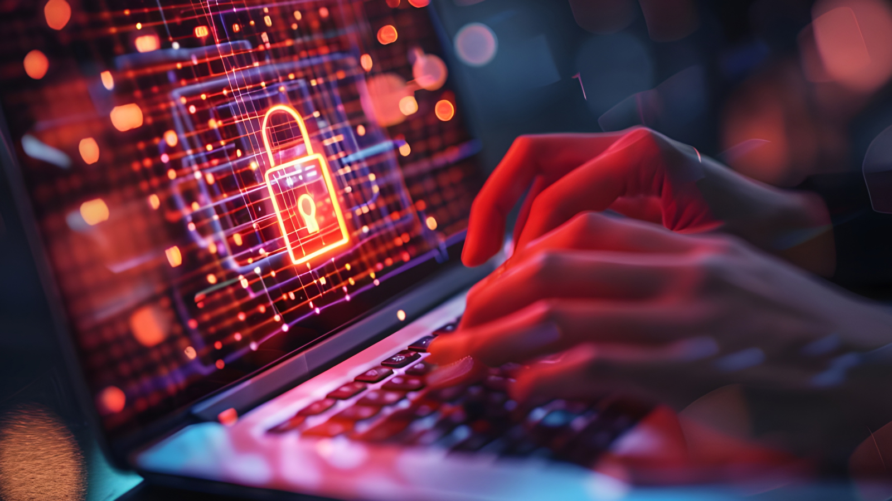

Passkeys represent a significant leap forward, replacing outdated login methods like passwords with a more secure and user-friendly approach. By embracing passkeys, you can effectively safeguard your digital identity and sensitive information.

Remember the last time you spent agonizing minutes trying to recall a complex password, only to find yourself locked out of your account? Or worse, the sinking feeling when you realize you've fallen victim to a data breach, exposing your personal information? For decades, passwords have been our primary defense against unauthorized access to our digital lives. But their time may be coming to an end.

The tides are turning in online security with the emergence of passkeys. This revolutionary authentication method, championed by tech giants like Google, Apple, and Microsoft, is poised to become the new industry standard. Unlike passwords, which are vulnerable to compromise, passkeys utilize advanced cryptography and biometric authentication to offer a more secure, convenient, and user-friendly way to protect your online accounts.

## Understanding Passkeys: The Key to a Password-Free Future

<!--FIGURE--><!--/FIGURE-->

Passkeys represent a significant leap forward in authentication technology. Unlike passwords, which are essentially guessable strings of characters, passkeys are cryptographic keys tied to specific devices and user account. This means that instead of remembering a complex password, you can authenticate yourself using a biometric (like your fingerprint or facial recognition) or a simple PIN.

**How do passkeys work?**

- **Public-key cryptography:** Passkeys utilize a pair of cryptographic keys: a public key and a private key. The public key is shared with the service you're trying to access and it doesn’t need to be protected while the private key remains securely stored on your device.****
- **Device-based authentication:** When you attempt to log in, your device generates a cryptographic challenge. The service then uses your public key to verify the response, ensuring that only the device with the corresponding private key can access the account.

**Benefits of Passkeys**

- **Stronger security:** Passkeys are inherently more secure than passwords as they are resistant to phishing, brute-force and replay attacks, and credential stuffing.
- **Easier to use:** No more complex passwords to remember or manage. Biometric or PIN authentication provides a seamless and convenient login experience.
- **Improved user experience:** Passkeys seamlessly sync, allowing you to log in with ease on any authorized device. This eliminates the frustration of remembering complex passwords and simplifies the login process.****
- **Platform independence:** Passkeys can be used across different devices and platforms, providing a consistent authentication experience.

By understanding these core principles, you can appreciate the transformative potential of passkeys in enhancing online security and user experience.

## Password Pitfalls: Why It's Time to Ditch the Digital Keys

<!--FIGURE--><!--/FIGURE-->

For decades, passwords have been our primary defense against unauthorized access to our online accounts. However, their limitations are becoming increasingly apparent. Let's delve into the vulnerabilities associated with passwords and understand why they are no longer sufficient in today's digital landscape.

- **Weak passwords:** Many users opt for easy-to-remember but easily guessable passwords, such as birthdays, pet names, or common words. These passwords can be cracked with relative ease by cybercriminals.
- **Password reuse:** The habit of using the same password across multiple accounts is a prevalent security risk. If one account is compromised, all other accounts using the same password are at risk.
- **Phishing attacks:** Cybercriminals often employ phishing tactics to trick users into revealing their passwords. These attacks can be highly effective, leading to significant data breaches.
- **Data breaches:** The increasing frequency of data breaches exposes millions of passwords to the dark web, making them vulnerable to exploitation.

The consequences of password-related security breaches can be severe, ranging from identity theft and financial loss to reputational damage for businesses. It's clear that passwords, while once considered a reliable security measure, are now a significant liability.

## Passkey vs Password: A Head-to-Head Showdown

Now that we've explored the vulnerabilities of passwords, let's compare them directly to the emerging technology of passkeys.

<table>
    <thead>
        <tr>
            <th>Feature</th>
            <th>Password</th>
            <th>Passkey</th>
        </tr>
    </thead>
    <tbody>
        <tr>
            <td>Security</td>
            <td>Weak, susceptible to breaches</td>
            <td>Strong, resistant to phishing and brute-force attacks</td>
        </tr>
        <tr>
            <td>Usability</td>
            <td>Difficult to remember, prone to errors</td>
            <td>Convenient, biometric or PIN-based authentication</td>
        </tr>
        <tr>
            <td>Convenience</td>
            <td>Requires password managers, autofill</td>
            <td>No need for password managers, seamless login with supports from major platforms (iOS, Android, Windows)</td>
        </tr>
        <tr>
            <td>Cost</td>
            <td>Often free, but password managers can be costly</td>
            <td>Potentially integrated into operating systems or devices</td>
        </tr>
    </tbody>
</table>

As you can see, passkeys offer significant advantages over traditional passwords in terms of security, usability, and convenience. By shifting the focus from remembering complex passwords to utilizing device-based authentication, passkeys provide a more robust and user-friendly solution for protecting your online accounts.

## The Future of Authentication: A Passwordless World

<!--FIGURE--><!--/FIGURE-->

The writing is on the wall: passwords are on their way out. As passkey technology continues to mature and gain wider adoption, we're inching closer to a passwordless future.

- **Industry-wide adoption:** Major tech companies and online platforms are increasingly embracing passkeys as a more secure and user-friendly alternative to passwords. This growing support will accelerate the transition to a passwordless ecosystem.
- **Overcoming challenges:** While passkeys offer significant advantages, challenges such as device compatibility and user education need to be addressed to ensure widespread adoption.****
- **Beyond authentication:** Passkeys have the potential to revolutionize not only login processes but also other areas of digital security, such as secure payments and data sharing.

## Unlock a Safer Digital Future with Passkeys

The future of authentication is bright, with passkeys at the forefront of driving innovation. By embracing this technology, we can create a more secure and convenient digital experience for everyone.

The era of passwords is drawing to a close. As we've explored, passkeys offer a significantly more secure, convenient, and user-friendly alternative. By understanding the vulnerabilities of passwords and the advantages of passkeys, we can collectively drive the transition to a passwordless future.

While passkey adoption is still in its early stages, the potential benefits are undeniable. As major tech companies and platforms continue to invest in this technology, we can expect to see rapid growth and widespread implementation in the coming years.

[Learn more and join the movement towards a password-free world!](/features/passkeys)
