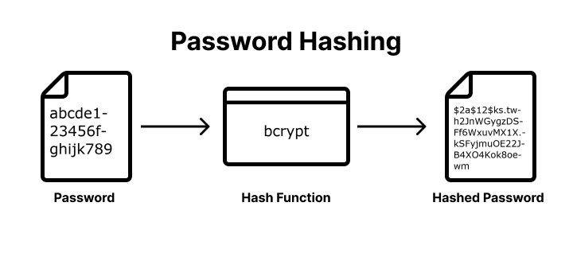

  
 
 > TL;DR:  
> Password salting is a security method that strengthens password protection by adding unique, random data (a "salt") to a password before it is hashed. This ensures that every password hash stored in a database is unique, effectively defending against attacks that use precomputed tables, such as rainbow table attacks.

<nav> Table of Content
    <ul>
        <li style="margin-top:15px"><a href="#salting">What Is Salting in Security?</a></li>
        <li><a href="#how-does-salting-work">How Does Salting Work?</a></li>
        <li><a href="#how-does-salting-improve-password-security">How Does Salting Improve Password Security?</a></li>
        <li><a href="#what-are-the-password-salting-best-practices">What are the Password Salting Best Practices?</a></li>
    </ul>
</nav>

<h2 id="salting">What Is Salting in Security?</h2>

<!--FIGURE--><!--/FIGURE-->

Salting in security is the practice of adding unique, random data (a "salt") to each user's password before it is hashed and stored. The technical workflow involves generating a cryptographically secure random salt, combining it with the user's input, and hashing the pair to create a unique digital fingerprint for future verification. This method improves security by neutralizing rainbow table attacks, protecting duplicate passwords from sharing the same hash, and forcing attackers to crack accounts individually. For robust implementation, best practices require using unique per-user salts of at least 16 bytes paired with modern algorithms and defense-in-depth techniques like peppering.

<h2 id="how-does-salting-work">How Does Salting Work?</h2>

Salting is a security technique that adds unique, random data to a password before hashing to ensure every stored credential has a unique digital fingerprint.

There are 5 steps in this technical workflow:  
**Step 1: Generating the Salt**

**Step 2: Combining Password and Salt**

**Step 3: Hashing the Combined String**

**Step 4: Storing the Salt and Hash**

**Step 5: User Verification**

### Step 1: Generating the Salt

Use a Cryptographically Secure Random Number Generator (CSPRNG) to create a unique, random string for each user account. This ensures the salt is unpredictable and statistically unique, preventing attackers from using precomputed data across different users.

### Step 2: Combining the Password and Salt

Combine the random salt with the user’s plain-text password by prepending or appending the salt string to the password. This combination creates a unique input for the hashing function, even if the password itself is common.

### Step 3: Hashing the Combined String

Process the combined salt-password string through a one-way, memory-hard hashing function such as Argon2id, bcrypt, or scrypt. This transformation produces a fixed-length salted hash that is computationally expensive to reverse or brute-force. You can see how different algorithms handle this by using our [Password Hash Generator](/tools/password-hash-generator).

### Step 4: Storting the Salt and Hash

Save both the resulting salted hash and the plain-text salt in the user’s database record. The salt does not need to be encrypted or hidden. Its primary function is to provide the unique key necessary to re-generate the same hash during future authentication attempts.

### Step 5: User Verification

Retrieve the stored salt from the database, combine it with the password provided during login, and run the combination through the same hashing algorithm. If the newly generated hash matches the salted hash stored in the database, the user is verified.

<h2 id="how-does-salting-improve-password-security">How Does Salting Improve Password Security?</h2>

Salting improves password security by adding unique, random data to each password before it is hashed, which prevents attackers from using precomputed tables or identifying identical credentials within a leaked database. This technique enhances protection by defeating rainbow table attacks, forcing unique hashes for duplicate passwords, increasing the computational cost for hackers, and mitigating dictionary and brute force attacks.

### Prevents Rainbow Table Attacks

Rainbow tables are massive, precomputed databases of hashes for millions of common passwords used to reverse-engineer stolen data instantly. Salting makes these tables ineffective because an attacker would need to generate a new, unique rainbow table for every specific salt used in the database, which is computationally impossible.

### **Mitigates Dictionary and Brute Force Attacks**

By appending a random string to the user's input, salting ensures that even common dictionary words do not match their standard hashed equivalents. This protects users with weaker passwords by ensuring their credentials do not appear as "low-hanging fruit" during automated dictionary or brute-force attempts.

### **Protects Duplicate Passwords**

Identical passwords result in identical hashes, allowing attackers to immediately identify every user who shares a common password like "123456." Salting ensures that if two users share the same password, their stored hashes are completely different, preventing a single cracked password from compromising multiple accounts.

### **Increase Computational Cost**

Salting removes the ability for hackers to attack an entire database in bulk. Instead of running a single attack against all stored credentials, attackers are forced to brute-force each account individually, exponentially increasing the time, processing power, and financial resources required to crack the data.

<h2 id="what-are-the-password-salting-best-practices">What are the Password Salting Best Practices?</h2>

Password salting best practices require generating a unique, cryptographically secure random salt for every user that is at least 16 bytes long and stored alongside the hashed password. Effective implementation includes using unique per-user salts, ensuring sufficient salt length, utilizing modern hashing algorithms, practicing proper storage, avoiding predictable values, and implementing password peppering for defense-in-depth.

### **Unique Per-User Salt**

Every account must have its own unique salt generated during registration or password changes. Never use a "site-wide" or "static" salt, as this allows attackers to use precomputed tables against your entire database. Unique salts ensure that even if two users choose the same password, their stored hashes will be completely different.

### **Sufficient Length**

A salt must be long enough to ensure high entropy and prevent brute-force attacks against the salt itself. Industry standards recommend a minimum length of 16 bytes (128 bits), generally matching the output size of the hashing function used.

### **Modern Hashing Algorithms**

Salting is most effective when paired with modern, slow, and memory-hard hashing algorithms like **Argon2id (recommended), bcrypt, or scrypt**. These algorithms are designed to resist high-speed cracking attempts from GPUs and ASICs, whereas fast hashes like MD5 or SHA-256 are no longer adequate for password storage.

### **Proper Storage**

Store the salt in plain text in the same database table and row as the password hash. Salts do not need to be kept secret, their security value comes from being unique and random. Storing them with the hash ensures they are easily retrieved by the application during the login verification process.

### **Avoid Predictable Values**

Never use usernames, email addresses, or other static user data as salts, as these are easily guessable by attackers. Always use a **Cryptographically Secure Pseudo-Random Number Generator (CSPRNG)** to create salts, ensuring they are truly random and unpredictable.

### **Password Peppering**

For an additional layer of security, implement a password pepper, which is a secret key stored separately from the database (e.g., in a secure vault or environment variable). Unlike a salt, the pepper is not stored with the hash. If the database is compromised, the pepper provides a final line of defense because the attacker lacks the secret value required to verify the hashes.

</head>
<body>
  <table>
    <thead>
      <tr>
        <th>Feature</th>
        <th>Password Salt</th>
        <th>Password Pepper</th>
      </tr>
    </thead>
    <tbody>
      <tr>
        <td>Storage</td>
        <td>Database (Per-user)</td>
        <td>Config/Vault (Site-wide)</td>
      </tr>
      <tr>
        <td>Uniqueness</td>
        <td>Unique to every account</td>
        <td>One secret key for all accounts</td>
      </tr>
      <tr>
        <td>Security Goal</td>
        <td>Neutralizes Rainbow Tables</td>
        <td>Protects if the Database is leaked</td>
      </tr>
    </tbody>
  </table>
</body>
</html>

	<h2 class="title cta-split-content-left">Better Password Security with Authgear</h2>
  
No longer have to worry about password salting and  hashing

  <a href="/talk-with-us" target="_blank" class="w-inline-block">
  	
Get Demo

<h2 id="article-cta-section">Let Authgear Manage Your User's Passwords</h2>

With Authgear, your users’ passwords will be well secured by industry-standard mechanisms.

Authgear uses Argon2id to salt and hash users' passwords. Moreover, your app will also be equipped with all the security features you need to provide not only better security but also smoother user experience to gain a competitive advantage.

[Contact us](/schedule-demo) now to see how Authgear can help you increase user conversion rate, reduce cost, and provide better user experience.

## Frequently asked questions

## Is salting the same as hashing?

No. **Hashing** is a one-way transformation used to verify passwords without storing them in plain text. **Salting** adds a unique random value to each password before hashing so identical passwords produce different hashes.

### Do I still need a salt when using bcrypt?

Modern bcrypt implementations generate and store a unique salt automatically with the hash. You don’t need to manage salts yourself, but you should understand why salting prevents rainbow-table attacks.

### What’s a “pepper” and where should I store it?

A **pepper** is an application-wide secret added in addition to the per-user salt. Store the pepper separately from the database (e.g., in a KMS/HSM or environment secret), never alongside the hash.

### Which password hashing algorithm should I use in 2025?

Prefer **Argon2id** for general use because it’s memory-hard. Use **PBKDF2** when you must meet FIPS/NIST requirements. Keep **bcrypt** only for legacy systems or where Argon2id is unavailable.

### What are safe Argon2id parameters?

A good starting point is roughly **m ≈ 19–64 MiB**, **t = 1–3**, **p = 1**. Tune to your hardware so a single verification stays comfortably under ~1 second on your production boxes, then revisit periodically.

### Is SHA-256 or SHA-3 alone OK for passwords?

No. General-purpose hashes are too fast for password storage. Use a dedicated password hashing/KDF algorithm such as **Argon2id**, **scrypt**, **bcrypt**, or **PBKDF2**.

### How long should a salt be?

Use a unique, random salt per password, typically **16–32 bytes (≥128 bits)** from a CSPRNG.

### **Where do I store the salt?**

Store the salt with the hash (e.g., in the same database row or encoded in the hash string). It is not secret and must be available during verification.

### What about the bcrypt 72-byte input limit?

bcrypt only considers the first ~72 bytes of input. Enforce a reasonable maximum length and/or migrate to **Argon2id**. If you must pre-hash, use an HMAC with a server-side pepper and store the pepper separately.

### How do I migrate from bcrypt/PBKDF2 to Argon2id?

Use **opportunistic rehashing**: verify existing users with the old algorithm, then on successful login, rehash the password with Argon2id and update the stored record. Keep both verifiers during the transition.

### When should I rehash existing passwords?

Rehash when your algorithm choice or parameters are no longer considered adequate (e.g., after you raise Argon2id memory/time settings or move from bcrypt to Argon2id). Track a “hash version” with each account.

### What’s the difference between hashing and encryption for passwords?

**Hashing** is one-way and designed for verification. **Encryption** is reversible and intended for data you must read back. Passwords should be hashed, not encrypted.

