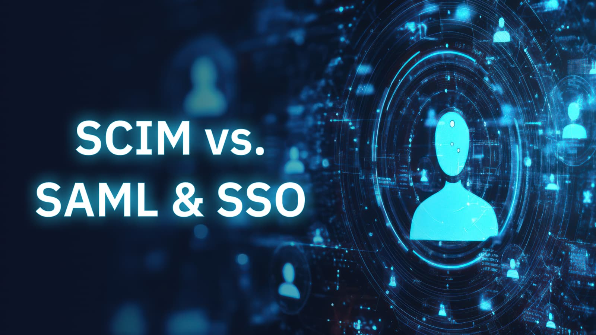

In today's fast-paced digital world, efficient user management is crucial for businesses of all sizes. **SCIM provisioning** offers a streamlined solution for automating the process of creating, updating, and deleting user accounts across various applications and systems. By leveraging the SCIM protocol, organizations can significantly reduce manual effort, improve security, and enhance overall productivity.

This comprehensive guide will delve into the intricacies of SCIM provisioning, exploring its definition, how it works, the benefits it offers, and how it compares to other authentication methods like SAML and SSO. Additionally, we'll discuss the key differences between just-in-time provisioning and SCIM provisioning.

## What is SCIM Provisioning: A Simplified Overview

<!--FIGURE--><!--/FIGURE-->

**SCIM**is a standardized protocol designed to automate the management of user accounts across different applications and systems. It provides a common language and framework for exchanging user data, ensuring seamless integration and reducing the administrative burden associated with manual provisioning.

### When do you need SCIM provisioning?

SCIM provisioning is particularly valuable for organizations that:

- **Manage multiple applications:** If your business utilizes a variety of software solutions, manually creating and updating user accounts in each system can be time-consuming and error-prone. SCIM provisioning automates this process, saving valuable resources.
- **Have a large number of users:** For organizations with a substantial user base, managing user accounts manually can be overwhelming. SCIM provisioning streamlines the process, ensuring that user information is consistently updated across all systems.
- **Require a high level of security:** SCIM provisioning can help enhance security by reducing the risk of human error and ensuring that user data is synchronized accurately.****
- **Want to improve user experience:** By automating the provisioning process, SCIM provisioning can provide a smoother onboarding experience for new users and minimize disruptions caused by account management issues.

## How SCIM Works: Understanding the Protocol

The **SCIM (System for Cross-domain Identity Management) protocol** defines a standard set of APIs that allow applications to exchange user data. It provides a common language for describing user attributes, groups, and roles, enabling seamless integration between different systems.

### SCIM provisioning typically involves the following steps:

1. **User Creation:** When a new user is created in a source application, the application sends a SCIM API request to the target application, providing the necessary user information.
1. **User Update:** If a user's information changes (e.g., email address, role), the source application sends a SCIM API update request to the target application, updating the corresponding user record.****
1. **User Deletion:** When a user is deleted from the source application, a SCIM API delete request is sent to the target application, removing the user's account.

### SCIM Example Use Case:

Imagine a company that uses a cloud-based HR system and a SaaS-based project management tool. With SCIM provisioning, when a new employee is added to the HR system, their user account can be automatically created in the project management tool. This eliminates the need for manual provisioning and ensures that the employee has access to the necessary tools from day one.

## Benefits of SCIM Provisioning

<!--FIGURE--><!--/FIGURE-->

SCIM provisioning offers numerous advantages for organizations of all sizes. By automating user account management, SCIM can:

- **Reduce administrative overhead:** SCIM eliminates the need for manual provisioning, saving time and resources.
- **Improve accuracy:** SCIM ensures that user data is consistent across all systems, reducing the risk of errors.
- **Enhance security:** SCIM can help improve security by automating the provisioning process and reducing the risk of unauthorized access.
- **Streamline onboarding and offboarding:** SCIM can automate the creation and deletion of user accounts, making the onboarding and offboarding process more efficient.
- **Increase scalability:** SCIM can easily handle large numbers of users and systems, making it a scalable solution for growing organizations.****
- **Improve user experience:** SCIM can provide a smoother onboarding experience for new users and minimize disruptions caused by account management issues.

## SCIM vs. SAML & SSO: A Comparative Analysis

<!--FIGURE--><!--/FIGURE-->

**SCIM, SAML, and SSO** are all important technologies for identity and access management, but they serve different purposes.

- **SCIM** (System for Cross-domain Identity Management) is a protocol for automating the provisioning of user accounts across different applications and systems.
- **SAML** (Security Assertion Markup Language) is a standard for exchanging authentication and authorization data between different systems.  ****
- **SSO** (Single Sign-On) is a mechanism that allows users to log in to multiple applications with a single set of credentials.

<table>
    <thead>
        <tr>
            <th><b>Feature</b> </th>
            <th><b>SCIM</b> </th>
            <th><b>SAML</b> </th>
            <th><b>SSO</b></th>
        </tr>
    </thead>
    <tbody>
        <tr>
            <td>Purpose</td>
            <td>User account provisioning</td>
            <td>Authentication and authorization data exchange</td>
            <td>Single sign-on</td>
        </tr>
        <tr>
            <td>Focus</td>
            <td>User data management</td>
            <td>Identity federation</td>
            <td>Access control</td>
        </tr>
        <tr>
            <td>Technology</td>
            <td>Protocol</td>
            <td>XML-based standard</td>
            <td>Authentication mechanism</td>
        </tr>
        <tr>
            <td>Typical Use Cases</td>
            <td>Automating user account creation, updates, and deletions</td>
            <td>Enabling federated authentication across different systems</td>
            <td>Providing a single login experience for users</td>
        </tr>
        <tr>
            <td><b>Complexity</b></td>
            <td>Moderate</td>
            <td>High</td>
            <td>Moderate</td>
        </tr>
        <tr>
            <td><b>Security</b></td>
            <td>Good</td>
            <td>High</td>
            <td>High</td>
        </tr>
        <tr>
            <td><b>Scalability</b></td>
            <td>Good</td>
            <td>Good</td>
            <td>Good</td>
        </tr>
        <tr>
            <td><b>Integration</b></td>
            <td>Easy with supported applications</td>
            <td>Requires configuration and support from both the identity provider and service provider</td>
            <td>Requires integration with the identity provider and service provider</td>
        </tr>
        <tr>
            <td><b>Cost</b></td>
            <td>Depends on implementation</td>
            <td>Depends on implementation</td>
            <td>Depends on implementation</td>
        </tr>
    </tbody>
</table>

While SCIM is primarily concerned with user account management, SAML and SSO focus on authentication and access control. In many cases, SCIM can be used in conjunction with SAML and SSO to provide a complete identity and access management solution.

## Just-in-Time Provisioning vs. SCIM Provisioning: A Comparison

<!--FIGURE--><!--/FIGURE-->

**Just-in-time provisioning** and **SCIM provisioning** are both methods for automating user account management, but they differ in their approach.

<table>
    <thead>
        <tr>
            <th><b>Feature</b> </th>
            <th><b>Just-in-Time Provisioning</b> </th>
            <th><b>SCIM Provisioning</b> </th>
        </tr>
    </thead>
    <tbody>
        <tr>
            <td><b>Timing</b></td>
            <td>Accounts are created only when a user accesses a system for the first time.</td>
            <td>Accounts can be created proactively or reactively based on user data changes.</td>
        </tr>
        <tr>
            <td><b>Scope</b></td>
            <td>Typically limited to a single application.</td>
            <td>Can be used to manage accounts across multiple applications.</td>
        </tr>
        <tr>
            <td><b>Automation</b></td>
            <td>Often requires manual configuration.</td>
            <td>Provides a standardized framework for automated provisioning.</td>
        </tr>
        <tr>
            <td><b>Efficiency</b></td>
            <td>Can be less efficient for frequent users.</td>
            <td>Can be more efficient for large organizations with multiple applications.</td>
        </tr>
        <tr>
            <td><b>Security</b> </td>
            <td>Can reduce the risk of unauthorized access.</td>
            <td>Can enhance security by automating the provisioning process.</td>
        </tr>
        <tr>
            <td><b>Cost</b></td>
            <td>May require additional infrastructure or licensing.</td>
            <td>May require additional infrastructure or licensing, but can reduce administrative costs.</td>
        </tr>
    </tbody>
</table>

Just-in-time provisioning is a simple approach that can be effective for small organizations with limited application usage. However, SCIM provisioning offers a more comprehensive and scalable solution for managing user accounts across multiple systems.

## Choosing the Right Provisioning Solution

The choice between just-in-time provisioning and SCIM provisioning depends on your organization's specific needs and requirements. If you have a large number of users and multiple applications, SCIM provisioning can offer significant benefits in terms of efficiency, security, and scalability.

**To learn more about SCIM provisioning and how it can help your organization, please contact Authgear today.** Our experts can provide guidance and support to help you implement the best solution for your user management needs.
