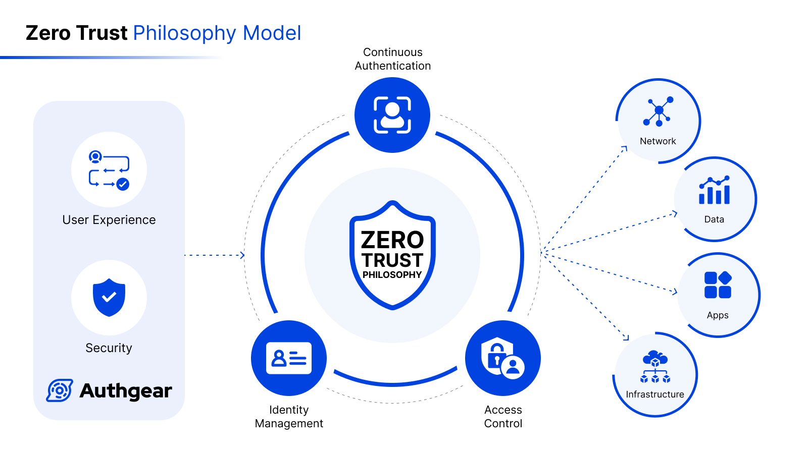

## Securing the Perimeterless: Dive Deep into Zero Trust Architecture with Continuous Authentication

The cost of digital vulnerabilities is staggering. In 2023 alone, cybercrime is estimated to cause **$6 trillion in global damages, a figure expected to balloon to $10.5 trillion by 2025.** Every minute, 117 new records are exposed in data breaches, with the average cost of a breach topping $4 million. Closer to home, **46% of all cyberattacks target businesses with fewer than 1,000 employees,** illustrating the widespread reach of the threat.

These alarming statistics paint a clear picture: **traditional security frameworks are demonstrably failing.**Hackers exploit outdated infrastructure, weak authentication, and human error with alarming ease. The "castle-and-moat" approach is dead; attackers are already inside the walls. This is where Zero Trust Security emerges as a revolutionary paradigm shift, challenging the very foundation of how we secure our data and resources.

By **moving beyond the "trust by default" mentality** and implementing stringent access controls, continuous authentication, and granular data protection, Zero Trust offers a powerful countermeasure against today's sophisticated cyber threats. It's time to move beyond buzzwords and embrace a security philosophy that actively prevents breaches, minimizes damage, and protects your most valuable assets – your data and your people.

## What is Zero Trust? Unveiling Zero Trust: More Than Just a Buzzword

<!--FIGURE--><!--/FIGURE-->

Zero Trust isn't a specific product or technology; it's a philosophy, a new way of thinking about security. It challenges the assumption of trust within the network, even for internal users. Instead, it demands continuous verification and authorization for every access attempt, regardless of location or perceived identity. This creates a dynamic layer of defense that adapts to constantly shifting threats and minimizes the attack surface.

## The Authentication Puzzle Piece: Zero Trust's Importance and Core Principle

<!--FIGURE--><!--/FIGURE-->

Zero Trust hinges on **robust authentication mechanisms.** In the past, a single login at the network edge used to grant access to virtually everything within. Now, every resource requires its own verification checkpoint, ensuring only authorized users with the right context (device, location, time of day) gain access to specific data or applications. This multi-layered approach significantly reduces the risk of lateral movement and data exfiltration, even if an attacker breaches the initial defenses.

## Continuous Authentication: Keeping the Watchful Eye Open

Traditional logins are like static passwords – easily compromised and often ineffective against persistent threats. **Continuous Authentication**elevates Zero Trust to the next level. It employs real-time monitoring and dynamic risk assessments to constantly evaluate user behavior and device posture. This means suspicious activities trigger immediate access revocation, preventing attackers from exploiting stolen credentials or compromised devices.

To implement Continuous Authentication and Authorization, you can follow the steps below.

- Verify identity and access rights continuously: don't rely on single-point-in-time authentication.
- Utilize adaptive authentication: adjust authentication requirements based on risk factors and user behavior.
- Monitor user activity and device posture: detect anomalies and revoke access if necessary.
- Use endpoint security tools: protect devices from malware and unauthorized access.

## Building Your Fortress: Benefits of a Zero Trust Architecture

<!--FIGURE--><!--/FIGURE-->

The advantages of Zero Trust extend far beyond just enhanced data security. Here are some key benefits:

- **Reduced Attack Surface**: By micromanaging access, you shrink the potential target area for attackers, making it harder for them to find vulnerabilities and infiltrate your system.
- **Improved Data Security**: Continuous authentication and granular access controls safeguard sensitive data, minimizing the risk of breaches and unauthorized access.
- **Enhanced User Experience**: Secure access from anywhere, on any device, empowers your workforce and fosters collaboration without compromising security.
- **Simplified Compliance**: Streamlined access management and robust audit trails facilitate compliance with industry regulations and data privacy laws.****
- **Reduced Recovery Costs**: Proactive threat detection and swift access revocation limit the damage from potential breaches, saving time and resources in the aftermath.

## Building Your Zero Trust Foundation with Authgear: WIAM for the Modern Enterprise

<!--FIGURE--><!--/FIGURE-->

Implementing a Zero Trust architecture requires tools that empower you to continuously verify, authorize, and monitor access across your entire ecosystem. This is where Authgear, the leading Workforce Identity and Access Management (WIAM) solution, steps in. Authgear empowers businesses to:

- **Implement Multi-Factor Authentication (MFA)**: Go beyond passwords with advanced authentication methods like biometrics, hardware tokens, and adaptive MFA.
- **Enforce Contextual Access Control**: Define granular access policies based on user, device, location, time, and application, ensuring access is granted only under the right circumstances.
- **Enable Continuous Authentication**: Monitor user behavior and device posture in real-time, automatically adapting access permissions and mitigating potential threats.****
- **Streamline Identity Management**: Unify your identity infrastructure, simplify user provisioning and deprovisioning, and gain full visibility into user activity.

## Take the Next Step: Embrace the Future of Security

In today's digital landscape, Zero Trust is no longer optional; it's a necessity. Don't let your organization become the next victim of a preventable breach. Contact Authgear today to learn more about how our WIAM solution can help you build a robust, secure Zero Trust architecture and future-proof your data security. We'll be happy to share success stories and show you how Authgear can empower your workforce and safeguard your valuable assets.

**Embrace Zero Trust, embrace continuous authentication, and unlock the freedom and security of a truly resilient digital environment.**

Ready to begin your Zero Trust journey? Contact Authgear today!

P.S. This article is just the beginning. Stay tuned for further insights on specific Zero Trust implementation strategies, real-world use cases, and best practices for securing your organization in the age of constant connectivity.
