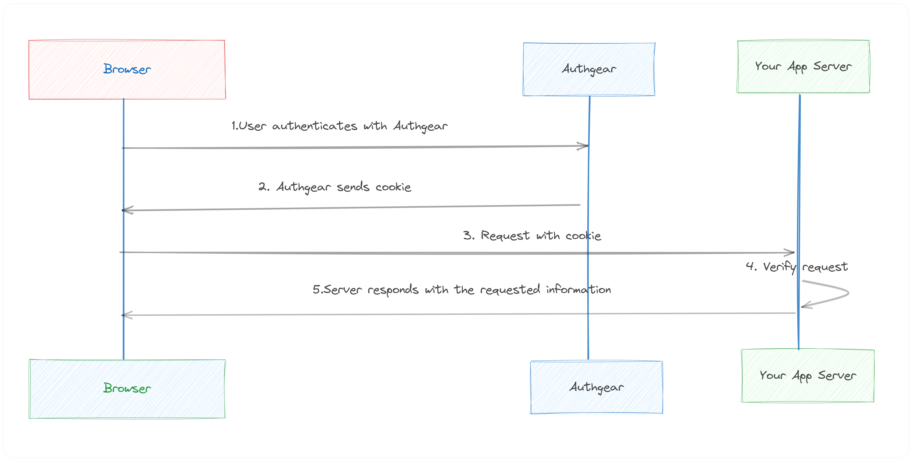

In today's digital industry, any successful application must prioritize both security and user experience. User authentication is one of the critical aspects of application security, but it can also be a significant challenge for developers because it requires understanding and correctly implementing complex protocols. Building an in-house authentication system can take anywhere between **three and six months**. As developers, we continuously search for solutions that make the integration of authentication easier, while guaranteeing the maximum protection for our user's data. Thankfully, SDK libraries can make this task much easier. This article explores **what SDKs and APIs Authgear offers** and how they can **simplify authentication integration** for developers.

## What is Authgear?

Auhgear is a highly adaptable **identity-as-a-service (IDaaS) platform** for web and mobile applications. As Auhgear is constructed on the <a href="https://openid.net/developers/how-connect-works/" target="_blank">OpenID Connect</a> (OIDC) standard, it supports a wide range of identity providers, including <a href="https://developers.google.com/identity" target="_blank">Google</a>, <a href="https://support.apple.com/en-gb/guide/deployment/depa64848f3a/web" target="_blank">Apple</a>, and <a href="https://azure.microsoft.com/en-gb/products/active-directory/" target="_blank">Azure Active Directory</a> (AD). Authgear enables developers to integrate **multiple authentication methods**, such as <a href="/features/social-login" target="_blank">social logins</a>, <a href="/features/passwordless-authentication" target="_blank">passwordless</a>, <a href="/features/biometric-authentication" target="_blank">biometrics logins</a>, <a href="/features/whatsapp-otp" target="_blank">one-time-password (OTP) with SMS/WhatsApp</a>, and multi-factor authentication (MFA)**.**  Authgear takes care of the heavy lifting in terms of user authentication, making it easier and faster to implement by integrating it into various types of applications - from single-page web apps to mobile applications to API services. You can also change how the end-users see your <a href="/solutions/customer-identity-and-access-management" target="_blank">signup and login pages</a> with a **user-friendly drag-drop low-code** dashboard. Most importantly, you can <a href="https://accounts.portal.authgear.com/signup" target="_blank">get started</a> **with Authgear for free** until you have a lot of active users and you want to customize pages under your brand.

## Authgear SDK libraries

Authgear SDKs are easy to integrate into your app, whether it's a **single-page app** (Angular, Vue, React)**, a mobile app**(IOS, Android, React Native, Flutter)**, or a regular web application**. In most cases, it involves just **a few lines of code**. There is also comprehensive documentation and community support available that can guide you through the integration process. Authgear provides SDKs for a variety of platforms and languages. Below, let’s break down the notable libraries and SDKs by types of applications and you choose your application type for a getting started guide.

<!--FIGURE--><!--/FIGURE-->

### Single-Page Application (SPA) SDK Libraries

You need to protect a JavaScript SPA application that runs entirely in a browser:

  <table>
    <thead>
      <tr>
        <th>SDK</th>
        <th>Description</th>
        <th>Getting started</th>
      </tr>
    </thead>
    <tbody>
      <tr>
        <td>Angular</td>
        <td>Add authentication to your Angular application</td>
        <td><a href="https://docs.authgear.com/tutorials/spa/angular" target="_blank">https://docs.authgear.com/tutorials/spa/angular</a></td>
      </tr>
      <tr>
        <td>Flutter</td>
        <td>Integrating Authgear with a Flutter app</td>
        <td><a href="https://docs.authgear.com/get-started/flutter" target="_blank">https://docs.authgear.com/get-started/flutter</a></td>
      </tr>
      <tr>
        <td>JavaScript</td>
        <td>Integrate Authgear to your website with the Web SDK</td>
        <td><a href="https://docs.authgear.com/get-started/website" target="_blank">https://docs.authgear.com/get-started/website</a></td>
      </tr>
      <tr>
        <td>React</td>
        <td>Add user logins to your React apps</td>
        <td><a href="https://docs.authgear.com/tutorials/spa/react" target="_blank">https://docs.authgear.com/tutorials/spa/react</a></td>
      </tr>
      <tr>
        <td>Vue</td>
        <td>Add authentication to your Vue application</td>
        <td><a href="https://docs.authgear.com/tutorials/spa/vue" target="_blank">https://docs.authgear.com/tutorials/spa/vue</a></td>
      </tr>
    </tbody>
  </table>

### Native and Mobile Application SDK Libraries

If you are developing mobile or desktop applications, choose from one of these SDKs for your platform to get started.

  <table class="column-spacing">
    <thead>
      <tr>
        <th>SDK</th>
        <th>Description</th>
      </tr>
    </thead>
    <tbody>
      <tr>
        <td>Android</td>
        <td>Integrating Authgear with an Android app</td>
      </tr>
      <tr>
        <td>Flutter</td>
        <td>Integrating Authgear with a Flutter app</td>
      </tr>
      <tr>
        <td>IOS</td>
        <td>Integrating Authgear with an IOS app</td>
      </tr>
      <tr>
        <td>React Native</td>
        <td>Integrating Authgear with a React Native app</td>
      </tr>
      <tr>
        <td>Xamarin</td>
        <td>Integrating Authgear with a Xamarin app</td>
      </tr>
    </tbody>
  </table>

Please note that these SDKs are frequently updated, new ones might have been added regularly.

Token-based Authentication approach you can use for your single page and mobile apps:

<!--FIGURE--><!--/FIGURE-->

## Backend Service and API Authentication

If your API or backend service needs authentication, you can validate the JWT token in your application server code. You can find <a href="https://docs.authgear.com/get-started/backend-integration/jwt#decode-user-from-an-access-token" target="_blank">step-by-step examples</a> for **Python, Go, and Node.js** to verify and decode the JWT token from the Authorization header of an incoming HTTP request. For other programming languages, you can use Authgear Authentication APIs to configure OIDC authentication.

## Regular Web Application

If you have a traditional web application like **Java EE, Express, PHP, GO, Laravel, or**<a href="http://ASP.NET" target="_blank">**ASP.NET**</a>**Core MVC** and you want to integrate authentication features, you can use a <a href="https://docs.authgear.com/get-started/authentication-approach/cookie-based" target="_blank">Cookie-based</a> authentication method.

<!--FIGURE--><!--/FIGURE-->

## Admin API

If you need to programmatically perform Authgear administrative tasks like managing users or anything that can be done through the Authgear Portal’s dashboard can also be done through this API, you use <a href="https://docs.authgear.com/apis/admin-api" target="_blank">Admin API</a> REST or GraphqQL endpoints.

### Events and Hooks

Yet another cool feature of Authgear is <a href="https://docs.authgear.com/integrate/events-hooks" target="_blank">Events and Hooks</a> where you can easily customize the authentication pipeline. Hooks are secure, self-contained functions that allow you to customize the behavior of Auhgear. Authgear invokes hooks during runtime to execute your custom [JavaScript](https://docs.authgear.com/integrate/events-hooks/denohooks) code. For instance, you can add logic to assign roles to new users, trigger actions after login, block suspicious activity, and more.

## Getting started with Authgear

Authgear allows you to add authentication depending on the programming language, the framework you are using, or chosen SDK from the above sections. Here are the **common** **steps** on how you can get started using any SDK.

**Step 1. Create an Authgear account** Signup for a free Authgear Portal account at <a href="https://portal.authgear.com/" target="_blank">https://portal.authgear.com/</a>.

Or you can use your self-deployed (using <a href="https://docs.authgear.com/deploy-on-your-cloud/local" target="_blank">Docker</a> or <a href="https://docs.authgear.com/deploy-on-your-cloud/helm" target="_blank">Helm chart</a>) Authgear.

**Step 2. Create an application in the Portal**

To use Authgear services, you’ll need to have an application set up in the Authgear portal. The Authgear application is where you will configure how you want authentication to work for the project you are developing.

- Once logged in, navigate to the "Applications" tab and click "Add Application."
- Choose an appropriate application type (e.g., Traditional Web Application, Single Page Application, or Native App) and provide a name for your application.
- Click "Save" and keep the **Client ID**. You will need it when initializing the connection through Authgear SDK.

Every application in Authgear is assigned an alphanumeric, unique client ID that your application code will use to call Authgear APIs through the SDK. Learn more about <a href="https://docs.authgear.com/integrate/using-sdk-to-call-your-application-server" target="_blank">how to call your application server</a> using SDKs.

**Step 3. Configure the application**

- After creating the application, you'll be directed to the "Settings" tab, where you can configure the application's settings.
- Fill in the required fields, such as "Authorized Redirect URIs" and "Post Logout Redirect URIs," with the corresponding URLs from your application.
- Save your changes.

**Step 4. Choose how your user authenticates**

From the “Authentication” tab, you can choose a **login method** for your users. Options are including, by email, mobile, or social, just using a username or the custom method you specify.

<!--FIGURE--><!--/FIGURE-->

**Step 5. Install the relevant Authgear SDK**

You follow the instructions in the Getting Started guide for the **appropriate Authgear SDK** from the tables above depending on your platform.

## Summary

Authgear SDKs and APIs make auth integration significantly more straightforward for developers. By offloading much of the complexity associated with authentication, developers can focus on creating value-adding features for their applications. Authgear is a <a href="/solutions/customer-identity-and-access-management" target="_blank">cloud-based solution</a> that scales with your needs. Whether you have hundreds of users or millions, it can handle the load, providing reliable and fast authentication.

### Related resources

- <a href="/post/authentication-as-a-service" target="_blank">Authentication-as-a-Service: What Is It and Why You Need It</a>
- <a href="/post/frictionless-authentication" target="_blank">Frictionless Authentication: What Is It & How To Implement It?</a>

### Recommended content

- <a href="/post/social-login-guide" target="_blank">Social Login - Why You Should Implement It</a>
- <a href="/post/web-application-authentication-guide" target="_blank">Web Application Authentication: How It Works and How to Implement It</a>
