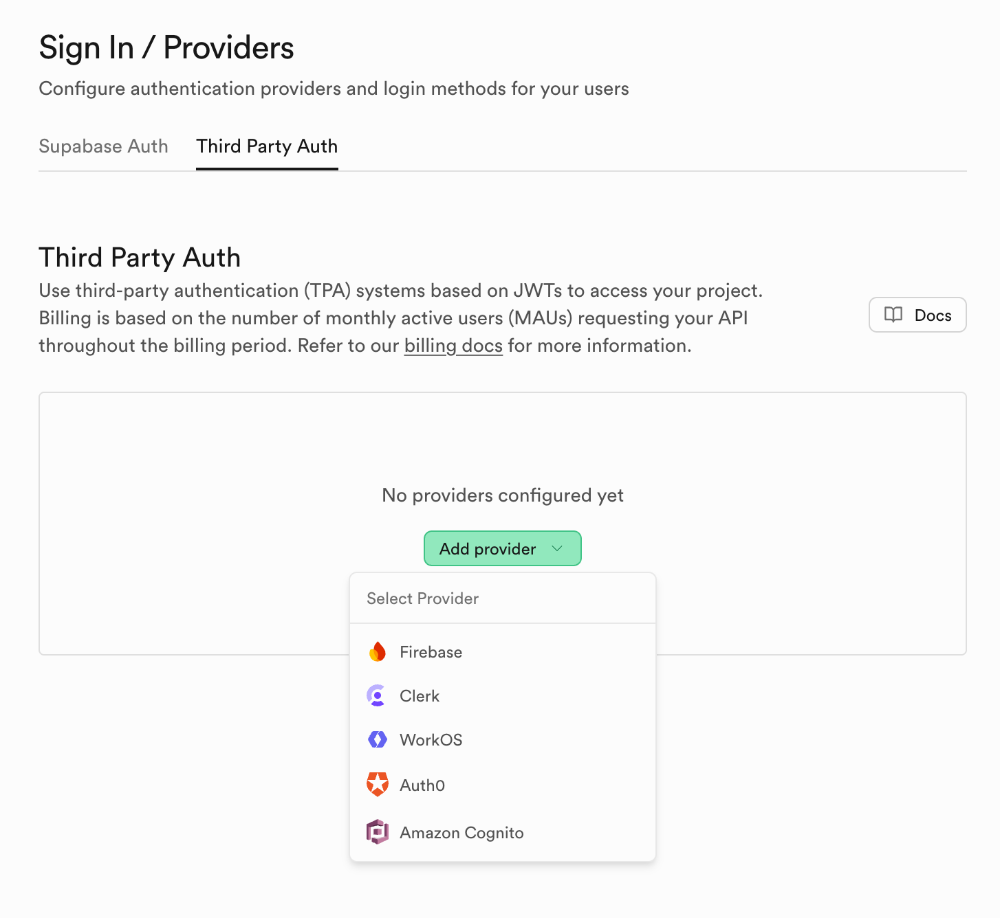

You already have sign-in solved. Your company is using an identity provider (IdP) for SSO, and every app in your stack already trusts them. Then a new project comes along, and your team wants to try out Supabase**.**

There’s just one catch: your users live **outside Supabase Auth**, and Supabase’s built-in third-party options (Clerk, WorkOS, Auth0, Amazon Cognito) don’t fit your setup. You’re not migrating users, and you definitely don’t want two sources of truth.

The good news? You don’t need to. Supabase’s database doesn’t *require* Supabase Auth, it only needs a **Supabase-signed JWT** to evaluate Row Level Security (RLS). If you can verify your existing JWTs, you can **exchange** them for a Supabase-signed token at the edge and keep using your current SSO or IdP exactly as-is. No user imports. No duplicate sessions.

In this guide, you’ll learn how to:

- Verify your IdP’s JWTs (any issuer with a JWKS endpoint).
- Mint a Supabase-signed JWT.
- Configure `supabase-js` to fetch that token on demand.
- Write RLS policies that key off the user’s `sub` claim.

If you don’t already have an IdP, **Authgear** slots in neatly here and gives you MFA, biometrics, social logins. But the pattern works with *any* JWT issuer. Let’s get your existing SSO talking to Supabase the right way.

<!--FIGURE--><!--/FIGURE-->

This guide is for teams who can't****use these options—you can still use Supabase.

## Full example code

The full example app source code is available on GitHub: [https://github.com/authgear/authgear-example-supabase](https://github.com/authgear/authgear-example-supabase)

Use it as a template for integrating your own JWT-based IdP with Supabase.

## How it works

Supabase’s Postgres RLS expects requests to carry a **Supabase-signed** JWT and typically the `authenticated` role. If you already have an SSO/IdP that issues JWTs, you can’t hand those tokens directly to Supabase. The solution is a **bring-your-own-JWT** flow:

1. Verify your IdP’s JWT using the issuer’s JWKS.
1. **Sign a new JWT with your Supabase project secret** and add `role: "authenticated"`.
1. Your frontend uses the new JWT in requests to Supabase

## Step 1 - Set up your authentication provider

Check the payload of the JWT issued by your existing auth provider. It typically contains claims like `sub` , `email` , `phone_number.`

Also check how to verify the token. Typically it's via a JWKs endpoint under `https://<your-idp>/.well-known/openid-configuration`.

See [Authgear's JWT Token](https://docs.authgear.com/reference/tokens/jwt-access-token) for reference.

## Step 2 - **Create an Server-Side Function to exchange JWTs**

Next we will implement a server-side function that handles the token exchange. One of ways is to deploy a Supabase Edge Function.

In the Supabase dashboard:**Project Settings → API → JWT Keys → Legacy JWT Secret**Copy the secret value—you’ll need it for signing the Supabase token.

Now we set up the critical piece: a Supabase Edge Function that will accept your IdP's JWT and return a new JWT signed with Supabase’s secret.

Here we use Authgear as an example, but it's similar for other IdP that issues JWT.

1. Navigate to "Edge Functions" -> "Secrets" and add the two secrets:   <ol><li>`AUTHGEAR_ENDPOINT` = your Authgear app endpoint (e.g. `https://myapp.authgear.cloud`).``
1. `SB_JWT_SECRET` = your Supabase JWT secret (from Step 2 above).

1. Navigate to "Edge Functions" -> "Functions" in Supabase web UI. Copy-paste the following code and deploy it there. Name the function `exchange-jwt`.

Once deployed, your function is accessible at:

`${SUPABASE_URL}/functions/v1/exchange-jwt`

## Step 3: Create the database table and RLS policies

Now let’s set up the database table and RLS rules in Supabase. We’ll create a table to store data owned by users, and use RLS to ensure each user can only manipulate their own rows.

Open the SQL editor in your Supabase project and run the following SQL commands:

We created a SQL function `current_user_id()` that returns the JWT’s `sub` claim (subject) from the current request’s JWT. Supabase’s Postgres has an `auth.jwt()` function that exposes the JWT claims of the requester; `auth.jwt() ->> 'sub'` extracts the `sub` field as text.

- The `instruments` table has a `user_id` column which will store the Authgear user’s ID for each instrument.

- We enabled RLS on the table, which means by default no rows can be accessed unless allowed by a policy.

We then defined a policy for READ operations, you can create similar policies for INSERT, UPDATE & DELETE. Each policy is limited to the `authenticated` role and uses a condition requiring that the row’s `user_id` matches the user’s id from the JWT.

## Step 4: Wire the exchanged JWT to Supabase Client

Now you can use the exchanged JWT in the subsequent requests to Supabase. The Supabase client expose an `accessToken` hook for custom access token function.

If you’re using Authgear on the frontend, it looks like this (swap to your IdP SDK as needed):

In this configuration:

- We disable `autoRefreshToken` and `persistSession` in Supabase’s client so that Authgear is the source of truth for the session.

- We provide an `accessToken` async function. The Supabase Client will call this function every time it needs a JWT for an authenticated request. In our case, that is every query to our `instruments` table.

Now the database should be accesible using the Supabase client and secured by the RLS policy.

### Conclusion

You don’t have to choose between Supabase and your existing SSO. By verifying your IdP’s JWT and minting a Supabase-signed token at the edge, you get clean RLS, a single source of identity, and zero user migration. It’s the simplest way to bring Supabase into a stack that already trusts JWTs. So you can keep using all the features provided by your auth provider, such as [Authgear.](/)
