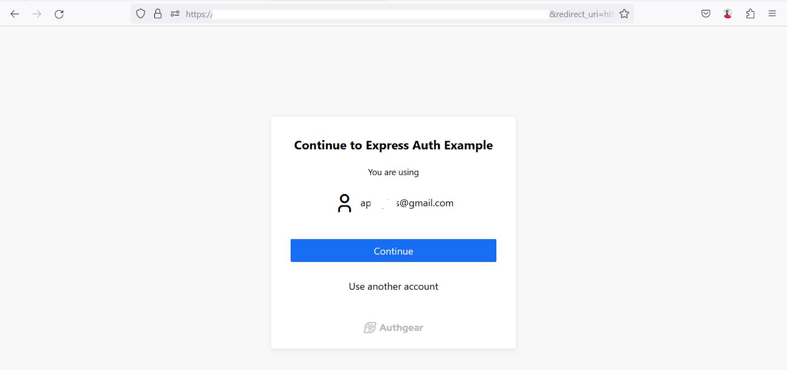

OAuth 2.0 is an open authorization standard that makes it possible for users to securely grant third-party applications access to their profile and data without requiring their password. Usually, the user data is held by another site (the service provider) that offers a means for users to authorize third-party applications via an authorization server. Also, the provider can determine what resource a third party can access on behalf of a user. For example, an OAuth provider can allow a third party to access a user’s email address, name, and profile photo.

In this article, we’ll dig deep into what OAuth 2.0 is and learn about how it works.

## The History of OAuth

The term OAuth is short for Open Authorization. The origin of OAuth can be traced back to Blaine Cook, who was working on the Twitter OpenID implementation in 2006. During that period, he and others in the industry met and discussed about API access delegation. They eventually agreed that there was no open standard for API access delegation. As a result, further work began for the creation of OAuth.

Between April to December 2007, more people joined the OAuth project, and the final draft of OAuth 1.0 was released. Later, the specification for OAuth 1.0 Revision A was released. This release addresses the session fixation attack issue in OAuth 1.0.

In 2012, the next major specification for OAuth was released as OAuth 2.0. This release is still the most secure and widely used version of OAuth today. In fact, OAuth 2.0 is so popular that big organizations like Google, Facebook, and Microsoft implement it in their services. OAuth 2.0 is secure, and flexible and as a result, it empowers developers and service providers to do more. For example, authentication-as-a-service providers like Authgear use OAuth 2.0 to enable developers to add user authentication and management to their apps with ease.

In 2016, OAuth 2.1 was published, this version improves on OAuth 2.0 in several ways like improved security. For instance, it introduces the use of “Proof Key for Code Exchange” PKCE which makes it harder for attackers to steal user credentials.

## How OAuth 2.0 Works

In this section, we’ll take a look at how OAuth 2.0 works by looking at a practical example of an authorization flow using the authorization code grant type.

### Step 1: Sending of Authorization Request

For an OAuth 2.0 request that uses the authorization code grant type, the authorization flow begins with the client sending a request for authorization to the Authorization Server.

Usually, the user is redirected to an authorization page on the OAuth service provider’s website where they can choose to grant the client access to their profile. The following screenshot shows an example of a service provider’s authorization page.

<!--FIGURE--><!--/FIGURE-->

### Step 2:  Authorization Server Responds with Authorization Grant

Once the user grants authorization on the provider’s site, an authorization grant is issued. Then, the authorization server redirects the user to a page on the client's site with an authorization code (typically found in the code URL parameter).

**Note:** The client specifies the redirect URL (a page on their site the provider should redirect to).

### Step 3: Client Sends Authorization Grant in Exchange for Access Token

The client can not access protected resources on behalf of a user by using the authorization grant directly. Instead, OAuth 2.0 requires the client to make a request to the provider’s token endpoint to exchange the authorization code for an access token.

So, in this step, the client application sends the authorization code back to the provider.

### Step 4: Authorization Server Responds with an Access Token

Here, the OAuth provider simply responds to the request in the previous step with an access token, if the authorization code in the request is valid.

Access tokens may expire after a set period of time. As a result, the client can refresh the access token by sending a special request to a token refresh endpoint.

### Step 5: The Client Can Request Protected Resources using the Access Token

The client can now send requests using the access token to use protected resources on behalf of the resource.

## OAuth 2.0 Authorization Grant Types

We mentioned authorization grant types a few times earlier in this post. Now let's take a closer look at the various grant types in order to improve our understanding of how OAuth 2.0 works.

### Authorization code

This grant type requires an authorization server that enables the user to grant access to the client and returns an authorization code to the client to continue the rest of the OAuth flow. The authorization server seats between the user and the client and prevents the user from exposing their password to the client. The authorization code grant is very popular and many OAuth 2.0 providers use it to allow users to sign in to other services using their existing account on their service.

### Implicit

In an implicit grant, no authorization code is issued, instead, the service provider returns an access token to the client directly. Hence, there’s one less step in the authorization flow while using this grant type.

The authorization flow for implicit grant starts with the client redirecting the user to an authorization page. The user is then redirected back to the client with an access token in the URL after they grant authorization. After that, the client can use the access token to access protected resources on behalf of the user.

Because the access code is delivered to the client via the redirect URL it is exposed to the user or resource owner. This can lead to security issues as it’s easy for an attacker to get the access token and access protected resources. This grant type is obsolete in OAuth 2.1.

### Resource Owner Password Credentials

Here the client sends the user’s credentials such as username and password to the authorization server to obtain an access token. The user's password is only used during authorization, subsequent requests for protected resources require only the access token.

This grant type can expose the resource owner’s password to the client and this may lead to security issues. The resource owner password credentials grant is rarely used and is removed in OAuth 2.1.

### Client Credentials

A client application can use this type of grant for authorization when the client is also the resource owner. That is, the client will only access protected resources under the client's control. While using the client credentials grant, the access token is issued without involving the user. It’s usually used in Machine-to-Machine (M2M) Authorization.

The flow for client credentials flow starts with the client sending a request with credentials like the client’s ID and client secret to the authorization server. The authorization will respond with an access token if the authentication of the client is successful.

## Examples of OAuth 2.0

The following are examples of some providers and services powered by OAuth 2.0 they offer to the public:

**Google:** Google allows developers to access limited user resources on their services using OAuth 2.0. Developers can use this feature to allow users to sign in to their own applications using their apps using their Google account (Sign in with Google).

**Facebook:** Facebook also allows access to their developer APIs via OAuth. Developers can also use OAuth 2.0 to add a sign-in with Facebook feature to their websites and mobile apps.

**Twitter:** The Twitter API uses OAuth 2.0 and developers can let users sign in to their applications using their existing Twitter account.

**Github:** Github also offers APIs that support OAuth 2.0.

**Authgear:** Authgear provides a full user authentication and management service with full support for OAuth 2.0. You can add a complete user registration and log-in system to your application with just Authgear.

## Advantages of OAuth 2.0

The following are some advantages of OAuth 2.0 that should make one consider using it.

1. OAuth 2.0 is secure. For example, it can eliminate the need for client applications to send sensitive data such as passwords over HTTP requests.

2. It is easy to use and implement OAuth 2.0 in an application. There are many OAuth client libraries available for different programming languages and frameworks to simplify implementation.

3. OAuth 2.0 makes user authentication and management easier. Its usage can eliminate the need to design and implement a custom user management system.

4. Many popular services use OAuth 2.0 implementations because it is scalable and can serve small to large solutions while consuming fewer resources.

## Summing Things Up

In this post, we covered what OAuth 2.0 is, how it works, and some of the benefits of using OAuth 2.0.

You can continue learning about OAuth 2.0 and try out practical examples for different programming languages and frameworks, check out some tutorials on Authgear [here](https://docs.authgear.com/get-started/start-building).
