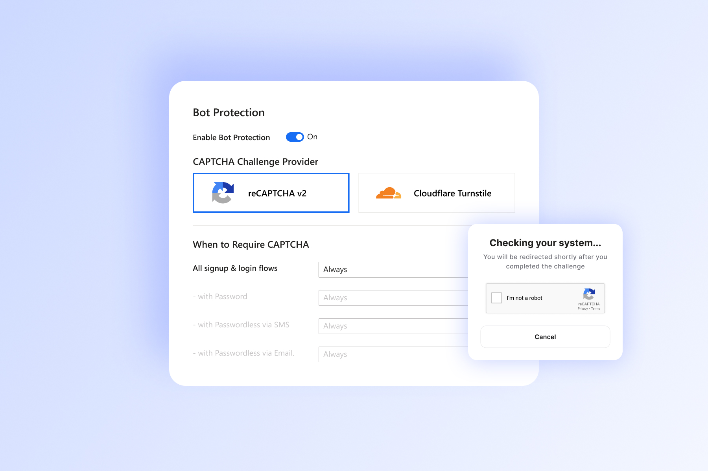
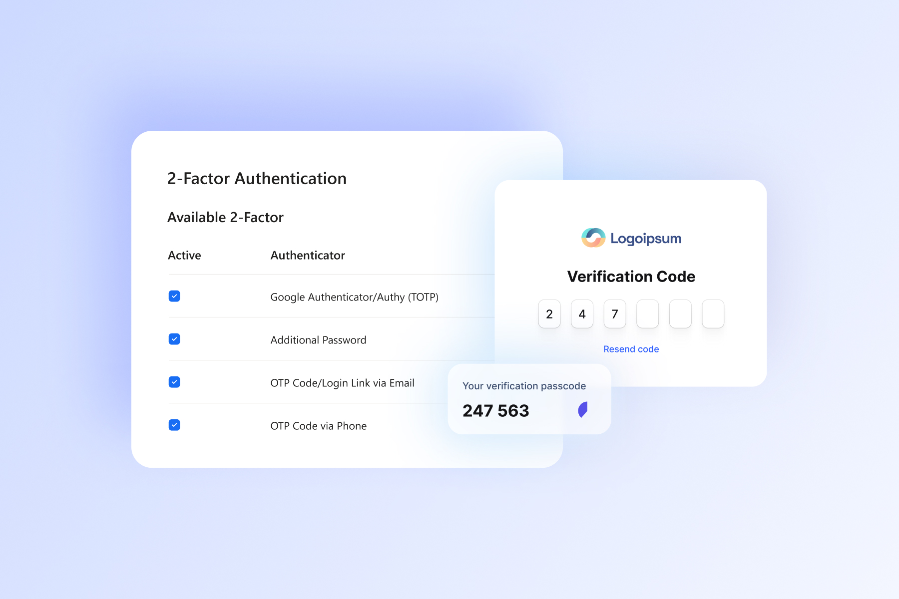
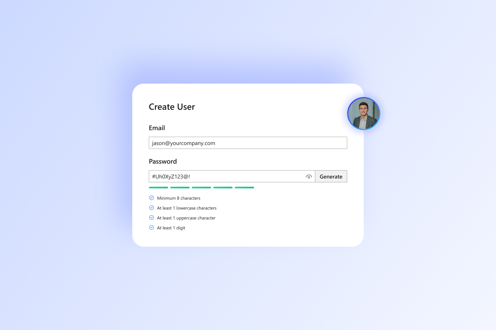
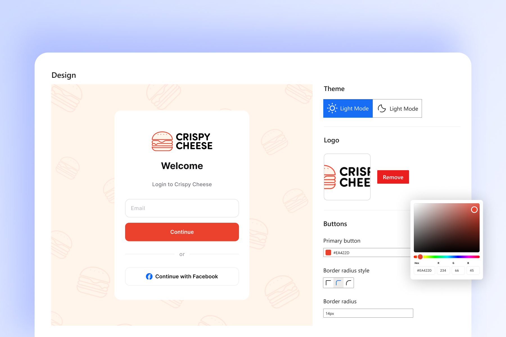
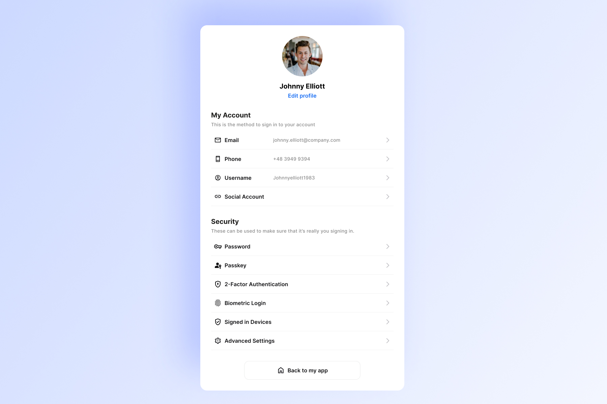

### 1. Enhanced User Security with Bot Protection

Keeping your platform secure from bot attacks is a priority. With the latest Captcha integration, Authgear adds an extra layer of protection to your authentication flows, ensuring only legitimate users gain access to your platform.

### 2. Grace Period for 2FA Setup

Admins now have more control over user security. You can configure a grace period to encourage users to enable two-factor authentication (2FA). During this grace period, users receive notifications to set up 2FA before a specified deadline. After the grace period ends, 2FA becomes mandatory for login, enhancing overall account security.

### 3. Simplified User Onboarding with Temporary Passwords

Admins can now create users with a random temporary password and require them to set a new password upon their first login. This simplifies the onboarding process while ensuring that users establish their credentials securely.

### 4. Modernized Login and User Settings Pages

We’ve revamped the login and user settings pages with a fresh, modern design. The updated interface not only enhances aesthetics but also provides improved navigation, making it easier for users to manage their accounts.

### Explore These Features Today!

These updates underscore our commitment to delivering secure, intuitive, and user-friendly solutions. Try out the new features and let us know your thoughts!
