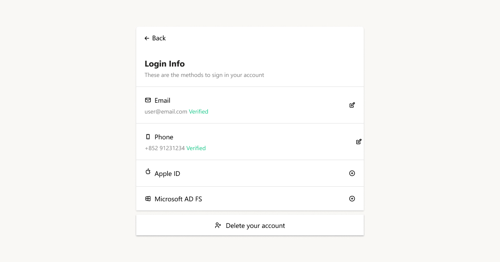
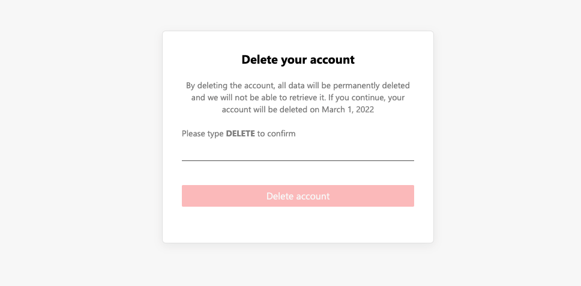

Privacy protection regulations related to [“Right to be Forgotten”](https://en.wikipedia.org/wiki/Right_to_be_forgotten), also known as “Right to Erasure”, have been introduced in several jurisdictions, such as GDPR in the European Union. In addition, Apple also announced that [every app listed on its App Store must allow users to initiate account deletion in-app](https://developer.apple.com/news/?id=i71db0mv), which will be effective on June 30, 2022.

## The Delete Your Account Button

We are helping you to give your users more control over their data. Now you can bring the **Delete your account** button to your app with a few clicks.

If you use the pre-built frontend provided by Authgear for privacy settings, this button will show inside the “My Account” panel. It is designed to be easy to find in your app.

You can change the **Grace Period** of how long the account will be deactivated before deletion in the Authgear Portal.

Alternatively, if you opt to implement your own **Delete Account** button, you can initiate deletion from the [Admin API](https://docs.authgear.com/integrate/account-deletion#initiate-deletion-from-admin-api) in your backend server.

## New Webhook Events

Deleting the account is not only removing the data on Authgear, it’s expected all the personal data should be erased along with the account.
