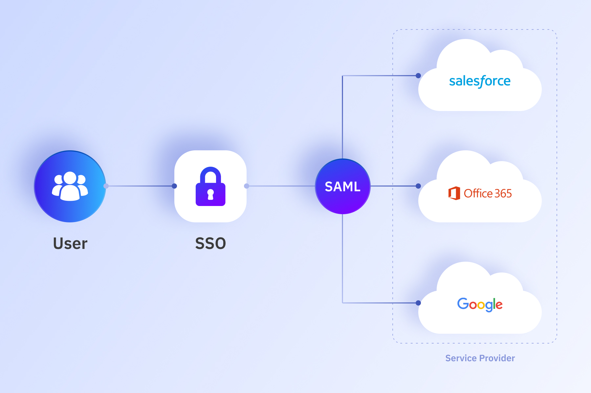

### What is SAML IdP?

A SAML Identity Provider enables single sign-on (SSO) by acting as a trusted source for verifying user identities. With this feature, Authgear can authenticate users for any SAML-compatible service, ensuring secure and efficient access across your organization's applications and services.

### Why Use Authgear as Your SAML IdP?

Authgear’s implementation of SAML IdP brings several enterprise-grade advantages:

1. **Centralized User Management**   Leverage Authgear’s robust user management capabilities to maintain a single, authoritative source of truth for all user identities.
1. **Enhanced Security Features**   Combine SAML IdP functionality with Authgear's advanced security features, including 2FA enforcement, device management, and detailed audit trails.
1. **Seamless Integration with Enterprise Apps**   Authgear integrates smoothly with SAML-compatible apps like Salesforce, Google Workspace, and other enterprise platforms, simplifying the management of access permissions.
1. **Enjoy Authgear’s Full Feature Set**   In addition to acting as an IdP, enterprises can enjoy Authgear’s complete range of features—such as passwordless login, customizable authentication flows, and detailed analytics—enhancing both security and user experience.

### Who Benefits from Authgear as a SAML IdP?

This feature is designed for enterprises aiming to:

- Streamline their identity infrastructure.
- Enable secure SSO across various platforms.
- Reduce operational overhead in managing user credentials.
- Enhance the overall security and user experience of their systems.

### Ready to Simplify Identity Management?

By using Authgear as your SAML IdP, your enterprise gains a unified solution that combines the power of SAML with Authgear’s modern authentication features. Try it today and experience a new level of security and efficiency!
