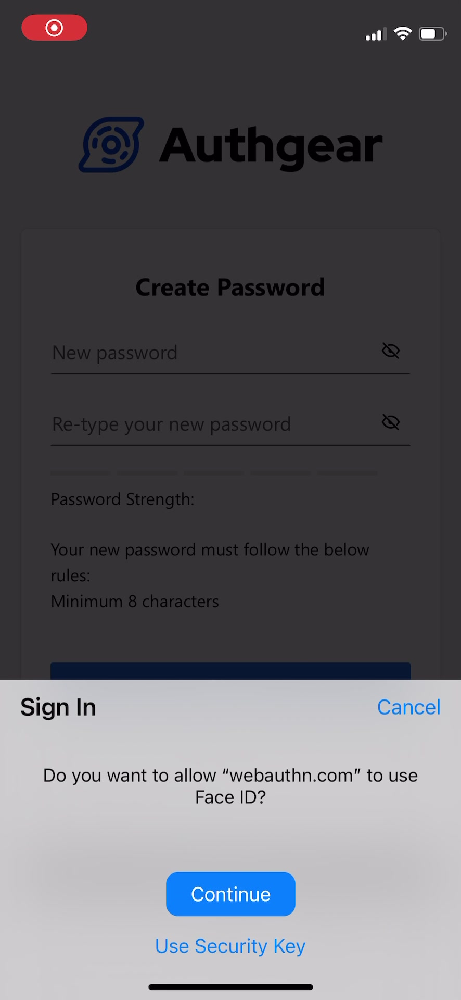
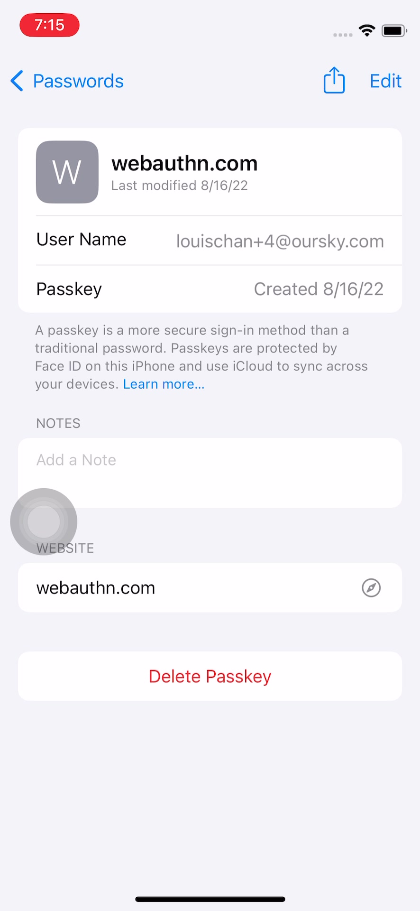
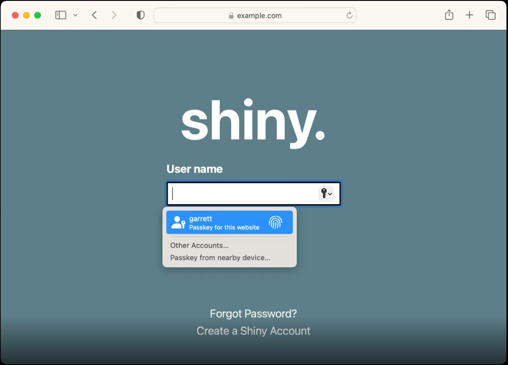
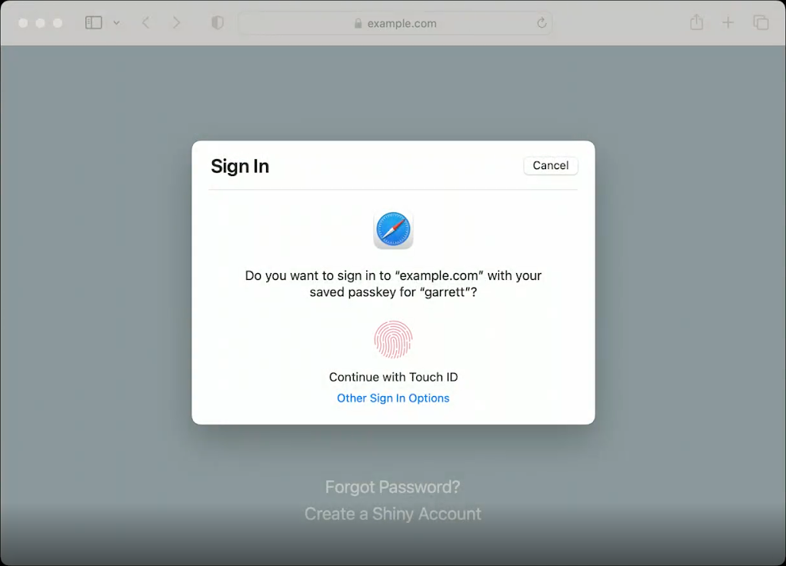
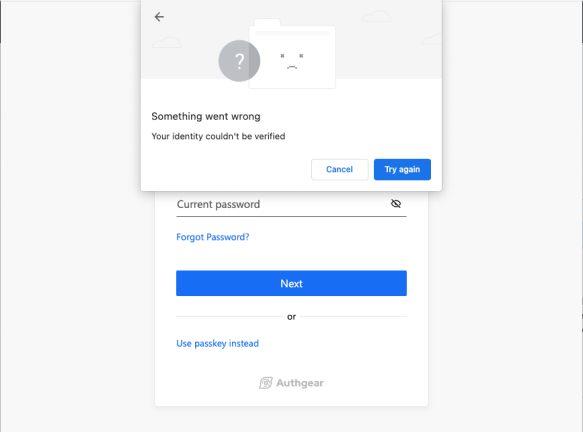
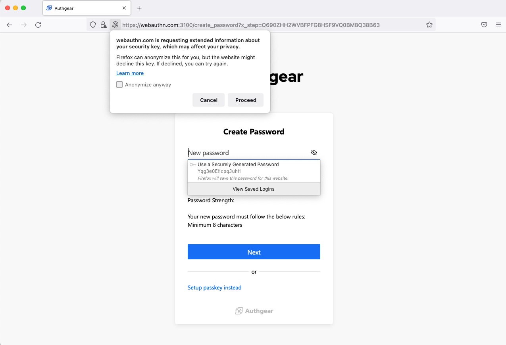

<script type="application/ld+json">
    {
        "@context":"http://schema.org",
        "@type":"NewsArticle",
        "mainEntityOfPage":{
                            "@type":"WebPage",
                            "@id":"/post/4-things-we-learned-supporing-passkeys#webpage",
														"url":"/post/4-things-we-learned-supporing-passkeys"
                        },
        "headline":"Web App Authentication: How It Works and How to Implement It",
        "image":{
            "@type":"ImageObject",
            "url":"https://uploads-ssl.webflow.com/60658b47b03f0c77e8c14884/630d77a4270550c53827f5b8_supporting-passkey.png",
            "width":1200,
            "height":600
        },
        "datePublished":"2022-07-21",
        "dateModified":"2022-07-21",
        "description":"In this guide, you'll learn more about how authentication in web app works and how to implement it with Authgear.",
        "author":{
            "@id":"https://www.oursky.com/#organization"
        },
        "publisher":{
            "@type":"Organization",
            "name":"Oursky",
            "@id":"https://www.oursky.com/#organization",
            "logo":{
                "@type":"ImageObject",
                "@id":"https://www.oursky.com/#logo",
                "url":"https://oursky.com/assets/img/og-image.png",
                "caption":"Oursky"
              }
        }
    }
    </script>
Do you know that the password “123456” is still used by <a href="https://www.ncsc.gov.uk/news/most-hacked-passwords-revealed-as-uk-cyber-survey-exposes-gaps-in-online-security" target="_blank">more than 23 million people</a>? People often think that hackers wouldn’t bother hacking their accounts and decide to use the same simple passwords on different platforms.

One of my friends told me his account was hacked, and malicious messages were sent to his Facebook friends. He also used a simple password similar to “12345678” for all his social accounts since he thought no one would hack his accounts. Sadly, it turned out that anything that could go wrong would go wrong,

Password is easy to use, making it the most common authentication method. However, people tend to use simple passwords that are vulnerable to cracking. Moreover, users may get tricked into giving hackers their passwords without knowing.

In 2022, we finally got good news! Industry leaders like <a href="https://developer.apple.com/passkeys/" target="_blank">Apple</a>, <a href="https://developers.google.com/identity/fido#who_supports_passkeys" target="_blank">Google</a> and Microsoft are working on this new method of authentication called passkeys. Passkeys have the potential to replace passwords completely. Nevertheless, <a href="/post/passkeys-compatibility" target="_blank">various compatibility and support issues exist before the technology is more mature</a>.

In this blog post, we’ll briefly discuss passkeys' foundation and the problems we have encountered as we help developers easily support passkeys on their apps by Authgear.

## What Are Passkeys?

Passkeys are digital credentials based on industry standard for user authentication. They follow the FIDO and WebAuthn standards that use public key cryptograpy, which is the most popular and secure protocol. Whenever a user creates a new account, a pair of public and private keys will be created. The public key is published, and the corresponding private key is kept secret, usually within a user’s device. The data encrypted with the public key can only be decrypted with the corresponding private key. Users simply have to unlock their devices with a PIN, biometric sensors, etc., to unlock the private key and gain access to the apps or websites. This way, users never have to reveal their private keys to anyone, unlike password-based authentication.

While tech giants work hard to bring passkeys to mobile devices, our team is working hard on supporting passkeys in <a href="/" target="_blank">Authgear</a> so that everyone can easily enable login with passkeys on their apps. Since the support for passkeys is still far from mature, we encountered a couple of issues with integrating passkeys with various devices and platforms.

Here are the 4 issues for any developers trying to develop Passkeys-enabled websites and our solutions (and maybe why you might want to use Authgear instead of developing your solutions):

<nav id="table-of-content">
    <ul> 
        <li><a href="#backward">Needs to Maintain Backward Compatibility With Non-passkeys Supported Platforms </a></li>
        <li><a href="#autofill">Autofill Prompts Supports Are Limited</a></li>
        <li><a href="#platform-experience">User Experiences Vary Across Platforms</a></li>
        <li><a href="#error-handling">Error Handling Is Inconsistent Between Platforms</a></li>
    </ul>
 </nav>

<h2 id="backward">Needs to Maintain Backward Compatibility With Non-passkeys Supported Platforms</h2>

<!--FIGURE-->

<!--/FIGURE-->

Before we got our hands dirty, we spent some time researching the compatibility of Passkeys on various platforms.

Before iOS 16, the <a href="https://www.w3.org/TR/webauthn-2/#enum-attachment" target="_blank">platform authenticator</a> like Safari creates <a href="https://fidoalliance.org/white-paper-multi-device-fido-credentials/" target="_blank">single-device FIDO credentials</a>. The implication is that while the end-user can create credentials, it will be cleared along with cookies. If the end-user signs up to your app with a single-device credential only, they will permanently lose access to their accounts when they clear their browsing history. Platforms like Android and Chrome desktop share this characteristic as well.

<!--FIGURE-->

<!--/FIGURE-->

With Passkeys support on iOS16, Safari creates <a href="https://fidoalliance.org/multi-device-fido-credentials/#faq" target="_blank">multi-device FIDO credentials</a> stored in iCloud Keychain. Multi-device FIDO credentials are also known as **Passkeys**. The passkeys are still considered to have <a href="https://www.w3.org/TR/webauthn-2/#enum-attachment" target="_blank">platform attachment</a>s, but these passkeys are synced across the end-user devices. Therefore, the passkeys are available on all devices the end-user owns and will not be cleared with the browsing history. This characteristic is also the key point of making passkeys usable among consumers.

<!--FIGURE-->

<!--/FIGURE-->

As there are two kinds of credentials, “single-device credentials” and “multi-device credentials.” To ensure our end-users have the best experience, your app must be prepared to handle both technically.

That meant we needed to support multiple credentials per account, so the end-user can freely add credentials as they wish — add both Passkeys on supported platforms and single-device credentials on platforms without Passkeys support.

<h2 id="autofill">Autofill Prompts Supports Are Limited</h2>

<a href="https://www.w3.org/TR/webauthn-2/#client-side-discoverable-credential" target="_blank">Client-side discoverable credentials</a> mean credentials that can be used without first identifying the end-user. The major use case of client-side discoverable credentials is to **support autofill prompt** — On the login page, you show a typical input field for end-users to type in their usernames; when they click on the input field, the system will prompt them with a list of available passkeys to use. The end-users can then tap to select a passkey and sign in instantly, making authentication much simpler.

Client-side discoverable credentials are quite impressive in terms of UX, but we encountered an issue that prevented us from rolling it out to our customers. The code to implement autofill is counter-intuitive. We need to create a pending promise while waiting for the autofill result. When the promise is settled, a new pending promise must be re-created. The pseudo-code looks like this:

```

<span class="keyword">function</span> <span class="function">autofill</span>() {
 <span class="comment">// This function is recursive.</span>
 <span class="comment">// PublicKeyCredential.isConditionalMediationAvailable is available on iOS 16 and onward.</span>
 <span class="comment">// So autofill is only available on iOS 16 and onward.</span>
 <span class="keyword">if</span> (<span class="keyword">typeof</span> PublicKeyCredential.is<span class="function"></span>ConditionalMediationAvailable <span class="operator">===</span> <span class> <span class="string">"function"</span> {
  <span class="keyword">const</span> available <span class="operator">=</span> <span class="keyword">await</span> PublicKeyCredential.<span class="function">isConditionalMediationAvailable</span>();
  <span class="keyword">if</span> (available) {
   <span class="keyword">const</span> options <span class="operator">=</span> <span class="comment">// options are omitted for brevity.</span>
   <span class="keyword">try</span> {
    <span class="keyword">const</span> response <span class="operator">=</span> <span class="keyword">await</span> navigator.credentials.<span class="function">get</span>({
     ...options,
     <span class="property">mediation</span>: <span class="string">"conditional"</span>,
    });
    <span class="comment">// Send the assertion response to your server to sign in.</span>
   } <span class="keyword">catch</span> (e) {
    <span class="comment">// Inspect the error to see if we should recursively</span>
    <span class="comment">// call the function again.</span>
     <span class="function">autofill</span>();
    }
   }  
  }
}
    </span>
```

The mediation option is the option that determines the behavior of the system. When mediation is conditional, the system does not show a modal dialog. On iOS 16, the available passkeys are shown as options in the keyboard accessory view. Thus, it works like autofill. When mediation is not specified, the system shows a typical modal dialog asking the user to select a passkey.

<p>We ran into an issue that <span class="inline-code">navigator.credentials.get({ mediation: "conditional"})</span> will immediately be rejected with a <span class="inline-code">DOMException(name="NotAllowedError")</span>. When such an exception is observed, the next invocation of <span class="inline-code">navigator.credentials.get()</span> will display the modal dialog normally. However, when the end-user chooses a passkey, the modal dialog becomes unresponsive, and the promise never settles. This bug effectively breaks the flow. We have no choice but to disable autofill for now. It’s probably a bug we have to wait til iOS 16 is officially available. This bug is tracked <a href="https://bugs.webkit.org/show_bug.cgi?id=241126" target="_blank">here</a>.</p>

<!--FIGURE-->

<!--/FIGURE-->

<!--FIGURE-->

<!--/FIGURE-->

<h2 id="platform-experience">User Experiences Vary Across Platforms</h2>

We rely on the WebAuthn API the platform/browser provides to use Passkeys. We have no control over the user interface presented to the end-user. If the platform does not offer helpful and explanatory error messages, the end-users could easily get stuck and not know how to proceed.

<p>One such scenario happens on the Chrome desktop. Suppose the end-users sign up with a passkey already. When they attempt to log in, the <span class="inline-code">navigator.credentials.get</span> method supports an option <span class="inline-code"><a href="https://www.w3.org/TR/webauthn-2/#dom-publickeycredentialrequestoptions-allowcredentials" target="_blank">allowCredentials</a></span> to let us tell the device which passkeys the users can use.</p>

<p>When Safari finds that the credentials in <span class="inline-code">allowCredentials</span> do not match with the passkeys available, it will smartly ask the users to use another device by scanning a QR code or use a security key.</p>

On Chrome desktop, however, the browser is not smart enough to hide the option of using credentials on the device. The end-user could tap on that option and see an unhelpful error message saying "Your identity could not be verified" without any other messages.

<!--FIGURE-->

<!--/FIGURE-->

On the Firefox desktop, the modal dialog looks very similar to the ordinary permission dialog. The modal dialog is not centered and not big enough to draw the end-user’s attention. If the end-user is accustomed to the permission dialog, the modal dialog could be easy to miss.

<!--FIGURE-->

<!--/FIGURE-->

<h2 id="error-handling">Error Handling Is Inconsistent Across Platforms</h2>

Though the specification does specify what error to throw in some exceptional situations, the granularity of the exception is up to <a href="https://www.w3.org/TR/webauthn-2/#CreateCred-DetermineRpId" target="_blank">name</a>. Sometimes an exception with the same name is thrown, forcing us to look at the message to see what it means. The message is not specified, and all platforms have their proprietary messages. This makes us resort to matching the message with some regular expressions to guess the exceptional situations, which is quite tricky.

## Conclusion

Though the integration involves two functions only, it is not an easy task if we are determined to make the experience of using passkeys as simple and easy as passwords. The difference in compatibility and the inconsistency of error handling between platforms are challenging for developers who wants to enable Passkeys on their web or apps.

Hand-rolling your implementation may not be good if robustness is crucial to your app and users. <a href="https://accounts.portal.authgear.com/signup" target="_blank">Start a free trial</a> or <a href="/talk-with-us" target="_blank">contact us</a> to see how you can benefit from Authgear and provide a frictionless experience for your users without all the hassles.
