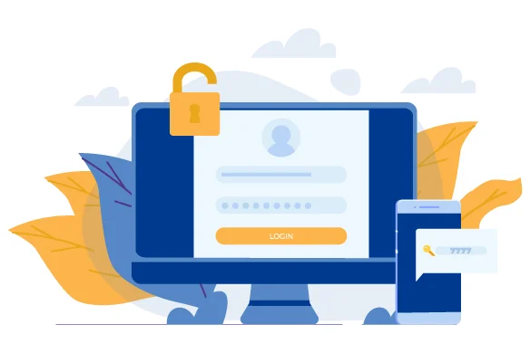
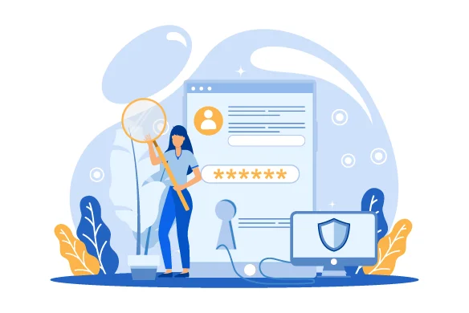
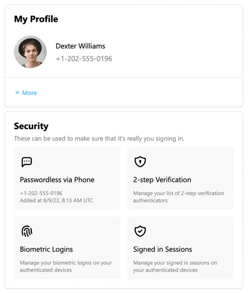
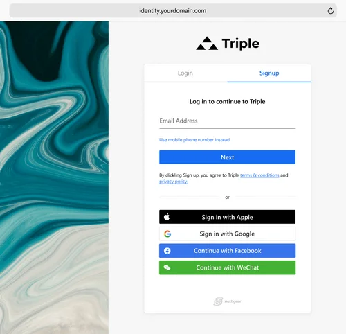

As a business owner or decision maker, authentication is likely not at the top of your mind. You have more important things to worry about than how your authentication system works. However, authentication is a crucial part of any online business.

Today's consumers expect a seamless authentication experience. They want to be able to sign up for and log into your services quickly and easily, without having to remember a lot of passwords. On the other hand, you as a business owner need to worry about authentication methods that are secure and scalable. Building an in-house authentication system can take anywhere between <a href="https://www.upwork.com/resources/how-to-develop-an-app" target="_blank">three and six months</a>. It might not sound like a long time. However, in today's fast-paced business world, that authentication system will likely be outdated by the time it's finished. In addition, there's so much that could go wrong in building an authentication system from scratch.

A more efficient solution is authentication as a service or AaaS. In this blog post, we'll discuss what authentication as a service is, why your business needs it, and some features to look for in an AaaS provider.

<nav id="table-of-content">
    <ul> 
        <li><a href="#definition">What Is Authentication as a Service?</a>
            <ul style="margin-top:15px;margin-bottom:0">
                <li><a href="#internal-authentication">Internal Authentication Services</a></li>
                <li><a href="#external-authentication">External Authentication Services</a></li>
            </ul>
        </li>
        <li><a href="#comparison">In-house Authentication vs Using Authentication-as-a-Service</a>
            <ul style="margin-top:15px;margin-bottom:0">
                <li><a href="#cost-reduction">Significant Cost Reduction</a></li>
                <li><a href="#ux">Better User Experience</a></li>
                <li><a href="#time-to-market">Shorter Time-to-Market</a></li>
                <li><a href="#data-security">Stronger Data Security and Infrastructure</a></li>
                <li><a href="#scalability">Scalability</a></li>
                <li><a href="#development">Maximize Developing Value</a></li>
            </ul>
        </li>
        <li><a href="#authgear">Integrate Your Apps with Authgear</a></li>
    </ul>
 </nav>

<h2 id="definition">What Is Authentication as a Service?</h2>

<!--FIGURE-->

<!--/FIGURE-->

Authentication as a service is a cloud-based authentication solution that allows businesses to outsource their authentication needs. AaaS providers offer authentication platforms that are secure, scalable, and easy to use.

Generally, there are two major types of authentication as a service:

<h3 id="internal-authentication">Internal Authentication Services</h3>

These authentication services are used by employees and contractors of a business or organization. The authentication system is used to grant or deny access to the company's internal network, applications, and data.

<h3 id="external-authentication">External Authentication Services</h3>

These authentication services are used by customers or consumers who use a business' mobile or web app. The authentication system is used to grant or deny access to the app and its features.

Authentication as a service (AaaS) providers develop essential authentication features, such as:

### Multifactor Authentication

Multifactor authentication (MFA) is an authentication method that requires the user to provide more than one piece of evidence, or factor, to verify their identity. The most common authentication factors are something you know (e.g., a password), something you have (e.g., a phone), or something you are (e.g., your fingerprint).

MFA is more secure than single-factor authentication because it's harder for hackers to compromise multiple authentication factors. <a href="https://www.microsoft.com/security/blog/2019/08/20/one-simple-action-you-can-take-to-prevent-99-9-percent-of-account-attacks/" target="_blank">Microsoft announced that adding MFA can prevent 99.9% of account compromise attacks</a>.

### Biometric Authentication

Biometric authentication is an authentication method that uses physical or behavioral characteristics, such as your fingerprint, iris scan, or voice print, to verify your identity.

Biometric authentication is much more secure than password-based authentication because it's harder for hackers to replicate or spoof the credentials/biometric data used for biometric authentication.

### One-time Passwords

One-time passwords (OTPs) are temporary, single-use passwords that are sent to a user's device via SMS, email, or messaging apps. The user then enters the OTP to verify their identity.

SMS OTP is the most common secondary authentication method since most consumers now have mobile devices. However, hackers have found ways to intercept or steal the OTPs. <a href="/features/whatsapp-otp" target="_blank">WhatsApp OTP</a>, on the other hand, is more secure since it’s end-to-end encrypted and it’s much chepaer to implement compared to SMS OTP.

### Passkey, the True Passwordless Experience

<a href="/features/passkeys" target="_blank">Passkeys</a> are a new type of digital credentials that have the potential to completely replace passwords. With this new technology, users no longer have to think of new passwords when creating accounts. Furthermore, passkeys allow users to sign into the same service across devices and platforms without having to re-entering the same username and password time after time.

### Social Login

Social login is an authentication method that allows users to sign in to a website or app using their social media account, such as Google, Facebook, Twitter, or LinkedIn.

Social login is convenient and provides smooth user experience because users don't have to remember multiple usernames and passwords.

### Data Analytics

User analytics is essential nowadays since businesses need to collect user data and come up with actionable insights to stay competitive. Authentication-as-a-service providers help businesses collect user data to analyze their users’ behaviors such as through what channels the users sign up, what the percentage of active users, etc. By looking into these metrics, businesses can adjust their strategies to grow the user base and keep the retention rate from drapping. It can also be used to improve the user experience by identifying areas where users are struggling to authenticate.Some AaaS providers also offer additional features, such as:

- Customizable signup/login pages
- User management
- Account settings page

These features help businesses not only improve data security but also provide better customer experience, grow the user base, reduce operational costs related to password reset or management, and increase customer retention rate.

<h2 id="comparison">In-house Authentication vs Using Authentication-as-a-Service</h2>

<!--FIGURE-->

<!--/FIGURE-->

Some senior developers certainly prefer developing their authentication system in-house since they will have more control over it. However, there are many reasons for businesses to use authentication-as-a-service (AaaS), such as:

<h3 id="cost-reduction">Significant Cost Reduction</h3>

One of the most significant advantages of using AaaS is cost reduction. Building an authentication system from scratch requires a lot of time, effort, and money.

You need to hire developers, set up authentication infrastructure, hire staff for authentication-related issues, and more. The whole process can be very costly and take months or even years to complete.

On the other hand, AaaS providers already have authentication experts on staff and secure authentication infrastructure in place. All you need to do is sign up for an account, integrate your application or website with their authentication solution, and start using the authentication services. The whole process is much simpler and less expensive than building an authentication system from scratch.

<h3 id="ux">Better User Experience</h3>

Another advantage of using authentication-as-a-service is that it can provide a better user experience. AaaS providers offer a wide range of authentication methods, such as social login, one-time passwords, and biometric authentication.

Developers can offer frictionless login experience powered by AaaS without all the hassles. This not only makes authentication more convenient for users but also reduces the likelihood of them abandoning your website or app due to friction.

<h3 id="time-to-market">Shorter Time-to-Market</h3>

Developing an authentication system from scratch can a long time to complete, as we mentioned earlier. This is because there are many moving parts involved.

When you opt for AaaS, you can launch your applications much faster because the authentication provider will take care of everything for you.

<h3 id="data-security">Stronger Data Security and Infrastructure</h3>

Data breaches are becoming more and more common, so it's important to have a robust authentication system in place to protect your data. When you opt for AaaS, you can be confident that your data is in good hands since you will have a team that’s 100% dedicated to working on the authentication system.

AaaS providers invest a lot of time and money into developing strong authentication software and infrastructure. They also have authentication experts on staff who are well-versed in the latest authentication technologies and trends.

This means that you can be confident that your data is well-protected when you use AaaS.

<h3 id="scalability">Scalability</h3>

Another advantage of using AaaS is that it's very scalable. If you need to add more users to your authentication system, you can simply sign up for a larger plan with the authentication provider.

You don't need to worry about purchasing more hardware for authentication. This not only saves you a lot of time and money in the long run but also allows you to be more flexible.

<h3 id="development">Maximize Developing Value</h3>

Instead of making your development work on maintaining the authentication system, you can free up develpoment capacity and allow your developers to work on core features. This allows your developers to focus on features that make your business stand out to attract more users.

<h2 id="authgear">Integrate Your Apps with Authgear</h2>

The choice is clear: authentication as a service is the way to go and Authgear is certainly one of the solutions to be considered. This customer identity and access management solution comes with everything you need to get started, including secure and frictionless authentication methods, user management tools, pre-built signup & account setting pages, and more.

<!--FIGURE-->

<!--/FIGURE-->

Users will love the easy sign-up process and the fact that they can manage their authentication methods and information all in one place. In fact, with Authgear, you'll notice that dropout rates decrease significantly. Thanks to the fact that we follow conversion best practices, you can be sure that more users will sign up for your services.

<!--FIGURE-->

<!--/FIGURE-->

For developers, we offer an easy-to-use authentication API that makes it simple to integrate Authgear into your existing app. And if you ever need help, our expert support team is always there to lend a hand.

<a href="https://accounts.portal.authgear.com/signup" target="_blank">Sign up for free</a> or <a href="/schedule-demo/" target="_blank">contact us</a> to learn more about how your applications can grow with Authgear.
