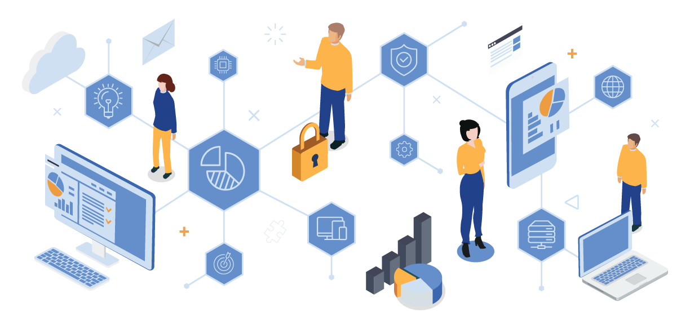
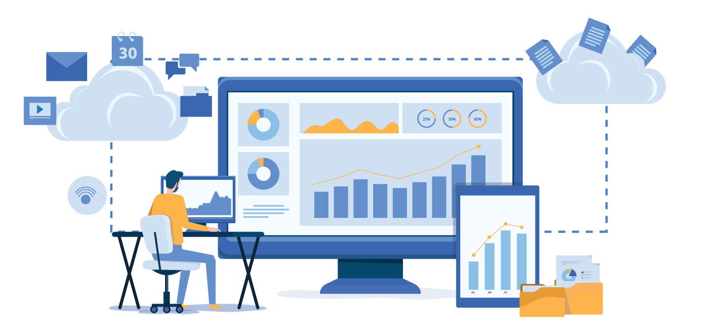
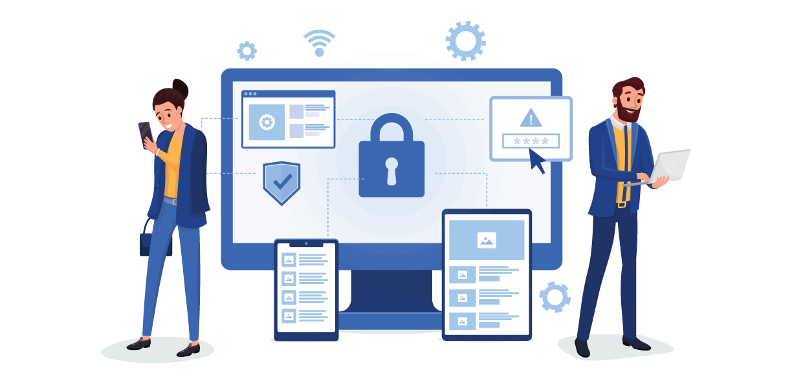

As the world becomes more interconnected, company boundaries are becoming more blurred. Businesses are now more connected than ever as they strive to create efficiencies and drive growth.

In the new workplace paradigm, access to IT resources is no longer limited to internal employees. Customers, partners, contractors, vendors, suppliers, and other stakeholders now have a level of access that was once unthinkable, with the sole purpose of driving value back to the business. This concept is known as the extended enterprise.

However, with this level of access comes a unique set of challenges around identity and access management (IAM). How do you manage the identities of all these external users and ensure that they have the appropriate level of access to company resources?

After all, the traditional IAM solution often used for managing internal employees is not well suited for managing extended enterprise users. In this blog post, we'll explore the challenges of identity management in an extended enterprise and why Authgear is the best solution.

<nav id="table-of-content">
    <ul> 
        <li><a href="#definition">What Is Extended Enterprise?</a></li>
        <li><a href="#components">Components of the Extended Enterprise Network</a></li>
        <li><a href="#challenges">Challenges of Managing Identity & Access in Extended Enterprise</a></li>
        <li style="margin-bottom:0"><a href="#features">How Authgear Can Help</a>
            <ul>
                <li style="margin-top:15px"><a href="#self-service">Self-Service Registration and Approval Process</a></li>
                <li><a href="#admin">Admin Portal & Self-Service Setting Page</a></li>
                <li><a href="#passwordless">Passwordless & 2FA</a></li>
                <li><a href="#access-control">Role-Based & App-Based Access Control</a></li>
                <li><a href="#integration">Integration with HR System and WIAM</a></li>
            </ul>
        </li>
        <li><a href="#authgear">Simplify Identity & Access Management for Extended Enterprise with Authgear</a></li>
    </ul>
 </nav>

<h2 id="definition">What Is Extended Enterprise?</h2>

<!--FIGURE-->

<!--/FIGURE-->

An extended enterprise is a network of organizations, people, and technological resources that work together to create value for the business. It includes all the business stakeholders, such as customers, partners, suppliers, and contractors.

A company’s IT assets were confined to a single physical location or platform in a traditional enterprise setting. Only internal employees could access these resources.

However, as the business landscape has changed, this traditional model is no longer feasible. Locking out external players does not allow businesses to attain the level of connectivity and agility needed to thrive in a competitive environment.

Nowadays, businesses need to share information and collaborate with various external partners to succeed. The extended enterprise model enables companies to do just that.

In other words, in an extended enterprise, businesses need to look beyond their four walls to include all the stakeholders that contribute to their success. This means forming a network of external and internal users who can access the company’s IT resources.

The availability of cloud-based applications and services has made it easier for businesses to adopt an extended enterprise model. With the click of a button, businesses can grant access to anyone, anywhere in the world.

<h2 id="components">Components of the Extended Enterprise Network</h2>

<!--FIGURE-->

<!--/FIGURE-->

An extended enterprise comprises various parties that contribute to the business's success. It includes all the internal and external stakeholders with access to the company’s IT resources.

The main components of an extended enterprise network are:

*Vendors*: The main role of vendors is to sell raw or semi-finished products that businesses use to manufacture products. They’re key players in an extended enterprise because the quality of the final product depends on the quality of the raw material they supply.

*Distributors*: When manufacturers do not sell their products directly to the final consumers, they rely on distributors like wholesalers, retailers, and resellers to assess the product's demand and distribute it. These distributors use marketing and promotional activities to increase the product's reach. Businesses must maintain close ties with their distributors to ensure their products reach the end users.

*Technicians*: Also known as service providers, these are the people who maintain and repair the company’s IT infrastructure and applications. They play a vital role in keeping the business running smoothly.

*Contractors*: Contractors are usually hired to provide a service for a specific period of time. They’re different from employees because they’re not on the company’s payroll. An extended enterprise can have various types of contractors, such as IT, marketing, operation, and so on.

*Partners*: Partners are usually other businesses that complement the company’s products or services. They can be distributors, retailers, vendors, or any other type of business. For example, a phone manufacturer will have a partnership with a mobile service provider.

*Customers*: Customers are the people who purchase a company’s products or services. They can be individuals or organizations. Businesses must satisfy their customers to ensure repeat business and build a good reputation.

This list is not exhaustive, and the stakeholders in your extended enterprise will depend on the nature of your business.

<h2 id="challenges">Challenges of Managing Identity & Access in Extended Enterprise</h2>

<!--FIGURE-->

<!--/FIGURE-->

The extended enterprise model comes with its own set of challenges, the most important of which is managing identity and access. In an extended enterprise, businesses need to give many people access to their IT resources.

Your business needs to allow all stakeholders to access your applications. Using traditional IAM to manage these identities can be cumbersome and time-consuming for your IT department.

Your IT team will have to create seats in the IAM solution for everyone involved. The IT department must also ensure that access and configuration changes are made promptly and set up correctly. It's easy to make mistakes when you have to manage a large number of identities.

For instance, real estate companies operating under the extended enterprise model might have applications that both their brokers and internal employees can access. However, they will certainly not want these parties to access the HR system.

The biggest problem is that the HR system is integrated with the IAM solution, and the company still needs to give brokers access to its applications. In that case, a problem arises: how can the company give brokers access to some applications but not others?

Another challenge is that the extended enterprise network is constantly changing. New stakeholders are added, and existing ones leave.

This means that the access rights need to be updated regularly to reflect these changes. As stakeholders keep changing, it is difficult to keep track of who has access to what. Managing each seat in an IAM solution can also be expensive, especially when you have many users.

<h2 id="features">How Authgear Can Help</h2>

<!--FIGURE-->

<!--/FIGURE-->

To better work with different parties, such as contractors, freelancers, vendors, and suppliers within the extended enterprise, businesses tend to build new applications for them to use along with internal employees; however, the underlying problems can be quite troubling.

Authgear provides an all-in-one solution for you to resolve any identity & access management issues related to extended enterprise on your apps to maximize the overall productivity.

The goal is to help your business operate with the lowest security risk and minimize IT complexity. Authgear also focuses on facilitating collaboration and providing a smooth user experience. Our solution has the following features that make it easy to manage extended enterprise access and identity:

<h3 id="self-service">Self-Service Registration and Approval Process</h3>

Authgear offers a pre-built login and signup page that external users can use to create accounts and log in independently. These users don’t have to wait for you IT to send them invitation links and your IT department does not have to to create corporate email accounts for them, which can incur significant costs on your IAM platform and also take quite some time to configure. This self-service flow is guarded with our approval process feature, allowing your IT department to make sure all the signups are from authorized personnels.

These features facilitate a frictionless yet secured user experience. Your enterprise can onboard internal and external partners more easily while freeing up your IT team's time since the team doesn't have to be involved in matters related to passwords and authentication as much.

<h3 id="admin">Admin Portal & Self-Service Setting Page</h3>

Some users may require assistance from the IT support team. Authgear has an admin portal that your support team can use to create, remove, revoke, or disable users’ sessions. The admins need only a few clicks to do all this.

Moreover, Authgear also has a pre-built account setting page that makes it easy for users to take care of the aforementioned matters by themselves. The page also allows external users to change their passwords, set up 2FA, revoke sessions that are actively signed in, and change their profile details. They can do all this without contacting the IT support team.

The admin portals also have analytics features for gathering insight that your company can use for marketing or security. It also has an audit log to track all the actions taken within the portal, making it easy to identify security concerns.

<h3 id="passwordless">Passwordless & 2FA</h3>

With Authgear, users don't have to cram another password into their already overloaded brains. Authgear offers various passwordless authentication methods to make life easier for users.

One is <a href="/features/whatsapp-otp" target="_blank">WhatsApp OTP</a>, which allows users to log in to their accounts using WhatsApp. The users receive an OTP through WhatsApp instead of an SMS. Not only is WhatsApp OTP much more secure compared to SMS OTP due to its end-to-end encryption, it’s cost per OTP is also much lower, allowing businesses to scale in a more cost-effective manner.

Another authentication method is <a href="/features/social-login" target="_blank">social logins</a>, which simplify customers’ registration by integrating the login process with logins to popular social platforms. Once users sign up using their social logins, you will obtain their email addresses that their providers of social networks verify.

<a href="/features/passkeys" target="_blank">Passkeys</a> is the real deal in giving your users a passwordless experience. If your apps support passkeys, users will sign up or log in without entering complex passwords that cybercriminals can target. After signing up using a username, the users will only need <a href="/features/biometric-authentication" target="_blank">biometric authentication</a> to access their accounts.

These passwordless features enhance security and simplify the authentication flow. You can also add 2FA as an extra security layer to ensure that only authorized users can access the account.

<h3 id="access-control">Role-Based & App-Based Access Control</h3>

Authgear supports role-based access control (RBAC) and application-based access control (ABAC). RBAC allows you to control a user’s access to specific resources by assigning the user a role. The roles can be pre-defined or created on the fly.

On the other hand, ABAC is a flexible access control model that uses attributes to determine a user’s access to specific apps or software. The attributes can be the user’s identity, the context of the request, or the resource itself.

Both RBAC and ABAC are important in managing extended enterprise access. With Authgear, you can easily add and remove users from specific roles or applications. This way, you can control which users have access to which resources.

<h3 id="integration">Integration with HR System and WIAM</h3>

Authgear can be easily integrated with your HR system and Workforce Identity and Access Management (WIAM). The integration allows you to manage extended enterprise access from one place.

From the HR system, you can provision and de-provision users based on their status in the system. The WIAM integration allows you to manage user roles and permissions. With Authgear, you can easily add and remove users from specific roles or applications.

<h2 id="authgear">Simplify Identity & Access Management for Extended Enterprise with Authgear</h2>

Authgear helps you centralize internal and external identity and access management to maximize productivity, boost security, and enhance user experience. Integrating your business applications with Authgear is quite simple with our software development kits (SDKs). <a href="/talk-with-us" target="_blank">Contact us</a> for us to learn more about your use case and see how Authgear can help you maximize the productivity and proftability of your extended enterprise.
