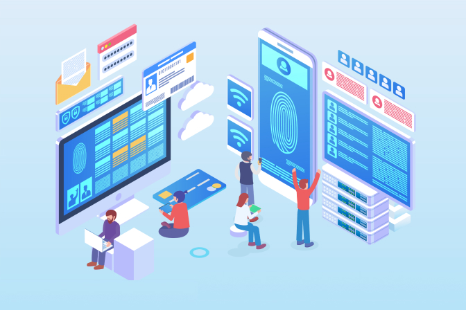
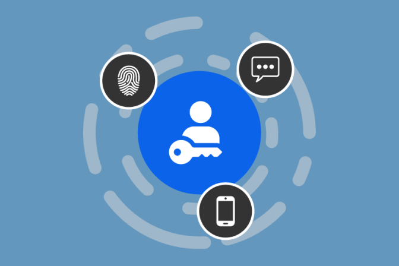

            In today's digital landscape, providing a seamless and frictionless authentication experience has become an essential requirement for businesses. However, achieving the delicate balance between robust security measures and a user-friendly experience can be quite challenging. While password authentication remains the most widely used method, it also poses the biggest hurdle in terms of friction. Throughout the user journey, from sign-up to login and even during the checkout process, various points of friction can arise, potentially leading to cart abandonment, decreased sales, and frustrated customers.

In this blog post, we will explore the significance of frictionless authentication, what composes a frictionless authentication, and how businesses can benefit from it.

<nav id="table-of-content">
    <ul>
        <li><a href="#def">What Is Frictionless Authentication?</a></li>
        <li><a href="#why">Why Should You Make Your Authentication Process Frictionless?</a>
            <ul>
                <li><a href="#ux">Deliver Excellent User Experience</a></li>
                <li><a href="#cx">Improve Customer Satisfaction and Retention</a></li>
                <li><a href="#sales">Boost Sales and Conversions</a></li>
            </ul>
        </li>
        <li><a href="#how">How to Make Your Authentication Process Frictionless?</a>
            <ul>
                <li><a href="#passkey">Enable Passkey as the Primary Authenticator</a></li>
                <li><a href="#biometrics">Implement Biometric Authentication as Part of Your MFA</a></li>
                <li><a href="#social">Integrate Popular Social Login to Shorten Signup/Login Time</a></li>
                <li><a href="#data">Collect User Data Progressively</a></li>
            </ul>        
        </li>
        <li><a href="#cases">How Different Industries Benefits from Adopting Frictionless Authentication</a>
            <ul>
                <li><a href="#bank">Banking and Financial Services</a></li>
                <li><a href="#retail">E-commerce and Retail</a></li>
                <li><a href="#public">Government and Public Sector</a></li>
            </ul>
        </li>
        <li><a href="#future">The Future of Frictionless Authentication</a></li>
        <li><a href="#authgear">Implement Frictionless Authentication with Authgear</a></li>
    </ul>
</nav>

<h2 id="def">What Is Frictionless Authentication?</h2>

<!--FIGURE-->

<!--/FIGURE-->

Frictionless authentication is an approach that leverages advanced technologies and techniques to streamline the verification process, eliminating the need for explicit user actions while maintaining high security standards. Users do not need to take extra steps or provide additional information at different stages of their journey to verify their identity, thereby delivering a seamless user experience.

<h2 id="why">Why Should You Make Your Authentication Process Frictionless?</h2>

Integrating frictionless authentication into your user journey offers several compelling advantages. By eliminating the common pain points associated with traditional password-based authentication, your business can reap the following benefits:

<h3 id="ux">Deliver Excellent User Experience</h3>

Password fatigue is a widespread issue in today's digital age and one of the obstacles to an excellent user experience. Users experience an unpleasant feeling of exhaustion when they struggle to remember numerous passwords that they’ve created for different sites. Simplifying authentication by reducing reliance on passwords can significantly alleviate user frustration and the need to remember multiple login credentials.

<h3 id="cx">Improve Customer Satisfaction and Retention</h3>

A frictionless authentication experience directly contributes to increased customer satisfaction. By prioritizing user convenience without compromising security, you can build trust, foster loyalty, and retain customers for the long term.

<h3 id="sales">Boost Sales and Conversions</h3>

A complex and time-consuming authentication process can act as a barrier to completing purchases, leading to cart abandonment. Implementing frictionless authentication can enhance the conversion rate, driving more sales and revenue for your business.

<h2 id="how">How to Make Your Authentication Process Frictionless?</h2>

<!--FIGURE-->

<!--/FIGURE-->

To implement a seamless authentication experience, consider adopting the following best practices or implementing the following authentication methods throughout the customer journey:

<h3 id="passkey">Enable Passkey as the Primary Authenticator</h3>

<a href="/features/passkeys" target="_blank">Passkeys</a> is a new category of digital credentials that allow users to log into applications without using complex passwords that are vulnerable to cyber-attacks. Users don’t have to create complex passwords when signing up, after which they will be authenticated using biometrics or PIN, exactly how they unlock their phones. Passkeys then not only reduces friction during the login and sign-up processes but also enhance data security since attackers have no way to trick the users into giving them the credentials.

<h3 id="biometrics">Implement Biometric Authentication as Part of Your MFA</h3>

Many applications have set session timeouts to prevent session-based attacks. However, it can be quite frustrating for users if they have to enter their passwords again and again after each session ends. Replacing password-based authentication with <a href="/post/biometric-authentication" target="_blank">biometric authentication</a> significantly reduces friction during login since users simply have to press in the fingerprint scanner or look into the cameras on their mobile phones for authentication. Moreover, these biometric markers are difficult to replicate, making them highly secure and convenient for users.

<h3 id="social">Integrate Popular Social Login to Shorten Signup/Login Time</h3>

Social login allows users to sign up or log in using information from their existing social media accounts, such as Facebook or Google and you rarely see sites or applications without them. <a href="/post/social-login-guide" target="_blank">Social login</a> not only simplifies the registration process but also eliminates the need to create and remember yet another set of credentials.

<h3 id="data">Collect User Data Progressively</h3>

Businesses have the tendency to ask for as much information as possible on the signup or contact forms for lead qualification and marketing campaigns. This, however, creates much friction for the users. To reduce friction, you can ask for only the essential information during the initial stages of the user journey. Request additional data progressively, preferably when it adds value or is necessary for personalized experiences. This approach minimizes friction during the sign-up process and enhances user engagement.

<h2 id="cases">How Different Industries Benefits from Adopting Frictionless Authentication</h2>

All industries can benefit significantly from adopting frictionless authentication. It has found widespread adoption across various industries and applications, revolutionizing the way users interact with digital platforms. Some notable examples include:

<h3 id="bank">Banking and Financial Services</h3>

The banking and financial services sector has embraced frictionless authentication to enhance security and convenience for their customers. Biometric authentication methods, such as fingerprint or facial recognition, enable users to securely access their accounts, authorize transactions, and eliminate the need for traditional authentication methods like PIN codes or security questions.

<h3 id="retail">E-commerce and Retail</h3>

In the world of e-commerce and retail, frictionless authentication simplifies the checkout process, reducing cart abandonment rates and enhancing the overall customer experience. By utilizing biometrics or behavioral biometrics, customers can securely complete purchases without the hassle of entering passwords or payment details, making online shopping more convenient and secure.

<h3 id="public">Government and Public Sector</h3>

The public sector can benefit much from incorporating frictionless authentication since modern consumers now also expect the public sector to deliver the same level of smooth and seamless experiences they encounter in other industries. With frictionless authentication, the public sector can not only improve convenience for citizens accessing government services but also strengthens security measures by reducing reliance on the traditional passsword-based authentication.

<h2 id="future">The Future of Frictionless Authentication</h2>

The future of frictionless authentication holds exciting possibilities. Advancements in artificial intelligence and machine learning will continue to refine and enhance the accuracy and security of biometric and behavioral authentication methods. Additionally, the integration of frictionless authentication with Internet of Things (IoT) devices, such as smart home systems or wearable devices, will further simplify and secure our interactions with connected devices and services.

<h2 id="authgear">Implement Frictionless Authentication with Authgear</h2>

Authgear is a customer identity and access management solution that helps businesses deliver frictionless authentication to their external users, including supplies, business partners, and customers. By offering a seamless and secure authentication experience, you can enhance user convenience, improves operational efficiency, and more importantly increase sales and retention rate. <a href="/schedule-demo/" target="_blank">Contact us</a> today to tell us more about your business and learn more about how Authgear can make your authentication process frictionless.
