User sign-ups are a crucial aspect of most web applications, and keeping track of them can provide valuable insights. Getting notified when a new user signs up is not just about knowing the numbers, but also about immediate user engagement. For example, you can send a welcome message or introduce them to special sign-up bonuses or offers as soon as they get authenticated in your system. When it comes to user authentication, <a href="/" target="_blank">Authgear</a> provides an extensive suite of authentication features. What if you want to receive immediate notifications in Slack when a new user signs up?

There are many low-code tools to achieve this like <a href="https://zapier.com/" target="_blank">Zapier</a> and <a href="https://n8n.io/" target="_blank">N8n</a>.  However, with Authgear you can integrate both authentication and sending messages. This article will guide you through the process of integrating Authgear's **Hooks and Events** with <a href="https://slack.com/" target="_blank">Slack</a> to achieve just that.

## **Why Authgear?**

As **Authgear** is an identity-as-a-service (IDaaS) platform that supports various authentication methods like <a href="/features/social-login" target="_blank">social logins</a>, <a href="/features/passwordless-authentication" target="_blank">passwordless</a>, <a href="/features/biometric-authentication" target="_blank">biometrics logins</a>, <a href="/features/whatsapp-otp" target="_blank">one-time-password (OTP)</a> with SMS/WhatsApp, and more.  It has built-in customizable login pages, you do not have to spend time designing UI and implementing complex authentication flows. It's designed to be developer-friendly and has <a href="https://docs.authgear.com/how-to-guide/events-hooks/denohooks" target="_blank">Hooks</a> to react to different user-related events. Authgear offers an in-browser code editor where you can write **JavaScript/Typescript code** to add extra logic that is stored and runs on serverless infrastructure maintained by Authgear. We are going to use this capability to send Slack message after a new user sign up.

## Prerequisites

- **Authgear Account:** If you do not have one, you can sign up for a <a href="https://portal.authgear.com/" target="_blank">free Authgear account</a>.
- **Configure an application in Authgear**. Any web-based, mobile, or desktop application will work. If you don't have any applications that use Authgear, you can create one by following the <a href="https://docs.authgear.com/get-started/start-building" target="_blank">Authgear Start Building</a> page.
- **Slack account:** If don't have a Slack account, sign up for a new free one [here](https://slack.com/get-started) and go to the Slack <a href="https://slack.com/get-started#/createnew" target="_blank">Get Started page</a>.
- **Slack workspace:** You need access to a Slack workspace where you're an admin. If you are creating just a new workspace, follow <a href="https://slack.com/help/articles/206845317-Create-a-Slack-workspace" target="_blank">this guide</a>.

## Setting up the Slack Webhook

Before integrating Authgear, you'll need to create a webhook in Slack.

### Create a Slack Workspace

As you can see, I created a new workspace called authgear-example-sign-up:

<!--FIGURE-->
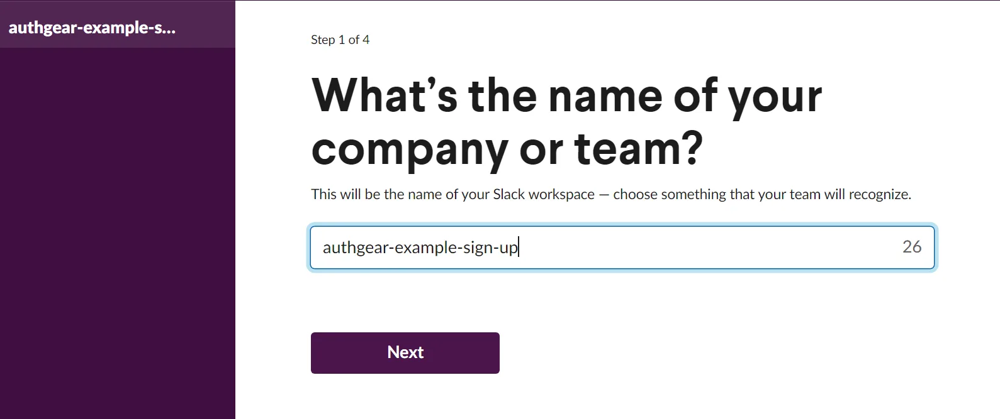
<!--/FIGURE-->

Created a new Admin account there:

<!--FIGURE-->
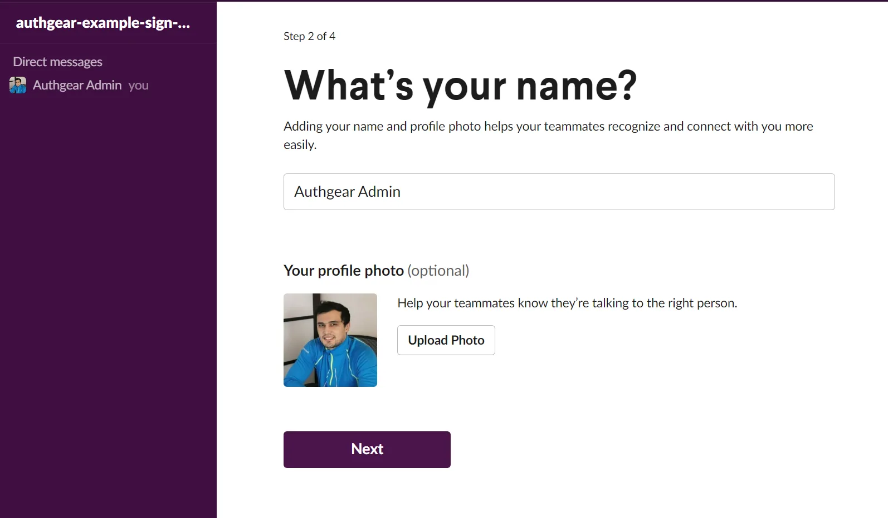
<!--/FIGURE-->

Initiated a new Slack channel named notification-sign-upwhere we receive a notification when a user signs up:

<!--FIGURE-->
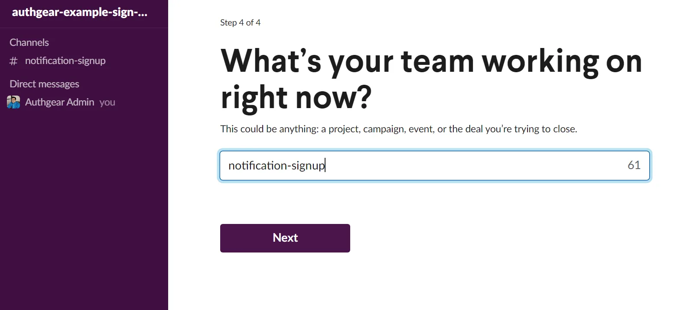
<!--/FIGURE-->

### Create a Slack App

Navigate to the <a href="https://api.slack.com/apps" target="_blank">Slack API page</a>, and create a new app **from scratch**. We use it to send the webhook information:

<!--FIGURE-->
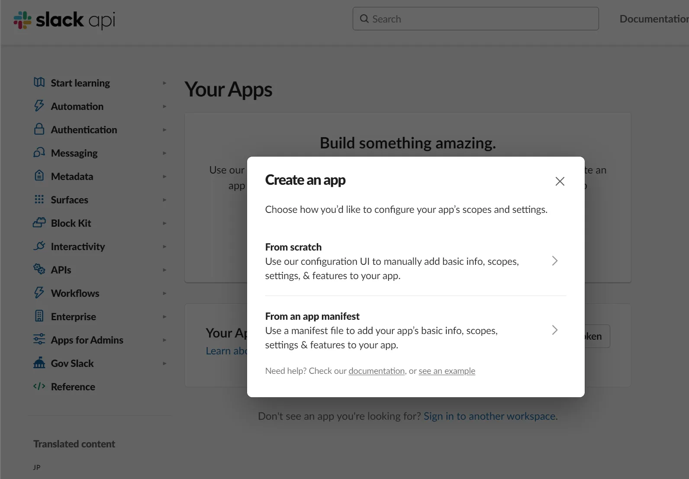
<!--/FIGURE-->

In the next step, you provide the app name and select the workspace that you want to connect the app to. Make sure this is the correct app because you can't change the app's workspace later. After you pick a workspace, click **Create App**.

<!--FIGURE-->
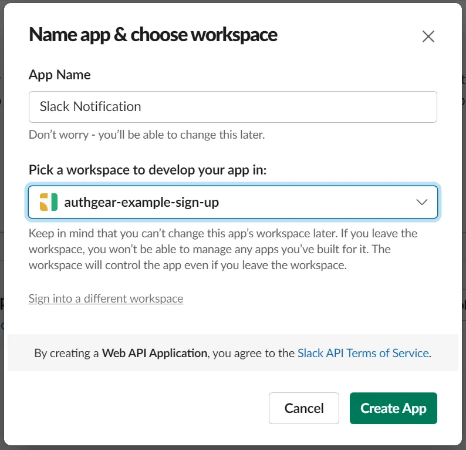
<!--/FIGURE-->

### Enable Incoming Webhooks

Under the "Add features and functionality" section, click on "Incoming Webhooks" and activate them.

<!--FIGURE-->
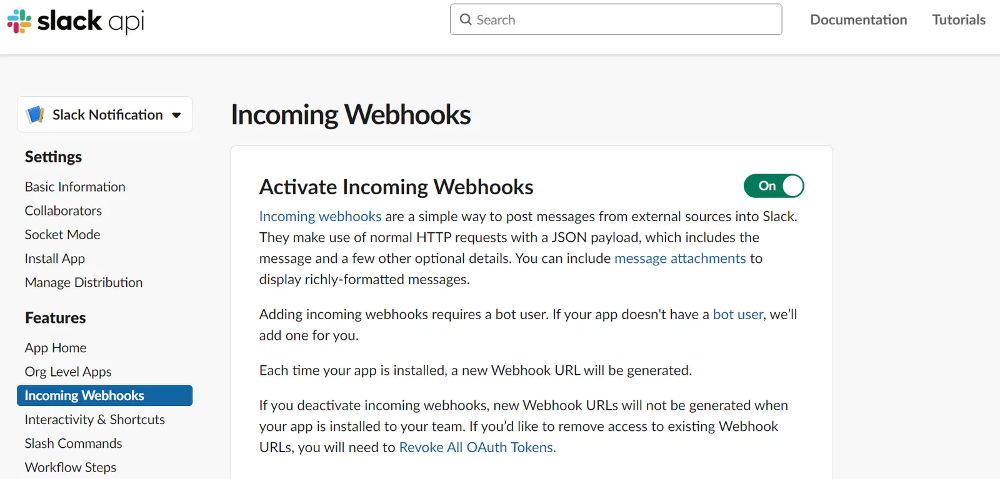
<!--/FIGURE-->

Scroll down and click on "Add New Webhook to Workspace." Select the channel where notifications should be sent, and click "Allow.”

<!--FIGURE-->
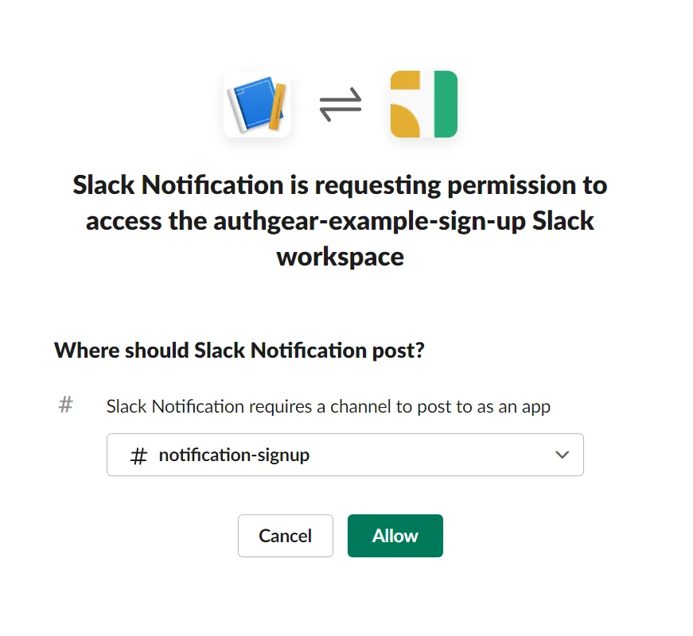
<!--/FIGURE-->

Scroll down and click on "Add New Webhook to Workspace." Select the channel where notifications should be sent, and click "Allow.”

<!--FIGURE-->
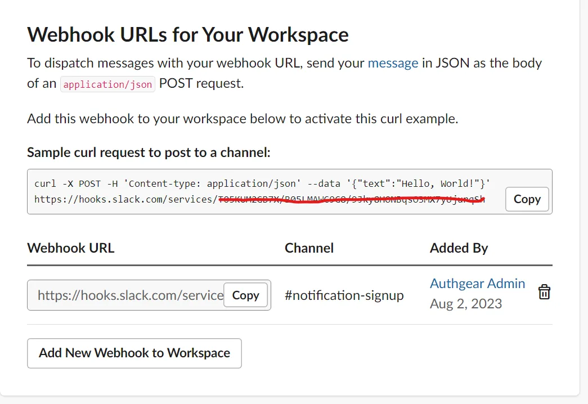
<!--/FIGURE-->

## Integrating Authgear with Slack Webhook

With the Slack Webhook URL in hand, you can now set up the Authgear Hook to respond to the <a href="https://docs.authgear.com/how-to-guide/events-hooks/event-list#user.created" target="_blank">user.created</a> event of <a href="https://docs.authgear.com/how-to-guide/events-hooks#non-blocking-events" target="_blank">non-blocking</a> type.

### Writing a Hook Function

Navigate to **Advanced**->**Hooks** section in the <a href="https://portal.authgear.com/" target="_blank">Authgear Portal</a>. **Add** a new **Non-blocking** Event:

<!--FIGURE-->
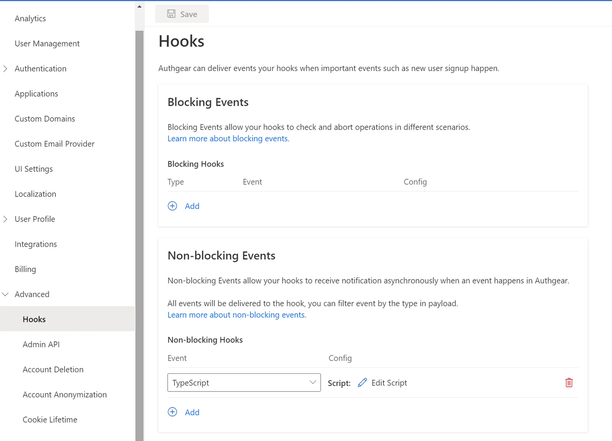
<!--/FIGURE-->

Choose the Hook **Type** as the *TypeScript.*You will write a function to respond to the user creation event and send a notification to Slack. Click on **Edit Script** under the **Config** option, it will bring you to the editor:

<!--FIGURE-->
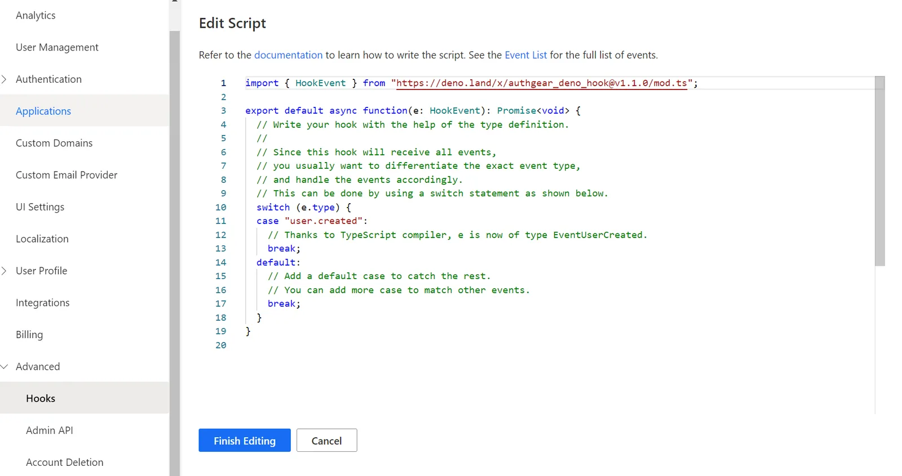
<!--/FIGURE-->

We want to send a POST request to a Slack webhook URL when EventUserCreated is triggered:

```

import { EventUserCreated } from "https://deno.land/x/authgear_deno_hook@v1.1.0/mod.ts";

export default async function(e: EventUserCreated): Promise<void> {
 
    const url = "YOUR_SLACK_WEBHOOK_URL";
    // Replace the text below with the actual message you want to send.
    const message = `New account signup: ${e.payload.identities[0].claims.email} has joined!`;
    const payload = {
      text: message,
    };
    const headers = {
      "Content-Type": "application/json",
    };
    // Send a POST request to the Slack webhook URL with the message.
    await fetch(url, {
      method: "POST",
      headers: headers,
      body: JSON.stringify(payload),
    });
      
}
  
			</void>
```

This async TypeScript function will run after a user is registered. Replace *YOUR_SLACK_WEBHOOK_URL* with the URL copied earlier.  Once that is done, click on **Finish Editing** and **Save** the changes on the Hooks page.

### Validate the new hook

After everything is configured, we can test the newly created hook in action. The easiest way to test it is by creating a **new user** from the **User Management** page in [Authgear Portal](https://portal.authgear.com/) manually.

<!--FIGURE-->
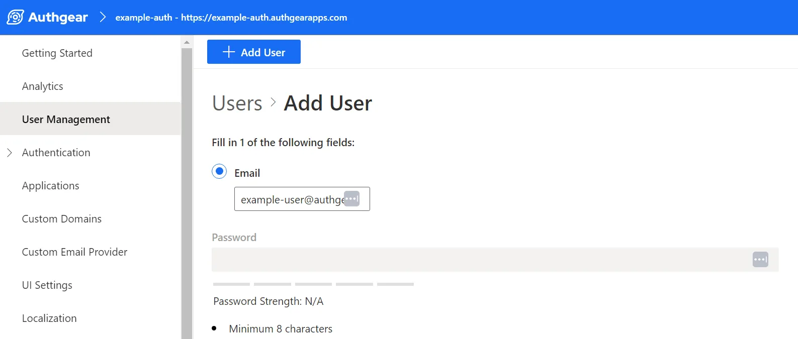
<!--/FIGURE-->

### Validate the new hook

After everything is configured, we can test the newly created hook in action. The easiest way to test it is by creating a **new user** from the **User Management** page in <a href="https://portal.authgear.com/" target="_blank">Authgear Portal</a> manually.

<!--FIGURE-->
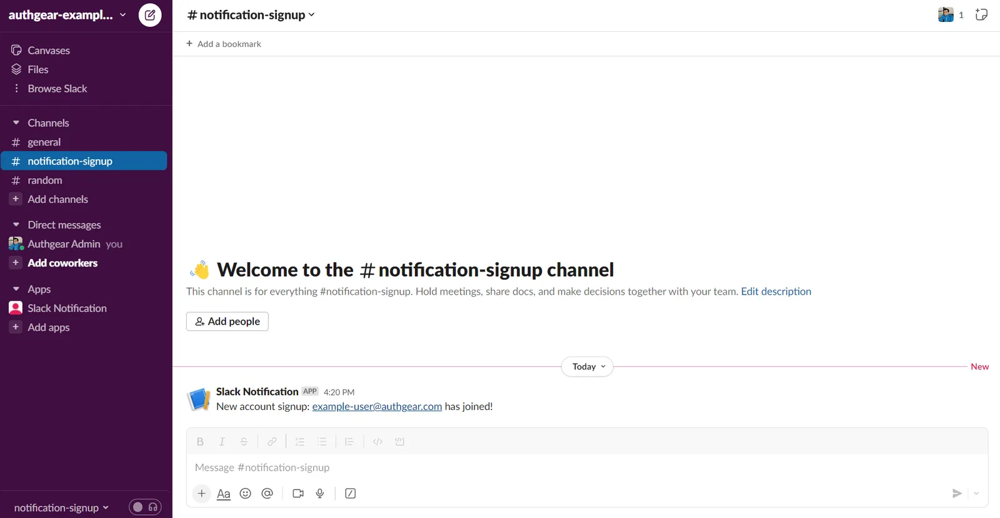
<!--/FIGURE-->

Another way to validate it is when a new user goes through the sign-up process after you integrated your system with Authgear App and configured the login method for your users. Or you could also use the **Try it now** option on the Authgear dashboard's **Getting Started** page.

<!--FIGURE-->
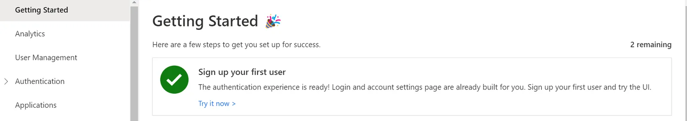
<!--/FIGURE-->

After you sign up with an email, Slack message will be sent:

<!--FIGURE-->
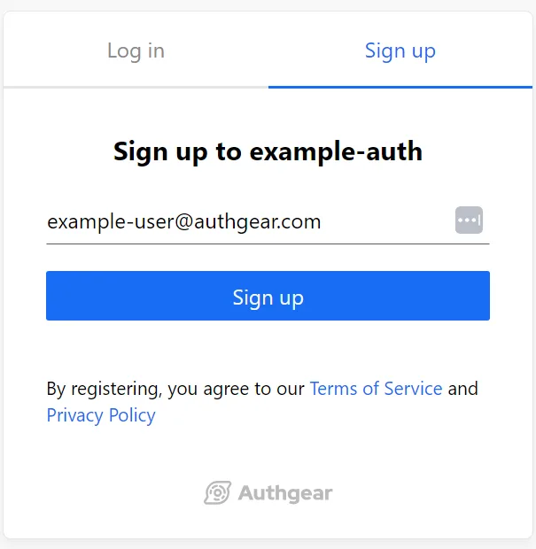
<!--/FIGURE-->

## Summary

Authgear's Hooks provides a customizable way to respond to user-related events. By integrating with Slack, you can receive real-time updates on user sign-ups directly in your preferred channel. Make sure to explore other <a href="https://docs.authgear.com/how-to-guide/events-hooks/event-list" target="_blank">events</a> and tailor the integration to your specific needs!

### Related resources

<a href="/post/how-profile-enrichment-can-boost-your-product" target="_blank">How Profile Enrichment can boost your product</a>
