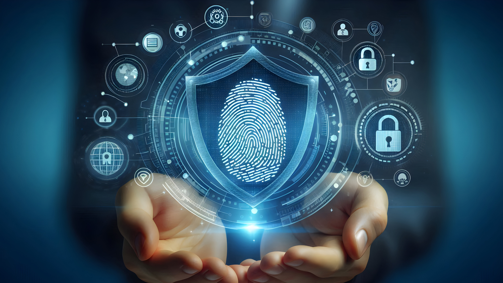

## How Does Biometric Authentication Work? A Comprehensive Guide to the Future of Security

> **tl;dr** — Biometric authentication captures a physical trait (fingerprint, face, iris), compares it locally to an enrolled template stored in the device's secure enclave, and on match unlocks a private key that signs a server challenge. The biometric never leaves the device; only the cryptographic signature does. As of 2026, Apple Face ID, Touch ID, Windows Hello, and Android Class 3 sensors are all FIDO2-compatible — meaning any WebAuthn-enabled app or website can use them as a phishing-resistant login factor.

Biometric authentication has revolutionized digital security by transitioning from traditional password-based systems to methods relying on unique physical or behavioral traits. This shift has significantly enhanced security and user convenience. Early biometric pioneers focused on fingerprint recognition, employing capacitive sensors to capture detailed impressions. Advancements in technology led to the incorporation of optical and ultrasonic sensors, improving accuracy and reliability.

### 2026 Adoption Snapshot

- **iOS 18+**: Face ID is on every iPhone since 2017 and on iPad Pro / iPad Air since 2018. Touch ID remains on the iPhone SE line and most Macs.
- **Android 14+**: Class 3 fingerprint is shipping on every flagship (Samsung Galaxy S, Pixel 9, OnePlus). Class 3 face unlock is still mostly Pixel and high-end Samsung. Budget devices remain Class 2.
- **Windows 11**: Windows Hello (face or fingerprint) ships on roughly 80% of new business laptops. Microsoft's "passwordless by default" push from 2025 made it the default sign-in for new Microsoft 365 accounts.
- **WebAuthn / passkeys**: Supported in Safari, Chrome, Edge, and Firefox on every major OS. Google reports passkey adoption surpassed 1 billion sign-ins per month in late 2025.

However, the landscape expanded with the introduction of facial recognition, exemplified by Apple's Face ID. This technology leverages sophisticated 3D mapping sensors to create a detailed facial representation, coupled with attention awareness for enhanced security. While fingerprint recognition primarily relies on physical characteristics, facial recognition incorporates behavioral elements like facial expressions and head movements, making it a more dynamic form of authentication.

### Android Biometric Authentication: A Complex Landscape

<!--FIGURE-->

<!--/FIGURE-->

**Android biometric authentication presents a more intricate landscape compared to its iOS counterpart due to its open-source nature and diverse hardware manufacturers.** To address this variability, the Android Compatibility Definition Document (CDD) categorizes biometric devices into two security classes: Class 3 (BIOMETRIC_STRONG) and Class 2 (BIOMETRIC_WEAK). While fingerprint sensors often meet the rigorous Class 3 standards, facial recognition systems, especially those without advanced 3D mapping capabilities, frequently fall into the less secure Class 2 category. This disparity underscores the importance of developers thoroughly evaluating the biometric capabilities of target devices to ensure robust security when implementing Android biometric authentication solutions.

While Android biometric authentication offers enhanced security and user convenience, it comes with its own set of challenges:

- **Fragmentation:** The diverse range of Android devices and operating system versions creates inconsistencies in biometric hardware and software implementations, making it difficult to develop robust and compatible authentication solutions.
- **Security Risks:** Class 2 biometric devices are susceptible to spoofing attacks, compromising the security of sensitive data. Additionally, improper key management and storage can expose users to vulnerabilities.
- **User Experience:** Integrating biometric authentication seamlessly into the user experience can be challenging, as it requires careful consideration of factors such as enrollment processes, error handling, and fallback mechanisms.
- **Regulatory Compliance:** Adhering to various biometric data protection regulations and privacy laws adds complexity to the development and deployment of biometric authentication systems.

### Apple Face ID and Touch ID: Hardware-Backed by the Secure Enclave

Apple's biometric stack — Face ID on Face ID-equipped iPhones and iPads, Touch ID on the iPhone SE and most MacBooks — is anchored by the **Secure Enclave**, a dedicated security coprocessor that runs its own OS and stores cryptographic keys that the main CPU cannot read. The biometric template is generated and stored exclusively inside the Secure Enclave; iOS and apps never see it.

For developers, the practical entry points are:

- **`LocalAuthentication.framework`** — `LAContext.evaluatePolicy(.deviceOwnerAuthenticationWithBiometrics, ...)` for protecting an action behind biometric verification.
- **Keychain access control** — bind a key to `kSecAccessControlBiometryCurrentSet` so the key is invalidated if the user re-enrols a finger or face. Useful for high-assurance flows like banking.
- **Passkeys / `ASAuthorizationPlatformPublicKeyCredential...`** — for FIDO2 / WebAuthn sign-in. Face ID or Touch ID gates the platform authenticator.

Face ID uses a 3D dot-projector + IR camera, so it is resistant to photo and mask spoofing. The Spoof Acceptance Rate published by Apple is < 1 in 1,000,000 (vs 1 in 50,000 for Touch ID). Both are FIDO2-certified at the strongest level.

### Windows Hello: Face, Fingerprint, and TPM-Backed Keys

Windows Hello supports three biometric modalities — face (IR camera, 3D depth), fingerprint, and (in enterprise builds) iris — plus a fallback PIN. All credentials are sealed in the device's **Trusted Platform Module (TPM 2.0)**, which is a hardware requirement for Windows 11.

For developers, Windows Hello shows up in two places:

- **Web apps**: through WebAuthn — the browser calls `navigator.credentials.create()` / `.get()` and Windows Hello handles the user gesture. No Windows-specific code is needed.
- **Desktop apps**: through the **Windows.Security.Credentials.UI** namespace (UWP) or the **Web Account Manager** APIs. Both bind keys to the TPM and require Windows Hello to release them.

A Windows Hello-protected key is non-exportable: even an attacker with full administrator access cannot copy it to another machine, because the TPM enforces a per-device, per-user binding. This is what makes Windows Hello phishing-resistant — there is no shared secret to steal.

### Beyond Biometric Unlock: Secure Data Protection with Biometrics

<!--FIGURE-->

<!--/FIGURE-->

Both iOS and Android offer robust native APIs that empower developers to create applications leveraging biometric authentication for secure data protection. These APIs provide the necessary tools to encrypt sensitive data and restrict access to biometrically verified users. However, a common pitfall lies in the misconception that biometric authentication alone guarantees absolute security. **Many developers erroneously store plaintext passwords or refresh tokens on the device, assuming that biometric protection is sufficient.**This oversight can lead to catastrophic consequences if the device is compromised, as attackers can potentially access these critical credentials.

Tokenization is a security measure where sensitive data, such as credit card numbers, is replaced with a unique identifier known as a token. This token holds no intrinsic value and cannot be directly used to access the original data. When integrated with biometric authentication, tokenization fortifies security. This process involves converting sensitive data into a token, followed by biometric verification for access. The token is then employed for transactions or accessing protected resources while the original data remains encrypted and isolated, significantly reducing the risk of exposure in case of a data breach.

By combining biometric authentication and tokenization, organizations can enhance security, prevent fraud, and comply with data privacy regulations. Additionally, it streamlines payment processes and improves user experience by eliminating the need to remember complex passwords. A prime example is biometric payment authentication, where a user's credit card information is tokenized and stored securely. Subsequent purchases require biometric verification, using the token for payment without exposing the original card details. This synergistic approach creates highly secure and user-friendly systems that safeguard sensitive data while providing convenient access.

### General Process of Biometric Authentication

<!--FIGURE-->

<!--/FIGURE-->

Biometric authentication involves a sophisticated sequence of steps to verify a user's identity securely. The process commences with key generation and user enrollment, where cryptographic keys are created and the user's biometric data is captured and transformed into a template. This template, encrypted using a public key, is securely stored.

During authentication, the user's biometric data is captured and compared to the encrypted template. A successful match triggers the decryption of the stored template using the private key. Subsequently, a challenge is generated and encrypted with the private key before being transmitted to the server for verification. The server's ability to decrypt the challenge using the corresponding public key confirms the user's identity.

This intricate process underscores the importance of robust cryptographic practices and secure key management in safeguarding biometric authentication. By combining these elements, biometric systems offer a high level of security and convenience for users.

### Step 1. Key Generation and Enrollment

1. Generate a cryptographic key pair (public and private key).
1. Securely store the private key on the device.
1. Enroll the user's biometric data (fingerprint, facial recognition, etc.) and create a biometric template.
1. Encrypt the biometric template using the public key and store it securely.

### Step 2. Authentication Process

1. If the biometrics capture is a match, the device uses the private key to decrypt the stored template.
1. A challenge is generated and encrypted using the private key.

### Step 3. Server Verification

1. The encrypted challenge is sent to the server.
1. The server attempts to decrypt the challenge using the public key.
1. If decryption is successful, the authentication is verified.

### How About Web Biometrics? A Deep Dive into WebAuthn

<!--FIGURE-->

<!--/FIGURE-->

Web biometrics extends the realm of biometric authentication to the web environment, allowing users to verify their identity using biometric factors like fingerprints or facial recognition directly within web applications. This is achieved through the Web Authentication API, commonly known as WebAuthn.

WebAuthn provides a standardized framework for integrating strong authentication into web-based services. It leverages platform-specific biometric sensors and security features to create a secure and user-friendly authentication experience. By relying on hardware-backed security keys and biometric factors, WebAuthn significantly enhances resistance to phishing attacks and credential theft.

While WebAuthn offers significant advantages, several challenges must be addressed for widespread adoption:

- Browser Compatibility: Ensuring consistent WebAuthn support across different browsers and operating systems can be complex due to varying levels of implementation.
- User Experience: Creating intuitive and user-friendly biometric enrollment and authentication processes is essential for widespread acceptance.
- Security Risks: Protecting against spoofing attacks and other vulnerabilities requires careful consideration of countermeasures and ongoing security assessments.
- Privacy Concerns: Addressing privacy concerns related to biometric data collection, storage, and usage is crucial for building user trust.
- Accessibility: Ensuring that WebAuthn is accessible to users with disabilities requires careful design and implementation.

By carefully addressing these challenges and leveraging the benefits of WebAuthn, developers can create robust and secure web applications that enhance user experience and protect sensitive information.

### The Future of Identity: A Deep Dive into Biometric Authentication

<!--FIGURE-->

<!--/FIGURE-->

Biometric authentication has emerged as a cornerstone of modern security, offering a robust and convenient alternative to traditional password-based systems. From the intricacies of hardware dependencies and software implementations to the complexities of web-based authentication and identity verification, understanding the underlying mechanisms is crucial for harnessing the full potential of this technology.

As biometric technologies continue to evolve, we can anticipate even more sophisticated and secure solutions that redefine the way we interact with digital systems.

Ready to elevate your application's security with biometric authentication?   
[Discover how Authgear simplifies the integration of robust biometric features into your web and mobile applications.](/features/biometric-authentication/)
