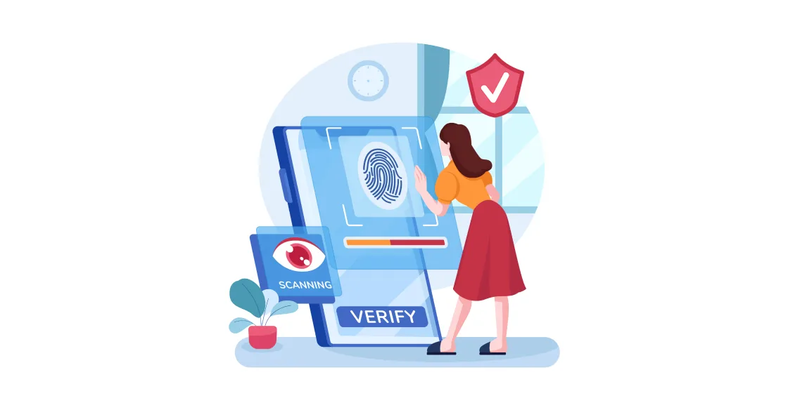
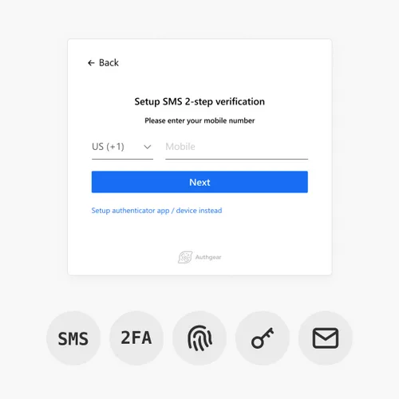
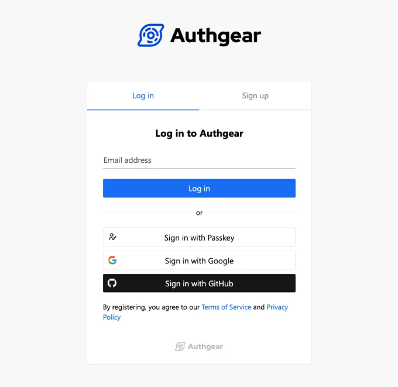
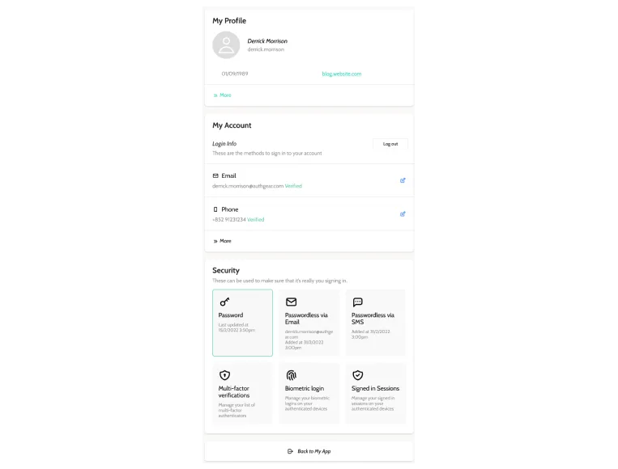
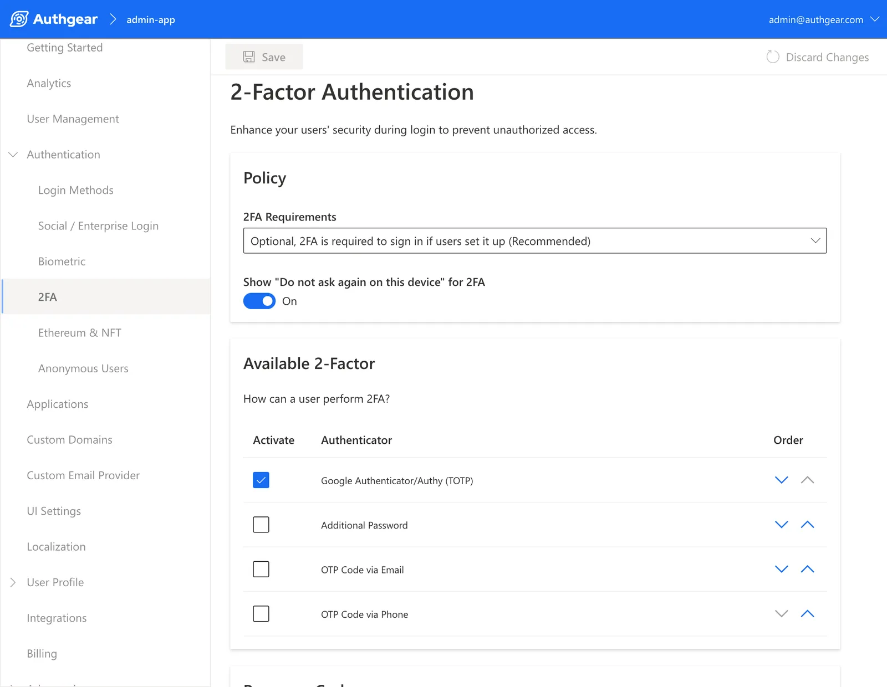

    
        As a recent <a href="https://www.pwc.com/us/en/industries/financial-services/library/next-in-insurance-top-issues.html" target="_blank">PWC</a> article pointed out, the Insurance industry is experiencing change at a more rapid rate than ever. The pandemic may have driven up <a href="https://www.pwc.com/us/en/industries/financial-services/library/insurance-consumer-survey.html" target="_blank">life insurance purchases</a>, but it also created a far more digitally demanding consumer base. Forced to stay at home and do everything online, we’re now impatient with anyone who can’t keep up.

When comparing a <a href="https://www.pwc.com/us/en/industries/financial-services/library/next-in-insurance-top-issues.html" target="_blank">survey</a> of 6000 insurance customers interviewed in 2018 to the same in 2021, PWC noted that there had been a 77% increase in users saying they’d prefer to submit mobile claims. They also showed that people who commented that they would switch carriers due to a lack of a user-friendly digital interface had increased by 80%. The big picture in all of this is that digital capabilities matter more than ever, especially in the insurance business.

Being digitally equipped no longer gives insurance companies an edge, it’s now a necessity. To meet consumers’ digital demands, insurance companies are also faced with how best to ensure data security and provide a seamless user experience. This is where insurance IAM at <a href="/" target="_blank">Authgear</a> can offer a solution. To understand how, keep reading.

<nav id="table-of-content"> Table of Content
    <ul>
        <li><a href="#why">Why Do You Need an Insurance IAM?</a>
            <ul>
                <li><a href="#customer">Customers Are Expecting Faster and Better Online Services</a></li>
                <li><a href="#external">Insurers Often Have to Work with External Parties</a></li>
            </ul>
        </li>
        <li><a href="#ciam">How Does Insurance IAM Help Insurers Acquire Life-Long Clients?</a>
            <ul>
                <li><a href="#signup">Smoother Signup and Login Experience</a></li>
                <li><a href="#ux">Better Customer Experience and Services</a></li>
                <li><a href="#security">Enhanced Cybersecurity</a></li>
            </ul>
        </li>
        <li><a href="#external-iam">How Insurers Can Work Better with External Team Members?</a>
            <ul>
                <li><a href="#productivity">Boost Productivity with Frictionless Onboarding</a></li>
                <li><a href="#it">Significantly Reduce IT Costs and Complexity</a></li>
                <li><a href="#business">Ensure Secure Yet Seamless External Access to Business Apps</a></li>
            </ul>
        </li>
        <li><a href="#authgear">Insurance IAM is Key to a Successful Insurance Business</a></li>
    </ul>
</nav>

<h2 id="why">Why Do You Need an Insurance IAM?</h2>

<!--FIGURE-->

<!--/FIGURE-->

IAM stands for “identity and access management” and can be broken down into different categories of use, each of which has its own benefits for insurers. It’s a blanket term for technology that helps to manage access security.

How we log into things affects our data security as well as the ease and speed at which we can access vital services and information. This is why insurance companies need to think about incorporating Authgear IAM and finessing their digital systems:

<h2 id="customer">Customers Are Expecting Faster and Better Online Services</h2>

With how digital our world has become clients are now expecting the same level of speed from all their online dealings. The ease of use when it comes to those online interactions is the new metric by which many judge their experience of insurers. A Customer Identity and Access Management (CIAM) solution allows insurers to authenticate clients wherever they are, at any time, and securely grant them access to the appropriate services.

An exciting feature that CIAM includes is multiple passwordless options – a game-changer for anyone sick of trying to keep track of passwords. Logins can be done with <a href="/features/whatsapp-otp" target="_blank">OTPs</a> which are sent via SMS or WhatsApp, or even biometric authentication. The <a href="/features/biometric-authentication" target="_blank">biometric authentication</a> that we offer at Authgear is quite different. Unlike what our competitor offers, our biometric authentication **has no timeout**. In other words, once the insurance clients log into the portals and enable biometric authentication, they can always securely log in again using biometric authentication forever using the logged in device, which is perfect for insurance clients who might only log in once or twice every year.

<!--FIGURE-->

<!--/FIGURE-->

Without getting too technical about it, biometric authentication generally use a refresh token to store the login session, but it has to be replaced every once  in a while (usually max of 180 days) to stay secure, meaning that users will have to log in again with their passwords before being able to sign in with biometric authentication again. Authgear, on the other hand, implements biometric authentication based on the public-key cryptography. The private key stored in the user’s device never leaves the device and it’s used to authenticate against a public key on the server, eliminating the need for users to sign in again while keeping the credentials safe.

One of the biggest advantages of this form of insurance IAM is down to the fact that clients only log in once, maybe twice a year for insurance claims. When we’re not using logins frequently, it’s easy to forget passwords and get frustrated, but with Authgear’s biometric authentication, that no longer needs to be a worry. Once the authentication has been set up on your phone, you’re good to go until you change devices. This then allows insurers to offer their clients a stress-free experience that only reflects positively back on them.

<h2 id="external">Insurers Often Have to Work with External Parties</h2>

Insurers often have to work with external agents, brokers, and other third parties who might need access to internal resources. Trying to keep a steady flow of information between all the different players, while still protecting data security can create some complex identity and access management issues. Most traditional workforce systems just aren’t designed for these atypical situations.

Authgear however has been very successful in helping businesses centralize the <a href="/solutions/frontline-workers-identity/" target="_blank">management of internal and external identities</a>. How we’ve done this is by integrating our clients’ apps with Authgear for IAM of the external workforce and then linking this system with their existing internal workforce IAM (also referred to as WIAM). Our insurance IAM is fully equipped to fit into existing systems and streamline what you have, rather than adding any extra stress.

<h2 id="ciam">How Does Insurance IAM Help Insurers Acquire Life-Long Clients?</h2>

It’s one thing to attract clients but retaining them for life requires ongoing support and customer service improvements. IAM insurance systems help insurers do both. The technology makes it easy for new clients to sign up and it helps to ensure a positive long-term customer experience. This is how:

<h3 id="signup">Smoother Signup and Login Experience</h3>

Authgear provides insurance companies with a pre-built customizable signup page that follows best practices to minimize any signup friction and ultimately, makes it easier for insurers to acquire new clients. There’s nothing that puts potential customers off like glitchy sign-ups that take too long. The process needs to be quick and easy so that they follow through.

<!--FIGURE-->

<!--/FIGURE-->

After sign-up, Authgear supports the long-term customer experience by making logins simpler and safer. We provide a variety of passwordless authentication options such as OTP authentication, biometric authentication, and <a href="/features/passkeys" target="_blank">passkeys</a> for users to choose from. Each allows users to log into insurance apps without having to memorize complex passwords or worry about the cybersecurity flaws that come with them.

These authentication features not only ensure data security but also prevent problems occurring with clients forgetting passwords and getting frustrated with insurance systems. Any friction in using an insurer’s online system could potentially drive clients away. Authgear’s IAM insurance solution helps keep insurance clients happy and in turn, protect the business of the insurer.

<h3 id="ux">Better Customer Experience and Services</h3>

Once the client is logged in, Authgear also provides a pre-built account setting page for users to manage their personal information, authentication methods, and logged-in sessions. This gives them full control over how they log in so that they can use whatever suits them best.

<!--FIGURE-->

<!--/FIGURE-->

Furthermore, Authgear also provides an admin portal for support teams to help clients if they forget their passwords or are worried they’ve been hacked. This kind of support is crucial for keeping the user experience pleasant and secure.

<h3 id="security">Enhanced Cybersecurity</h3>

Authgear’s insurance IAM offerings allow insurers to implement multi-factor authentication in the form of OTPs and passwordless authentication which helps to significantly reduce the risk of cybercrime. The client information stored in insurance apps and websites is inevitably private, valuable data. Insurers have a duty to ensure that they have adequate technology in place to protect this data and their clients from threats like credential stuffing attacks. It also gives users peace of mind if they can see that their insurance provider is taking security seriously.

<h2 id="external-iam">How Insurers Can Work Better with External Team Members?</h2>

It’s not just the client-insurer relationship that is improved with IAM insurance systems. It also improves the way insurers manage their external workforce network:

<h3 id="productivity">Boost Productivity with Frictionless Onboarding</h3>

Instead of having to create corporate emails for external work partners, only to be left with trying to delete them when the contract expires, Authgear offers a new path. Our insurance IAM solutions let external contractors create accounts with personal emails and phone numbers, after which our approval system will make sure that only the right people are granted access to internal resources.

This simplifies what is often a lengthy onboarding process so that productivity can be the focus, rather than wasting time on getting new contractors access to the system.

<h3 id="it">Significantly Reduce IT Costs and Complexity</h3>

Providing self-service user flows as we do with Authgear allows businesses to reduce IT operational costs and any other costs associated with password resets. Moreover, our IAM insurance solution has a monthly cost that is much lower compared to other options. We make it so that external identity and access management at your insurance firm isn’t just safer, it’s cheaper and simpler to run.

<h3 id="business">Ensure Secure Yet Seamless External Access to Business Apps</h3>

In their 2022 report on password safety, <a href="https://financesonline.com/password-statistics/" target="_blank">Finances Online</a> shared a startling statistic from Microsoft: Multi-factor authentication blocks 99.9% of all cyber-attacks (2020). Considering that at least 555 million stolen passwords have been shared on the dark web since 2017, there’s no doubt at this point of the risk that we all face when it comes to protecting our logins.

Authgear allows developers to easily configure 2FA and implement passwordless authentications which adds a layer of security to your insurance IAM. External team members can access your business application using a TOTP, Email OTP, etc. – all of which provide added data privacy protection. Various passwordless authentication methods are also vailable as primary authentication factor, helping insurers provide a smoother user experience free of any password-related frustration

<!--FIGURE-->

<!--/FIGURE-->

<h2 id="authgear">Insurance IAM is Key to a Successful Insurance Business</h2>

Not only does insurance IAM help businesses better meet the digital demands of clients, but it also streamlines the inclusion of external workforces. In the digital age, attracting and retaining clients is largely dependent on how seamless an insurer can make the online experience. Insurance IAM greatly improves this, while also keeping everyone’s personal information safer.

When it comes to creating a better customer experience and a more integrated external workforce, Authgear’s IAM technology is a tried and true solution.

<a href="/schedule-demo/" target="_blank">Contact us</a> to tell us more about your insurance business and see how Authgear can help you acquire and retain more customers and collaborate better with external team members.
