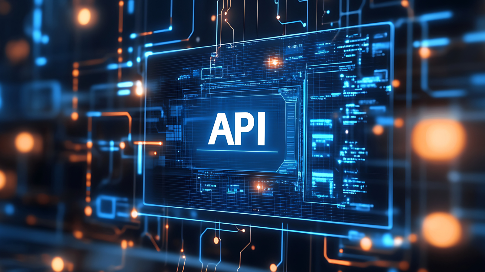

Securing your APIs is paramount in today's digital landscape. An API Gateway stands as a formidable fortress, safeguarding your backend services. In this comprehensive guide, we'll delve into the intricacies of API gateway authentication, exploring various methods, best practices, and the subtle differences between API Gateways and authorization servers. By understanding how to effectively implement API gateway authentication, you can significantly enhance your application's security and protect sensitive data.

## API Gateway: The Front Door to Your APIs

<!--FIGURE--><!--/FIGURE-->

**An API Gateway acts as the single entry point and control plane for multiple APIs.**Imagine it as a receptionist directing visitors to the correct departments within a building. Similarly, an API Gateway handles incoming API requests, routes them to the appropriate backend services, and aggregates the responses. It's a crucial component of modern application architectures, especially for microservices-based systems.

Key responsibilities of an API Gateway include:

- **Request routing:** Directing incoming requests to the correct backend service based on defined rules.
- **Load balancing:** Distributing traffic across multiple instances of a service to improve performance and reliability.
- **Authentication and authorization:** Enforcing security policies to protect your APIs.
- **Rate limiting:** Preventing abuse and ensuring fair usage of your APIs.
- **Caching:** Improving performance by storing frequently accessed data.
- **Monitoring and analytics:** Gathering insights into API usage and performance.

By handling these tasks, an API Gateway simplifies development, improves performance, and enhances security for your APIs.

## What is Authentication in API Gateway?

<!--FIGURE--><!--/FIGURE-->

**API gateway authentication is the process of verifying the identity of clients attempting to access APIs through the gateway.** It's the first line of defense in securing your APIs and protecting sensitive data.

By implementing robust authentication mechanisms, you ensure that only authorized users or applications can access your APIs. This prevents unauthorized access, data breaches, and other security threats.

The API gateway acts as a gatekeeper, demanding proof of identity before granting access to backend services. This proof can come in various forms, such as API keys, OAuth tokens, or basic authentication credentials.

In essence, authentication in an API gateway is about establishing trust between the client and the API. Once trust is established, the API gateway can proceed with authorizing the client's access to specific resources and operations.

## Types of API Gateway Authorizers

<!--FIGURE--><!--/FIGURE-->

API Gateway authorizers are the mechanisms used to validate the identity of clients making requests. There are several common types:

### 1. Lambda Authorizers

- **Flexibility:** Offers unparalleled flexibility, allowing custom logic for authentication and authorization.
- **Customizable:** Can be tailored to any authentication scheme or business logic.
- **Scalability:** Handles varying traffic loads efficiently.
- **Example:** Validating JWT tokens, accessing user information from a database, or implementing complex authorization rules.

### 2. Cognito User Pool Authorizers

- **Managed Identity:** Leverages Amazon Cognito for user management and authentication.
- **Seamless Integration:** Easily integrates with other AWS services like Amazon Amplify.
- **Built-in Features:** Offers features like user signup, sign-in, and password management.
- **Example:** Protecting API endpoints based on user roles or group memberships.

### 3. IAM Authorizers

- **Serverless Architecture:** Ideal for serverless applications using AWS Lambda.
- **Fine-Grained Control:** Allows granular control over API access based on IAM roles and policies.
- **Integration with AWS Services:** Seamlessly integrates with other AWS services.
- **Example:** Restricting API access to specific IAM roles or users.

### 4. Custom Authorizers

- **Total Control:** Provides maximum control over authentication logic.
- **Complex Scenarios:** Suitable for complex authentication requirements.
- **Development Effort:** Requires additional development and maintenance.
- **Example:** Implementing custom authentication schemes or integrating with legacy systems.

## API Gateway Authentication Example: Protecting Your APIs with JWT

<!--FIGURE--><!--/FIGURE-->

Let's consider a common scenario: a mobile application that needs to access a protected API. To secure this interaction, we can employ **JSON Web Tokens (JWT)** as the authentication mechanism.

### How it Works:

1. **User Login:** The mobile app prompts the user to log in using their credentials.
1. **Token Generation:** Upon successful authentication, the authentication server issues a JWT containing user claims (e.g., user ID, roles, permissions).
1. **API Request:** The mobile app includes the JWT in the authorization header of subsequent API requests.
1. **Token Verification:** The API Gateway intercepts the request and validates the JWT using a public key.
1. **Authorization:** If the token is valid and the user has the necessary permissions, the API Gateway forwards the request to the backend service.
1. **Response:** The backend service processes the request and returns a response to the API Gateway, which then forwards it to the mobile app.

### Benefits of Using JWT:

- **Stateless Authentication:** No need to maintain session data on the server.
- **Security:** JWTs can be signed and encrypted to protect against tampering.
- **Efficiency:** JWTs can be easily verified by the API Gateway.
- **Standardized Format:** Widely adopted and supported.

## API Gateway Authentication Methods

<!--FIGURE--><!--/FIGURE-->

API Gateways offer a variety of authentication methods to suit different security requirements and application scenarios. Here are some common approaches:

### **Basic Authentication**

- **Simplest method:** Uses a username and password encoded in the request header.
- **Limited security:** Passwords are transmitted in plain text, making it vulnerable to interception.
- **Best suited for:** Low-security internal applications or testing environments.

### API Key Authentication

- **Lightweight:** Involves generating and distributing API keys to clients.
- **Basic access control:** Checks if the provided API key is valid.
- **Limited security:** Can be compromised if leaked.
- **Best suited for:** Public APIs with less sensitive data or internal applications.

### OAuth 2.0

- **Industry standard:** Provides authorization framework for delegating access to third-party applications.
- **Complex:** Requires careful implementation and understanding of different grant types.
- **Strong security:** Offers various grant types for different use cases.
- **Best suited for:** Public-facing APIs that require user authorization, such as social login or third-party integrations.

### OpenID Connect (OIDC)

- **Built on OAuth 2.0:** Provides additional features like user information and identity verification.
- **Stronger security:** Offers identity assurance and token-based authentication.
- **Complex:** Requires understanding of both OAuth 2.0 and OIDC.
- **Best suited for:** Public-facing APIs that need to verify user identity and obtain user information.

### Custom Authentication

- **Flexibility:** Allows for tailored authentication logic based on specific requirements.
- **Development effort:** Requires building custom authentication mechanisms.
- **Complex:** Can be challenging to implement and maintain.
- **Best suited for:** Unique authentication needs that cannot be met by standard methods.

### Choosing the Right Method

The optimal authentication method depends on factors such as:

- **Security requirements:** Level of protection needed for your APIs and data.
- **User experience:** Ease of use for clients.
- **Development resources:** Available expertise and time for implementation.
- **Integration with existing systems:** Compatibility with other authentication solutions.

## How API Gateway Authentication Works

<!--FIGURE--><!--/FIGURE-->

API gateway authentication is a multi-step process that ensures only authorized clients can access protected APIs. Here's a general overview:

1. **Client Request:** A client application sends an API request to the API gateway.
1. **Authentication Check:** The API gateway intercepts the request and examines the authentication credentials provided by the client. This might involve checking API keys, JWT tokens, or other forms of authentication.
1. **Authorization Verification:** If the authentication is successful, the API gateway proceeds to verify the client's authorization to access the requested resource. This involves checking permissions and roles associated with the authenticated user.
1. **Request Forwarding:** If both authentication and authorization are successful, the API gateway forwards the request to the appropriate backend service.
1. **Response Handling:** The API gateway receives the response from the backend service and returns it to the client, often with additional headers or data.

**Key components involved in the process:**

- **Authentication mechanisms:** The methods used to verify the client's identity (e.g., API keys, OAuth, JWT).
- **Authorization policies:** The rules that define which actions a client is allowed to perform.
- **Token management:** The handling and validation of access tokens (if used).
- **Security measures:** Encryption, token signing, and other security practices to protect sensitive data.

By following these steps and employing robust security measures, API gateways can effectively protect your APIs from unauthorized access and data breaches.

## Best Practices for Deploying API Gateway for Authentication and Authorization

Implementing a robust API gateway for authentication and authorization is crucial for securing your APIs. Here are some best practices to follow:

### Authentication Best Practices

- **Choose the right authentication method:** Select a method that aligns with your security requirements, user experience, and development resources.
- **Implement strong password policies:** Enforce complex passwords, password expiration, and lockout policies.
- **Use HTTPS:** Always encrypt communication between the client and the API gateway to protect sensitive data.
- **Protect API keys:** Store API keys securely and avoid hardcoding them in client applications.
- **Implement rate limiting:** Prevent abuse and denial-of-service attacks by limiting the number of requests.
- **Consider multi-factor authentication (MFA):** Add an extra layer of security for high-risk operations.

### Authorization Best Practices

- **Implement role-based access control (RBAC):** Define roles with specific permissions and assign them to users or groups.
- **Follow the principle of least privilege:** Grant users only the necessary permissions to perform their tasks.
- **Regularly review and update authorization policies:** Ensure that permissions remain appropriate.
- **Use token-based authentication:** JWT or OAuth tokens can be used to carry user claims and permissions.
- **Validate user claims:** Verify the authenticity and integrity of user information in tokens.

### Additional Best Practices

- **Centralized authentication and authorization:** Manage authentication and authorization centrally for consistency.
- **Regular security audits:** Conduct vulnerability assessments and penetration testing to identify weaknesses.
- **Monitor API usage:** Track API usage patterns to detect anomalies and potential threats.
- **Implement logging and auditing:** Record API requests and responses for troubleshooting and security analysis.
- **Stay updated with security best practices:** Follow industry standards and guidelines.

By adhering to these best practices, you can significantly enhance the security of your API gateway and protect your applications and data from unauthorized access.

## API Gateway vs. Authorization Server: What's the Difference?

**What is the difference between API Gateway and authorization server?** This is a common question when architecting modern application systems. While both play crucial roles in API security and management, they serve distinct purposes.

### API Gateway

An API gateway is the single entry point and control plane for multiple APIs. It acts as a reverse proxy, handling incoming API requests, routing them to the appropriate backend services, and aggregating the responses.

**Key functions of an API gateway:**

- Request routing
- Load balancing
- Authentication and authorization
- Rate limiting
- Caching
- Monitoring and analytics

### Authorization Server

An authorization server is specifically designed to issue access tokens to clients after successful authentication. It determines whether a client application has permission to access a specific resource.

**Key functions of an authorization server:**

- Issuing access tokens
- Validating access tokens
- Managing user consent
- Enforcing authorization policies

<table>
    <thead>
        <tr>
            <th><b>Feature</b></th>
            <th><b>API Gateway</b></th>
            <th><b>Authorization Server</b> </th>
        </tr>
    </thead>
    <tbody>
        <tr>
            <td>Primary Function</td>
            <td>Handles API requests, routing, and aggregation</td>
            <td>Issues access tokens and enforces authorization</td>
        </tr>
        <tr>
            <td>Security Focus</td>
            <td>Authentication, authorization, rate limiting, and other security measures</td>
            <td>Authorization and access control</td>
        </tr>
        <tr>
            <td>Common Protocols</td>
            <td>HTTP, REST</td>
            <td>OAuth 2.0, OpenID Connect</td>
        </tr>
    </tbody>
</table>

### When to Use Which

- **API Gateway:** When you need to manage multiple APIs, handle traffic, and enforce basic security policies.
- **Authorization Server:** When you have complex authorization requirements, need to manage user consent, or want to leverage industry standards like OAuth 2.0.

In many cases, an API gateway can incorporate basic authorization features, but for complex scenarios, using a dedicated authorization server is recommended. By understanding the distinctions between these components, you can design a robust and secure API architecture.

## API Gateway Authentication Example: Protecting Your APIs with JWT

Let's consider a common scenario: a mobile application that needs to access a protected API. To secure this interaction, we can employ **JSON Web Tokens (JWT)** as the authentication mechanism.

### How it Works:

1. **User Login:** The mobile app prompts the user to log in using their credentials.
1. **Token Generation:** Upon successful authentication, the authentication server issues a JWT containing user claims (e.g., user ID, roles, permissions).
1. **API Request:** The mobile app includes the JWT in the authorization header of subsequent API requests.
1. **Token Verification:** The API Gateway intercepts the request and validates the JWT using a public key.
1. **Authorization:** If the token is valid and the user has the necessary permissions, the API Gateway forwards the request to the backend service.
1. **Response:** The backend service processes the request and returns a response to the API Gateway, which then forwards it to the mobile app.

### Benefits of Using JWT:

- **Stateless Authentication:** No need to maintain session data on the server.
- **Security:** JWTs can be signed and encrypted to protect against tampering.
- **Efficiency:** JWTs can be easily verified by the API Gateway.
- **Standardized Format:** Widely adopted and supported.

By implementing JWT-based authentication, you can effectively protect your APIs while providing a seamless user experience.

**Would you like to delve deeper into API gateway authentication methods?**

### Forward Authentication to Authgear Resolver Endpoint

Authgear provides a robust solution for handling authentication and authorization in your API gateway. By forwarding authentication requests to the Authgear Resolver Endpoint, you can offload the complexity of authentication and leverage Authgear's advanced features.

**Key benefits of using Authgear:**

- **Managed authentication:** Authgear handles user registration, login, and password management.
- **Customizable workflows:** Configure authentication flows to match your specific requirements.
- **Integration with identity providers:** Connect to social login providers or enterprise identity systems.
- **Scalability:** Authgear can handle large volumes of authentication requests.

To learn more about how to forward authentication to the Authgear Resolver Endpoint and leverage its capabilities, visit our website at https://docs.authgear.com/get-started/backend-api/nginx.

**Mastering API gateway authentication is essential for building secure and scalable applications.** By understanding the core concepts, exploring different authentication methods, and following best practices, you can effectively protect your APIs and data.

To learn more about Authgear's API gateway solutions and how we can help you implement robust authentication, visit our website at [www.authgear.com]().
