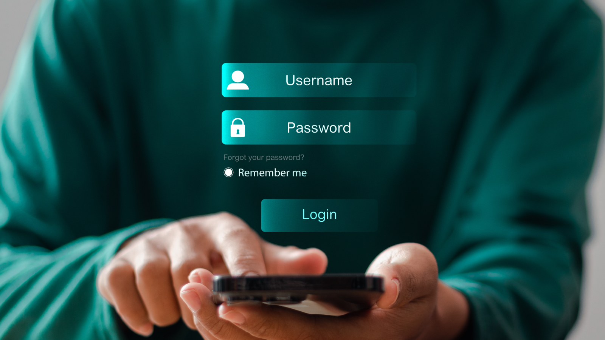

In 2026, passkeys have moved from experiment to mainstream. Apple, Google, and Microsoft now support passkeys across all major platforms. Over 15 billion accounts can use passkeys. And the question developers and security teams ask most often is simple: **are passkeys actually safer than passwords?**

The short answer is yes — significantly. The longer answer explains exactly why, and what it means for your app.

## Are Passkeys Safer Than Passwords?

Yes. Passkeys are safer than passwords in every measurable way. Here's why:

- **Passkeys cannot be phished.** When you log in with a passkey, your device signs a challenge from the server using a private key that never leaves your device. A fake login page gets nothing — there's no password to steal.
- **Passkeys cannot be reused.** Each passkey is unique to the website it was created for. A passkey for your banking app cannot be used on any other site, even if the attacker controls the other site.
- **Passkeys cannot be guessed.** Passkeys are cryptographic keys generated randomly. There is no equivalent of "password123" or a dictionary attack.
- **Passkeys cannot be leaked in bulk.** Servers only store your public key — even if a server is breached, attackers get a public key that is useless without the private key on your device.

According to Google, accounts with passkeys are 99.9% less likely to be compromised than those relying on passwords alone. Phishing and credential stuffing — responsible for the majority of account takeovers — simply don't work against passkeys.

## Understanding Passkeys: How They Work

<!--FIGURE-->

<!--/FIGURE-->

A passkey is a pair of cryptographic keys: a **private key** stored securely on your device, and a **public key** stored on the server. Here's what happens when you log in:

1. The server sends a unique challenge to your device
1. Your device uses Face ID, Touch ID, or PIN to unlock the private key
1. The private key signs the challenge
1. The server verifies the signature using your public key
1. You're in — without sending any secret over the internet

Think of it like a safe deposit box. The bank holds the lock (your public key). Only your key (private key, on your device) can open it. The bank never sees your key, and you never share it.

**Key benefits at a glance:**

- **Phishing-resistant:** Nothing to steal — your private key never leaves your device
- **No passwords to remember:** Authentication via biometric (Face ID, fingerprint) or device PIN
- **Cross-device sync:** Passkeys sync across your devices via Apple Keychain, Google Password Manager, or 1Password
- **Works everywhere:** iOS, Android, Windows, macOS, Chrome, Safari, Firefox

## Why Passwords Are No Longer Enough

<!--FIGURE-->

<!--/FIGURE-->

Passwords have been the primary authentication method for 60 years, and they're failing us. Here's why:

- **Weak passwords:** 80% of breaches involve weak or reused passwords (Verizon DBIR 2025). Users choose memorable over secure.
- **Password reuse:** The average person reuses passwords across 5+ accounts. One breach exposes all of them.
- **Phishing:** Even sophisticated users get fooled. Phishing attacks are responsible for 36% of data breaches.
- **Data breaches:** 26 billion records were leaked in the "Mother of All Breaches" in early 2024. Those passwords are now on the dark web.
- **Password fatigue:** The average person manages 100+ passwords. The cognitive load drives risky behavior (writing down passwords, reusing them).

The core problem: passwords are *secrets shared with a server*. Every time you log in, you send your secret over the internet. Every server that stores your password is a potential breach. Passkeys eliminate this entirely.

## Passkeys vs Passwords: Full Comparison (2026)

                      
    <table class="ag-table">
      <thead>                                                             
        <tr>
          <th>Feature</th>                                                
          <th>Password</th>                                 
          <th>Passkey</th>
        </tr>
      </thead>
      <tbody>
        <tr>
          <td>Security model</td>
          <td>Shared secret (stored on server)</td>
          <td>Public-key cryptography (private key never leaves
  device)</td>
        </tr>
        <tr>
          <td>Phishing resistance</td>
          <td>❌ Vulnerable — fake sites steal passwords easily</td>
          <td>✅ Immune — passkeys are bound to the domain they were
  created for</td>
        </tr>
        <tr>
          <td>Brute-force resistance</td>
          <td>❌ Weak passwords are cracked in seconds</td>
          <td>✅ No password to crack</td>
        </tr>
        <tr>
          <td>Credential stuffing</td>
          <td>❌ At risk if passwords are reused</td>
          <td>✅ Each passkey is unique per site</td>
        </tr>
        <tr>
          <td>Data breach exposure</td>
          <td>❌ Passwords exposed if server is breached</td>
          <td>✅ Only public key stored — useless alone</td>
        </tr>
        <tr>
          <td>User experience</td>
          <td>❌ Remember and type a password</td>
          <td>✅ Biometric or PIN tap</td>
        </tr>
        <tr>
          <td>Login speed</td>
          <td>⚠️  Slower — type password + optional MFA</td>
          <td>✅ Faster — one biometric tap</td>
        </tr>
        <tr>
          <td>Cross-device sync</td>
          <td>❌ No (password managers partially solve this)</td>
          <td>✅ Yes (iCloud Keychain, Google Password Manager)</td>
        </tr>
        <tr>
          <td>MFA requirement</td>
          <td>⚠️  Recommended but often skipped</td>
          <td>✅ Built-in (device PIN/biometric is the second factor)</td>
        </tr>
        <tr>
          <td>Lost device recovery</td>
          <td>⚠️  Password still works from other devices</td>
          <td>⚠️  Recovery via backup passkeys or account recovery
  flow</td>
        </tr>
        <tr>
          <td>Platform support (2026)</td>
          <td>✅ Universal</td>
          <td>✅ iOS, Android, Windows, macOS, major browsers</td>
        </tr>
        <tr>
          <td>Implementation cost</td>
          <td>⚠️  Low (passwords are simple)</td>
          <td>⚠️  Medium (WebAuthn API or auth platform like Authgear)</td>
        </tr>
      </tbody>
    </table>

## Passkeys in 2026: Real-World Adoption

<!--FIGURE-->

<!--/FIGURE-->

Passkeys have crossed the tipping point from "interesting experiment" to "production standard." Here's where things stand in 2026:

- **15+ billion accounts** can now authenticate with passkeys (Apple, Google, Microsoft, Amazon, GitHub, PayPal, and hundreds more)
- **Google:** Reports that passkey sign-ins are 4× faster than passwords and have a 99.9% lower account compromise rate
- **Apple:** Passkeys are the default sign-in method in iOS 17+ across all Apple accounts
- **Microsoft:** All Microsoft accounts are now passwordless by default — passkeys encouraged
- **GitHub:** Passkeys available for all 100M+ users since early 2024
- **Amazon:** Passkeys available for shopping accounts across the US, UK, and Australia

For developers, the message is clear: users increasingly expect passkey support. Apps without passkeys will feel dated within 12-18 months.

## Passkeys vs Passwords: Which Should You Use?

The answer is almost always **passkeys** — but a phased approach is practical:

- **New apps:** Implement passkeys from day one. Use a platform like Authgear that provides passkey support with a few lines of code.
- **Existing apps:** Add passkeys as a login option alongside passwords. Let users opt in. Most will — passkeys are easier to use.
- **Enterprise apps:** If you use Active Directory / LDAP internally, you can still add passkeys for external-facing applications while keeping your internal directory.
- **Legacy systems:** If passkey support is truly impossible, at minimum enforce MFA on all accounts to close the worst password vulnerabilities.

## How to Enable Passkeys in Your App with Authgear

Implementing passkeys from scratch requires handling WebAuthn registration, authentication challenges, key storage, and cross-device sync — a significant engineering effort. Authgear provides passkey support out of the box.

**With Authgear, enabling passkeys takes minutes, not weeks:**

1. **Enable passkeys in the Authgear Portal:** Go to Authentication → Login Methods → Passkeys and toggle them on. No code required.
1. **Choose your strategy:**<ul><li>*Passkeys + passwords:* Users can choose their preferred method
1. *Passkeys only:* Enforce passwordless authentication
1. *Passkeys for new users, passwords for existing:* Gradual migration
1. **Add the Authgear SDK to your app:** Available for React, Next.js, React Native, Flutter, iOS, Android, and more.
1. **Test on supported devices:** iOS 16+, Android 9+, Chrome 108+, Safari 16+, Edge 109+

Your users authenticate with Face ID, Touch ID, or PIN — and you handle zero credential storage, no password resets, and no phishing risk.

[Learn more about Authgear passkeys →](/features/passkeys)

## The Future of Authentication

The writing is on the wall: passwords are on their way out. The transition is already happening across every major platform. As passkey adoption grows, expect:

- **Passwordless by default:** More platforms will make passkeys the default login method, not an option
- **Passkeys for payments:** Strong customer authentication (SCA) requirements in finance will push passkey adoption in banking and fintech
- **AI-resistant authentication:** As AI makes social engineering more sophisticated, phishing-resistant passkeys become more critical, not less
- **Shared device scenarios:** Work is ongoing for enterprise managed-device passkey scenarios, filling the last remaining gap

The era of passwords is drawing to a close. Apps that adopt passkeys today will have a security and UX advantage tomorrow.

## Frequently Asked Questions

### What is a passkey vs a password?

A password is a secret string you create and remember (or store in a password manager). A passkey is a cryptographic key pair — a private key stored on your device and a public key stored on the server. You never type a passkey; instead, you authenticate with Face ID, Touch ID, or a PIN. Passkeys are more secure because they can't be phished, guessed, or leaked in a data breach.

### Are passkeys safer than passwords?

Yes, significantly. Passkeys are phishing-resistant (fake sites can't steal them), brute-force-resistant (cryptographic keys can't be guessed), and breach-resistant (servers only store public keys, which are useless without your device). Google reports passkey accounts have a 99.9% lower compromise rate than password accounts.

### Can passkeys replace two-factor authentication (2FA)?

Yes. A passkey combines something you have (your device) with something you are (your biometric) or something you know (your PIN). This makes a passkey equivalent to a password plus a second factor — you don't need a separate SMS code or authenticator app. Passkeys meet or exceed NIST AAL2 authentication requirements.

### What happens if I lose my device?

Passkeys sync across your devices via Apple Keychain, Google Password Manager, or a cross-platform manager like 1Password. If you lose one device, you can still log in from another. For users without a second device, most services provide account recovery via email verification or a backup code — just like password resets today.

### Do passkeys work on all browsers and devices?

In 2026, passkeys work on the vast majority of devices: iOS 16+, Android 9+, Windows 10+ with Windows Hello, macOS 13+ with Touch ID, and all major browsers (Chrome 108+, Safari 16+, Firefox 122+, Edge 109+). For older devices, passkey-enabled services typically still offer password fallback.

### How do I add passkey support to my app?

You can implement passkeys directly using the WebAuthn API (built into modern browsers) or use an authentication platform like [Authgear](/features/passkeys) that handles the complexity for you. Authgear supports passkeys across all major platforms with a few lines of SDK code and a configuration toggle in the portal.
