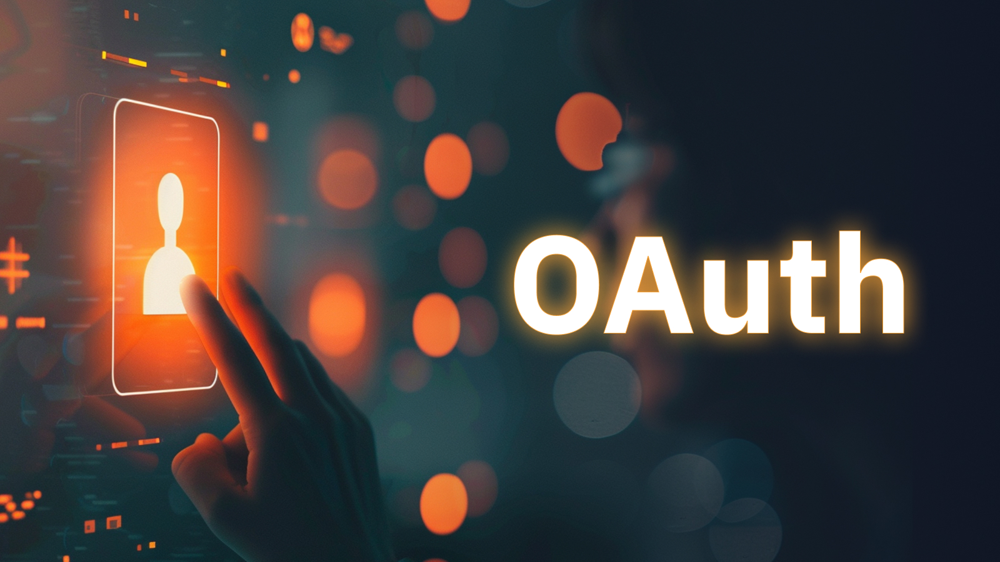

SAML and OAuth are two fundamental protocols for managing user identities within applications. While often mentioned together, they serve distinct purposes and cater to different use cases. SAML is primarily concerned with authentication, verifying a user's identity, while OAuth focuses on authorization, determining what a user can access. This blog aims to demystify the differences between these protocols, exploring their core functionalities, use cases, and the factors to consider when choosing the right tool for your application's identity management needs. By understanding the strengths and weaknesses of each protocol, you can make informed decisions to enhance your application's security and user experience.

## What is SAML and how does it work?

**SAML**, which stands for Security Assertion Markup Language, is an XML-based standard used for exchanging authentication and authorization data between different parties. It's the backbone of single sign-on (SSO) systems, allowing users to access multiple applications with a single set of credentials.

## How does SAML work?

<!--FIGURE--><!--/FIGURE-->

The SAML process involves three main actors:

- **Identity Provider (IdP):** The entity responsible for authenticating users and providing information about them.
- **Service Provider (SP):** The application or service that requires authentication.
- **User:** The individual accessing the service provider.

The process typically follows these steps:

1. **User initiates a login:** The user tries to access a protected resource on the service provider.
1. **Redirection to IdP:** The service provider redirects the user to the identity provider for authentication.
1. **User authentication:** The user provides credentials to the identity provider.
1. **Assertion creation:** Upon successful authentication, the identity provider creates a SAML assertion containing user information.
1. **Assertion transfer:** The identity provider sends the SAML assertion to the service provider.
1. **Authentication validation:** The service provider verifies the SAML assertion and grants access to the user if valid.

By streamlining the authentication process and eliminating the need for multiple logins, SAML enhances user experience, boosts productivity, and strengthens security. SAML also provides a standardized way to exchange authentication and authorization data, making it easier for organizations to integrate different systems and applications.

## What is OAuth and how does it work?

<!--FIGURE--><!--/FIGURE-->

**OAuth**, which stands for Open Authorization, is an industry-standard protocol for authorization. Unlike SAML, which focuses on authentication, OAuth is concerned with granting access to specific resources on behalf of a user. It allows users to share their data with third-party applications without revealing their credentials.

## How does OAuth work?

The OAuth process involves four main players:

- **Resource Owner:** The user who owns the data.
- **Client:** The application requesting access to the resource owner's data.
- **Authorization Server:** The server that issues access tokens.
- **Resource Server:** The server hosting the protected resources.

The typical OAuth flow involves these steps:

1. **User authorization:** The user grants permission to the client to access their data.
1. **Access token request:** The client requests an access token from the authorization server.
1. **Access token issuance:** The authorization server issues an access token to the client.
1. **Resource request:** The client uses the access token to access protected resources from the resource server.

OAuth offers a robust and flexible framework for managing access to protected resources. By employing access tokens instead of passwords, OAuth significantly enhances security by reducing the risk of credential exposure. This token-based approach also provides granular control over data access, enabling users to precisely define which information can be shared with specific applications. Furthermore, OAuth's decentralized architecture promotes interoperability and innovation, as it allows for a wide range of applications and services to integrate seamlessly. This flexibility empowers users to share their data with confidence, knowing that their privacy and control are maintained.

## Is SAML or OAuth Obsolete?

**The short answer is no, neither SAML nor OAuth is obsolete. Both protocols remain essential tools in the modern identity management landscape.**

SAML, with its emphasis on authentication and single sign-on, continues to be a cornerstone for many enterprise environments. Its ability to securely exchange user information between different systems makes it a reliable choice for organizations with complex IT infrastructures. While newer protocols like OpenID Connect (OIDC) have gained popularity, SAML's established position and robust security features ensure its continued relevance.

OAuth, on the other hand, has experienced a surge in popularity due to its flexibility and adaptability to modern application architectures. Its focus on authorization and its ability to integrate with a wide range of platforms and devices make it an ideal choice for consumer-facing applications and API-driven ecosystems. The emergence of OAuth 2.0 has further solidified its position as a leading authorization protocol.

While both SAML and OAuth have their strengths, it's important to recognize that they are not mutually exclusive. In many cases, they can be used in conjunction to provide a comprehensive identity management solution. For instance, SAML can handle authentication, while OAuth can manage authorization within an application. The choice between SAML vs OAuth (or a combination of both) depends on specific use cases, security requirements, and the overall architecture of the system.

## SAML vs OAuth: A Side-by-Side Comparison

<table>
    <thead>
        <tr>
            <th>Feature</th>
            <th>SAML</th>
            <th>OAuth</th>
        </tr>
    </thead>
    <tbody>
        <tr>
            <td>Focus</td>
            <td>Authentication</td>
            <td>Authorization</td>
        </tr>
        <tr>
            <td>Data Exchange</td>
            <td>Assertions containing user attributes</td>
            <td>Access tokens</td>
        </tr>
        <tr>
            <td>Security Model</td>
            <td>Based on digital signatures and encryption</td>
            <td>Based on token-based access control</td>
        </tr>
        <tr>
            <td>Typical Use Cases</td>
            <td>Enterprise SSO, federation, access control</td>
            <td>API authorization, mobile apps, third-party integration</td>
        </tr>
        <tr>
            <td>Complexity</td>
            <td>Generally more complex to implement</td>
            <td>Relatively simpler to implement</td>
        </tr>
        <tr>
            <td>Common Standards</td>
            <td>SAML 2.0</td>
            <td>OAuth 2.0</td>
        </tr>
    </tbody>
</table>

### Key Differences Explained:

- **Authentication vs. Authorization:** SAML primarily focuses on verifying a user's identity, while OAuth is concerned with granting access to specific resources.
- **Data Exchange:** SAML uses assertions to exchange user information, while OAuth relies on access tokens to represent authorization.
- **Security Model:** SAML's security is built on digital signatures and encryption, ensuring data integrity and confidentiality. OAuth's security is based on token-based access control, with tokens acting as temporary credentials.
- **Use Cases:** SAML is commonly used in enterprise environments for SSO and federation, while OAuth is prevalent in consumer-facing applications, mobile apps, and API integrations.
- **Complexity:** SAML implementations can be more complex due to the involvement of multiple parties and the need for extensive configuration. OAuth is generally simpler to implement and integrate.

By understanding these key differences, you can make informed decisions about which protocol is best suited for your specific application or use case.

## When to Use SAML vs OAuth: Best Practices

<!--FIGURE--><!--/FIGURE-->

The decision to use SAML or OAuth hinges on several factors, including the nature of your application, its security requirements, and the target audience. Enterprise environments with multiple applications and a strong emphasis on centralized identity management often benefit from SAML's robust authentication and single sign-on capabilities. On the other hand, consumer-facing applications that rely on third-party authentication or need to grant granular access to specific resources are well-suited for OAuth's flexible authorization mechanisms. Additionally, API-driven systems and mobile applications often leverage OAuth's token-based approach to secure data exchange and user interactions. Here's a breakdown of when to use each:

## When to Use SAML

- **Enterprise Environments:** SAML excels in large organizations with multiple applications and a need for centralized identity management. It's ideal for SSO, where users can access various applications with a single set of credentials.
- **Strong Security Requirements:** SAML offers robust security features like digital signatures and encryption, making it suitable for handling sensitive data.
- **Complex Integration:** When integrating with legacy systems or complex infrastructures, SAML's XML-based format might be more compatible.

## When to Use OAuth

- **Consumer-Facing Applications:** OAuth is well-suited for applications that rely on third-party authentication (e.g., social logins) or need to grant access to specific resources.
- **API-Driven Systems:** OAuth is the preferred choice for protecting APIs and authorizing access to specific data endpoints.
- **Mobile and Web Applications:** OAuth's flexibility makes it ideal for modern applications that require seamless user experiences and integration with various platforms.

## Best Practices

To make informed decisions about using SAML or OAuth, consider the following guidelines:

- **Understand Your Requirements:** Clearly define your application's authentication and authorization needs before making a decision.
- **Evaluate Security:** Assess the security implications of each protocol and choose the one that best protects your users' data.
- **Consider Complexity:** Evaluate the development and maintenance effort required for each option.
- **Explore Hybrid Approaches:** In some cases, using both SAML and OAuth can provide a comprehensive identity management solution. For example, SAML for authentication and OAuth for authorization within the application.
- **Stay Updated:** Keep up with the latest developments and best practices for both protocols to ensure optimal security and performance.

By carefully considering these factors and following best practices, you can select the most appropriate protocol for your application and enhance its overall security and user experience.

## SAML vs. OAuth: A Comprehensive Guide to Choosing the Right Identity Management Solution

<!--FIGURE--><!--/FIGURE-->

SAML and OAuth are both powerful tools for managing user identities, but they serve distinct purposes. SAML excels at authentication, establishing a user's identity, while OAuth focuses on authorization, determining what a user can access. By understanding the core differences, use cases, and best practices for each protocol, you can make informed decisions to enhance the security and user experience of your applications.

While both protocols have their strengths, the optimal choice depends on your specific requirements. In some cases, a combination of SAML and OAuth may be the most effective approach. By carefully evaluating your application's needs and considering the factors discussed in this blog, you can select the right identity management solution to protect your users and your business.

## Talk to Authgear Experts

If you're still unsure about which protocol is best for your application or need assistance implementing SAML or OAuth, Authgear's experts are here to help. We offer a comprehensive identity management platform that simplifies the integration of both protocols into your applications. Our team can provide guidance, support, and tailored solutions to meet your specific needs.

Contact us today to learn more about how Authgear can help you build secure and user-friendly applications.
