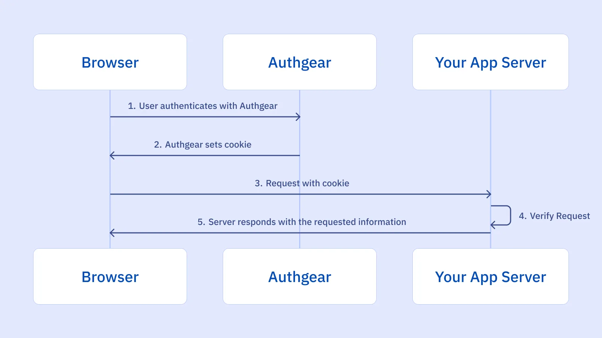
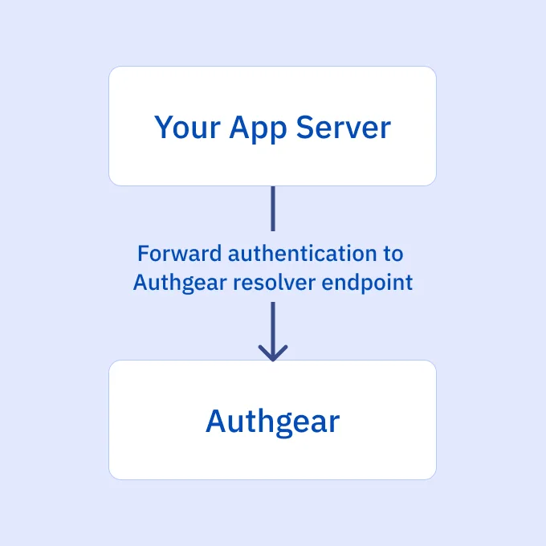

## What is Session Management in a Web Application?

Session management is the mechanism that tracks a user's interactions with a web application over a specific period. It involves creating, maintaining, and eventually terminating a user's session. This process is essential for maintaining user state, personalizing experiences, and ensuring secure access to protected resources.

At the core of session management is the session ID, a unique identifier assigned to each user. This ID is typically stored in a cookie on the user's device and sent to the server with each request. The server uses this ID to retrieve the corresponding session data, allowing it to recognize the user and maintain their session state.

While cookies are commonly used to store session IDs, other methods like URL rewriting or hidden form fields can also be employed. However, it's crucial to implement robust security measures to protect session IDs and prevent unauthorized access.

## How Does Session Management Work?

Session management refers to handling multiple requests and responses from a user or entity on a website or web application. Throughout these interactions, information of the user will be passed between the server and the browser, kept by the browser, and even processed. It is therefore critical for the web app to properly secure and manage sessions, especially within authenticated sessions, in order to prevent <a href="/post/broken-authentication-what-is-it-and-how-to-prevent-it" target="_blank">broken authentication</a>. Before we get into the attacks associated with session management and some best practices, let’s define a few terms first.

### Session ID

A session ID, or session token, is a unique identifier, in the form of randomly generated string, used to identify a user's session on a website or application. The server creates a session ID when a user logs in to a website or app and destroy it when the session is terminated.

There are a few different ways to generate session ID, but it is recommended by <a href="https://owasp.org/" target="_blank">OWASP</a> to use a good Cryptographically Secure Pseudorandom Number Generator (CSPRNG) to create session IDs. This ensures that each cookie is unique and thus can withstand guessing attacks.

The session ID remains the same for a certain period of time and a new one is generated if a user closes the browser and reopens the web browser to visit the site. Session ID binds the user session to the user HTTP traffic and the appropriate access controls imposed by the website or app.

If an attacker were to obtain a user's session ID, they would be able to impersonate the user and gain access to their account. For that reason, session IDs should not be disclosed to the general public and are only ever transferred in secured means.

To securely exchange session ID, cookies are usually used to contain the session ID since they have some attributes that can protect exchange of session ID.

### Session Cookies

Session cookies can store a range of information and session ID is one of them. Cookies are small pieces of data sent from a website to a user's web browser and stored on the user's devices. When the user re-accesses the website, their browser sends the cookie back to the server. This allows the server to identify the user and track their activity on the site.

## Threats and Cyber Attacks Related to Session Management

### Session Hijacking

Session hijacking attacks involve an attacker attempting to get the session ID of the victim after the user logs in. Afterwards, the attacker can then impersonate the user and perform actions on their behalf using the obtained session ID.

### Session Fixation

Session fixation attack, sometimes confused with session hijacking, essentially exploits the flaws of authentication and session management of web app and “fixes” an established session on the user’s browser. To do this, the hacker tricks the victim into using an identifier that the hacker already knows instead of stealing new identifiers. Afterwards, the hacker can then impersonate the user.

## Session Management Vulnerabilities

Session management vulnerabilities arise from improper implementation or configuration of session management mechanisms. These vulnerabilities can lead to severe security breaches, allowing attackers to compromise user accounts and access sensitive data. Some common session management vulnerabilities include:

- **Session Fixation:** An attacker manipulates a victim into using a predictable session ID, enabling them to hijack the session later.
- **Session Hijacking:** An attacker steals a valid session ID to impersonate a legitimate user.
- **Session Expiration:** Improper session timeout settings can lead to prolonged sessions, increasing the risk of unauthorized access.
- **Session Fixation:** An attacker manipulates a victim into using a predictable session ID, enabling them to hijack the session later.
- **Session Cookies Without HttpOnly Flag:** If session cookies lack the HttpOnly flag, attackers can potentially steal the cookie using JavaScript and exploit the session.
- **Insecure Session ID Generation:** Weak or predictable session ID generation algorithms can make it easier for attackers to guess or brute force session IDs.

By understanding these vulnerabilities and implementing the recommended best practices, you can significantly reduce the risk of session-related attacks.

## Best Practices of Implementing Session Management

Effective session management is critical for safeguarding user data and preventing unauthorized access in web applications. By implementing robust session management practices, you can protect sensitive information, maintain user trust, and comply with security regulations. This involves carefully considering session ID generation, cookie configuration, and session expiration policies. Additionally, monitoring for suspicious activity and implementing regular security audits are essential components of a comprehensive session management strategy.

### Properties of Session ID

A well-configured session ID is fundamental to a secure session management strategy. Several key properties contribute to its effectiveness:

- **Length:** A sufficiently long session ID is essential to deter brute-force attacks. While 128 bits is often cited as a baseline, the optimal length depends on factors like the expected number of sessions and the desired level of security. Longer session IDs offer greater protection but may impact performance.
- **Randomness:** Employ a cryptographically secure random number generator (CSPRNG) to create unpredictable session IDs. Avoid patterns or predictable sequences that could be exploited by attackers.
- **Entropy:** High entropy ensures that the session ID contains ample randomness, making it computationally infeasible to guess. This property is closely tied to length and randomness.
- **Obscurity:** The content of the session ID should be meaningless and devoid of any sensitive information. This prevents attackers from extracting valuable data even if they manage to obtain the ID. Additionally, consider encoding or obfuscating the session ID to further hinder analysis.
- **Uniqueness:** Each session should have a distinct session ID to prevent session fixation attacks. Duplicate session IDs can allow attackers to hijack existing sessions.

### Attributes of Cookies

Cookies offer several attributes to enhance session ID security:

- **Secure:** This attribute ensures that the cookie is only transmitted over HTTPS connections, providing encryption and protecting against man-in-the-middle attacks.
- **HttpOnly:** This attribute prevents client-side scripts (JavaScript) from accessing the cookie, mitigating cross-site scripting (XSS) vulnerabilities.
- **SameSite:** This attribute controls cookie sending behavior based on the request origin.some text<ul><li>**Strict:** Cookies are only sent in same-site requests, preventing cross-site request forgery (CSRF).
- **Lax:** Cookies are sent in same-site and some cross-site requests, offering a balance between security and user experience.
- **None:** Cookies are sent with all requests, requiring additional security measures like Secure and HttpOnly.

### Generation of New Session IDs

Regularly regenerating session IDs is essential for maintaining strong security:

- **Login:** Issuing a new session ID upon successful login helps prevent session fixation attacks.
- **Privilege Level Changes:** When a user's privileges change (e.g., from guest to authenticated), generate a new session ID to protect sensitive data.
- **Password Changes:** Requiring users to re-authenticate after changing their password and issuing a new session ID adds an extra layer of protection.
- **Idle Timeout:** Consider regenerating the session ID after a period of inactivity to mitigate session hijacking risks.

## How Session Management Works with Authgear

<!--FIGURE-->

<!--/FIGURE-->

When your users authenticate with Authgear, Authgear will take care of generating and properly configuring the cookies to ensure secure authentication. The subsequent requests sent from the browser to your app server will now include the session cookie. To verify the session, forward the requests to the Authgear Resolver Endpoint.

<!--FIGURE-->

<!--/FIGURE-->

**Request Example**`  
> GET /api_path HTTP/1.1  
> Host: yourdomain.com  
> cookie: session=  
`

## Session Management and Broken Access Control

It's crucial to recognize the interconnectedness of session management and access control. A compromised session can directly lead to broken access control, granting unauthorized access to sensitive resources. For instance, if an attacker successfully hijacks a user's session, they can potentially access data or perform actions that are restricted to the legitimate user. Therefore, implementing robust session management practices is essential for preventing broken access control vulnerabilities. For a deeper dive into broken access control and its countermeasures, refer to our comprehensive guide: [Defending Against Broken Access Control Vulnerabilities: A Comprehensive Guide](/post/what-is-broken-access-control-vulnerability-and-how-to-prevent-it)

## Securing Session Management and Authentication with Authgear

A lot can go wrong when implementing session management and data breaches result in businesses losing more than half of their users and facing significant financial loss.

Let Authgear secure session management and the overall security of your apps. Authgear not only follows cybersecurity best practices to ensure that your users’ personal data is well-protected but also provides various authentication and user management features, including <a href="/features/biometric-authentication" target="_blank">biometric authentication</a>, <a href="/features/social-login" target="_blank">social login</a>, <a href="/features/passkeys" target="_blank">passkeys</a>, <a href="/features/whatsapp-otp" target="_blank">WhatsApp OTP</a>, and more, to make sure that you can deliver a secure yet frictionless digital experience to your users.

<a href="https://portal.authgear.com/" target="_blank">Sign up for a free trial</a> or <a href="/schedule-demo/" target="_blank">contact us</a> to see how your app can benefit from integrating with Authgear.
