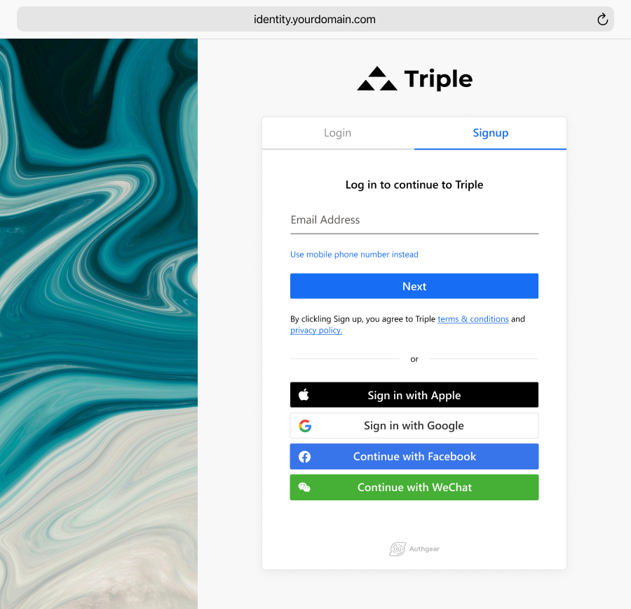

    
    These days, the subscription service industry is soaring, companies are growing at unprecedented rates, and consumers are spoiled for choice. There is more money to be made online than ever before, but the competition is fierce. The best way to ensure you get a slice of the pie is by having a great sign up form or sign up page, but how can you optimize your sign up process for success?

**This article will go over the best tips and tricks that you can use to optimize your sign up form and skyrocket your app conversion rate.**

<nav id="table-of-content"> Table of Content
    <ul style="margin-top:15px">
        <li><a href="#why-sign-up">Why It’s Important to Have a Good Sign Up Form?</a></li>
        <li><a href="#best-practices">Sign Up Form Best Practices</a>
            <ol style="margin-top:15px;margin-bottom:15px">
                <li><a href="#minimal-design">Minimal Design to Eliminate Distraction and Confusion</a></li>
                <li><a href="#form-fields">Remove Unnecessary Form Fields</a></li>
                <li><a href="#user-experience">Manage User Expectations</a></li>
                <li><a href="#social-login">Allow Social Login and Auto-Fills</a></li>
                <li><a href="#rwd">Optimize Sign Up Page for Mobile Devices</a></li>
            </ol>
        </li>
        <li><a href="#authgear">Create High Conversion Sign Up Page with Authgear</a></li>
    </ul>
</nav>

<h2 id="why-sign-up">Why It’s Important to Have a Good Sign Up Form?</h2>

Sign up forms are perhaps the most important part of your customer acquisition process. You can have a great product or service and an excellent website, but without having a simple, attractive sign up form, you'll be losing a good amount of business. As a matter of fact, the <a href="https://andrewchen.com/investor-metrics-deck/" target="_blank">bounce rate of sign up or landing pages can be over 80%</a>. Conversely, when you have an intuitive sign up form, you can boost engagement, increase your conversions, and ultimately generate way more revenue.

That said, having a sign up form or a sign up page is not enough; you need to make sure that your sign up process is simple and easy to understand so that your customers will engage with your form and actually become customers. So, let's go over some of the best practices for creating stunning sign up forms that look great and, more importantly, perform well.

<h2 id="best-practices">Sign Up Form Best Practices</h2>

<h3 id="minimal-design" style="margin-top:0">1. Minimal Design to Eliminate Distraction and Confusion</h3>

Many sign up pages keep their design to minimal and only contain a sign up form.

<!--FIGURE-->

<!--/FIGURE-->

Take Mailchimp as an example. The sign up page removes the navigation bar and the footer. It also does not have other sections to distract the users; furthermore, there are no other links, aside from the required ones like terms and privacy statement, that will take users away from the sign up process. This effectively keeps the users’ attention to the sign up form itself and minimizes the possibility of bouncing off.

<h3 id="form-fields">2. Remove Unnecessary Form Fields</h3>

Many websites or apps may ask for a ton of information as part of the qualification process. However, the best sign up forms are always clean and simple to minimize friction. Ideally, your form should only ask for the information that's absolutely necessary to register the customer in your database, such as their name, password, and email address.

<!--FIGURE-->

<!--/FIGURE-->

A perfect example would be Asana’s sign up form, which only requires users to provide their email address to send a verification email.

Of course, depending on your industry, you may need to collect more information than that, but try your best to make the form as short and simple as it possibly can be, and you'll dramatically increase your conversion rates.

If you are using an automated tool to create your sign up form, then chances are your form will be generated with a ton of fields that aren't really necessary. It can be easy to auto-generate a form and be done with it, but this is a huge mistake. You should scrutinize your form extensively before putting it live on your website or in your app.

Make sure that every field is absolutely necessary and remove any fields you don't need. In this way, you can keep things clean and minimal, which is something customers look for when signing up for new services.

	<h2 class="title cta-split-content-left">Increase Your App's Conversion Rate with Authgear</h2>
  
Tested and proven sign-up page template, following the best practices for user conversion

  <a href="/schedule-demo/" target="_blank" class="w-inline-block">
  	
Get Demo

<h3 id="user-experience">3. Manage User Expectations</h3>

Aside from shortening the process to minimize friction, it is also important to set the right expectations. Inform them regarding what is needed and how long the process will be so that they will have enough context. It is also important to let them know why certain information, such as payment information, ID numbers, and other personal information, is needed and how it will be used so that users will not feel insecure and drop during the process.

<h3 id="social-login">4. Allow Social Login and Auto-Fills</h3>

One of the best things you can do when creating your sign up process is to allow people to log in with their existing social credentials, such as with a Google or Facebook (Meta) account. Research reveals that people are much more likely to sign up for your service if they don't have to fill out a new sign up form and can just log in with their existing credentials.

If it's not possible for you to permit social logins, the next best thing is to permit auto-fills which will allow customers to quickly fill in your form with information that is already saved on their devices. Auto-fills allow customers to complete lengthy sign-up forms in seconds rather than minutes, and this is something that can go a long way when it comes to increasing conversion rates from your sign up forms and pages.

<h3 id="rwd">5. Optimize Sign Up Page for Mobile Devices</h3>

Mobile usage has increased steadily over the last few years. According to <a href="https://techjury.net/blog/mobile-vs-desktop-usage/#gref" target="_blank">Techjury</a>, 50% B2B inquiries were made on mobile, mobile phones generated 54.25% of the traffic, and 55% of page views came from mobile phones in 2021. It is therefore important to optimize sign up pages for mobile devices; otherwise, a poorly designed mobile page can easily drive the users away.

<h2 id="authgear">Create High Conversion Sign Up Page with Authgear</h2>

<!--FIGURE-->

<!--/FIGURE-->

Authgear is an authentication and user management solution for web and mobile apps. By integrating your apps with Authgear, you can provide a secure and smooth authentication experience for your users. Furthermore, we also offer customizable sign up and login pages that follow the best practices to help you boost the sign up rate, grow your subscriber base, and ultimately generate more revenue for your apps.

Ready to take your app to the next level? <a href="/schedule-demo/" target="_blank">Get in touch with us</a> today to learn more about how we can help you and your apps reach new heights.
