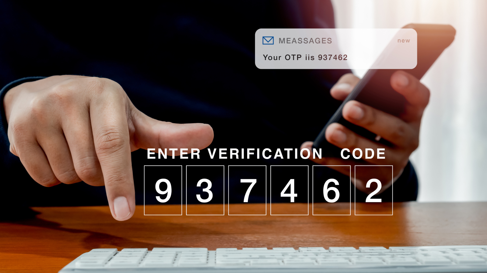

SMS OTP (One-Time Password) is a secure, temporary 4-8 digit code sent via text message to a user’s mobile phone to act as a second, time-sensitive layer of security for two-factor authentication. While it is the most popular authentication method, SMS OTP can be hacked through sophisticated tactics such as SIM swapping, where an attacker hijacks a phone number, or phishing to intercept the code in real-time.

Moving away from SMS is recommended because it relies on the insecure SS7 cellular network and cannot defend against modern account takeover (ATO) methods. To mitigate these risks, businesses should implement secure SMS OTP alternatives like authenticator apps (TOTP), WhatsApp-delivered codes, or phishing-resistant passkeys and biometric authentication.

<nav id="table-of-content">
    <ul>
        <li><a href="#sms-otp-definition">What are OTP messages?</a></li>
        <li><a href="#why">Why have OTP messages become so popular?</a></li>
        <li><a href="#why-not-sms">Why Should You Abandon SMS OTP?</a>
            <ul>
            <li><a href="#sim-swap">SIM Swap Security Risk</a></li>
            <li><a href="#ss7-flaw">SS7 Technical Flaw</a></li>
            <li><a href="#social-engineering">Social Engineering Risks</a></li>
            <li><a href="#sms-cost">Sending OTP Through SMS Can Be Quite Expensive</a></li>
            <li><a href="#ux">Friction in User Experience</a></li>
            </ul>
        </li>
        <li><a href="#alternatives">More options in OTP Messages</a>
            <ul>
            <li><a href="#fido">1) Passkeys (WebAuthn/FIDO) — Best overall: highest security &amp; lowest friction</a></li>
            <li><a href="#whatsapp">2) WhatsApp OTP — Best for reach + lower delivery cost than SMS</a></li>
            <li><a href="#social-login">3) Social Login — Best for fastest first-time signup</a></li>
            <li><a href="#compare">Comparison at a glance</a></li>
            </ul>
        </li>
        <li><a href="#authgear">Implement WhatsApp OTP and Other Secure Authentication Methods with Authgear</a></li>
    </ul>
</nav>

<h2 id="sms-otp-definition">What are OTP messages?</h2>

<!--FIGURE-->

<!--/FIGURE-->

OTP, or One-Time Password, is a security token delivered to a user's device, typically a mobile phone, for the purpose of verifying their identity. This dynamic code replaces static passwords, providing an additional layer of protection against unauthorized access. When a user attempts to log in to an online account or perform a sensitive transaction, they are prompted to enter a unique, time-sensitive code sent to their registered device. This mechanism enhances account security by making it significantly more difficult for malicious actors to gain unauthorized access, even if they possess the user's credentials.

<h2 id="why">Why have OTP messages become so popular?</h2>

With the rise of cyberattacks and data breaches, maintaining and improving data security is no longer an afterthought and implementing two-factor authentication (2FA) adds an extra layer of protection against them. According to [Market Research Future](https://www.marketresearchfuture.com/reports/two-factor-authentication-market-3772), the two-factor authentication market size is expected to grow from USD 14.65 billion in 2022 to USD 44.67 billion by 2030 and it’s said that OTP accounts for about 56-60% of the market value.

Their simplicity and reliance on ubiquitous mobile phones contributed to their rapid ascent in popularity. The convenience of receiving a code directly to one's device made OTP messages a user-friendly choice. Moreover, the perception of OTP messages as an additional layer of protection against unauthorized access has further fueled their adoption. However, it's crucial to recognize that while OTP messages offer a valuable security enhancement, they are not infallible and should be part of a comprehensive security strategy.

<h2 id="why-not-sms">Why Should You Abandon SMS OTP?</h2>

Verifying a user's identity via SMS OTP isn’t as secure as you think. Aside from security, there are other reasons for you to consider other authentication methods. Here are the common security issues of SMS OTP verification and why you should ditch it.

<h3 id="sim-swap">SIM Swap Security Risk</h3>

SIM swapping can give hackers access to all your online accounts. A hacker can call your mobile service provider, pretend to be a victim, and activate a new SIM with your number.

The hacker will then breach any 2FA that uses your phone number as a second authentication method. Because most online accounts require an SMS verification, if the hacker can intercept that SMS, they can change the user’s account password, access sensitive user data, and even steal your money if the target account is an online banking platform.

SIM swap fraud is increasingly becoming popular year after year. In 2021, for instance, cybercriminals stole a staggering [$68 million](https://www.newsweek.com/sim-swap-scam-man-losing-life-savings-sparks-fbi-investigation-1706220), according to FBI data.

<h3 id="ss7-flaw">SS7 Technical Flaw</h3>

Signaling System No.7, commonly known as SS7, is fundamental to all mobile communications. The SS7 is simply a standard that facilitates SMS, calls, number translation, and other telephony services like call forwarding.

So, how does it subject SMS to security risks?

The protocol has a flawed design that hackers can exploit to intercept calls and SMSs, including one-time passwords. Hackers can exploit security vulnerabilities in the SS7 protocol to compromise and intercept OTPs on a cellular network.

And the scary part? Doing so isn’t hard!

All a hacker needs to intercept your SMS is a computer running Linux and the SS7 SDK—which can easily be downloaded online.

<h3 id="social-engineering">Social Engineering Risks</h3>

When it comes to SMS security, the user is the weakest link in the security chain.

Hackers have upped their phishing (a form of social engineering) game and can use their skills to obtain OTPs from unsuspecting individuals. Studies show that SMS-based scams, also known as “Smishing attacks,” soared by <a href="https://www.safetydetectives.com/blog/what-is-smishing-sms-phishing-facts/" target="_blank">328% in 2020</a> alone.

Hackers are increasingly using smishing to trick unsuspecting users into revealing the OTP codes. Organizations can eradicate these attacks by educating users on the importance of securing these codes. Alternatively, they could adopt a verification method that doesn’t leave users with anything that hackers can steal.

<h3 id="sms-cost">Sending OTP Through SMS Can Be Quite Expensive</h3>

SMS authentication may be an easier authentication method for users but very expensive for organizations. Companies pay for every SMS message delivered to their users, which can result in substantial monthly bills.

Furthermore, many SMS OTPs never get delivered even though you pay for every message sent out. Price varies significantly across providers and is also determined by the volume of SMS messages being set out. Worst of all, the cost of attack resulting from weak SMS authentication can be catastrophic to an organization.

<h3 id="ux">Friction in User Experience</h3>

SMS OTPs are user-friendly and make it easier for users to log into online applications and services. In fact, more than 60% of users worldwide use SMS OTP to log in to their favorite services.

However, SMS verification can give users a gruesome experience if the OTPs aren’t delivered. Suppose you wanted to access online banking to pay for services, but the bank’s system fails to or takes minutes to deliver an OTP. This could present you as untrustworthy and even make you lose a business opportunity in the worst-case scenario.

<h2 id="alternatives">Best Alternatives to SMS OTP (Ranked)</h2>

Luckily, there are secure and reliable SMS OTP alternatives you could use to avoid all the security and other issues associated with OTPs.

Below are three practical upgrades to SMS OTP. Each option improves security and UX in different ways—choose one or layer them for the best results.

<h3 id="fido">1) Passkeys (WebAuthn/FIDO) — Best overall: highest security &amp; lowest friction</h3>

Recently, three tech giants, namely Apple, Microsoft and Google, announced that they would <a href="https://www.forbes.com/sites/daveywinder/2022/05/07/apples-stunning-2022-security-pact-with-google-microsoft-revealed/?sh=23e4b32969ca" target="_blank">jointly commit to the FIDO</a> (Fast ID Online) Alliance standards using mobile devices for authentication in order to replace passwords, which are inherently vulnerable to hacking. What this means is that smartphones will server as secure passkey stores. Users can easily access the passkey stored by presenting something that they are (biometrics), something that they know (a PIN or pattern), and something they possess (smartphone) within a single action. This is not only more secure but also much more convenient for users as they can easily log into any app or websites by confirming a prompt on their phones.

<a href="/features/passkeys" target="_blank">Passkeys</a> replace one-time codes with a cryptographic key that lives on the user’s device. There’s nothing to phish, intercept, or leak, and sign-in is a quick biometric or device PIN.

**Why it beats SMS OTP**

- **Phishing-resistant** by design; no codes to steal.
- **No delivery failures or SMS costs.**
- **1-tap UX** on supported devices/browsers.

**Where it shines**

- High-value accounts (finance, SaaS admin, B2B apps), consumer apps with repeat sign-ins, and teams targeting top conversion and security.

**How Authgear helps**

- **Turn on Passkeys in minutes** (built on FIDO2/WebAuthn).
- **Cross-platform support** out of the box (desktop & mobile).
- **Progressive rollout**: keep passwords/OTP as fallback while you migrate.

<a href="https://portal.authgear.com/" target="_blank">*Enable Passkeys with Authgear and ship phishing-resistant login today.*</a>

<h3 id="whatsapp">2) WhatsApp OTP — Best for reach + lower delivery cost than SMS</h3>

If you still want one-time codes, sending them via <a href="https://docs.authgear.com/authentication-and-access/authentication/whatsapp-otp-login" target="_blank">WhatsApp</a> is often more reliable and budget-friendly than SMS—plus messages are end-to-end encrypted.

**Why it beats SMS OTP**

- **E2E-encrypted channel** reduces interception risk vs. SMS.
- **Typically lower cost & higher deliverability** than telco SMS routes.
- **Familiar UI**—users already check WhatsApp frequently.

**Where it shines**

- Markets where WhatsApp is ubiquitous; apps with cost-sensitive OTP volume; onboarding flows that benefit from conversational reminders.

**How Authgear helps**

- **Native WhatsApp OTP** login method—no DIY bots or extra infra.
- **Simple toggle in the Portal**; works alongside SMS/email/passkeys.
- **Analytics & anti-abuse** controls baked in.

<a href="https://portal.authgear.com/" target="_blank">*Switch your OTPs to WhatsApp with Authgear to cut costs and boost delivery.*</a>

<h3 id="social-login">3) Social Login — Best for fastest first-time signup</h3>

Businesses are increasingly using <a href="/post/social-login-guide" target="_blank">social logins</a> as an alternative to SMS OTP.

Let users sign up/sign in with a button (Apple, Google, Facebook, GitHub, LinkedIn, WeChat, and more). It removes forms and passwords and can later be combined with passkeys for returning sessions.

**Why it beats SMS OTP**

- **Fewer steps** than requesting and entering a code.
- **Trust piggybacking** on major IdPs with hardened security.
- **Richer profiles** when users consent to share attributes.

**Where it shines**

- Consumer apps, content/community platforms, developer tools, and any funnel where first-minute activation matters.

**How Authgear helps**

- **One platform, many providers** (Apple, Google, Facebook, GitHub, LinkedIn, WeChat, and enterprise IdPs).
- **Risk controls & MFA add-ons** (e.g., chain into passkeys for step-up).
- **Unified user store**—no spaghetti of custom OAuth flows.

<a href="https://portal.authgear.com/" target="_blank">*Add one-click Social Login via Authgear and remove signup friction.*</a>

<h3 id="compare">Comparison at a glance</h3>

<table role="table" aria-label="Alternatives to SMS OTP Comparison" style="width:100%; border-collapse:collapse;">
  <caption style="text-align:left; font-weight:600; margin-bottom:8px;">
    Comparison at a glance
  </caption>
  <thead>
    <tr>
      <th scope="col" style="text-align:left; padding:12px; border-bottom:1px solid #e5e7eb;">Method</th>
      <th scope="col" style="text-align:left; padding:12px; border-bottom:1px solid #e5e7eb;">Security (phishing/interception)</th>
      <th scope="col" style="text-align:left; padding:12px; border-bottom:1px solid #e5e7eb;">UX friction</th>
      <th scope="col" style="text-align:left; padding:12px; border-bottom:1px solid #e5e7eb;">Delivery cost</th>
      <th scope="col" style="text-align:left; padding:12px; border-bottom:1px solid #e5e7eb;">Dependencies</th>
      <th scope="col" style="text-align:left; padding:12px; border-bottom:1px solid #e5e7eb;">Ideal fit</th>
    </tr>
  </thead>
  <tbody>
    <tr>
      <td style="padding:12px; border-bottom:1px solid #f1f5f9;"><strong>Passkeys</strong></td>
      <td style="padding:12px; border-bottom:1px solid #f1f5f9;"><strong>Highest</strong></td>
      <td style="padding:12px; border-bottom:1px solid #f1f5f9;"><strong>Lowest</strong> (biometric/PIN)</td>
      <td style="padding:12px; border-bottom:1px solid #f1f5f9;">None</td>
      <td style="padding:12px; border-bottom:1px solid #f1f5f9;">Browser/device support</td>
      <td style="padding:12px; border-bottom:1px solid #f1f5f9;">Secure, repeat sign-ins; high-value accounts</td>
    </tr>
    <tr>
      <td style="padding:12px; border-bottom:1px solid #f1f5f9;"><strong>WhatsApp OTP</strong></td>
      <td style="padding:12px; border-bottom:1px solid #f1f5f9;">Higher than SMS</td>
      <td style="padding:12px; border-bottom:1px solid #f1f5f9;">Low (code entry)</td>
      <td style="padding:12px; border-bottom:1px solid #f1f5f9;"><strong>Lower than SMS</strong> (often)</td>
      <td style="padding:12px; border-bottom:1px solid #f1f5f9;">WhatsApp availability</td>
      <td style="padding:12px; border-bottom:1px solid #f1f5f9;">Cost-sensitive OTP at scale; WhatsApp-heavy markets</td>
    </tr>
    <tr>
      <td style="padding:12px;"> <strong>Social Login</strong></td>
      <td style="padding:12px;">High (IdP-backed)</td>
      <td style="padding:12px;"><strong>Very low</strong> (one click)</td>
      <td style="padding:12px;">None</td>
      <td style="padding:12px;">Third-party IdP uptime/policies</td>
      <td style="padding:12px;">Fastest first-time activation; consumer apps</td>
    </tr>
  </tbody>
</table>

<h2 id="authgear">Implement WhatsApp OTP and Other Secure Authentication Methods with Authgear</h2>

SMS OTP are one of the most common ways to verify logins and transactions.

However, they suffer from major drawbacks, including friction in user experience and risks of sim swaps and social engineering scams.

By integrating your apps with Authgear, you can implement a variety of authentication methods, including WhatsApp OTP, social login, biometric authentication, and more, to avoid all the problems associated with SMS OTPs, enjoy significant cost savings, increase app conversion rate, and increase marketing ROI.

## **Skip fragile SMS codes.**

With Authgear you can roll out **Passkeys**, **WhatsApp OTP**, and **Social Login** in days—not months. Start with passkeys for the biggest lift in security and conversion, add WhatsApp OTP where SMS is costly or unreliable, and keep Social Login for instant signups.

[Get a live demo](/schedule-demo/) to see how quickly your team can ship secure, low-friction login.

