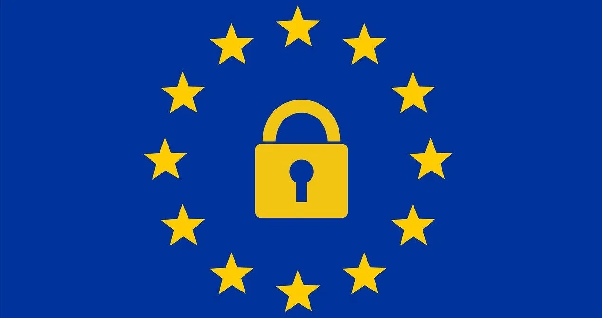
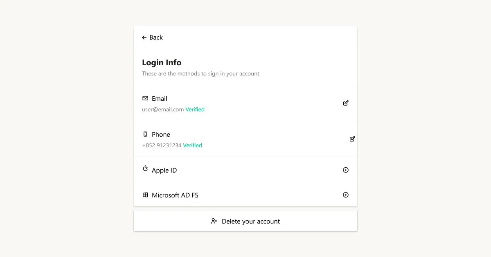

    
   The collection of data has always helped various companies analyze the behaviors of their clients in order to provide personalized services or adjust their marketing strategies. However, consumers now are more aware of how their data is used or misused and thus start demanding for more control over their data. Consequently, governments have also introduced different laws to regulate data collection.

The right to erasure is also commonly referred to as the right to be forgotten. It is a right under <a href="https://www.privacypolicies.com/blog/gdpr-compliance-apps/" target="_blank">article 17 of the GDPR</a>, which allows individuals to ask data controllers to delete their personal data. However, the right to erasure doesn’t always apply. In this blog post, we will discuss everything you need to know about the right to erasure for your apps to comply with the latest policies of data protection.

<nav id="table-of-content">Table of Content
    <ul>
        <li><a href="#background">Background of the Right to Erasure</a></li>
        <li><a href="#exceptions">Exceptions to the Right of Erasure</a></li>
        <li><a href="#public-data">When the Personal Data Is Public</a></li>
        <li><a href="#erasure-process">The Process of Data Erasure</a></li>
    </ul>
</nav>

<h2 id="background">Background of the Right to Erasure</h2>

<!--FIGURE-->

<!--/FIGURE-->

The General Data Protection Regulation is a body whose mandate is to govern how personal data is collected, processed, and erased. Initially, the right to erasure came around after a dispute was taken to court against search engines. In the litigation, search engines were on the defense side for holding older materials in the indexes, though they were no longer accurate or newsworthy.

Consequently, the European Court of Justice acknowledged the right to erasure in 2014. Ever since, search engines have allowed users to take more control over their digital footprint. Other stakeholders have also adjusted accordingly. For instance, Apple announced that all apps allowing users to create accounts should also allow them to initiate account deletion within the applications. This requirement was initially scheduled to be effective on January 31, 2022, but was extended to June 30, 2022 for developers to better prepare for it.

As we mentioned earlier, some conditions must be met for the data controller to comply with the <a href="https://ico.org.uk/your-data-matters/your-right-to-get-your-data-deleted/#:~:text=The%20right%20to%20get%20your%20data%20deleted%20is%20also%20known,'right%20to%20be%20forgotten'." target="_blank">right to erasure</a>. Under GDPR, a data subject is entitled to this right if:

- The personal data no longer serves the purpose for which it was collected or processed
- The data subject withdraws their consent, and there is no other ground for lawful processing
- The personal data was unlawfully processed
- The controller is bound by a legal obligation to erase the data
- The data subject has a valid objection to processing
- The data has been collected in relation to the offer of information society services to a child

<h2 id="exceptions">Exceptions to the Right to Erasure</h2>

The GDPR cites circumstances in which a data subject cannot invoke the right to be forgotten. The right to erasure will not apply if the processing is required for:

- Reasons of public interest in the scope of public health
- Establishment, exercise or defense of legal claims
- Compliance with a legal obligation
- Exercising the right of freedom of expression and information
- Archiving for a public interest, scientific or historical purposes, or statistical purposes

	<h2 class="title cta-split-content-left">Comply With the Right to Erasure Effortlessly With Authgear</h2>
  
Equip your apps with everything you need to protect users' privacy

  <a href="/schedule-demo/" target="_blank" class="w-inline-block">
  	
Get Demo

<h2 id="public-data">When the Personal Data Is Public</h2>

Sometimes, <a href="https://www.experian.co.uk/business/glossary/right-to-erasure/" target="_blank">a data subject</a> can request the erasure of their data, which the data controller might have made public. In that case, the controller needs to inform controllers processing that data that there has been a request to delete any copies of it or links to it.

Besides, if the data controller had disclosed the personal data to other organizations, they must inform the said organizations of the data erasure. The data subject also has the right to request information about the recipient organizations from the data controller.

<h2 id="erasure-process">The Process of Data Erasure</h2>

In light of the right to erasure under GDPR, developers need to <a href="https://iapp.org/news/a/how-to-comply-with-the-right-to-erasure-if-you-havent-already/" target="_blank">process requests</a> to erase people's personal data. While the GDPR does not specify a particular manner of data erasure, it’s a process with several steps, as we have outlined below.

### Preparing the Supporting Systems

The systems, applications, and databases that store and process a subject’s data should enable the organization to locate and delete the data easily. Therefore, organizations need to perform audits on their current IT systems to see that they can handle the function.

After an audit, an organization can identify whether the systems need to be reconfigured or upgraded to be up to the task. It’s important to note that the GDPR does not allow an organization to claim that the erasure of data is impossible. Therefore, preventing further processing of the data does not qualify as erasure.

A closer alternative would be anonymizing a person’s data. Since anonymous data cannot be linked back to them, it’s no longer considered personal data.

### Creating Data Governance Structure

It’s essential to have a data governance structure to reply to data erasure requests. Data governance revolves around functions like mapping the data flow across systems, departments, and third parties. It also ensures data quality – taking care of issues like duplicates that can be found in back-ups and hard copies.

Notably, some data might call for extra obligations, for instance, if it’s related to minors. Having a data governance structure ensures that such matters are taken care of to ensure that the organization covers all ground during erasure.

### Putting Policies and Procedures in Place

The GDPR does not require organizations to have policies or procedures in place. However, there is a possibility that an organization will require them to comply fully. These policies and procedures will educate developers and other employees of an organization on the necessary steps in the data erasure life cycle.

Documenting these policies and procedures is also proof of an organization’s compliance with the obligation to an individual’s data rights. The policies and procedures need to be centrally managed – to ensure uniformity across various departments of an organization.

### Confirming the Data Subject’s Identity

Before a data controller can erase a subject’s data upon request, they must be able to confirm the subject’s identity. If the data controller has doubts about their identity, they can request more information to verify it.

The GDPR does not outline an organisation's steps to confirm identity. Nevertheless, most data controllers have procedures in place. For instance, if the controller had verified the subject’s identity as they entered into the agreement, they can verify identity.

If the data controller wants to decline a subject’s request for data erasure on the grounds of identity concerns, they must inform the subject.

However, in some cases, confirmation of the data subject’s identity is not necessary. That is the case if the data subject’s personal information that identifies them is not necessary for the purpose of processing.

### Cost of Data Erasure

Ideally, exercising one’s right to erasure is free of charge. However, if the requests are unfounded or excessive, the data controller can charge a fee within a reasonable range or decline the request.

You can deem requests unfounded or excessive if the data subject requests erasure frequently. But, you must demonstrate the unfounded or excessive nature of the request.

### The Timeframe of Data Erasure

As the data controller, you must respond to data erasure requests without undue delay and not later than a month after receiving the request. In the reply, you should inform the data subject of your measures in response to their request.

Should you receive several or complex requests, you can reply telling the data subjects that you need more time to work on their requests. In that case, the deadline can be extended by not more than two months.

If you decline the data subject’s request, you also need to inform them within one month of receiving the request. You must also <a href="https://simple.life/privacy-1.htm" target="_blank">justify the refusal</a> to them.

## Benefits of Authgear to the Developer

As time goes by, the issue of data control is gaining traction. Now, more than ever before, users want more control of their data, including deleting it. With Authgear, you can easily comply with the right to erasure and Apple’s upcoming account deletion requirement with our latest in-app account deletion feature.

<!--FIGURE-->

<!--/FIGURE-->

Authgear is the authentication and user management solution your apps need that comes with all sorts of features, such as SSO, 2FA, biometrics, admin portals, etc., that your consumer apps need. As a developer, you would highly appreciate Authgear for its ease of customization and a wide range of defaults.

<a href="/schedule-demo/" target="_blank">Contact us</a> now to learn more about Authgear and how it can help your applications gain a competitive edge.
