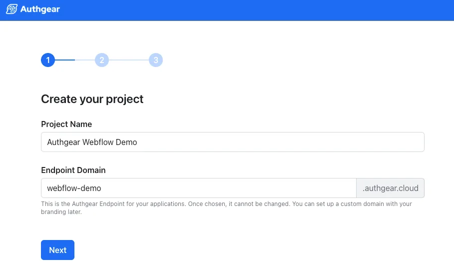
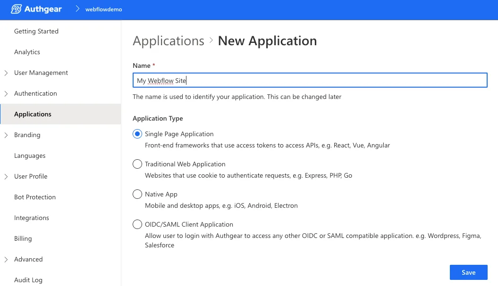
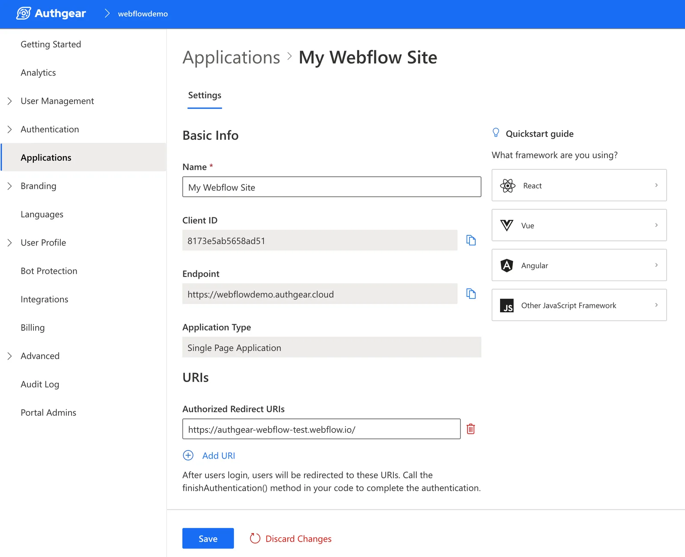
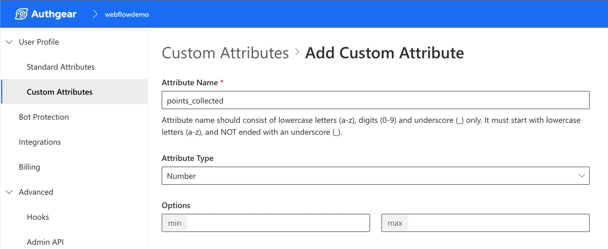
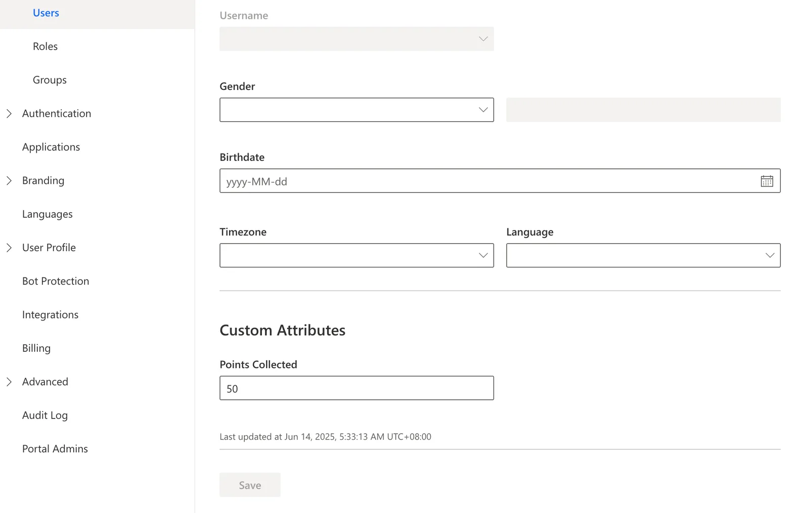

*With Webflow sunsetting its native User Accounts feature*, many developers face the challenge of finding a secure, robust, and easy-to-integrate solution. Now, imagine you're building a loyalty program website—a vibrant digital haven where members effortlessly log in to check their personalized content and track their reward points. Your community is excited to explore exclusive benefits and see their progress, but with the traditional authentication method gone, how do you ensure a flawless, secure experience?

Enter Authgear. This powerful tool steps in to bridge the gap left by Webflow. Authgear’s generous free tier and versatile suite of features make it the ideal replacement for managing user authentication on your loyalty program site. Whether you’re a seasoned developer or just beginning your journey, integrating Authgear ensures your members can seamlessly log in, interact with exclusive content, and feel secure every step of the way.

In this guide, you’ll embark on a step-by-step process to integrate Authgear into your Webflow website. By the end, you’ll have learned to:

- Create an Authgear project and an application.
- Add Login, Logout, and Sign Up buttons that show/hide correctly.
- Implement the core authentication logic for your Webflow site.
- Display standard and custom user information in a protected section.
- Create and manage gated content visible only to logged-in users.

You can check the end product of this guide in [here](https://authgear-webflow.webflow.io/), you can also clone the Webflow project [here](https://webflow.com/made-in-webflow/website/authgear-webflow).

### Prerequisites

- An active **Authgear account**. If you don't have one, you can [sign up for free](https://accounts.portal.authgear.com/signup).
- A **Webflow account** and a project you want to add authentication to.

## Step 1: Create Your Authgear Project

First, we'll create a project, which acts as a container for your applications and users.

1. After signing into the [Authgear Portal](https://portal.authgear.com/), you will be prompted to create a new project.
1. Enter a Project Name (e.g., `My Webflow Site`).
1. Complete the endpoint domain to form your unique Authgear endpoint: `https://<your-project-name>.authgear.cloud`. Click "Next".

<!--FIGURE-->

<!--/FIGURE-->

1. Choose how you would like your end-users to login. In this tutorial, make sure we choose Email here.
1. Add branding by uploading logo and choosing the colors you like.

## Step 2: Create and Configure an Application

Now that you have a project, you need to create an application within it.

1. In the Authgear Portal, navigate to Applications in the left-hand menu.
1. Click the + Add Application button in the top toolbar.
1. In the dialog, enter an Application Name (e.g., "Webflow Site") and select the Single Page Application type. Click "Save".

<!--FIGURE-->

<!--/FIGURE-->

1. On the next screen, Authgear shows tutorials for various frameworks. Click Next to skip this and go to your application's configuration page.
1. You will now be on the application configuration page. Under the URIs section, find the Authorized Redirect URIs field.
1. Enter the root URL of your published Webflow site (e.g., `https://my-awesome-site.webflow.io/`). Note that the trailing "/" in the above URLs must be included.
1. Click Save at the bottom of the page.
1. Finally, make a note on your Client ID and Endpoint. You will need these values in a later step.

<!--FIGURE-->

<!--/FIGURE-->

## Step 3: Add Custom Styles to Webflow

1. In your Webflow project, go to Site Settings > Custom Code.
1. In the Head Code section, paste the CSS styles below. These styles prevent a "flash" of content before our script has a chance to run. The script itself will be added to the footer in the next step for better page performance.

1. Click "Save Changes".

## Step 4: Add the SDK and Style Authentication Buttons

1. In the Webflow Designer, add three Button elements to your page.
1. Set their text to "Login", "Sign Up", and "Logout".
1. Assign classes and IDs:<ul><li>**Login Button**: Class **`auth---invisible`**, ID **`login-btn`**
1. **Sign Up Button**: Class **`auth---invisible`**, ID **`signup-btn`**
1. **Logout Button**: Class **`auth---visible`**, ID **`logout-btn`**
1. Go back to Site Settings > Custom Code and paste the following into the Footer Code section. This includes the Authgear SDK and the initial logic for your buttons.

## Step 5: Implement the Core Authentication and UI Logic

Update the Footer Code:

In your Webflow Footer Code, replace the contents of the *second* `<script>` tag with the full logic below. Remember to update the placeholder values with your credentials from Step 2.

Then, you can move on to sign up as the first user:

1. Publish your Webflow site.
1. Open the live site URL and click "Sign Up" to create an account.
1. After signing up, you will be redirected back, and the "Logout" button should be visible.
1. Verify this new user exists in your Authgear Admin Portal under User Management > Users.

## Step 6: Add Elements for Standard User Information

1. In the Webflow Designer, add two Paragraph elements to your page.
1. Assign them IDs and text:<ul><li>First Paragraph: ID **`user-email`**, Text **Membership Email:**
1. Second Paragraph: ID **`user-email-verified`**, Text Verification Status:
1. In your Footer Code, update the `updateUI` function to fetch and append this data.

## Step 7: Add and Display Custom Attributes

### 7a. Create, Configure, and Assign a Custom Attribute

1. Define the Attribute:<ol><li>In the Authgear Admin Portal, navigate to User Profile > Custom Attributes.
1. Click "+ Add New Attribute".
1. Configure it: Name **`points_collected`**, Type Number. Click "Save".
1. In the list, set Token Bearer Access Right and End-user Access Right to Read-only.

<!--FIGURE-->

<!--/FIGURE-->

1. Assign a Value to Your User   <ol><li>Navigate to User Management > Users, and click on your test user.
1. In the Profile Tab, scroll down to Custom Attributes.
1. Enter a number (e.g., 50) in the Points Collected field and click "Save".

<!--FIGURE-->

<!--/FIGURE-->

### 7b. Display the Custom Attribute in Webflow

1. In the Webflow Designer, add a new Paragraph element to your page.
1. Give it the ID **`points-collected`** and set its text to **FlowPoints Collected:**.
1. In your Footer Code, update the `updateUI` function again to fetch and display this value.

## Step 8: Protect Content

### 8a. Protect a Section of a Page

1. In the Webflow Designer, add a Div Block to your page for the "logged out" view.<ul><li>Give it the class `a`**`uth---invisible`**.
1. Inside, add a Paragraph with the text "Please login to see this locked content".
1. Add a Button with the text "Login to View" and the class `content-button`.
1. Add a second Div Block for the "logged in" view.<ul><li>Give it the class**`auth---visible`**.
1. Drag the three paragraph elements from Steps 6 and 7 inside this div.
1. Finally, add a click listener for the new `content-button`.

### 8b. Protect an Entire Page

1. Create a new page in Webflow (e.g., "locked-content").
1. In the Navigator panel, select the Body element.
1. In the Style Panel (S), give the Body the class**`auth---visible`**. Our script will now automatically redirect any unauthenticated users from this page.

## Final Code

Here is the complete, final script to be placed in your Webflow project's **Footer Code**.

## Conclusion

By following this guide, you’ve seen how Authgear can seamlessly fill the gap left by Webflow’s native User Accounts, enabling you to offer secure, intuitive authentication and personalized experiences for your users. With features like easy integration, customizable UI, and robust user management, Authgear empowers you to protect your content and build thriving communities with confidence.

Ready to secure your Webflow site and delight your users? <a href="https://accounts.portal.authgear.com/signup" target="_blank">Sign up for Authgear for free</a> and start building today!
