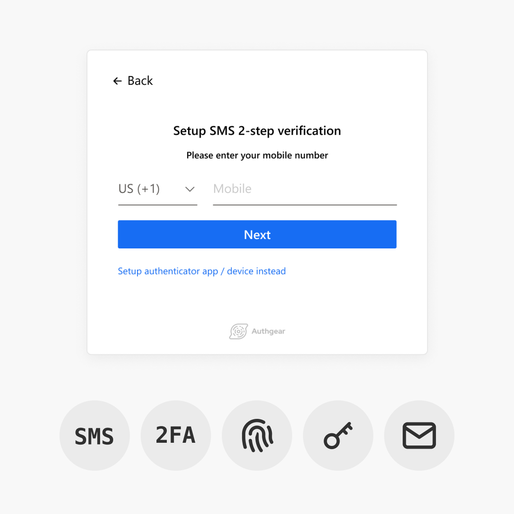

    
    Customer Identity and Access Management (CIAM) solutions are integrated into different applications or software to help organizations manage and verify end users’ identities to grant access to online services and securely collect, organize, and analyze user data to generate business insights.

The CIAM market is <a href="https://www.marketsandmarkets.com/Market-Reports/consumer-iam-market-87038588.html" target="_blank">projected to grow from $8.6 billion in 2021 to $17.6 billion by 2026</a> due to the rise in security breaches and cyber attacks. The COVID-19 pandemic plays an important role in driving the growth of the CIAM market as “going digital” is now the norm and various vendors and service providers demand for CIAM to offer a frictionless customer experience and improve data security.

In this blog post, we will be discussing a few points, such as what Customer Identity and Access Management is, what it does, how you can benefit from it, and what a good CIAM looks like, for you to better understand the importance of CIAM and why your apps need it.

<nav id="table-of-content">Table of Content
    <ul style="margin-bottom:0">
        <li><a href="#ciam-vs-iam" style="margin-top:15px;">How Is CIAM Different From IAM? </a></li>
        <li><a href="#why-ciam">Why Do You Need a CIAM Solution? </a></li>
        <li><a href="#features" style="margin-bottom:0">What Are The Key Features of CIAM?</a>
            <ol style="margin-bottom:0">
                <li style="margin-top:15px"><a href="#registration">Frictionless User Registration</a></li>
                <li><a href="#authentication">Different Authentication Mechanisms </a></li>
                <li><a href="#privacy-consent">Consent and Privacy Management</a></li>
                <li><a href="#user-analytics">User Analytics</a></li>
            </ol>
        </li>
        <li><a href="#more-ciam">What Other Qualities or Features Should a Good CIAM Solution Have?</a>
            <ul>
                <li style="margin-top:15px"><a href="#integration">Integration & Scalability</a></li>
                <li><a href="#cloud">Cloud-based Hosting</a></li>
            </ul>
        </li>
    </ul>
</nav>

<h2 id="ciam-vs-iam">How Is CIAM Different from IAM?</h2>

Many confuse Identity and Access Management (IAM) with Customer Identity and Access Management (CIAM) as they both deal with user authentication. However, the key difference is that IAM, usually referred to as Enterprise Authentication or Workforce Identity Management, is a broader term that manages authentication or user identity **within an organization** while CIAM deals with the identities of **external consumers or users**. As a result, the required features and the main objectives of CIAM and IAM are quite different. For example, the main objective of IAM is to improve internal operational efficiency while that of CIAM is to provide better user experience for end users to maximize customer acquisition and retention rates. In addition, IAM usually does not have to be as scalable as CIAM since the number of employees is usually much lower than the potential number of consumers.

<h2 id="why-ciam">Why Do You Need a CIAM Solution?</h2>

Many businesses used to develop their own customer and identity management solutions in-house; however, the complexity of CIAM requires a lot of resources to develop, maintain, and improve. As a result, many businesses choose to integrate their software or applications with external CIAM solutions that can better fulfill their needs, reduce stress for the engineering team, decrease cost, etc.

Businesses can benefit much from integrating their software or apps with a well-developed CIAM solution in many ways, but the main two advantages that businesses can gain are to **improve user experience** and **enhance data security.**

### Improve User Experience

When users are deciding which software or app to use, it often comes down to which software or app has better user experience. Customer identity solutions can help businesses optimize user experience throughout the entire user journey for businesses to convert more customers and keep them satisfied so that they will eventually become loyal brand advocates.

A CIAM solution provides a smooth and frictionless registration process powered by several features. CIAM solutions come with pre-built signup templates with minimal frictions and allow users to create new accounts with existing credentials provided by other identity providers, such as Google, Facebook, and LinkedIn. This significantly shortens and smoothens the registration process, which can have a bounce rate that’s up to 80%.

<!--FIGURE-->

<!--/FIGURE-->

### Enhance Data Security

According to <a href="https://www.ibm.com/security/data-breach" target="_blank">IBM’s Cost of a Data Breach Report 2021</a>, the average costs of data breach rose from USD 3.86 million to 4.24 million, where compromised credentials accounted for 20% of the data breaches. Businesses can no longer consider data security an afterthought as costs of data breaches continue to rise and studies show that <a href="https://businessinsights.bitdefender.com/businesses-can-lose-up-to-58-of-customers-after-a-data-breach-research-shows" target="_blank">more than 50% of consumers will not make another purchase for months after a security breach in the U.S</a>.

CIAM solutions do more than just provide an authentication server to verify users’ identities. It also secures users’ credentials through <a href="/post/password-hashing-salting" target="_blank">password hashing and salting</a>, requires multi-factor authentication to add another layer of security, and provides different authentication methods to eliminate password fatigue. By integrating their apps or software with CIAM solutions, businesses will not have to devote resources to developing and maintaining their own CIAM system and better protect their users’ credentials.

<h2 id="features">What Are The Key Features of CIAM?</h2>

<h3 id="registration" style="margin:0 auto 25px">Frictionless User Registration</h3>

<!--FIGURE-->

<!--/FIGURE-->

When was the last time you didn’t see “Sign in with Facebook” or “Sign in with Google” when you were about to create a new account in an app or on a website? Creating new accounts with existing credentials or identities is now the norm as it allows users to gain access to new services with minimal efforts. They will not have to come up with a new set of username and password or enter the same old credentials perhaps just to see if they will find this service valuable.

CIAM solutions allow your users to easily register with existing credentials or identities provided by third party identity providers (IdPs), such as Google, Facebook, LinkedIn, Github, and more. Furthermore, some CIAM solutions also come with existing signup page templates so that you will not have to build your own form and page from scratch.

<h3 id="authentication">Different Authentication Mechanisms</h3>

CIAM solutions equip consumer-facing apps with different authentication methods, such as social login, <a href="/post/biometric-authentication" target="_blank">biometric authentication</a>, and more, so that users are free from the password reset nightmare when they forget their passwords. Enabling <a href="/post/what-is-multi-factor-authentication-mfa" target="_blank">multi-factor authentication</a> not only allows users to have more login options to improve user experience but also adds layers of security as these types of authentication are often stronger than the traditional username-password authentication.

<h3 id="privacy-consent">Consent and Privacy Management</h3>

As consumers are more aware of their digitals rights and concerned about how their personal information is collected and used, businesses certainly have to find a way to manage user’s consent and protect their data. CIAM solutions help you build customer trust by giving users more control over their data. Users can decide whether to accept your privacy policy or share different personal information with the help of CIAM.

<h3 id="user-analytics">User Analytics</h3>

CIAM provides a centralized place to collect, organize, and analyze users’ data. You will be able to know things like:

- Through what channels most of your users come from?
- How many active and inactive users are there?
- What are the methods used most frequently to sign up?

More insights can be generated by integrating CIAM solutions with other analytical solutions so that businesses can provide personalized experiences to their users to build customer loyalty.

<h2 id="more-ciam">What Other Qualities or Features Should a Good CIAM Solution Have?</h2>

<h3 style="margin-top:0" id="integration">Integration & Scalability</h3>

Contrary to IAM that is used internally by enterprises with relatively user count, CIAM solutions used by consumer-facing apps are often required to accommodate hundreds of thousands of users, especially during holiday season or some major events. The number of users will continue to increase when your business grows or you offer more services and products; therefore, having a scalable CIAM that can handle a high volume of users is quite important.

Furthermore, consumer-facing apps often need a lot of integrations to conduct business. The number of integration needed will certainly increase as the business grows. As a result, CIAM solutions often offer certain popular integrations as their unique selling points.

<h3 id="cloud">Cloud-based Hosting</h3>

CIAM technology can be deployed or delivered in several ways, such as on a public cloud, a private cloud, or even on-premise. However, cloud deployment is the ideal way of hosting since businesses can access the service from any location and also easily scale and upgrade it.

## Integrate Your App or Website with Authgear to Earn & Build Customer Loyalty

Authgear is a Customer Identity and Access Management solution that provides all features, including social login, frictionless registration process, biometric authentication, two-factor authentication, user and session management, etc., that your consumer-facing apps need to grow user base and build customer loyalty.

<a href="/talk-with-us" target="_blank">Contact us</a> now to see how easy it is to enjoy all the benefits that our CIAM can bring you.
