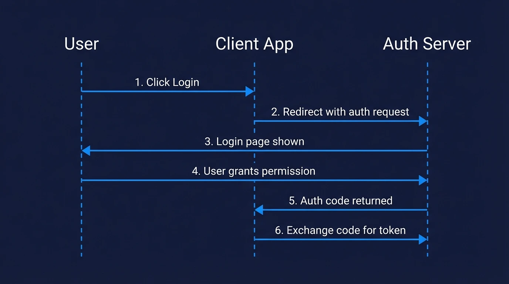

Every time you click "Sign in with Google" or connect a third-party app to your GitHub account, OAuth 2.0 is running behind the scenes. It's the protocol that lets users grant apps access to their data — without handing over their password.

In this guide, you'll learn exactly how OAuth 2.0 works: the authorization flow step by step, what the different grant types are for, how it compares to OIDC and JWT, and when to use each.

## What Is OAuth 2.0?

OAuth 2.0 is an open authorization framework that allows a user to grant a third-party application limited access to their account on another service — without sharing their password.

Think of it like a hotel key card system. Instead of giving a guest your master key (your password), the hotel (authorization server) issues a temporary key card (access token) that only opens specific doors (scopes) for a limited time.

OAuth 2.0 is *authorization*, not authentication. It answers "what can this app access?" — not "who is this user?" (That's what [OpenID Connect](/post/oidc-vs-saml) adds on top.)

## The Four Actors in OAuth 2.0

Before walking through the flow, it helps to know the four parties involved:

<div class='ag-table-wrap'>
<table class='ag-table'>
  <thead>
    <tr>
      <th>Actor</th>
      <th>What it is</th>
      <th>Example</th>
    </tr>
  </thead>
  <tbody>
    <tr>
      <td><strong>Resource Owner</strong></td>
      <td>The user who owns the data</td>
      <td>You, the person logging in</td>
    </tr>
    <tr>
      <td><strong>Client</strong></td>
      <td>The app requesting access</td>
      <td>A todo app that wants to read your Google Calendar</td>
    </tr>
    <tr>
      <td><strong>Authorization Server</strong></td>
      <td>Issues tokens after user consents</td>
      <td>Google's OAuth server (accounts.google.com)</td>
    </tr>
    <tr>
      <td><strong>Resource Server</strong></td>
      <td>Hosts the protected data</td>
      <td>Google Calendar API</td>
    </tr>
  </tbody>
</table></div>

## The OAuth 2.0 Authorization Code Flow: Step by Step

The most common and secure OAuth 2.0 flow is the **Authorization Code flow**. Here's exactly what happens, step by step:

<!--FIGURE-->

<!--/FIGURE-->

### Step 1: The Client Redirects the User to the Authorization Server

The flow starts when the user clicks "Login with Google" (or similar). The client redirects them to the authorization server with a URL like this:

```

https://accounts.google.com/o/oauth2/v2/auth?
  client_id=YOUR_CLIENT_ID
  &redirect_uri=https://yourapp.com/callback
  &response_type=code
  &scope=https%3A%2F%2Fwww.googleapis.com%2Fauth%2Fcalendar.readonly
  &state=random_csrf_token
  &code_challenge=BASE64URL(SHA256(code_verifier))
  &code_challenge_method=S256

```

Key parameters:

<ul>
  <li><code>client_id</code> — identifies your app to the authorization server</li>
  <li><code>redirect_uri</code> — where to send the user after they approve</li>
  <li><code>scope</code> — what access you're requesting (e.g. <code>calendar.readonly</code>). Note: adding <code>openid</code> to the scope activates <a href='/post/oidc-vs-saml'>OpenID Connect</a> on top of OAuth 2.0 — useful when you also need to identify the user.</li>
  <li><code>state</code> — a random value to prevent CSRF attacks</li>
  <li><code>code_challenge</code> — part of the <a href='/post/pkce-in-oauth-2-0-how-to-protect-your-api-from-attacks'>PKCE extension</a> (required for public clients)</li>
</ul>

### Step 2: The User Logs In and Grants Consent

The authorization server shows the user a login page and a consent screen — "This app wants access to your email and profile. Allow?" — and the user approves or denies.

### Step 3: The Authorization Server Returns an Authorization Code

After the user approves, the authorization server redirects back to your `redirect_uri` with a short-lived authorization code:

```

https://yourapp.com/callback?code=AUTH_CODE_HERE&state=random_csrf_token

```

This code is temporary (usually expires in 60–120 seconds) and can only be used once. It's not an access token — your server still needs to exchange it.

### Step 4: The Client Exchanges the Code for an Access Token

Your server makes a back-channel POST request to the token endpoint — this happens server-side, so the client secret is never exposed to the browser:

```

const response = await fetch('https://oauth2.googleapis.com/token', {
  method: 'POST',
  headers: { 'Content-Type': 'application/x-www-form-urlencoded' },
  body: new URLSearchParams({
    grant_type: 'authorization_code',
    code: 'AUTH_CODE_HERE',
    redirect_uri: 'https://yourapp.com/callback',
    client_id: process.env.CLIENT_ID,
    client_secret: process.env.CLIENT_SECRET,
    code_verifier: codeVerifier, // PKCE
  }),
});

const { access_token, refresh_token, expires_in } = await response.json();
// Note: refresh_token is optional — not all servers issue one.
// For Google, you need to pass access_type=offline to receive a refresh_token.

```

The authorization server returns:

<ul>
  <li><strong>access_token</strong> — used to make API requests on behalf of the user</li>
  <li><strong>refresh_token</strong> — used to get a new access token when it expires (without the user logging in again). Not always returned — depends on the server and the scopes requested.</li>
  <li><strong>expires_in</strong> — how many seconds until the access token expires</li>
</ul>

### Step 5: Use the Access Token to Call the Resource Server

```

const userInfo = await fetch('https://www.googleapis.com/calendar/v3/users/me/calendarList', {
  headers: {
    Authorization: `Bearer ${access_token}`,
  },
});

const calendars = await userInfo.json();
// { kind: 'calendar#calendarList', items: [...] }

```

The resource server validates the token and returns the protected data. When the access token expires, use the refresh token to get a new one without prompting the user again.

## OAuth 2.0 Grant Types

The Authorization Code flow above is just one of several OAuth 2.0 grant types. Each one is designed for a specific scenario:

<div class='ag-table-wrap'>
<table class='ag-table'>
  <thead>
    <tr>
      <th>Grant Type</th>
      <th>Use Case</th>
      <th>Status</th>
    </tr>
  </thead>
  <tbody>
    <tr>
      <td><strong>Authorization Code + PKCE</strong></td>
      <td>Web apps, mobile apps, SPAs — any user-facing app</td>
      <td>✅ Recommended</td>
    </tr>
    <tr>
      <td><strong>Client Credentials</strong></td>
      <td>Machine-to-machine (M2M) — no user involved</td>
      <td>✅ Recommended</td>
    </tr>
    <tr>
      <td><strong>Device Code</strong></td>
      <td>Smart TVs, CLI tools — devices without a browser</td>
      <td>✅ Recommended</td>
    </tr>
    <tr>
      <td><strong>Implicit</strong></td>
      <td>Old SPAs — token returned directly in redirect</td>
      <td>❌ Avoid — superseded by Auth Code + PKCE</td>
    </tr>
    <tr>
      <td><strong>Resource Owner Password</strong></td>
      <td>App collects username/password directly</td>
      <td>❌ Avoid — superseded by Auth Code + PKCE</td>
    </tr>
  </tbody>
</table></div>

For a deeper explanation of each grant type and when to use them, see our guide on [OAuth 2.0 grant types](/post/common-oauth-2-0-grant-types).

## OAuth 2.0 vs OpenID Connect (OIDC)

This is one of the most common points of confusion. Here's the short version:

<ul>
  <li><strong>OAuth 2.0</strong> handles <em>authorization</em> — "what can this app access?"</li>
  <li><strong>OpenID Connect (OIDC)</strong> handles <em>authentication</em> — "who is this user?"</li>
</ul>

OIDC is built on top of OAuth 2.0. It adds an `id_token` (a JWT containing user identity info) to the standard OAuth flow, plus a `/userinfo` endpoint and a standardized `openid` scope.

In practice: when you add `scope=openid` to your OAuth 2.0 request, you're using OIDC. When you only ask for `scope=read:email` (no `openid`), you're using plain OAuth 2.0.

<div class='ag-table-wrap'>
<table class='ag-table'>
  <thead>
    <tr>
      <th></th>
      <th>OAuth 2.0</th>
      <th>OpenID Connect</th>
    </tr>
  </thead>
  <tbody>
    <tr>
      <td><strong>Purpose</strong></td>
      <td>Authorization (access delegation)</td>
      <td>Authentication (identity verification)</td>
    </tr>
    <tr>
      <td><strong>Token returned</strong></td>
      <td>Access token</td>
      <td>Access token + ID token</td>
    </tr>
    <tr>
      <td><strong>User info</strong></td>
      <td>Not standardized</td>
      <td>Standardized <code>/userinfo</code> endpoint</td>
    </tr>
    <tr>
      <td><strong>Use when</strong></td>
      <td>Granting API access to another app</td>
      <td>Letting users "log in" to your app</td>
    </tr>
  </tbody>
</table></div>

Most modern implementations use both together. For a deeper comparison with SAML, see [OIDC vs SAML](/post/oidc-vs-saml). You can also inspect any OIDC provider's configuration using the [OIDC Discovery Endpoint Explorer](/tools/oidc-discovery-endpoint).

## OAuth 2.0 vs JWT

OAuth 2.0 and JWT are often mentioned together but they're different things:

<ul>
  <li><strong>OAuth 2.0</strong> is a <em>protocol</em> — it defines how authorization flows work</li>
  <li><strong>JWT (JSON Web Token)</strong> is a <em>token format</em> — it defines how to encode claims into a compact, signed string</li>
</ul>

JWTs are commonly *used as* OAuth 2.0 access tokens or ID tokens, but OAuth 2.0 doesn't require JWTs. An OAuth 2.0 access token could be an opaque random string — the resource server just validates it with the authorization server.

When you receive a JWT as your OAuth 2.0 access token, you can decode and verify it locally without making a network call. When you receive an opaque token, you must call the authorization server's introspection endpoint to validate it.

## Scopes: Controlling What Access Is Granted

Scopes define exactly what the client is allowed to do. They're space-separated strings in the authorization request:

```

scope=openid email profile calendar.readonly

```

The user sees these scopes on the consent screen and can approve or deny. The access token issued is then limited to those scopes — even if the resource server would otherwise allow more.

Good scope design follows the principle of least privilege: request only what you actually need. Requesting `calendar.readonly` instead of `calendar` signals to users that you won't modify their calendar.

## PKCE: Required for Public Clients

If your client is a mobile app, single-page app (SPA), or any application where you can't safely store a client secret, you must use **PKCE** (Proof Key for Code Exchange). Public clients can't store secrets because their code ships to the user's device — anyone can inspect a mobile app bundle or browser JavaScript to extract a hardcoded secret.

PKCE prevents authorization code interception attacks by having your client generate a random `code_verifier`, hash it into a `code_challenge`, and send the challenge with the authorization request. When exchanging the code for a token, your client sends the original verifier — proving it's the same client that started the flow.

See our detailed guide on [how PKCE works in OAuth 2.0](/post/pkce-in-oauth-2-0-how-to-protect-your-api-from-attacks).

PKCE is also mandatory in newer OAuth 2.1 profiles — including [MCP authentication](/post/mcp-authentication), the authorization spec for connecting AI agents to tools and data.

## Common OAuth 2.0 Mistakes to Avoid

<ul>
  <li><strong>Not validating the <code>state</code> parameter</strong> — always verify it matches what you sent to prevent CSRF attacks</li>
  <li><strong>Storing access tokens in localStorage</strong> — use httpOnly cookies or server-side sessions; localStorage is accessible to JavaScript and vulnerable to XSS</li>
  <li><strong>Using the Implicit grant for SPAs</strong> — use Authorization Code + PKCE instead; the Implicit grant is deprecated for good reason</li>
  <li><strong>Not rotating refresh tokens</strong> — refresh token rotation means the server issues a new refresh token every time one is used, invalidating the old one. This way, if a refresh token is stolen and used by an attacker, the next legitimate use by your app will detect the mismatch and revoke the session.</li>
  <li><strong>Requesting overly broad scopes</strong> — only request what you need; users are more likely to approve narrow, specific permissions</li>
</ul>

## Implementing OAuth 2.0 Without the Complexity

Implementing OAuth 2.0 from scratch means handling token storage, refresh logic, PKCE, state validation, scope management, and security edge cases. Most teams are better served by an authentication platform that handles this for them.

[Authgear]() provides a fully OAuth 2.0 and OIDC compliant authorization server with pre-built login UI, token management, refresh rotation, and support for social login providers (Google, Apple, Facebook) out of the box. You get a production-ready OAuth 2.0 implementation without building the infrastructure yourself.

## Summary

Here's what you need to remember about how OAuth 2.0 works:

<ul>
  <li>OAuth 2.0 delegates access — users grant apps permission to act on their behalf without sharing passwords</li>
  <li>The Authorization Code + PKCE flow is the correct choice for almost all user-facing apps in 2026</li>
  <li>Access tokens are short-lived; refresh tokens let you get new ones silently</li>
  <li>OAuth 2.0 handles authorization; add OIDC (<code>scope=openid</code>) if you also need authentication</li>
  <li>JWT is a token format often used with OAuth 2.0, not a replacement for it</li>
</ul>
