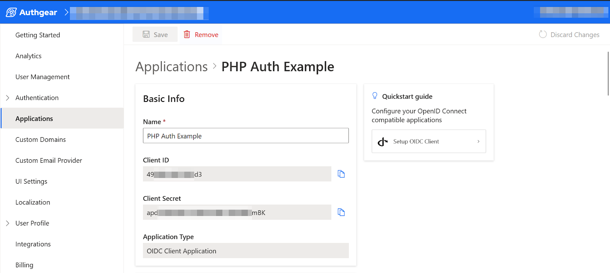

社群登入是一項功能，允許用戶使用 Facebook、Twitter 和 Google 等社交媒體網站上的現有帳戶登入網站。

在網站上新增社群媒體登入可以增加註冊量。這是因為社群登入簡化了註冊過程。例如，社群登入消除了使用者建立和記住另一組使用者名稱和密碼的需求。

社群登入的工作方式很簡單。用戶無需在您的網站上輸入用戶名和密碼，而是點擊按鈕使用其社交媒體帳戶（例如 Google、Facebook 或 Twitter 帳戶）登入。然後，他們會被導向到社群媒體網站上的授權頁面，以代表使用者向您的網站授予授權。如果使用者未登入社群媒體網站，則需要先登入。

在本文中，您將學習如何在 Laravel 網站上新增社群登入。

## 什麼是社群登入提供者？

在社群登入中，提供者只是用戶已經擁有帳戶的社群媒體網站。流行的社交登入提供者的範例包括 Facebook、Twitter（現為 X）、Google、LinkedIn、Apple、Microsoft 和 Github。

大多數受歡迎的社群媒體登入供應商都依賴[開放認證](/zh-Hant/post/what-is-oauth-2-0-and-how-it-works)標準。因此，您可以使用幾乎任何支援 OAuth 標準的服務作為社交登入提供者。在這篇文章中，我們將看到一個範例，說明如何使用 Laravel 支援的常見提供者以外的任何提供者。

### Laravel 社交名流

Socialite 是 Laravel 中正式社群登入的方案。這是一個超級有用的工具。然而，截至發這篇文章時，它僅支援以下社交登入提供者：

- Facebook
- 嘰嘰喳喳
- Google
- 領英
- GitHub
- GitLab
- 位元桶

如果您需要使用上述任何提供者以外的任何提供者來實現社交登錄，則需要使用額外的工具，例如 [社群名流供應商](https://socialiteproviders.com/)，該工具對已發布的提供者有其自身的限制。我們在這篇文章中的目標是提供一個指南，讓您更輕鬆地與任何支援 OAuth 的社群登入提供者合作。

## 如何使用其他提供者為 Laravel 新增社交登錄

在本節中，我們將逐步介紹如何使用 Socialite 不支援的供應商為 Laravel 網站新增社群登入。

我們將使用 Authgear 作為範例應用程式的 OAuth 提供者。 Authgear 是一種身份驗證即服務解決方案，提供多因素身份驗證、社交登入和生物識別身份驗證等功能。

儘管 Authgear 不是常規的社交登入提供者，但它與大多數提供者共享相同的 OAuth 標準和授權流程。這包括使用 OAuth 憑證、將使用者重定向到授權頁面以及將授權代碼發送回客戶端應用程式。

### 先決條件

若要繼續操作，您需要具備以下條件：

- 現有的 Laravel 專案。或建立一個新專案。
- Authgear 帳號。免費創建一個[這裡](/zh-Hant/)。

### 第 1 步：從提供者的網站取得 OAuth 憑證

為了將您的 Laravel 應用程式連接到任何社交登入提供者，您需要從提供者的網站取得 OAuth 憑證。

請按照本指南從 Authgear 取得 OAuth 憑證。

首先登入 Authgear 入口網站並建立新專案或選擇現有專案。然後，導航到專案的 **Applications** 部分。建立一個新的應用程序，類型為**OIDC Client Application**，如下所示：

<!--FIGURE-->

<!--/FIGURE-->

接下來，點擊**儲存**按鈕進入新應用程式的設定頁面。設定頁麵包含所有 OAuth 憑證，例如 Authgear 應用程式的用戶端 ID、用戶端金鑰和端點。記下這些值，因為您將在後續步驟中使用它們。

<!--FIGURE-->

<!--/FIGURE-->

在 Authgear 中配置的最後一件事是重定向 URI。這應該是一個指向應用程式頁面的鏈接，該頁面將在用戶在提供者網站上向您的應用程式授予授權後完成身份驗證流程。

當您仍在 Authgear 應用程式的設定頁面上時，請向下捲動至 URL 部分並按一下「新增 URI」。在此範例中，我們使用 Laravel 的預設連接埠在 localhost 上進行測試，因此，在文字欄位中輸入 **localhost:8000/oauth/callback** 並點擊 **Save**。在生產中，請確保添加帶有您網站域名的正確連結。

### 第 2 步：在 Laravel 專案中啟用使用者身份驗證

在大多數情況下，網站除了常規電子郵件和密碼身份驗證之外，還使用社交登入。因此，讓我們為 Laravel 應用程式設定常規電子郵件和密碼身份驗證。我們將使用 Laravel/Breeze 套件來做到這一點。

Breeze 是 Laravel 的官方身份驗證入門套件。它有助於自動設定用於使用者身份驗證的路由、視圖、控制器和資料庫。

在 Laravel 專案的根資料夾中執行以下命令來下載 Breeze 套件：

```

composer require laravel/breeze --dev

```

下載 Breeze 後，執行以下命令啟用 Breeze 並設定用戶身份驗證系統的所有資源：

```

php artisan breeze:install

```

在設定提示中，選擇 **blade** 作為堆疊，並將其他選項保留為預設值。

設定完成後，您應該會看到一些新資料夾和檔案新增到您的 Laravel 專案中。其中包括 **controllers** 資料夾中的 **Auth** 子資料夾，以及 **views** 資料夾中的另一個 **auth** 子資料夾。

### 第 3 步：在頁面上新增社群登入按鈕

在此步驟中，我們將在常規 **Login** 按鈕下方新增一個 **Login with Authgear** 按鈕，如下所示：

<!--FIGURE-->

<!--/FIGURE-->

若要建立上述視圖，請開啟 **views/auth/login.blade.php** 並在 **Log In** 按鈕下方新增以下程式碼：

```

<div class="mt-4">
   <p>Or</p>
   <a href="/zh-Hant/oauth/login" class="inline-flex items-center px-4 py-2 bg-gray-800 border border-transparent rounded-md font-semibold text-xs text-white">Login with Auth Provider</a>
</div>

```

完成後，請造訪 **localhost:8000/login** 預覽登入頁面。此時，按一下「**使用身分驗證提供者登入**」按鈕將無法如預期運作。我們將在下一步中解決這個問題。

### 步驟 4：將使用者重新導向至提供者的授權頁面

當使用者點擊**使用驗證提供者登入**時，我們會將他們重新導向到提供者的授權頁面。

為此，我們需要在 Laravel 中設定新的 OAuth 控制器並實現必要的方法。

透過執行以下命令建立新控制器：

```

php artisan make:controller OAuthController

```

在開始向新控制器新增程式碼之前，讓我們安裝 **OAuth2-client** 套件。我們將使用此套件與 Laravel 專案中社交登入提供者網站上的端點進行通訊。

執行以下命令安裝 OAuth2-client：

```

composer require league/oauth2-client

```

現在讓我們回去實作我們的新控制器。將以下程式碼加入**OAuthController.php**：

```

use \League\OAuth2\Client\Provider\GenericProvider;
use Illuminate\Support\Facades\Auth;
use Illuminate\Support\Facades\Hash;
use App\Models\User;

class OAuthController extends Controller {

	public $provider;

	public function __construct ()
	{
    	$appUrl = env("AUTHGEAR_PROJECT_URL", "");
    	$this->provider = new GenericProvider([
        	'clientId'            	=> env("AUTHGEAR_APP_CLIENT_ID", ""),
        	'clientSecret'        	=> env("AUTHGEAR_APP_CLIENT_SECRET", ""),
        	'redirectUri'         	=> env("AUTHGEAR_APP_REDIRECT_URI", ""),
        	'urlAuthorize'        	=> $appUrl.'/oauth2/authorize',
        	'urlAccessToken'      	=> $appUrl.'/oauth2/token',
        	'urlResourceOwnerDetails' => $appUrl.'/oauth2/userInfo',
        	'scopes' => 'openid'
    	]);
	}

	public function startAuthorization() {
    	$authorizationUrl = $this->provider->getAuthorizationUrl();
    	return redirect($authorizationUrl);
	}

    public function handleRedirect() {

    }
}

```

上面的程式碼使用了一些我們尚未配置的環境變量，所以我們現在就配置一下。開啟 Laravel 專案的 **.env** 檔案並新增以下欄位：

```

AUTHGEAR_PROJECT_URL = ""
AUTHGEAR_APP_CLIENT_ID = ""
AUTHGEAR_APP_CLIENT_SECRET = ""
AUTHGEAR_APP_REDIRECT_URI = "http://localhost:8000/oauth/callback"

```

使用 Authgear 應用程式設定頁面中的正確值設定每個欄位的值（請參閱步驟 1）。

您的專案 URL 是 Authgear 應用程式端點的主機名稱。例如，如果您的端點是 **https://laravel-app.authgear.cloud/oauth2/authorize**，則您的專案 URL 將為 **https://laravel-app.authgear.cloud**。

在繼續下一步之前，讓我們建立將呼叫 **startAuthorization()** 和 **handleRedirect()** 方法的路由。為此，請將以下程式碼新增至 **routes/web.php**：

```

Route::get('/oauth/login', [OAuthController::class, 'startAuthorization']);
Route::get('/oauth/callback', [OAuthController::class, 'handleRedirect']);

```

我們將在下一步中實作 **handleRedirect()** 方法。

此時，如果您執行應用程式並點擊「使用身分驗證提供者登入」按鈕，您應該會被重新導向到提供者的授權頁面。

<!--FIGURE-->

<!--/FIGURE-->

您的使用者需要在授權頁面上建立帳戶，然後才能登入您的 Authgear 專案。他們的資料只能由您的專案訪問，而 Authgear 上的其他開發人員或專案無法存取。

### 步驟5：實施OAuth回呼頁面

用戶在提供者網站上向您的應用程式授予授權後，他們將被重定向到您的回調頁面。這與您的重定向 URI 在步驟 1 中指向的頁面相同。我們將在 OAuthController 檔案中的 **handleRedirect()** 方法中實作此頁面的邏輯。

將空的 **handleRedirect()** 方法替換為以下程式碼：

```

public function handleRedirect() {

	// if code is set, get access token
	$accessToken = null;
	if (isset($_GET['code'])) {
    	$code = $_GET['code'];

    	try {
        	$accessToken = $this->provider->getAccessToken('authorization_code', [
            	'code' => $code
        	]);

    	} catch (\League\OAuth2\Client\Provider\Exception\IdentityProviderException $e) {

        	// Failed to get the access token or user details.
        	exit($e->getMessage());

    	}

    	//Use access token to get user info
    	if (isset($accessToken)) {
        	$resourceOwner = $this->provider->getResourceOwner($accessToken);
        	$userInfo = $resourceOwner->toArray();
       	 
        	echo $userInfo['email'];
       	 
    	}
	}
}

```

我們剛剛新增的程式碼將提供者的授權代碼交換為存取令牌。然後，它使用存取令牌向 Authgear 請求當前使用者的資訊。

### 第 6 步：登入用戶

現在，讓我們使用從提供者檢索到的使用者資訊在 Laravel 應用程式中啟動新的經過驗證的使用者會話。

首先，我們需要在 **users** 資料庫表中新增一個新的 **oauth_uid** 欄位。該表的遷移檔案是由 Breeze 自動建立的。若要新增字段，請先在 **Models/User.php** 中新增 **oauth_uid** 作為新的可填入欄位。然後，開啟 **database/migrations/create_users_table…** 並在 **Schema::create()** 方法內的新行中新增以下程式碼：

```

$table->string('oauth_uid')->nullable();

```

接下來，執行 **php artisan migrate** 指令來建立實際的資料庫表。

最後，在 **handleRedirect()** 方法中尋找以下行：

```

echo $userInfo['email'];

```

將上面的行替換為以下程式碼：

```

//check if user already registered
$oldUser = User::query()->whereEmail($userInfo['email'])->first();
if (!empty($oldUser)) { // for production apps add more checks to prevent possible account hijack.
	$oldUser->oauth_uid = $userInfo['sub'];
	$oldUser->save();
	Auth::guard('web')->login($oldUser);
} else {
	$user = User::create([
    	'name' => $userInfo['email'],
    	'email' => $userInfo['email'],
    	'oauth_uid' => $userInfo['sub'],
    	'password' => Hash::make($userInfo['sub'] ."-". $userInfo['email'])
    	]);

    	Auth::guard('web')->login($user);
}

// Redirect user to a protected route
return redirect('/dashboard');

```

現在讓我們來看看剛剛新增的程式碼的作用：

1. 首先，程式碼使用提供者提供的使用者電子郵件來檢查該使用者是否已註冊，然後讓其登入。
1. 如果使用者尚未註冊，則會使用社群登入提供者的資料為他們建立一個新帳戶。
1. 最後，經過身份驗證的使用者被重定向到他們的儀表板。

透過上述所有步驟，您的 **使用身分驗證提供者登入** 按鈕應將使用者重新導向至 Authgear 進行登入/註冊或授予授權，然後將他們重新導向回您的網站以完成身分驗證流程。

您可以按照本教程中的相同步驟為其他提供者（例如 Monday、Apple 等）添加社交登入到您的 Laravel 應用程式。

## 接下來是什麼？

您可以繼續了解有關 Authgear 的更多信息，以及如何使用它來添加多個社交登入提供者，而無需為每個提供者實施單獨的程式碼。例如，在新增 Authgear 作為您的提供者後，您可以在 Authgear 入口網站中新增 Facebook、Twitter 和 Google 等其他供應商，而無需更新 Laravel 程式碼。查看 [Authgear 的官方文件](https://docs.authgear.com/get-started) 以了解更多資訊。

另請參閱我們的實踐影片指南 [如何使用任何提供者將社交登錄新增至 Laravel 應用程式](https://www.youtube.com/watch?v=dWsxWeyHw-A)。
