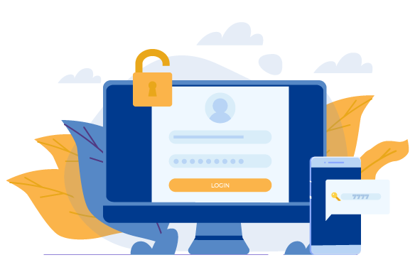
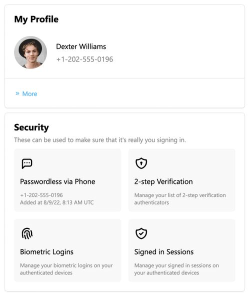
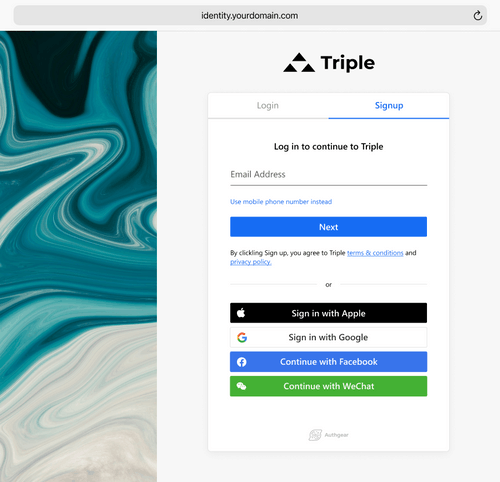

作為企業主或決策者，身份驗證可能不是您最關心的問題。您有比身份驗證系統如何運作更重要的事情需要擔心。然而，身份驗證是任何線上業務的關鍵部分。

當今的消費者期望無縫的身份驗證體驗。他們希望能夠快速輕鬆地註冊並登入您的服務，而無需記住大量密碼。另一方面，作為企業主，您需要擔心安全且可擴展的身份驗證方法。建構內部身份驗證系統可以採取以下任何方式： <a href="https://www.upwork.com/resources/how-to-develop-an-app" target="_blank">三個月和六個月</a>。聽起來可能不是很長一段時間。然而，在當今快節奏的商業世界中，該身份驗證系統在完成時可能會過時。此外，從頭開始建立身份驗證系統可能會出現許多問題。

更有效的解決方案是身分驗證即服務或 AaaS。在這篇文章中，我們將討論什麼是身分驗證即服務、為什麼您的企業需要它，以及 AaaS 提供者需要的一些功能。

<nav id="table-of-content">
    <ul> 
        <li><a href="#definition">什麼是身份驗證即服務？</a>
            <ul style="margin-top:15px;margin-bottom:0">
                <li><a href="#internal-authentication">內部認證服務</a></li>
                <li><a href="#external-authentication">外部身分驗證服務</a></li>
            </ul>
        </li>
        <li><a href="#comparison">內部身分驗證與使用身分驗證即服務</a>
            <ul style="margin-top:15px;margin-bottom:0">
                <li><a href="#cost-reduction">顯著降低成本</a></li>
                <li><a href="#ux">更好的使用者體驗</a></li>
                <li><a href="#time-to-market">更短的上市時間</a></li>
                <li><a href="#data-security">更強大的資料安全和基礎設施</a></li>
                <li><a href="#scalability">可擴展性</a></li>
                <li><a href="#development">最大化開發價值</a></li>
            </ul>
        </li>
        <li><a href="#authgear">將您的應用程式與 Authgear 集成</a></li>
    </ul>
 </nav>

<h2 id="definition">什麼是身份驗證即服務？</h2>

<!--FIGURE-->

<!--/FIGURE-->

身份驗證即服務是一種基於雲端的身份驗證解決方案，允許企業外包其身份驗證需求。 AaaS 供應商提供安全、可擴展且易於使用的身份驗證平台。

一般來說，身份驗證即服務有兩種主要類型：

<h3 id="internal-authentication">內部認證服務</h3>

這些身分驗證服務由企業或組織的員工和承包商使用。身份驗證系統用於授予或拒絕對公司內部網路、應用程式和資料的存取。

<h3 id="external-authentication">外部身分驗證服務</h3>

這些身份驗證服務由使用企業行動或網路應用程式的客戶或消費者使用。身份驗證系統用於授予或拒絕對應用程式及其功能的存取。

身份驗證即服務 (AaaS) 提供者開發基本的身份驗證功能，例如：

### 多重身份驗證

多因素身份驗證 (MFA) 是一種身份驗證方法，要求使用者提供多個證據或因素來驗證其身份。最常見的身份驗證因素是您知道的東西（例如密碼）、您擁有的東西（例如電話）或您的身份（例如您的指紋）。

MFA 比單因素身份驗證更安全，因為駭客更難破壞多個身份驗證因素。 <a href="https://www.microsoft.com/security/blog/2019/08/20/one-simple-action-you-can-take-to-prevent-99-9-percent-of-account-attacks/" target="_blank">微軟宣布添加MFA可以防止99.9%的帳戶外洩攻擊</a>.

### 生物辨識認證

生物辨識身份驗證是一種使用物理或行為特徵（例如指紋、虹膜掃描或聲紋）來驗證您身分的身份驗證方法。

生物辨識身份驗證比基於密碼的身份驗證安全得多，因為駭客更難複製或欺騙用於生物識別身份驗證的憑證/生物識別資料。

### 免洗密碼

一次性密碼 (OTP) 是一種臨時的一次性密碼，透過簡訊、電子郵件或訊息應用程式傳送到使用者的裝置。然後，使用者輸入 OTP 來驗證其身分。

由於大多數消費者現在都擁有行動設備，簡訊 OTP 是最常見的輔助身份驗證方法。然而，駭客已經找到了攔截或竊取 OTP 的方法。 <a href="/zh-hant/features/whatsapp-otp" target="_blank">WhatsApp 免洗密碼</a>另一方面，它更安全，因為它是端對端加密的，與 SMS OTP 相比實施起來更便宜。

### Passkey，真正的無密碼體驗

<a href="/zh-hant/features/passkeys" target="_blank">通行密鑰</a> 是一種新型數位憑證，有可能完全取代密碼。借助這項新技術，用戶在建立帳戶時不再需要考慮新密碼。此外，金鑰允許使用者跨裝置和平台登入相同的服務，而無需一次又一次地重新輸入相同的使用者名稱和密碼。

### 社群登入

社交登入是一種身份驗證方法，允許用戶使用其社交媒體帳戶（例如 Google、Facebook、Twitter 或 LinkedIn）登入網站或應用程式。

社群登入非常方便並提供流暢的使用者體驗，因為使用者不必記住多個使用者名稱和密碼。

### 數據分析

如今，用戶分析至關重要，因為企業需要收集用戶數據並提出可行的見解以保持競爭力。身份驗證即服務提供者幫助企業收集用戶資料來分析用戶的行為，例如用戶透過哪些管道註冊、活躍用戶的百分比等。透過研究這些指標，企業可以調整其策略以擴大用戶群並防止保留率下降。它還可以用於透過識別使用者難以進行身份驗證的區域來改善使用者體驗。一些 AaaS 提供者還提供其他功能，例如：

- 可自訂的註冊/登入頁面
- 使用者管理
- 帳戶設定頁面

這些功能不僅可以幫助企業提高資料安全性，還可以提供更好的客戶體驗、擴大用戶群、降低與密碼重設或管理相關的營運成本，並提高客戶保留率。

<h2 id="comparison">內部身分驗證與使用身分驗證即服務</h2>

<!--FIGURE-->

<!--/FIGURE-->

一些高級開發人員當然更喜歡在內部開發他們的身份驗證系統，因為他們對它有更多的控制權。然而，企業使用身分驗證即服務 (AaaS) 的原因有很多，例如：

<h3 id="cost-reduction">顯著降低成本</h3>

使用 AaaS 最顯著的優勢之一是降低成本。從頭開始建立一個身分驗證系統需要大量的時間、精力和金錢。

您需要雇用開發人員、設定身分驗證基礎設施、僱用員工來處理與身分驗證相關的問題等等。整個過程可能非常昂貴，需要數月甚至數年才能完成。

另一方面，AaaS 供應商已經擁有身分驗證專家和安全身分驗證基礎架構。您所需要做的就是註冊一個帳戶，將您的應用程式或網站與其身份驗證解決方案集成，然後開始使用身份驗證服務。整個過程比從頭開始建立身份驗證系統要簡單得多，成本也便宜得多。

<h3 id="ux">更好的使用者體驗</h3>

使用身分驗證即服務的另一個優點是它可以提供更好的使用者體驗。 AaaS 提供者提供多種身份驗證方法，例如社交登入、一次性密碼和生物識別身份驗證。

開發人員可以毫無麻煩地提供由 AaaS 提供支援的流暢登入體驗。這不僅使用戶的身份驗證更加方便，而且還降低了他們因摩擦而放棄您的網站或應用程式的可能性。

<h3 id="time-to-market">更短的上市時間</h3>

正如我們前面提到的，從頭開始開發一個身份驗證系統可能需要很長時間才能完成。這是因為涉及許多活動部件。

當您選擇 AaaS 時，您可以更快地啟動應用程序，因為身份驗證提供者會為您處理一切。

<h3 id="data-security">更強大的資料安全和基礎設施</h3>

資料外洩變得越來越普遍，因此擁有強大的身份驗證系統來保護您的資料非常重要。當您選擇 AaaS 時，您可以確信您的資料會得到良好的管理，因為您將擁有一個 100% 致力於身份驗證系統工作的團隊。

AaaS 供應商投入大量時間和金錢來開發強大的身份驗證軟體和基礎設施。他們還擁有精通最新認證技術和趨勢的認證專家。

這意味著當您使用 AaaS 時，您可以確信您的資料受到良好的保護。

<h3 id="scalability">可擴展性</h3>

使用 AaaS 的另一個優點是它具有很強的可擴展性。如果您需要在身分驗證系統中新增更多用戶，只需向身分驗證提供者註冊更大的方案即可。

您無需擔心購買更多硬體進行身份驗證。從長遠來看，這不僅可以為您節省大量時間和金錢，而且還可以讓您更加靈活。

<h3 id="development">最大化開發價值</h3>

您可以釋放開發能力並允許開發人員致力於核心功能，而不是讓您的開發人員致力於維護身分驗證系統。這使您的開發人員可以專注於使您的業務脫穎而出以吸引更多用戶的功能。

<h2 id="authgear">將您的應用程式與 Authgear 集成</h2>

選擇很明確：身分驗證即服務是必經之路，而 Authgear 無疑是要考慮的解決方案之一。此客戶身分和存取管理解決方案附帶您入門所需的一切，包括安全且無摩擦的身份驗證方法、使用者管理工具、預先建置的註冊和帳戶設定頁面等。

<!--FIGURE-->

<!--/FIGURE-->

用戶會喜歡簡單的註冊過程以及他們可以在一個地方管理其身份驗證方法和資訊的事實。事實上，使用 Authgear，您會發現輟學率顯著降低。由於我們遵循轉換最佳實踐，您可以確保更多的用戶會註冊您的服務。

<!--FIGURE-->

<!--/FIGURE-->

對於開發人員，我們提供了易於使用的身份驗證 API，可以輕鬆地將 Authgear 整合到您現有的應用程式中。如果您需要協助，我們的專家支援團隊隨時為您提供協助。

<a href="https://accounts.portal.authgear.com/signup" target="_blank">免費註冊</a> 或者 <a href="/zh-hant/talk-with-us" target="_blank">聯絡我們</a> 詳細了解您的應用程式如何與 Authgear 一起發展。
